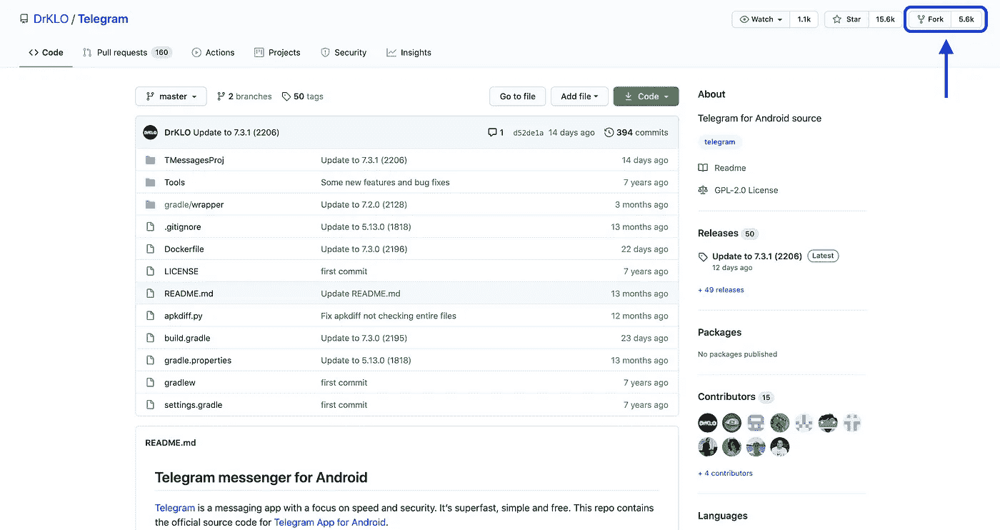
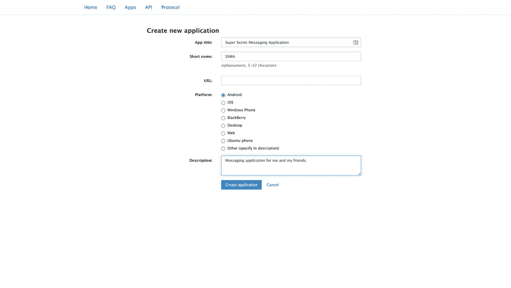
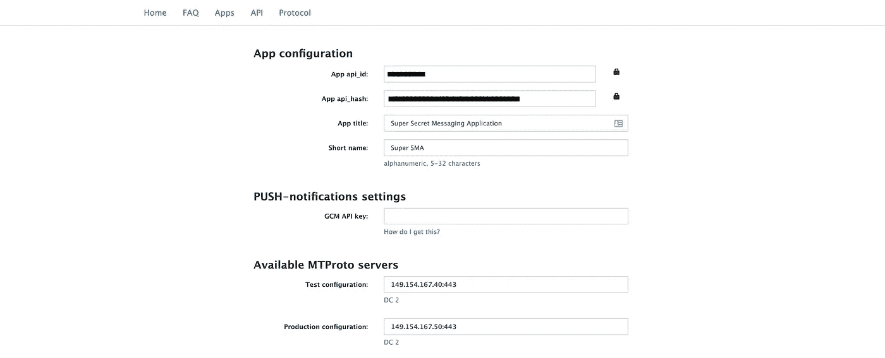
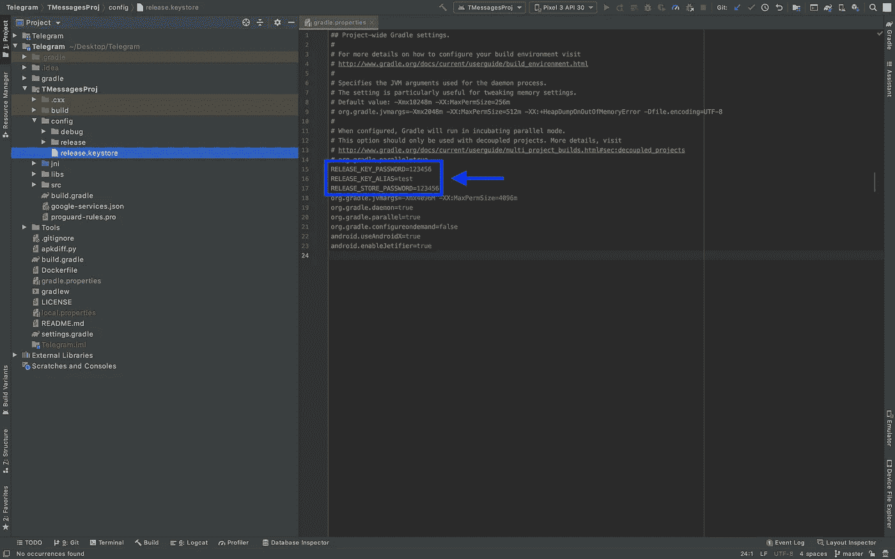
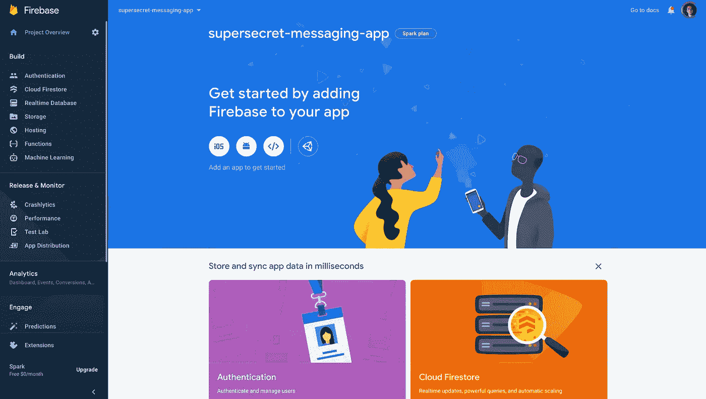
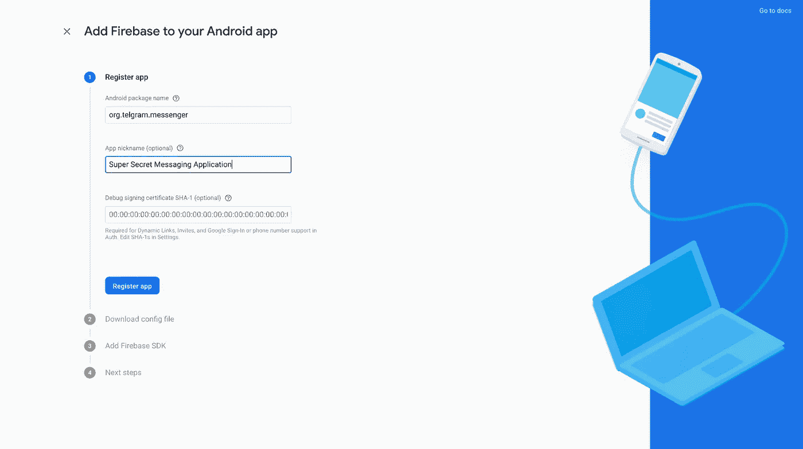
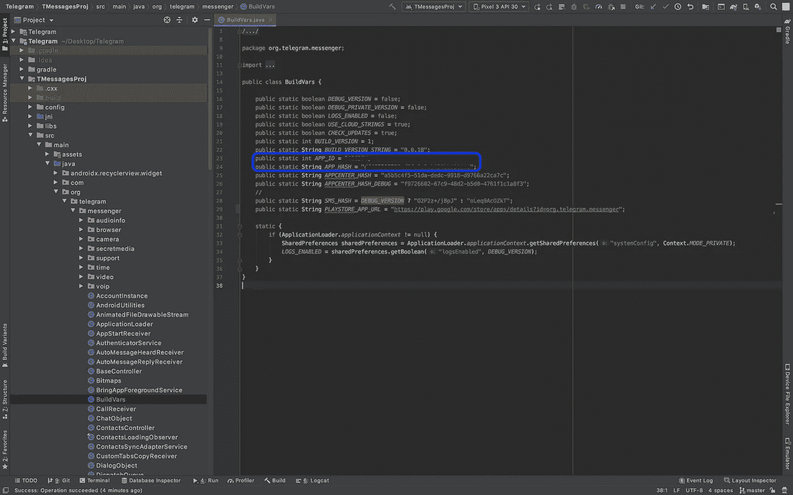
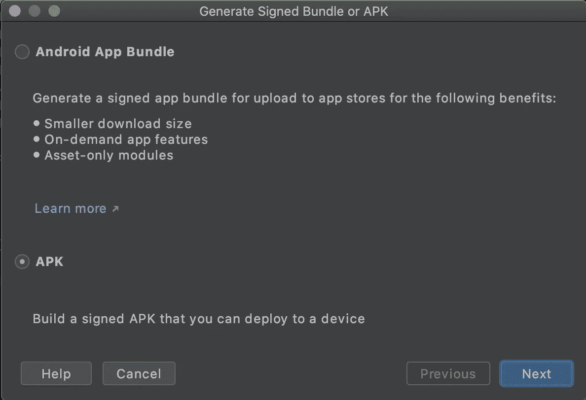
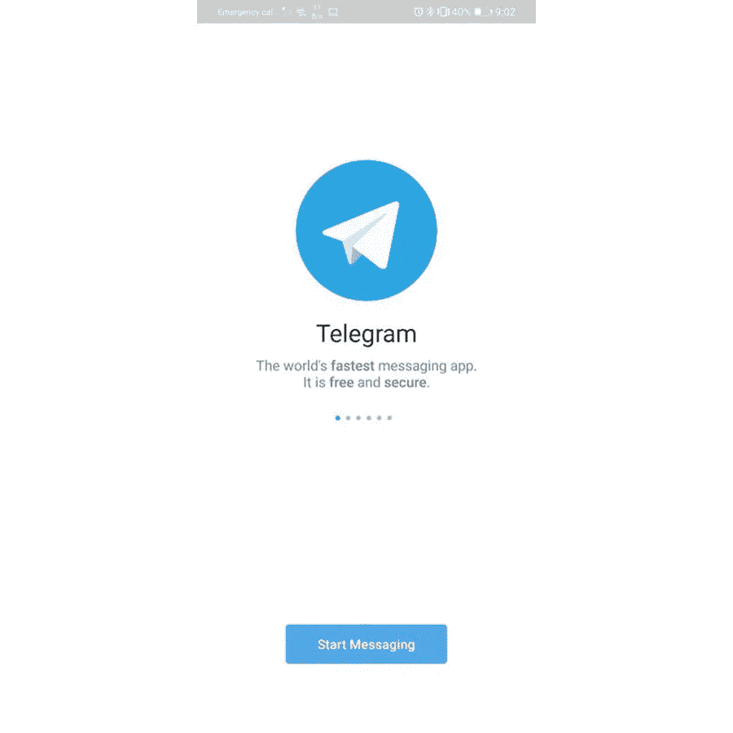
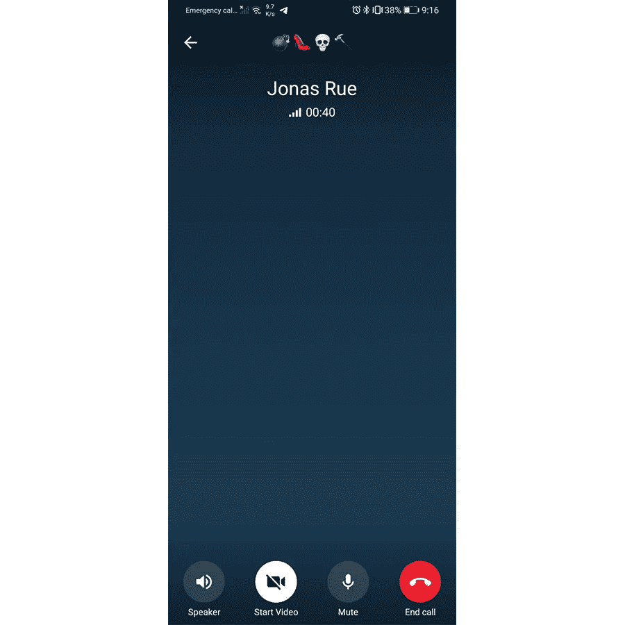

# 退出 WhatsApp？构建您自己的消息 Android 应用程序

> 原文：<https://betterprogramming.pub/quitting-whatsapp-build-your-own-messaging-android-application-d0b54483b9bd>

## 使用以隐私为中心的电报库来派生您自己的应用程序


克里斯蒂安·威迪格在 [Unsplash](https://unsplash.com?utm_source=medium&utm_medium=referral) 上拍摄的照片

随着 WhatsApp 宣布其新的隐私政策，每个人都开始意识到自己的隐私。你可以切换到[电报](https://telegram.org/)或[信号](https://signal.org/en/)，但如果你执迷不悟，还有一个选择:创建自己的消息应用程序，并在朋友间使用。

因此，我们不会从头开始编写任何东西，而是会派生出 Telegram Android 应用程序。[1]请记住，撰写本文是为了娱乐，而不是为了开发一个生产就绪的消息传递应用程序。让我们开始吧。

# 分叉应用程序

Telegram 是开源的，这意味着你可以在 GitHub 上找到它的源代码。我们将从 Android 的分叉[电报开始。](https://github.com/DrKLO/Telegram)



然后克隆 fork 开始工作:

```
git clone [https://github.com/YOUR_USERNAME/Telegram.git](https://github.com/DoguD/Telegram.git)
```

# 获取 API ID 和 API 哈希

下一步是获取`api_id`和`api_hash` **、**，我们只需要按照[电报的指令](https://core.telegram.org/api/obtaining_api_id)来获取它们:

*   使用任何应用程序注册电报。
*   登录你的电报核心:[https://my.telegram.org](https://my.telegram.org/)。
*   进入 [API 开发工具](https://my.telegram.org/apps)并填写表格。



在您完成表单之后，Telegram 会给您 API 密钥和必要的秘密。



# 密钥库文件

接下来我们需要将我们的`.keystore`文件复制到`Telegram/TMessagesProj/config` 并填入 WhatsApp 中。(如果你没有`.keystore`文件，你可以按照 [Android 文档](https://developer.android.com/studio/publish/app-signing#generate-key)创建一个。)



# 重火力点

现在是时候转到我们的 Firebase 仪表板并创建一个新项目了。我将把它命名为超级秘密信息应用程序。初始化完成后，我们应该会看到下面的仪表板。



接下来，我们需要创建一个 Android 应用程序。只需点击 Android 按钮，根据自己的需求填写表格即可。(如果不想重构源代码的包名，将包名设置为 org.telegram.messenger 很重要。)【2】**我们还需要用包名 org.telegram.messenger.beta 重复这个过程。**

****

**最后，下载`google-services.json`并复制到`Telegram/TMessagesProj`下。**

# ****更改构建变量****

**我们需要打开`Telegram/TMessagesProj/src/main/java/org/telegram/messenger/BuildVars.java`，根据我们在[电报 App 配置网站](https://my.telegram.org/apps)上的信息(`app_id`**`app_hash`)进行更改。****

********

****可选地，我们可以将`BUILD_VERSION`恢复为 1，将`BUILD_VERSION_STRING`恢复为 1.0.0。这将是我们自己的消息应用程序，因此没有理由不这样做。****

****如果一切正常，我们现在应该有一个可用的电报克隆。构建和测试的时间。****

# ****生成 APK****

****为了测试应用程序，我们需要构建签名的 APK，这可以在 Build > Generate Signed Bundle / APK 中完成。由于我们不会将这个应用程序发布到 Play Store，我们将选择 APK 选项。****

********

****单击“下一步”后，我们需要填写所需的信息(别名、密码等。)关于我们的`.keystore file`。****

****构建变体部分有点棘手(特定于手机)，但我为我的华为 P30 Pro 手机选择了 armv7Release。让我们在手机上安装 APK，测试一下是否一切正常。****

****为了测试，我把 APK 的文件发给了我的朋友[乔纳斯·鲁](https://medium.com/@jonasrue)。在完成电话验证后，我们测试了与他的消息传递，一切都运行良好。****

********

****我们还测试了语音聊天，效果也很好。****

********

# ****结论****

****在本教程中，我们编译了我们自己的 Android Telegram 克隆，它可以完美地工作。重要的是要记住，我们的应用程序仍然使用电报后端。我计划撰写本教程的第 2 部分，探索托管我们自己的电报消息服务器。****

****非常感谢你一直读到最后。如果你面临任何问题，请随时写一封回信解释你的情况，我会尽我所能帮助你。****

# ****笔记****

****[1]如果您计划发布您的应用程序，Telegram 恳请您不要使用他们的名称和图标。为了遵守他们的许可，你还需要公开发布你的源代码。更多信息可以在他们的 [GitHub 库](https://github.com/DrKLO/Telegram)中找到。****

****[2]如果你想更改应用程序的包名，可以关注 StackOverflow 上的这个[牛逼的回答。](https://stackoverflow.com/questions/16804093/rename-package-in-android-studio)****