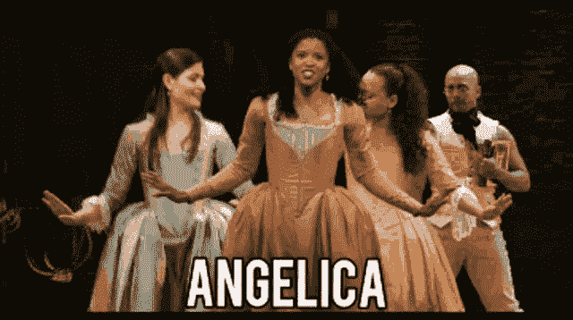
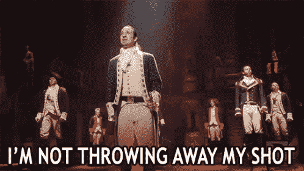

# 你对你的 JavaScript 基础知识了解多少？

> 原文：<https://betterprogramming.pub/quiz-how-well-do-you-know-your-js-fundamentals-df813504ff53>

## 受汉密尔顿启发的科技面试琐事


众所周知，技术面试会带来压力，尤其是对于即将开始第一份软件工程/开发工作的人。虽然目前围绕算法和数据结构部分的重要性有一些健康的争论，但了解基础知识仍然是至关重要的。

今天，我编写了一个小测验来帮助你测试你对技术面试中需要了解的重要 JavaScript 概念的了解。如果在我们开始之前你需要一些帮助，看看这些有用的文章[这里](https://levelup.gitconnected.com/8-javascript-concepts-to-learn-for-tech-interviews-57623edd2b65)和[这里](https://medium.com/javascript-in-plain-english/the-3-phases-of-event-propagation-explained-f76348b5343f)。在在控制台检查之前，请尽可能回答这些**！**

*附:我已经把汉密尔顿的音乐记在脑子里好几周了，所以我已经警告过你了。*🙃

准备好了吗？我们走吧！


# 1.如何将`this`附加到对象上，使得下面的代码不会返回`undefined`？

```
const Hamilton = {
    writesLikeHesRunningOutOfTime: true,
    frenemy: "Aaron Burr", greeting() {
        console.log(`Pardon me, are you ${this.frenemy}, sir?`)
    }
}setTimeout(Hamilton.greeting, 1000)
// Pardon me, are you undefined, sir?
```

一)`setTimeout(Hamilton.greeting.bind(Hamilton), 1000)`

B) `greeting() {
console.log(`Pardon me, are you ${this.frenemy.bind}, sir?`)
}`

C) `setTimeout(() => Hamilton.greeting(), 1000)`

d)A 或 C

.

.

.

.

.

.

.

.

.

.

.

## 回答:D)不是 A 就是 C

当使用常规函数时，`this`上下文属于调用它的对象。如果函数期望不同的`this`上下文，这会导致问题。在这个例子中，`Window`变成了`this` 对象。要解决这个问题，您可以使用以`.bind`形式绑定的**函数来将`Hamilton`对象专门附加到`greeting`函数，或者您可以在`setTimeout`中使用箭头函数。**

```
const Hamilton = {
    writesLikeHesRunningOutOfTime: true,
    frenemy: "Aaron Burr", greeting() {
        console.log(`Pardon me, are you ${this.frenemy}, sir?`)
    }
}setTimeout(Hamilton.greeting.bind(Hamilton), 1000)
// OR setTimeout(() => Hamilton.greeting(), 1000)// Pardon me, are you Aaron Burr, sir?
```


给刚认识的人的好建议！👍

# 2.这些名字会以什么顺序出现？

```
function theLadies() {
    console.log("Eliza");
    setTimeout(function() {console.log("Peggy")}, 1000);
    setTimeout(function() {console.log("Angelica")}, 0);
    console.log("Theodosia");
}theLadies()
```

伊莱扎、狄奥多西、安吉莉卡、佩吉

伊莉莎，安吉丽卡，狄奥多西，佩吉

安吉丽卡，伊莱扎，狄奥多西，佩吉

伊莱扎、佩吉、安吉莉卡、狄奥多西

.

.

.

.

.

.

.

.

.

.

.

## 答:A)伊莉莎、狄奥多西、安吉莉卡、佩吉

当一个函数遇到`setTimeout`时，浏览器将把回调函数放在一边，并启动以毫秒为单位的计时器(例如 1，000)，同时功能继续执行。一旦“Eliza”和“Theodosia”被控制台登录(因为它们没有执行障碍)，延迟最短的`setTimeout`回调(“Angelica”)将被从任务队列推送到调用堆栈，接下来是最后一个(不出意外，是“Peggy”)。抱歉佩吉。😬



# 3.当我们调用`whereItHappens`函数时，控制台会记录什么？

```
function whereItHappens() {
    let h = "Alexander Hamilton"
    let m = "James Madison"
    let j = "Thomas Jefferson"
    const fact = `${h}, ${m} and ${j} are in the room where it happens.` function room(){
        let b = "Aaron Burr"
        console.log(`${fact}`)
    } console.log(`Maybe we should let ${b} in the room where it happens?`)
    return room()
}whereItHappens()
```

a)亚历山大·汉密尔顿、詹姆斯·麦迪逊和托马斯·杰斐逊都在故事发生的房间里。

b)也许我们应该让 Aaron Burr 在事情发生的房间里？

c)参考错误

d)未定义

.

.

.

.

.

.

.

.

.

.

.

## 答案:C)参考错误

控制台将抛出一个未被捕获的 ReferenceError，指出`b`未被定义。因为`b`是在嵌套的`room`函数中声明的，所以它不能被更大的`whereItHappens`函数外部访问。由于**关闭**，主函数只能访问`h`、`m`、`j`和`fact`变量以及`room`函数。换句话说，亚伦·伯尔将*永远不会被允许出现在事情发生的房间里！*

如果我们要从函数中删除最后一行，`whereItHappens`将返回字符串“亚历山大·汉密尔顿、詹姆斯·麦迪逊和托马斯·杰斐逊在事情发生的房间里。”


抱歉，伯尔，这次不行。🚫

# 4.下列语句将返回什么？

```
{} === {}"talk less, smile more" == "Talk less, Smile more""and Peggy!" === " and Peggy!"2015 == "2015"(1786 - 1776) === 10
```

a)假、假、假、真、真

b)真、假、假、真、真

c)真，真，真，真，假

d)假，真，假，假，真

.

.

.

.

.

.

.

.

.

.

.

## 答:A)假，假，假，真，真

当您试图使用`===`比较两个不同的值时，您会问这两个值在值和数据类型方面是否*完全相同。`(1786–1776)` 等同于`10`并且都是数字，所以返回 true。`“and Peggy!”`示例在右边的字符串中有一个额外的空格，所以它们返回 false。请注意，对象`{}`是单独保存在内存中的，因此，它们实际上不可能是相同的，即使它们都是空的。*

如果您试图使用`==`来比较两个值，由于数据类型没有计算在内，所以验证会被更宽松地判断。两边的对象值也可能被强制匹配(比如字符串变成数字)，这就是`2015 == “2015”`返回 true 的原因。如果我们用`===`写了同样的语句，由于数据类型的不同，它将返回 false。

# 5.点击表单上的`Duel`按钮会发生什么？



```
<html>
  <body>
    <form method="POST" action="Aim-for-the-sky">
      <p>Do not throw away your shot!</p>
      <button type="submit" id="btn">Duel</button>
    </form> <script>
    document.getElementById("btn").addEventListener("click", () =>     
    {
      fetch("Aim-for-the-opponent", {
          method: "POST"
      })
    })
  </script>
  </body>
</html>
```

a)没有

b)张贴到“瞄准天空”

c)张贴到“瞄准对手”

d)B 和 C

.

.

.

.

.

.

.

.

.

.

.

## 答:D)B 和 C 都有

因为没有写`e.preventDefault`或`e.stopPropagation`，所以表单会先向“瞄准对手”发出 POST 请求，然后**事件冒泡**会继续向上到表单。`form`有一个默认的动作，“瞄准天空”，因此由于 AJAX 请求的异步特性，在冒泡开始之前，“瞄准对手”的 POST 请求将无法完成。

当事件点击`form`默认动作时，它将触发浏览器立即向该 URL 提交 POST 请求，取消第一个请求并将页面带到该`form` `action` URL。最后一个帖子将是在事件达到顶点时“瞄准天空”(正如汉密尔顿所说，就像一个真正的“正人君子”会做的那样)。

# 6.下面的代码会输出什么？


```
formHarem()var quote = "if you really loved me you would share him."function formHarem() {
    console.log(`I'm just saying ${quote}`)
}
```

a)参考错误

我只是说如果你真的爱我，你会和他分享。

c)我只是说未定义

d)未定义

.

.

.

.

.

.

.

.

.

.

.

## 答:C)我只是说未定义

JavaScript 有两个阶段:编译和执行。在编译阶段，从上到下读取代码，任何全局变量和函数名都被“提升”到内存中(即**提升**)。这包括使用`var`声明的任何变量。编译后，在执行阶段，如果一个变量或函数在代码中实际写入的地方被引用，引用错误不会被抛出，因为它已经存在于内存中。由于只提升了变量名，而不是实际的初始化值，我们将看到控制台中记录的“我只是说说`undefined`”。

这就是我们简短的以汉密尔顿为主题的 JavaScript 测验！你成功了！🙌


留下回复，告诉我你做的怎么样！