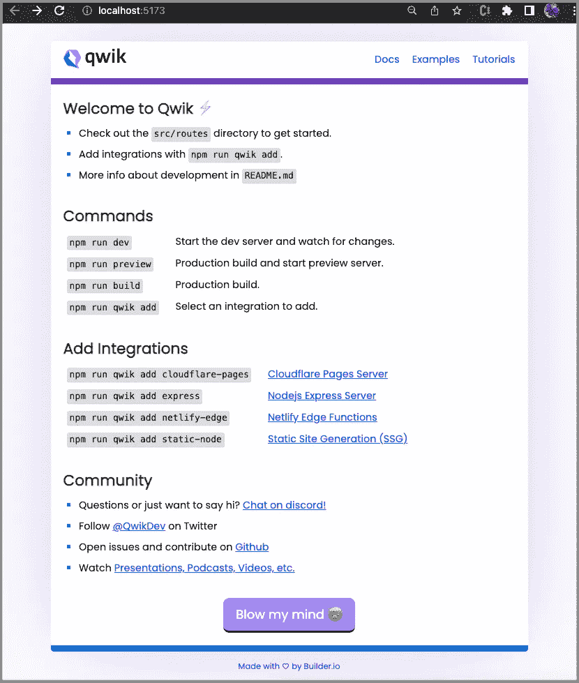
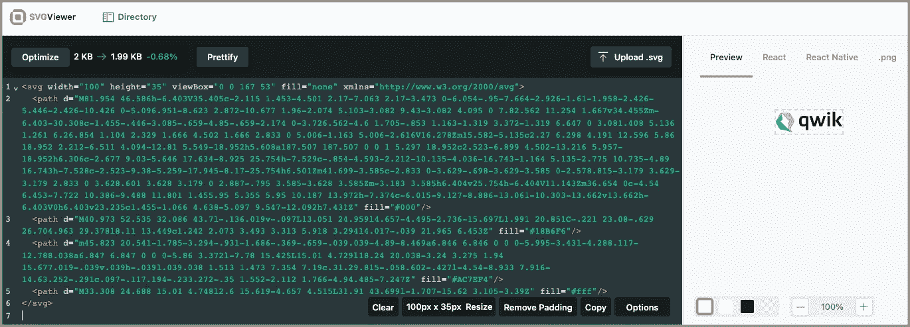
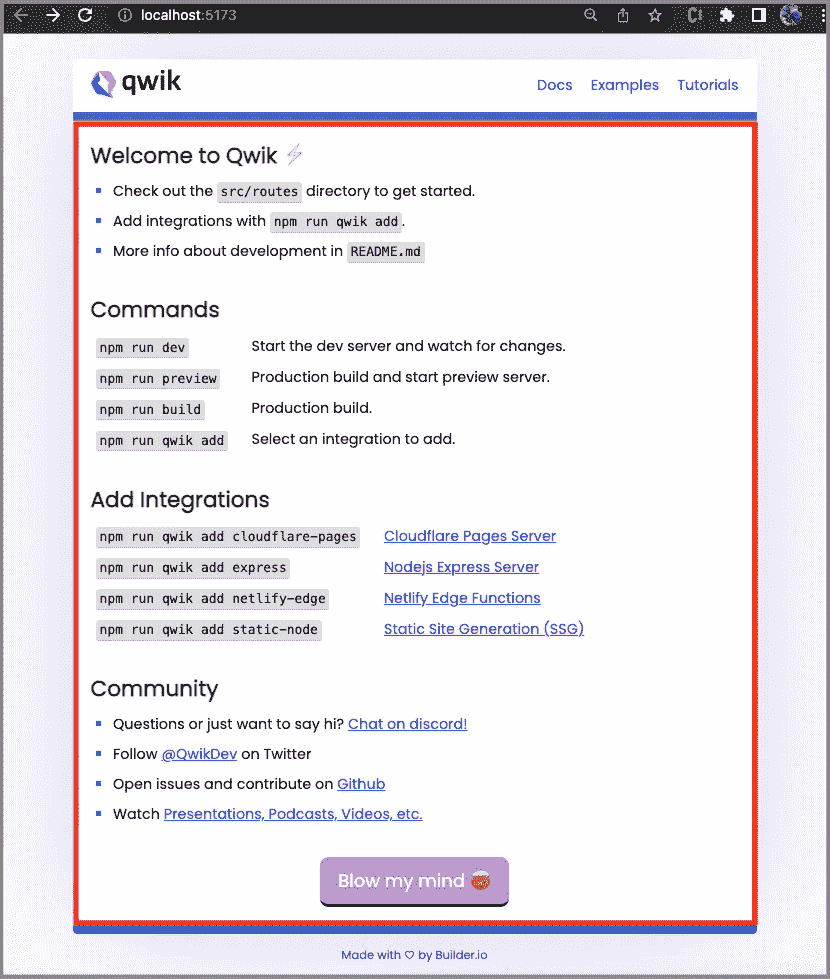
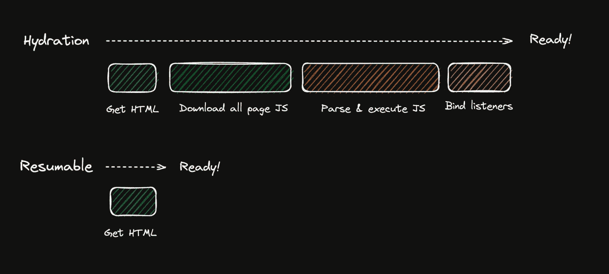

# 介绍 Qwik——加载时间为 O(1)的 JavaScript 框架

> 原文：<https://betterprogramming.pub/qwik-the-javascript-framework-with-o-1-load-time-222f30613361>

## Qwik 初学者指南


DALL-E 2 生成的图像

# 介绍

网站向浏览器发送 JavaScript 以提供交互性。随着网站复杂性的增加，下载到浏览器的 JavaScript 数量每年都在增加。大多数 JavaScript 框架一次下载并执行所有代码。它最终导致加载时间变慢，因为加载时间是 O(n)。

Qwik 是一个 JavaScript 框架，它在用户交互时缓慢下载代码。它的目标是拥有即时启动的应用程序，甚至是在移动设备上。它通过两个主要策略实现目标:

*   尽可能长时间延迟 JavaScript 的执行和下载(除了开始代码，大约 1KB)。
*   在服务器上序列化应用程序和框架的执行状态，并在客户端上恢复它。

Qwik 不是 React，虽然它看起来类似 React，并使用 JSX。无论网站有多复杂，它都能提供最快的页面加载速度。它的加载时间是 O(1)。

# 安装并运行 Qwik

运行以下命令安装 Qwik:

```
% npm create qwik@latest
```

安装是一个交互式向导，我们通过选择所有默认设置来进行选择。

该项目安装在文件夹`qwik-app`中。`package.json`位于根目录下。在`package.json`里面，有很多剧本。

*   在第 2 行，脚本`build`执行`build.client`(第 3 行)、`build.preview`(第 4 行)和`build.types`(第 5 行)。
*   在第 3 行，脚本`build.client`生成客户端模块。

```
% npm run build.client> build.client
> vite buildvite v3.1.1 building for production...
✓ 47 modules transformed.
dist/q-manifest.json        11.45 KiB
dist/build/q-8ba14edf.js    0.06 KiB / gzip: 0.07 KiB
dist/build/q-53555967.js    4.57 KiB / gzip: 2.23 KiB
dist/build/q-d7f3d226.js    0.26 KiB / gzip: 0.22 KiB
dist/build/q-bceff05d.js    0.61 KiB / gzip: 0.27 KiB
dist/build/q-8d91e16b.js    1.49 KiB / gzip: 0.84 KiB
dist/build/q-026a668e.js    0.83 KiB / gzip: 0.49 KiB
dist/build/q-b10147d6.js    0.20 KiB / gzip: 0.16 KiB
dist/build/q-f13b34ad.js    1.00 KiB / gzip: 0.51 KiB
dist/build/q-cff735f7.js    0.26 KiB / gzip: 0.20 KiB
dist/build/q-8d0c32f0.js    0.26 KiB / gzip: 0.20 KiB
dist/build/q-07a60165.js    0.43 KiB / gzip: 0.29 KiB
dist/build/q-9abdde7c.js    0.11 KiB / gzip: 0.11 KiB
dist/build/q-eab02654.js    2.42 KiB / gzip: 1.12 KiB
dist/build/q-b5e190d0.js    2.82 KiB / gzip: 0.88 KiB
dist/service-worker.js      2.13 KiB / gzip: 1.01 KiB
dist/build/q-0ea8883c.css   1.58 KiB / gzip: 0.79 KiB
dist/build/q-9d71bc2f.js    39.14 KiB / gzip: 15.82 KiB
dist/build/q-9a4a797f.js    3.99 KiB / gzip: 1.99 KiB
```

*   在第 4 行，脚本`build.preview`为生产构建 SSR 包。

```
% npm run build.preview> build.preview
> vite build --ssr src/entry.preview.tsxvite v3.1.1 building SSR bundle for production...
✓ 17 modules transformed.
server/entry.preview.mjs   32.50 KiB
```

*   在第 5 行，脚本`build.types`对源代码进行类型检查。

```
% npm run build.types> build.types
> tsc --incremental --noEmit
```

*   在第 6 行，脚本`dev`从开发模式开始，使用 [Vite 的开发服务器](https://vitejs.dev/)。Vite 是一个构建工具，旨在为现代 web 项目提供更快、更精简的开发体验。该命令生成 SSR 输出。

```
% npm run dev> dev
> vite --mode ssrVITE v3.1.1  ready in 654 ms➜  Local:   http://localhost:5173/
  ➜  Network: use --host to expose
(node:30981) ExperimentalWarning: The Fetch API is an experimental feature. This feature could change at any time
(Use `node --trace-warnings ...` to show where the warning was created)
```

*   在第 7 行，脚本`dev.debug`以带有 debug 的开发模式开始。`--inspect-brk`是 [Node.js](/5-major-features-of-node-js-18-5f4a164cc9fc) 选项，用于启用 inspector 代理并监听默认地址和端口(`127.0.0.1:9229`)。它在用户代码开始之前添加一个断点。

```
% npm run dev.debug> dev.debug
> node --inspect-brk ./node_modules/vite/bin/vite.js --mode ssr --forceDebugger listening on ws://127.0.0.1:9229/9f1b7a85-5155-4e06-a510-67188fbe690a
For help, see: [https://nodejs.org/en/docs/inspector](https://nodejs.org/en/docs/inspector)
```

*   在第 8 行，脚本`fmt`格式化所有代码。

```
% npm run fmt> fmt
> prettier --write ..eslintrc.cjs 52ms
.vscode/extensions.json 4ms
.vscode/qwik-city.code-snippets 3ms
.vscode/qwik.code-snippets 8ms
package-lock.json 63ms
package.json 10ms
README.md 56ms
server/entry.preview.mjs 259ms
src/components/header/header.css 47ms
src/components/header/header.tsx 300ms
src/components/icons/qwik.tsx 8ms
src/components/router-head/router-head.tsx 26ms
src/entry.dev.tsx 14ms
src/entry.preview.tsx 3ms
src/entry.ssr.tsx 5ms
src/global.css 20ms
src/root.tsx 5ms
src/routes/flower/flower.css 12ms
src/routes/flower/index.tsx 18ms
src/routes/index.tsx 21ms
src/routes/layout.tsx 4ms
src/routes/service-worker.ts 4ms
tsconfig.json 3ms
vite.config.ts 3ms
```

*   在第 9 行，脚本`fmt.check`检查是否有文件需要格式化。

```
% npm run fmt.check> fmt.check
> prettier --check .Checking formatting...
All matched files use Prettier code style!
```

*   在第 10 行，脚本`lint`使用 eslint 执行静态代码分析。

```
% npm run lint> lint
> eslint "src/**/*.ts*"
```

*   在第 11 行，脚本`preview`创建了客户机模块的生产版本，并运行本地服务器。预览服务器只是为了方便在本地预览生产版本，它不应该用作生产服务器。

```
% npm run preview> preview
> qwik build preview && vite preview --openvite build
vite build --ssr src/entry.preview.tsxvite v3.1.1 building for production...
✓ 47 modules transformed.
dist/q-manifest.json        11.45 KiB
dist/build/q-8ba14edf.js    0.06 KiB / gzip: 0.07 KiB
dist/build/q-d7f3d226.js    0.26 KiB / gzip: 0.22 KiB
dist/build/q-53555967.js    4.57 KiB / gzip: 2.23 KiB
dist/build/q-bceff05d.js    0.61 KiB / gzip: 0.27 KiB
dist/build/q-8d91e16b.js    1.49 KiB / gzip: 0.84 KiB
dist/build/q-026a668e.js    0.83 KiB / gzip: 0.49 KiB
dist/build/q-f13b34ad.js    1.00 KiB / gzip: 0.51 KiB
dist/build/q-b10147d6.js    0.20 KiB / gzip: 0.16 KiB
dist/build/q-cff735f7.js    0.26 KiB / gzip: 0.20 KiB
dist/build/q-8d0c32f0.js    0.26 KiB / gzip: 0.20 KiB
dist/build/q-9abdde7c.js    0.11 KiB / gzip: 0.11 KiB
dist/build/q-07a60165.js    0.43 KiB / gzip: 0.29 KiB
dist/build/q-b5e190d0.js    2.82 KiB / gzip: 0.88 KiB
dist/build/q-eab02654.js    2.42 KiB / gzip: 1.12 KiB
dist/service-worker.js      2.13 KiB / gzip: 1.01 KiB
dist/build/q-9d71bc2f.js    39.14 KiB / gzip: 15.82 KiB
dist/build/q-0ea8883c.css   1.58 KiB / gzip: 0.79 KiB
dist/build/q-9a4a797f.js    3.99 KiB / gzip: 1.99 KiB✓ Built client modules
✓ Built preview (ssr) modules➜  Local:   [http://localhost:4173/](http://localhost:4173/)
  ➜  Network: use --host to expose
(node:31183) ExperimentalWarning: The Fetch API is an experimental feature. This feature could change at any time
(Use `node --trace-warnings ...` to show where the warning was created)
```

*   在第 12 行，脚本`start`启动开发服务器。

```
% npm run start> start
> vite --open --mode ssrVITE v3.1.1  ready in 900 ms➜  Local:   http://localhost:5173/
  ➜  Network: use --host to expose
(node:31325) ExperimentalWarning: The Fetch API is an experimental feature. This feature could change at any time
(Use `node --trace-warnings ...` to show where the warning was created)
```

*   在第 13 行，脚本`qwik`可以用来添加额外的集成。

```
% npm run qwik add🦋  Add Integration? What feature would you like to add? › (use ↓↑ arrows, hit enter)
❯   Server Adaptors (SSR)
    Static Generator (SSG)
    Partytown
    Qwik React
    Tailwind
```

Qwik 需要 Node.js 16 或更高版本。执行`npm run dev`，默认网站在`http://localhost:5173/`可用。



作者图片

# Qwik 源文件夹

安装完成后，文件夹`qwik-app`如下所示:

```
qwik-app
├── README.md
├── public
│   └── favicon.svg
├── src
│   ├── components
│   ├── routes
│   ├── entry.dev.tsx
│   ├── entry.preview.tsx
│   ├── entry.ssr.tsx
│   ├── global.css
│   └── root.tsx
├── vite.config.ts
├── tsconfig.json
├── node_modules
├── package.json
├── package-lock.json
├── .eslintignore
├── .eslintrc.cjs
├── .gitignore
└── .prettierignore
```

*   `qwik-app`:包含 Qwik app 代码的目录。
*   `README.md`:描述项目结构和脚本。
*   `public`:静态资产的目录，包括`favicon.svg`。
*   `src/components`:组件推荐目录。
*   `src/routes`:提供基于目录的路由。
*   `src/entry.dev.tsx`:仅使用客户端模块，无 SSR 的开发切入点。

*   `src/entry.preview.tsx`:它是脚本`preview`的 bundle 入口点，在生产模式下服务于 SSR bundle。

`QwikCity`在第 1 行导入，用于将`render`适配到第 7 行的`qwikCity`。Qwik City 建立在 Qwik 的基础上，带来了自以为是的路由和其他以自以为是和高性能的方式大规模建立网站的东西。Qwik 城到 Qwik 是 Next.js 要反应的。

*   `src/entry.ssr.tsx`:这是 SSR 的切入点。它用于在浏览器外渲染应用的所有情况，用于 express、cloudflare 等服务器，以及用于脚本、`start`、`preview`和`build`。

`renderToStream`(第 6 行)在服务器上生成 HTML。反应过来`ReactDOMServer`的`[renderToString](https://javascript.plainenglish.io/a-hands-on-guide-for-a-server-side-rendering-react-18-app-4e630aae274c)`和[的](https://javascript.plainenglish.io/a-hands-on-guide-for-a-server-side-rendering-react-18-app-4e630aae274c)和`[renderToPipeableStream](https://javascript.plainenglish.io/a-hands-on-guide-for-a-server-side-rendering-react-18-app-4e630aae274c)`差不多。

*   `src/global.css`:这是全球通用的款式。
*   `src/root.tsx`:定义`QwikCity`网站的根文件。

在第 19–28 行，`QwikCity`网站由`head`(第 20–23 行)和`body`(第 24–27 行)定义。在第 25 行，`<RouterOutlet>`用于呈现子 route 元素。

*   `vite.config.js`:是`qwikCity`和`qwikVite`的 Vite 配置文件。
*   `tsconfig.js`:TypeScript 配置文件。

# Qwik 组件

文件夹`src/components`是组件的推荐目录。开箱即用，有 3 个组件子目录，`icons`、`header`和`router-head`。

```
components
├── icons
│   └── qwik.tsx
├── header
│   ├── header.tsx
│   └── header.css
└── router-head
    └── router-head.tsx
```

## QwikLogo 组件

`QwikLogo`组件位于`src/components/icons`内部。目前包括 logo [SVG 文件](/create-react-app-and-svgs-70970ac715f2)、`qwik.tsx`。

这里是`src/components/icons/qwik.tsx`:

将此文件导入到一个 [SVG 查看器](https://www.svgviewer.dev/)，我们可以看到 Qwik 徽标。



作者图片

## 标题组件

`Header`组件位于`src/components/header`内。它定义了下面显示的默认网站的标题，其中 Qwik 徽标位于左上角区域。


作者图片

文件夹中有两个文件，`src/components/header`:

*   `header.tsx`
*   `header.css`

这里是`src/components/header/header.tsx`:

上面的代码和 React 很像。

`component$()`(第 5 行)是 Qwik 中的组件定义，它(第 5–43 行)定义了一段可重用的代码，可用于构建 UI，类似于 React 中的功能组件。

`useStylesScoped$()`(第 6 行)创建一个作用域样式。

## 什么是`$`？

它是优化器和开发人员知道优化器将应用一个转换来提取跟在`$`后面的表达式，并把它变成一个可延迟加载和可导入的符号的标志。

这里是`src/components/header/header.css`:

它是一个 CSS 文件，定义了`header`组件的标签和类选择器。

## 路由器头组件

`RouterHead`组件位于`src/components/router-head`内部。它定义了放置在文档`<head>`元素内部的内容。

这里是`src/components/router-head/router-head.tsx`:

通过`root.tsx`将其放置在`head`元素内部:

```
<head>
  <meta charSet="utf-8" />
  <RouterHead />
</head>
```

在浏览器上，`View Page Source`显示转换后的标题内容。

# Qwik 路线

文件夹`src/routes`基于 Qwik City，支持以下功能:

*   基于目录的路由
*   嵌套布局
*   基于文件的菜单
*   面包屑
*   支持使用`.tsx`或`.mdx`文件格式创作内容
*   数据端点

现成的 routes 包括以下文件/目录:

```
routes
├── layout.tsx
├── index.tsx
├── service-worker.ts
└── flower
    ├── flower.css
    └── index.tsx
```

## 布局组件

在一个应用程序中，不同的路径通常共享一些共同的东西，比如页眉和页脚。这些公共部分由一个可在每个页面中重用的布局组件实现。

这里是`src/routes/layout.tsx`:

在第 8 行，普通的`Header`被放置在页面的顶部。

在第 10 行，一个`Slot`用于将子组件放置在页面中间。

在第 13–17 行，一个`footer`元素被放置在页面的底部。

## 索引路线

每条路径的叶子文件命名为`index`，文件类型可以是`.ts`、`.tsx`、`.js`、`.jsx`、`.md`或`.mdx`。

当 URL 为`/`时，`index.tsx`定义了放置在槽中的 UI(在下面的红框中)。



作者图片

下面的`src/routes/index.tsx`以简单明了的方式实现了上面的红框 UI。

## 服务人员

传统的服务人员提供预取和缓存。Qwik City 使用服务工作者动态预取可能执行的内容。不预取整个应用程序可以释放资源，只请求用户可以用于显示 UI 的小部分。

这里是`src/routes/service-worker.ts`:

该文件可以选择加入或退出服务工作人员。如果应用程序根本不想使用 service worker，只需从文件中删除`setupServiceWorker()`(第 3 行)。

## 鲜花之路

在路线上，`/flower`，它显示了一个由一系列转换后的方块构建的花卉演示。

转到`http://localhost:5173/flower`，我们看到一朵旋转的花。

作者提供的视频

文件夹中有两个文件，`src/routes/flower`:

*   `index.tsx`
*   `flower.css`

当 URL 为`/flower`时，`index.tsx`定义了放置在槽中的 UI。

这里是`src/routes/flower/index.tsx`:

*   在第 10–59 行，定义了花组件。
*   (第 11 行)创建一个作用域样式。`useLocation`(第 12 行)检索 URL 位置。
*   在第 14–17 行，创建了两个状态，`count`和`number`。`count`更新 css 变量`--state`(第 39 行)，用于计算`flower.css`中的平方变换。`number`用于控制花中有多少个方块(第 46 行)。
*   在第 19–25 行，`useClientEffect$`设置更新方块的时间间隔。
*   在第 29–36 行，它定义了一个范围滑块来改变`number`。
*   在第 37–45 行，它定义了花的布局。
*   在第 46–55 行，用类`square`创建了一个数组`div`。如果索引`i`为奇数，它还会添加类别`odd`。这些类用来设计`div`的数组。
*   在第 61–63 行，定义了`head`组件，它将被放在文档`<head>`元素的内部。

有趣的是，在第 43 行检查 URL 位置的查询参数是否是`/flower?pride=true`。当它为真时，它添加类`pride`。

我们来看看`src/routes/flower/flower.css`:

*   在第 1–18 行，主机布局被样式化。
*   在第 20–22 行，范围滑块由`100%` `width`定义。
*   在第 24–45 行，正方形被设计了样式。
*   在第 47–54 行，奇数索引的方块被设置了不同的背景颜色。
*   在第 56–73 行，对于带有类`pride`和`square`的 div，它们中的一些被定义了不同的背景颜色。

转到`http://localhost:5173/flower?pride=true`，我们看到一朵旋转的五彩缤纷的花。

作者提供的视频

# Qwik 为什么快？

Qwik 很快，因为它声称加载时间是 O(1)。它的快速加载时间来自于可重用性、累进性和反应性。

## 可再生性

水合是一种类似于渲染的技术，但是它在服务器端的 HTML 代码中内置了完整的 DOM。水合是耗时的，因为它必须下载与当前页面相关联的所有组件代码。它还需要执行与页面上的组件相关联的模板，以重新构建侦听器位置和内部组件树。

这里有一个带有监听器的按钮:

```
<button onclick="handlerFunction()">Click me</button>
```

HTML 代码需要下载要执行的 JavaScript 函数，该函数会导致为所有应用程序逻辑下载更多内容。



图片来自 Qwik 文档

Qwik 与众不同，因为它不需要水合作用来恢复客户端上的应用程序。它的可恢复性是指在服务器中暂停执行，在客户机中恢复执行，而不必重放和下载所有的应用程序逻辑。

Qwik 将事件侦听器序列化为 DOM，格式如下:

```
<button on:click="./chunk.js#handler_symbol">click me</button>
```

`on:click`属性包含包名和功能符号。只有当用户点击按钮时，它才能在客户端恢复应用程序。它使得 Qwik 比其他框架更快。

## 累进性

渐进性是指根据应用程序的需要下载代码，而不必急切地下载整个代码库。在 Qwik 中，一切都是可延迟加载的:

*   组件 on-render(初始化块和渲染块)
*   组件在线监视(副作用，仅在输入改变时下载)
*   监听器(仅在交互时下载)
*   样式(仅在服务器尚未提供样式时下载)

## 反应

Qwik 跟踪哪些组件订阅了哪个状态。这些信息使 Qwik 能够在状态改变时只使相关的组件无效，这样可以最大限度地减少需要重新呈现的组件数量。

# 结论

Qwik 是一个 JavaScript 框架，它在用户交互时缓慢地下载代码。无论网站有多复杂，它都能提供最快的页面加载速度。它的加载时间是 O(1)。

我们已经解释了安装的 Qwik 应用程序。它的语法类似于 React。Qwik 是核心，Qwik 城市建立在 Qwik 之上，有组织的组件和路线。

构建 Qwik 应用程序很容易，不管网站有多复杂，它都可以提供最快的页面加载速度。

还有另一个 web 框架， [Astro](https://medium.com/p/5dadd98f8e39) ，你可能想看看。它类似于 Qwik，但是从目录结构到`package.json`更简单。Astro 专注于基于内容的网站。

感谢阅读。

```
**Want to Connect?**If you are interested, check out [my directory of web development articles](https://jenniferfubook.medium.com/jennifer-fus-web-development-publications-1a887e4454af).
```