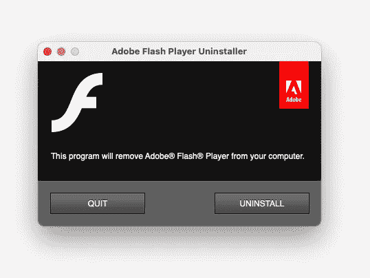

# 灵光一现。你不会被遗忘的

> 原文：<https://betterprogramming.pub/r-i-p-flash-youll-be-not-forgotten-3d11beae7a6b>

## 庆祝一项开创了许多职业生涯并于 2020 年底退休的基础网络技术

Adobe Flash Player 卸载程序

谷歌 Chrome [在 2020 年底彻底移除了](https://www.chromium.org/flash-roadmap#TOC-Flash-Support-Removed-from-Chromium-Target:-Chrome-88---Jan-2021-)Adobe Flash 插件。这标志着一个时代的结束。这个时代由一个专有软件主宰，这个软件多年来定义了互联网的面貌。许多人承诺过，但只有 Flash 兑现了。

# 什么是 Flash？

或者问一个更好的问题:什么是 T2？Flash 是一种专有产品，它是如何塑造和主导计算机娱乐和早期互联网行业的？

让我们回到世纪之交。现在是 90 年代末。微软发布 MS Windows 98，[浏览器大战](https://en.wikipedia.org/wiki/Browser_wars)愈演愈烈。还没有 Chrome 等等，还没有 Google！微软不是最酷的公司。实际上，情况恰恰相反:Micro$oft 试图主导市场——一个滥用权力、排挤所有竞争对手的恶霸。你还记得网景公司的[吗？没有智能手机，没有 iPhone…](https://en.wikipedia.org/wiki/Netscape_Navigator)

然而，有互联网。还年轻；仍然完好无损。然而，与竞争网络浏览器，有一点兼容性问题。W3C 联盟有自己的标准，但 M$并不想遵循这些标准。事实上，你可以说 Internet Explorer 定义了自己的*事实上的*标准。有一个许多人试图解决的问题。

也许这还不是世界末日。根据用户的屏幕分辨率，尤其是使用的网络浏览器，网站看起来确实有所不同。然而，我们可以看到一些趋势和简单的缓解措施。只要你的网站匹配大多数流行的分辨率和一些网络浏览器(跨网站测试——这是一个流行的术语),你就可以忍受这些不准确性。

# 新玩家来了

Flash 突然出现了——这项技术最初是为动画开发的。Flash 迅速普及，基本解决了问题。用户可以有不同的浏览器，但只要他们有一个 Flash 插件，Flash 内容看起来都一样，老实说，它看起来棒极了。尤其是如果你把它与当时糟糕的技术相比较——比如 Java 小程序。呸。

如前所述，Flash 最初是一个开发动画的产品。然而，它也允许脚本，这使得它非常强大。你可以设计和开发非常好看的互动动画，还有应用程序、网页组件和游戏。事实上，一些网站完全是基于 Flash 的。基本上，你打开任何带有 Flash 插件的浏览器，HTML 页面只是 Flash 内容的占位符。

Flash 是如此受欢迎，以至于当你安装了一个网络浏览器后，你做的第一件事就是下载并安装插件。Flash 基本上安装在世界上 99%的网络浏览器上。我们只需注意，在 HTML5 之前，Flash 也主导了视频流。当然，也有其他视频格式，但基本上，Flash 做得很好，而且做得很好，以至于 YouTube 是基于 Flash 视频的！即使在谷歌收购了 YouTube 之后，HTML5 在很长一段时间内都没有提供它所承诺的东西。YouTube 花了一段时间才最终放开 Flash。

# 好的，坏的，丑陋的

如果 Flash 真的那么好，它到底怎么了？嗯，Flash 最初确实发现并解决了很多问题。此外，这是一种专利产品，其他公司不喜欢这样。微软发布了自己的产品——Silverlight——结果惨败。，HTML5 承诺了很多，但它永远不会成熟，不会成为 Flash 的替代品。

还有什么其他的吗？Java。这些 Java 小程序花了很长时间来加载，它们又慢又丑——按钮的 UI——我的眼睛！显然，围绕 Java 有很多宣传(现在仍然如此)。它被认为和 C++一样快，但从未接近过。

自称是 IT 专业人士的人拿 Flash 开玩笑，说他们如何使用 *enterprise* Java 来解决实际问题——然而这对 Flash 来说从来都不是威胁。

还有 JavaScript——一种在 90 年代使用的脚本语言，主要用于使文本从左向右浮动。后来，一些 JS 库开始流行，并被用来解决跨浏览器的兼容性问题。但是您可以使用 Flash 更快更好地完成这项工作。也许这种说法有点夸张，所以让我们承认你可以用不同的方式来做——这两种解决方案共存得非常愉快，并被用来解决不同的问题。

当时 Flash 最大的问题之一是，在这个术语被创造出来之前，它就已经成为 Web 2.0 *。Flash 内容很难索引；因此，谷歌没有为基于 Flash 的网站和单页应用程序(SPA)提供正确的结果。事实上，所有的温泉对谷歌的索引器来说都是窒息的危险。同样，也许这不是世界末日，但在快速变化的 IT 行业中，万能的闪存开始出现放缓的迹象。*

此外，我们不要忘记 Flash 也统治的一个地方:那些在屏幕上跳跃的可怕和令人讨厌的基于 Flash 的广告。是的，作为一个动画软件，它就是为了做好这一点而设计的。好到令人讨厌。

# 苹果是如何杀死 Flash 的？

2007 年 6 月 29 日，iPhone 发布，震动了电脑和手机市场。我们可以争论这是否是有史以来第一部智能手机，但诺基亚或黑莓发生了什么？事实是，这是一个伟大的产品，引发了一场革命。当时重要的是问题:iPhone 什么时候支持 Flash？苹果说没有！

你可能会简单地相信这一切都是为了安全和节省电池电量——很明显，Flash 需要大量的电力，并且存在越来越多的安全问题。绝对是一面之词。然而，如果我们把关于[苹果降低 iphone](https://www.bbc.com/news/technology-51413724)性能以迫使客户升级以保护电池的最新消息放在桌面上，我们可以说这个故事还有苹果不想告诉我们的另一面。

好吧，我们承认吧:杀 Flash 是有点大胆夸张的说法。苹果也许不是唯一杀死 Flash 的公司，但在 iPhone 中禁止它肯定有助于减少它的寿命。当时，Flash 实际上控制了另一个市场——免费游戏。曾经有(现在仍然有！)无数简单或非常复杂、丑陋或美丽的免费游戏。只要你的网络浏览器有一个 Flash 插件，就不需要使用任何应用商店(和付费)!

# 结论

当 Flash 成熟时，Flash 应用程序和游戏的开发也成熟了。游戏变得更加复杂和先进。他们使用 3D 图形，并且有可用的物理引擎。一些游戏，甚至是用其他引擎制作的，通过模块和插件将 Flash 用于他们的 UI 或 HUD。然而，复杂的闪存应用程序带来了性能和安全性问题。

Adobe 被允许将 Flash 内容导出并打包为 iOS 应用程序。然而，Flash 并不是为了响应移动设计而创建的。事实上，Flash 是在任何移动设计出现之前就被创造出来的。其他技术正在迎头赶上或越来越受欢迎。

2007 年 iPhone 发布的时候，Flash 还很强。然而，它的地位开始慢慢下降。2015 年， [YouTube 终于淘汰了 Flash 作为默认播放器](https://www.theverge.com/2015/1/27/7926001/youtube-drops-flash-for-html5-video-default)。谷歌花了五年多的时间才在 Chrome 中关闭它。

安息吧，飞侠。