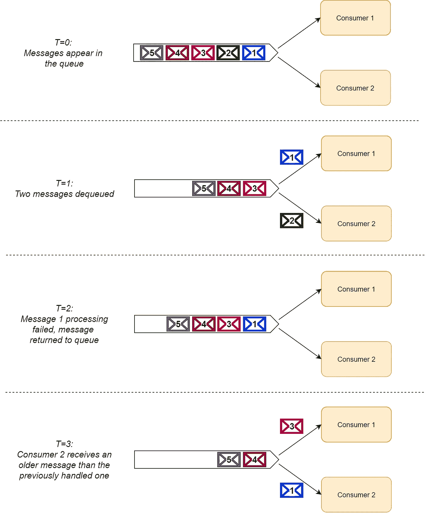
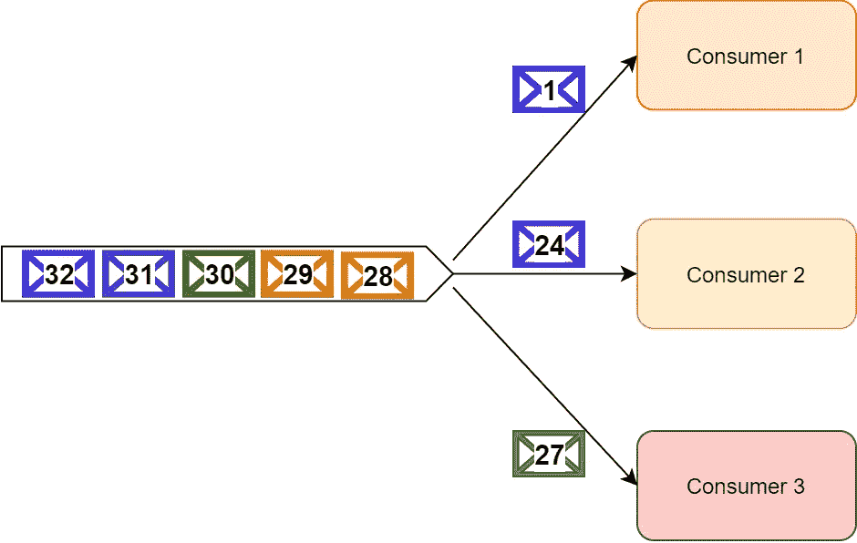
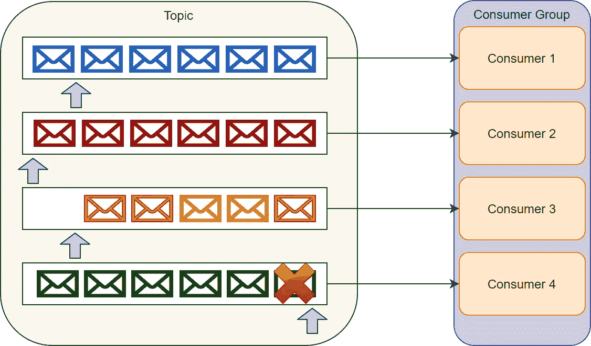
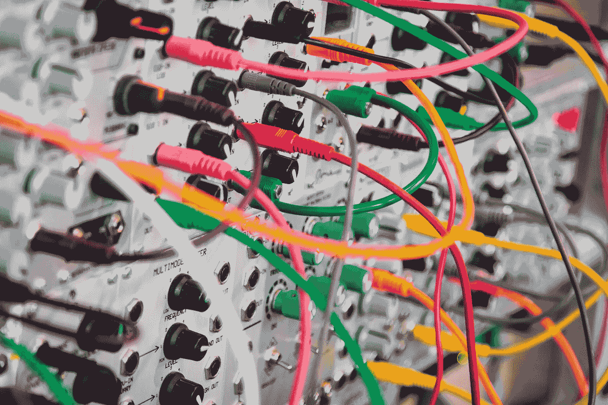
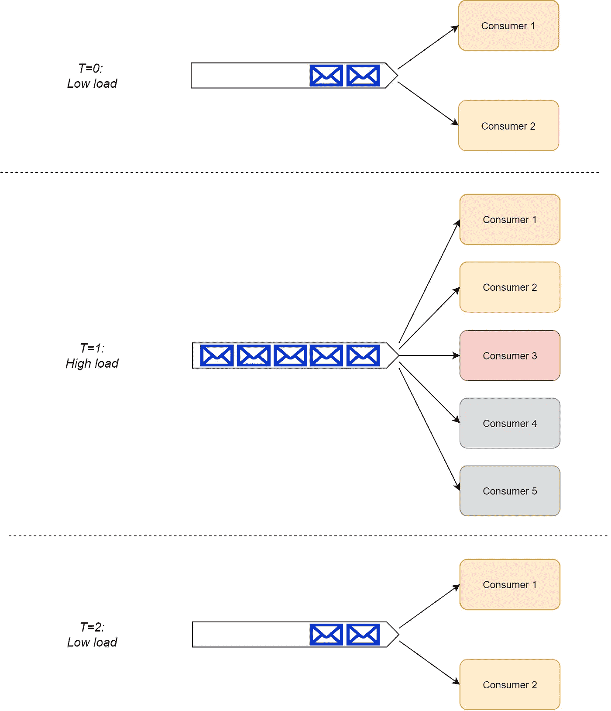
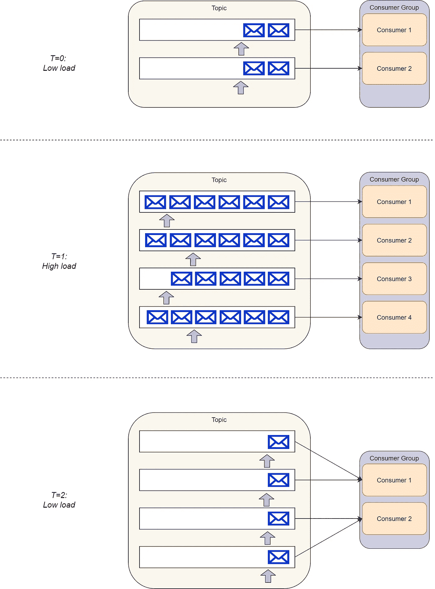

# RabbitMQ 与卡夫卡:正面交锋

> 原文：<https://betterprogramming.pub/rabbitmq-vs-kafka-1779b5b70c41>

## 比较各自的优势和劣势

*精选图片—图片由*[*absolute vision*](https://unsplash.com/@freegraphictoday?utm_source=unsplash&utm_medium=referral&utm_content=creditCopyText)*上* [*Unsplash*](https://unsplash.com/s/photos/guidance?utm_source=unsplash&utm_medium=referral&utm_content=creditCopyText)

# 介绍

作为一名处理大量基于微服务的系统的软件架构师，我经常遇到一个不断重复的问题:“我应该使用 [RabbitMQ](https://www.rabbitmq.com/) 还是 [Kafka](https://kafka.apache.org/) ？”

出于某种原因，许多开发人员认为这些技术是可以互换的。虽然在某些情况下确实如此，但这些平台之间存在各种潜在的差异。

因此，不同的场景需要不同的解决方案，选择错误的解决方案可能会严重影响您设计、开发和维护软件解决方案的能力。

[本系列的第 1 部分](https://medium.com/better-programming/rabbitmq-vs-kafka-1ef22a041793)解释了 [RabbitMQ](https://www.rabbitmq.com/) 和 [Apache Kafka](https://kafka.apache.org/) 的内部实现概念。这一部分继续回顾这两个平台之间的显著差异，作为软件架构师和开发人员，我们应该注意这些差异。

然后，它继续解释我们通常试图用这些工具实现的架构模式，并评估何时使用每种工具。

## 附注 1

如果你不熟悉 RabbitMQ 和 Kafka 的内部结构，我强烈推荐你先通读一下本帖的 [part 1](https://medium.com/better-programming/rabbitmq-vs-kafka-1ef22a041793) 。如果您不确定，那么请随意浏览标题和图表，至少可以对这些差异有所了解。

## 附注 2

继上一篇帖子之后，一些读者问我关于[阿帕奇脉冲星](https://pulsar.apache.org/)的问题。Pulsar 是另一个消息平台，旨在结合 RabbitMQ 和 Kafka 的一些优点。

作为现代平台，看起来很有前景；然而，像任何其他平台一样，它有自己的优势和劣势。我将在以后的帖子中尝试解决 Apache Pulsar 的比较问题，因为这篇帖子主要关注 RabbitMQ 和 Kafka。

# RabbitMQ 和 Kafka 之间的显著差异

RabbitMQ 是一个*消息代理*，而 Apache Kafka 是一个*分布式流媒体平台*。这种差异可能看起来是语义上的，但是它包含了严重的含义，影响了我们舒适地实现各种用例的能力。

例如，Kafka 最适合用于处理数据流，而 RabbitMQ 对于流中消息的排序有最低限度的保证。

另一方面，RabbitMQ 内置了对重试逻辑和死信交换的支持，而 Kafka 将这些实现留给了用户。

本节重点介绍这些不同平台之间的这些和其他显著差异。

## 消息排序

照片由[阿尔沙德·普卢奥](https://unsplash.com/@ar_shad?utm_source=unsplash&utm_medium=referral&utm_content=creditCopyText)在 [Unsplash](https://unsplash.com/s/photos/series?utm_source=unsplash&utm_medium=referral&utm_content=creditCopyText) 拍摄

RabbitMQ 对发送到队列或交换的消息的排序没有提供什么保证。虽然消费者按照生产者发送消息的顺序处理消息似乎是显而易见的，但这很容易让人误解。

RabbitMQ 文档对其订购保证做了如下说明:

> 在一个通道中发布的消息，经过一个交换、一个队列和一个传出通道后，将按发送顺序被接收— [RabbitMQ 代理语义](https://www.rabbitmq.com/semantics.html)

换句话说，只要我们有一个消息消费者，它就按顺序接收消息。然而，一旦我们有多个消费者从同一个队列中读取消息，我们就不能保证消息的处理顺序。

这种缺乏排序保证的情况之所以发生，是因为消费者可能会在阅读完消息后将它们返回(或重新传递)到队列中(例如，在处理失败的情况下)。

一旦消息被返回，即使它已经使用了后面的消息，另一个消费者也可以获取它进行处理。因此，使用者组无序地处理消息，如下图所示。

使用 RabbitMQ 时丢失消息排序的示例

当然，我们可以通过将消费者并发限制为一个来恢复 RabbitMQ 中的消息排序。更准确地说，单个使用者中的线程数量应该限制为一个，因为任何并行消息处理都可能导致相同的无序问题。

然而，将我们自己局限于一个单线程消费者会严重影响我们在系统增长时扩展消息处理的能力。因此，我们不应该轻松地进行这种权衡。

另一方面，Kafka 在消息处理上提供了可靠的排序保证。Kafka 保证发送到同一个主题分区的所有消息都按顺序处理。

如果您还记得第 1 部分，默认情况下，Kafka 使用循环分割器将消息放在分区中。但是，生产者可以在每个消息上设置一个分区键，以创建逻辑数据流(例如来自同一设备的消息，或者属于同一租户的消息)。

然后，来自同一个流的所有消息都被放在同一个分区中，让使用者组按顺序处理它们。

但是，我们应该注意，在一个使用者组中，每个分区都是由单个使用者的单个线程处理的。因此，我们无法扩展单个分区的处理。

然而，在 Kafka 中，我们可以扩展一个主题中的分区数量，使每个分区接收更少的消息，并为额外的分区添加额外的消费者。

**获胜者**

Kafka 是明显的赢家，因为它允许按顺序处理信息。RabbitMQ 在这方面只有弱保证。

## 信息发送

[韦巴罗](https://unsplash.com/@webaroo?utm_source=unsplash&utm_medium=referral&utm_content=creditCopyText)在 [Unsplash](https://unsplash.com/s/photos/router?utm_source=unsplash&utm_medium=referral&utm_content=creditCopyText) 上的照片

RabbitMQ 可以根据用户定义的路由规则将消息路由到消息交换的用户。一个[主题交换](https://www.rabbitmq.com/tutorials/amqp-concepts.html#exchange-topic)可以基于一个名为`routing_key`的专用头来路由消息。

或者，[头交换](https://www.rabbitmq.com/tutorials/amqp-concepts.html#exchange-headers)可以基于任意消息头路由消息。这两种交换都有效地允许消费者指定他们感兴趣接收的消息类型，从而为解决方案架构师提供了极大的灵活性。

另一方面，Kafka 不允许消费者在投票之前过滤主题中的消息。订阅的使用者无一例外地接收分区中的所有消息。

作为开发人员，您可以使用一个 [Kafka 流作业](https://kafka.apache.org/documentation/streams/)，它从主题中读取消息，过滤它们，并将它们推送到消费者可以订阅的另一个主题。然而，这需要更多的努力和维护，并有更多的移动部件。

**获胜者**

RabbitMQ 在路由和过滤消息供消费者使用时提供了卓越的支持。

## 消息定时

奥利弗·黑尔在 [Unsplash](https://unsplash.com/s/photos/timing?utm_source=unsplash&utm_medium=referral&utm_content=creditCopyText) 上拍摄的照片

RabbitMQ 提供了各种与对发送到队列的消息进行计时有关的功能:

**消息生存时间(TTL)**

一个 [TTL](https://www.rabbitmq.com/ttl.html) 属性可以与发送到 RabbitMQ 的每个消息相关联。设置 TTL 可以由发布者直接完成，也可以作为队列本身的策略来完成。

指定 TTL 允许系统限制消息的有效期。如果消费者没有及时处理它，那么它会自动从队列中删除(并被转移到一个死信交换，稍后会详细介绍)。

TTL 对于时间敏感的命令特别有用，这些命令在经过一段时间没有处理就变得无关紧要。

**延迟/预定消息**

RabbitMQ 通过使用[插件](https://github.com/rabbitmq/rabbitmq-delayed-message-exchange)支持延迟/预定消息。当在消息交换中启用该插件时，生产者可以向 RabbitMQ 发送消息，生产者可以延迟 RabbitMQ 将该消息路由到消费者队列的时间。

这个特性允许开发者安排未来的命令，这些命令并不意味着在那之前就要被处理。例如，当生产者遇到节流规则时，我们可能想要将特定命令的执行延迟到稍后的时间。

Kafka 不支持此类功能。当消息到达时，它将消息写入分区，消费者可以立即使用这些消息。

此外，Kafka 没有为消息提供 TTL 机制，尽管我们可以在应用程序级别实现一个。

我们还必须记住，Kafka 分区是一个只附加的事务日志。因此，它不能操纵消息时间(或分区内的位置)。

**获胜者**

RabbitMQ 轻而易举地胜出，因为其实现的性质限制了 Kafka。

## 消息保留

[丘特尔斯纳普](https://unsplash.com/@chuttersnap?utm_source=unsplash&utm_medium=referral&utm_content=creditCopyText)在 [Unsplash](https://unsplash.com/s/photos/storage?utm_source=unsplash&utm_medium=referral&utm_content=creditCopyText) 上拍照

一旦消费者成功地消费了消息，RabbitMQ 就从存储器中驱逐它们。此行为无法修改。这是几乎所有消息代理设计的一部分。

相比之下，Kafka 根据设计将所有消息保存到每个主题配置的超时时间。关于信息保持，Kafka 不关心其消费者的消费状态，因为它充当信息日志。

消费者可以随心所欲地使用每条消息，并且可以通过操纵分区偏移量来“及时”地来回移动。Kafka 定期检查主题中消息的年龄，并驱逐那些足够老的消息。

Kafka 的性能不依赖于存储大小。因此，从理论上讲，我们几乎可以无限期地存储消息，而不会影响性能(只要您的节点足够大，能够存储这些分区)。

**获胜者**

Kafka 是为了保留信息而设计的，而 RabbitMQ 不是。这里没有竞争，卡夫卡被宣布为胜利者。

## 故障处理

由[莎拉·基利安](https://unsplash.com/@rojekilian?utm_source=unsplash&utm_medium=referral&utm_content=creditCopyText)在 [Unsplash](https://unsplash.com/s/photos/error?utm_source=unsplash&utm_medium=referral&utm_content=creditCopyText) 上拍摄的照片

在处理消息、队列和事件时，开发人员通常认为消息处理总是成功的。毕竟，由于生产者将每条消息放在一个队列或主题中，即使消费者未能处理消息，它也可以简单地重试，直到成功。

虽然表面上是这样，但我们应该在这个过程中投入更多的思考。我们应该承认，在某些情况下，消息处理可能会失败。我们应该优雅地处理这些情况，即使解决方案部分由人为干预组成。

处理消息时有两种可能的错误:

1.  瞬时故障—由于网络连接、CPU 负载或服务崩溃等临时问题而发生的故障。我们通常可以通过一次又一次的重试来减轻这种失败。
2.  持续故障—由于无法通过额外重试解决的永久性问题而发生的故障。这些失败的常见原因是软件错误或无效的消息模式(即，有害消息)。

作为架构师和开发人员，我们应该问自己:“当消息处理失败时，我们应该重试多少次？重试之间应该等待多长时间？我们如何区分瞬时故障和持续故障？”

最重要的是:“当所有的重试都失败，或者我们遇到一个持续的失败时，我们该怎么办？”

虽然这些问题的答案是特定于领域的，但是消息平台通常为我们提供实现我们的解决方案的工具。

RabbitMQ 提供了传递重试和死信交换(DLX)等工具来处理消息处理失败。

DLX 的主要思想是 RabbitMQ 可以根据适当的配置将失败的消息自动路由到 DLX，并在此交换中对消息应用进一步的处理规则，包括延迟重试、重试计数和提交到“人工干预”队列。

[本文](https://engineering.nanit.com/rabbitmq-retries-the-full-story-ca4cc6c5b493)提供了关于 RabbitMQ 中处理重试的可能模式的更多见解。

这里要记住的最重要的一点是，在 RabbitMQ 中，当一个使用者忙于处理和重试一个特定的消息时(甚至在将它返回到队列之前)，其他使用者可以并发地处理跟在它后面的消息。

当特定的消费者重试特定的消息时，消息处理作为一个整体不会停滞。因此，消息消费者可以同步重试消息，而不会影响整个系统。

消费者 1 可以继续重试消息 1，而其他消费者继续处理消息

与 RabbitMQ 相反，Kafka 没有提供任何现成的机制。有了 Kafka，我们就可以在应用程序级别提供和实现消息重试机制。

此外，我们应该注意，当使用者忙于同步重试特定消息时，来自同一分区的其他消息无法得到处理。

我们不能拒绝并重试特定的消息，也不能提交它之后的消息，因为消费者不能更改消息顺序。正如您所记得的，分区仅仅是一个只附加的日志。

应用程序级解决方案可以将失败的消息提交给“重试主题”并从那里处理重试；然而，在这种类型的解决方案中，我们失去了消息排序。

在 Uber.com 的[可以找到由优步工程公司实施的这样一个例子。如果消息处理延迟不是问题，那么对错误进行充分监控的普通 Kafka 解决方案可能就足够了。](https://eng.uber.com/reliable-reprocessing/)

如果使用者无法重试消息，则不会处理底部分区中的消息

**冠军**

RabbitMQ 在点数上是赢家，因为它提供了一种开箱即用的机制来解决这个问题。

## 规模

由 [Unsplash](https://unsplash.com/s/photos/scale?utm_source=unsplash&utm_medium=referral&utm_content=creditCopyText) 上的[图形节点](https://unsplash.com/@graphicnode?utm_source=unsplash&utm_medium=referral&utm_content=creditCopyText)拍照

有多个基准测试，检查 RabbitMQ 和 Kafka 的性能。

虽然通用基准对特定情况的适用性有限，但 Kafka 通常被认为比 RabbitMQ 具有更好的性能。Kafka 使用顺序磁盘 I/O 来提高性能。

它使用分区的架构意味着它比 RabbitMQ 在水平方向(向外扩展)的伸缩性更好，而 rabbit MQ 在垂直方向(向上扩展)的伸缩性更好。

大型 Kafka 部署通常每秒可以处理数十万条消息，甚至数百万条消息。

过去，Pivotal 记录了 RabbitMQ 集群每秒处理[一百万条消息](https://content.pivotal.io/blog/rabbitmq-hits-one-million-messages-per-second-on-google-compute-engine)；但是，它是在一个 30 节点的集群上实现的，负载在多个队列和交换之间进行了优化分布。

典型的 RabbitMQ 部署包括三到七个节点集群，这些集群不一定能在队列之间最佳地分配负载。这些典型的集群通常可以预期每秒处理数万条消息的负载。

**赢家**

虽然两个平台都可以处理大量负载，但 Kafka 通常比 RabbitMQ 具有更好的伸缩性，可以实现更高的吞吐量，因此赢得了这一轮。

然而，值得注意的是，大多数系统都没有达到这些限制中的任何一个！因此，除非你正在构建下一个百万用户的热门软件系统，否则你不需要如此关心规模，因为这两个平台都可以很好地为你服务。

## 消费者复杂性

约翰·巴克利普在 [Unsplash](https://unsplash.com/s/photos/complex?utm_source=unsplash&utm_medium=referral&utm_content=creditCopyText) 上的照片

RabbitMQ 使用智能代理和非智能消费者的方法。消费者注册使用队列，RabbitMQ 将消息推给他们，让他们在消息进来时进行处理。RabbitMQ 也有拉 API 然而，它很少被使用。

RabbitMQ 管理向消费者分发消息和从队列中移除消息(可能是 dlx)。消费者不需要担心这些。

RabbitMQ 的结构还意味着，当负载增加时，队列的使用者组可以有效地从一个使用者扩展到多个使用者，而无需对系统进行任何更改。

RabbitMQ 消费者有效地扩大规模和缩小规模

另一方面，卡夫卡使用一种愚蠢的经纪人和聪明的消费者的方法。消费者组中的消费者需要协调他们之间的主题分区租约(以便消费者组中只有一个消费者监听特定的分区)。

消费者还需要管理和存储他们的分区的偏移索引。幸运的是，Kafka SDK 会为我们处理这些，所以我们不需要自己管理它。

然而，当我们的负载较低时，单个消费者需要并行处理和跟踪多个分区，这需要消费者端有更多的资源。

此外，随着负载的增加，我们只能将使用者组扩大到使用者数量等于主题中分区数量的程度。除此之外，我们需要配置 Kafka 来添加额外的分区。

然而，随着负载再次降低，我们不能删除已经添加的分区，这增加了消费者需要做的工作。尽管如上所述，SDK 处理这些额外的工作。

Kafka 分区不能被移除，在缩小规模后留给消费者更多的工作

**获胜者**

RabbitMQ，从设计上来说，是为头脑简单的消费者设计的。因此，它是这一轮的赢家。

# 什么时候用哪个？

由 [Paulius Dragunas](https://unsplash.com/@paulius005?utm_source=unsplash&utm_medium=referral&utm_content=creditCopyText) 在 [Unsplash](https://unsplash.com/s/photos/lighthouse?utm_source=unsplash&utm_medium=referral&utm_content=creditCopyText) 上拍摄的照片

现在我们来到了这个百万美元的问题:“我们什么时候应该使用 RabbitMQ，什么时候应该使用 Kafka？”

如果我们总结上述差异，我们会得出以下结论:

当我们需要时，RabbitMQ 是更好的选择:

1.  高级灵活的路由规则。
2.  消息定时控制(控制消息到期或消息延迟)。
3.  高级故障处理功能，以防消费者很可能无法处理消息(暂时或永久)。
4.  更简单的消费者实现。

当我们需要:

1.  严格的消息排序。
2.  延长消息保留时间，包括重播过去消息的可能性。
3.  在传统解决方案无法满足需求的情况下，达到高规模的能力。

我们可以使用这两个平台实现大多数用例。然而，作为解决方案架构师，我们有责任为这项工作选择最合适的工具。在做这个选择的时候，我们应该同时考虑到上面强调的功能性差异和非功能性约束。

这些约束包括以下内容:

1.  这些平台的现有开发人员知识。
2.  托管云解决方案的可用性(如果适用)。
3.  每个解决方案的运营成本。
4.  我们的目标堆栈的 SDK 的可用性。

当开发复杂的软件系统时，我们可能会尝试使用相同的平台来实现所有需要的消息传递用例。然而，从我的经验来看，通常情况下，使用这两个平台会有很多好处。

例如，在基于事件驱动架构的系统中，我们可以使用 RabbitMQ 在服务之间发送命令，并使用 Kafka 实现业务事件通知。

原因是事件通知通常用于事件源、批处理操作(ETL 风格)或审计目的，因此 Kafka 的消息保留能力非常有价值。

另一方面，命令通常需要在使用者端进行额外的处理，这些处理可能会失败，并且需要高级的故障处理能力。

在这里，RabbitMQ 因其功能而大放异彩。我可能会在将来写一篇关于它的详细文章，但是你必须记住——你的里程可能会有所不同，因为适用性取决于你的具体要求。

# 结束语

我从许多开发人员将 RabbitMQ 和 Kafka 视为可互换的观点出发，开始了这个由两篇文章组成的系列。我希望回顾这些帖子有助于深入了解这些平台的实现，以及它们之间的技术差异。

这些差异反过来会影响这些平台能够很好服务的用例。这两个平台都很棒，可以服务于多种用例。

然而，作为解决方案架构师，我们需要理解每个用例的需求，区分它们的优先级，并选择最合适的解决方案。