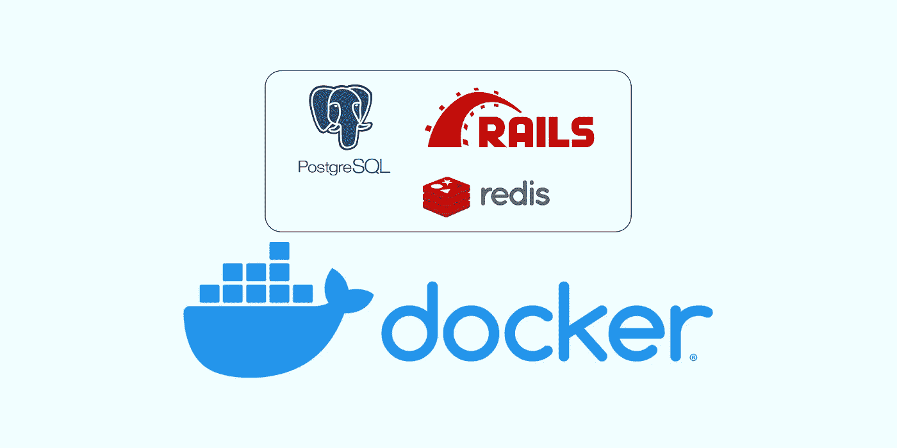
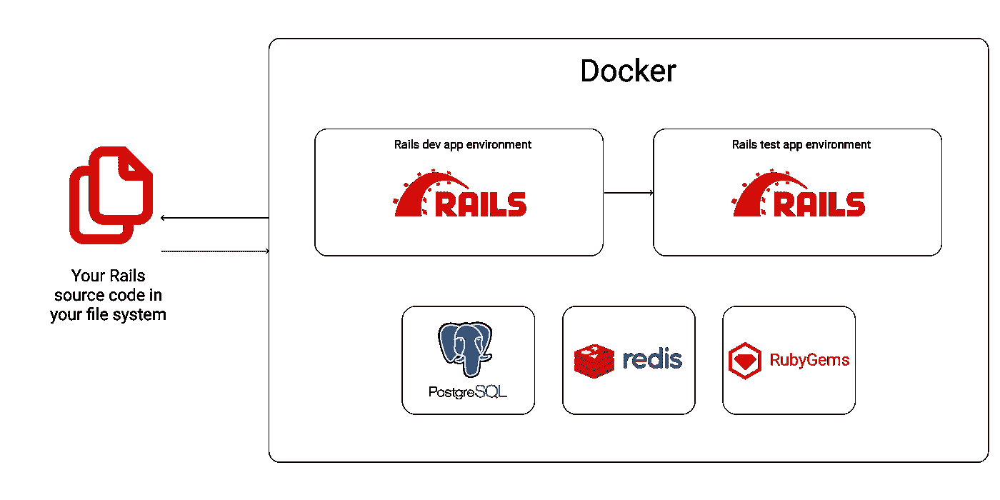
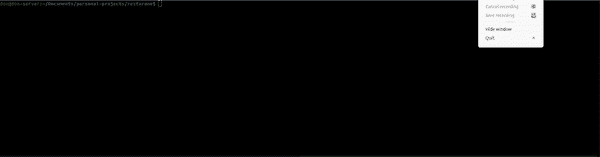
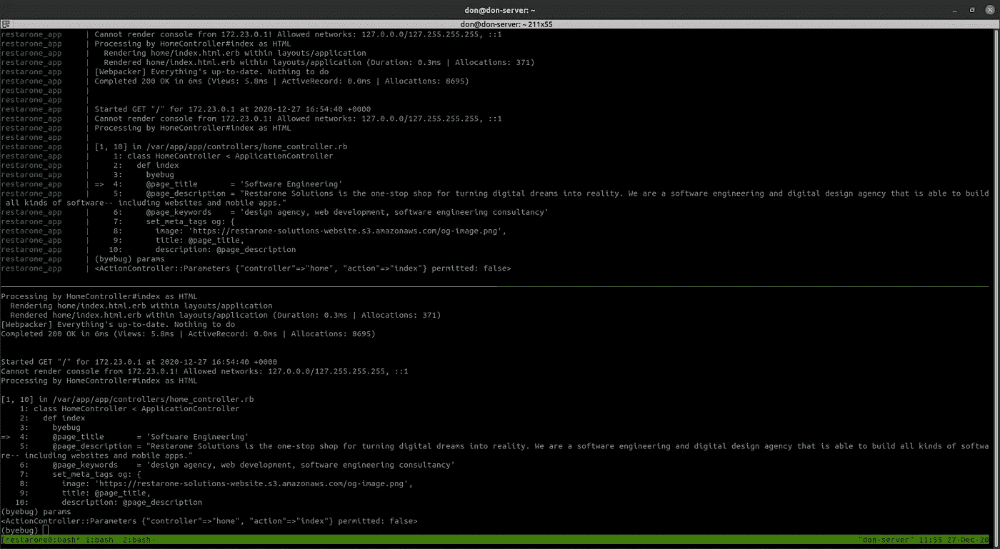

# 用 Docker 开发 Rails 6

> 原文：<https://betterprogramming.pub/rails-6-development-with-docker-55437314a1ad>

## 用确定性开发环境增强 Rails 工作流的实用指南



图片来源:作者

本指南涵盖了在本地机器上为 Rails 开发配置 [Docker](https://www.docker.com/) 。我的目标是引导您为构建 Ruby on Rails 应用程序建立一个符合人体工程学的、可重复的开发环境。

创建 Docker 配置时考虑了以下目标:

1.  在单独的 Docker 容器中运行测试，并在套件运行后拆除支持基础设施
2.  使用 [Docker 绑定挂载](https://docs.docker.com/storage/bind-mounts/)支持开发模式下的 Rails 热重载(不需要将源代码复制到 Docker 容器中)
3.  Gems 安装在单独的卷上
4.  byebug/pry 支持
5.  允许从应用程序卷内部运行 Rails 生成器并写入主机文件系统(使用绑定挂载)

为了支持上述内容，体系结构将如下所示:



图片来源:作者

我将“dockerizing”的 Rails 应用程序具有一个 [PostgreSQL](https://www.postgresql.org/) 数据库和 [Redis](https://redis.io/) (用于[动作电缆](https://guides.rubyonrails.org/action_cable_overview.html))并被命名为`restarone`。

如果您想观看视频，请点击此处:

在这个视频中，我遵循了本文中概述的所有步骤

让我们开始吧。

# 创建 Dockerfile 文件

首先，我在项目根目录下创建了一个`Dockerfile.dev`,并加入了安装依赖项的管道。

Dockerfile.dev

稍后我们将研究第 11 和 12 行引用的入口点文件，但是这个脚本只是安装 Rails 依赖项并清除缓存在容器中的 gem。

# 使用 Docker Compose 定义卷、网络和服务

接下来，我创建了定义应用程序使用的卷、服务和网络的`docker-compose.yml`。

docker-compose.yml

app 源代码的绑定挂载在第 30 行，指向本地文件系统上的 Rails 根目录。gem 被缓存在一个单独的卷上，因此可以在不干扰应用程序其余部分的情况下清理和重建它们。

`tty:true`谓词在附加到 Docker 容器时启用 byebug/pry 支持。我将 PostgreSQL(第 23 行)绑定到主机上的一个非标准端口，以避免与运行在端口`5432`上的本地安装的 PostgreSQL 服务器冲突。因此，如果您想运行 PgAdmin，请确保您将主机端口指定为`5099`，或者简单地将其更改为映射到`5432:5432`。

Rails 测试环境被简单地映射到已经构建好的 Rails dev 环境映像，但是它将在一个单独的容器和网络中运行。这允许我们同时运行开发服务器和测试套件，而不必在它们之间做出选择。

# 在容器内部运行脚本的入口点

现在让我们看一下每个环境的入口点文件。对于开发，我创建了以下入口点:

dev-docker-entrypoint.sh

它只是打印出 Rails 环境，检查是否满足包依赖关系，然后删除`puma server.pid`文件。(我倾向于强制退出容器。)接下来，它将通过在命令前加上前缀`bundle exec`来运行传递给它的任何命令。

除了删除服务器 pid 文件之外，测试入口点是相同的:

test-docker-entrypoint.sh

# 传递环境变量

现在，重物不再碍事了。在开始之前的最后一步是创建各自的环境文件，这些文件定义了应用程序所需的变量。我创建了两个名为`.env.development`和`.env.test`的文件，并放入每个环境的 db 配置中:

```
DATABASE_HOST=restarone_db
DATABASE_USERNAME=postgres
DATABASE_PASSWORD=password
DATABASE_NAME=restarone_development
DATABASE_PORT=5432
REDIS_URL=redis://restarone_redis:6379/1
```

因为 DNS 解析是由 Docker 处理的，所以 Rails 应用程序可以通过容器名(例如`restarone_db`和`restarone_redis`)找到/解析主机。

# 命令

这就是 Docker 的设置。让我们来看看几个命令。

## 构建应用程序并运行它

首先，我们需要构建容器，然后运行它们:

```
docker-compose build && docker-compose up
```



您应该看到正在构建的映像和正在启动的应用程序服务

## 附加到开发应用程序

要在 byebug/pry 中使用断点，只需在项目的目录名前加上`app`(我的目录名为`restarone`，因此应用程序名为`restarone_app`，测试环境名为`restarone_test`):

```
docker attach restarone_app
```



完整的应用程序日志(上图)，byebug 会话(下图)

## 运行测试套件

我们可以为测试套件创建一个一次性容器，然后在套件完成后通过运行以下命令将其拆除:

```
docker-compose run --rm restarone_test rails test:full_suite
```

只需传入应用程序使用的任何测试命令。我喜欢为运行测试创建一个 rake 任务，所以对我来说它是`rails test:full_suite`。

## 铁路发电机

就像测试套件一样，我们也可以构建一次性容器来运行标准的 Rails 生成器。

```
docker-compose run --rm restarone_app rails g model User name:string# for running migrationsdocker-compose run --rm restarone_app rails db:migrate
```

## 运行将输出写入本地文件系统的一次性脚本

有时 rake 任务会写入文件系统。我们可以通过运行如下命令来实现这一点:

```
docker-compose run --rm -v $PWD/tmp:/tmp restarone_app bundle exec rails r /tmp/script.rb# ordocker-compose run --rm -v $PWD/tmp:/tmp restarone_app rake some_namespace:some_task
```

## 连接到数据库容器

要运行`psql`命令，您需要使用`docker-compose exec`从 PostgreSQL 容器运行一个 shell:

```
docker-compose exec restarone_db sh
```

## 将本地文件复制到 Docker 容器中

有时我需要从 SQL 转储中恢复我的开发数据库。您可以使用`docker cp`将任何文件复制到容器中的共享卷:

```
docker cp /local/path/to/local/file/here container_name:/var/shared# to copy a SQL dump to the shared folder in the db: 
docker cp /local/path/to/dump/latest.dump restarone_db:/var/shared# to copy a file to the shared folder in the app: 
docker cp /local/path/to/file/some-rb-script.rb restarone_app:/var/shared
```

然后通过指向`var/shared/`从容器中引用该文件。在下面的例子中，我使用 Docker `exec`命令直接在正在运行的`restarone_db`容器上运行`psql`命令:

```
docker-compose exec restarone_db pg_restore -U postgres -d restarone_development /var/shared/latest.dump --no-owner --clean -F c
```

# 总结想法

Rails 是令人惊奇的，当与 Docker 打包在一起时，您会得到一个优雅的可移植性和确定性的 Rails 开发环境，您可以随时随地使用它进行构建。

沙施克是一名来自多伦多的软件工程师，也是 Restarone 公司的创始人。当他不开发软件时，他在 Medium 和 YouTube 上创作内容，帮助人们过渡到技术领域。