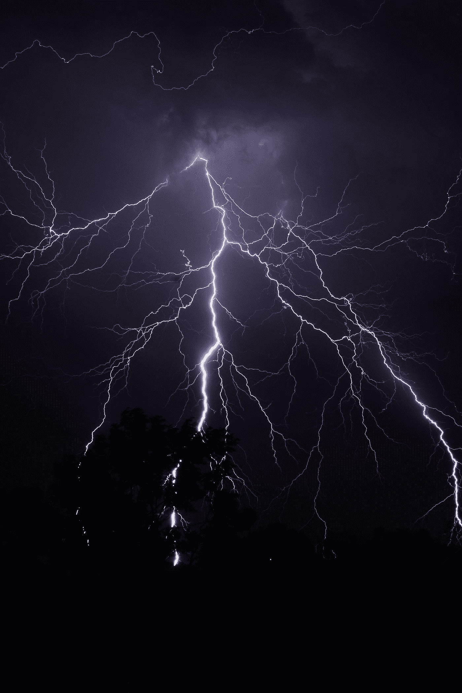
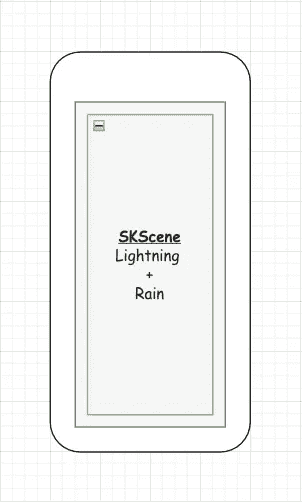
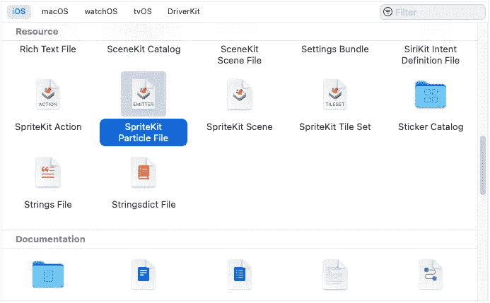
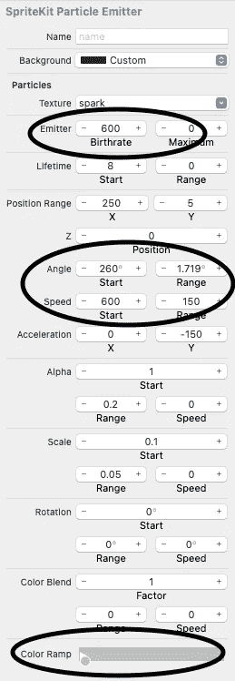
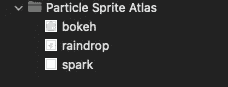
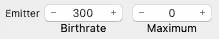
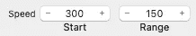
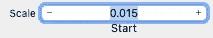
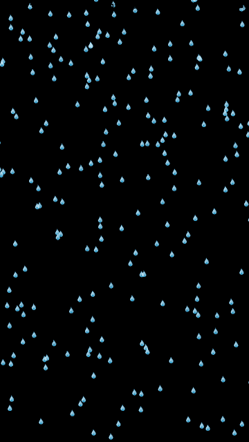

# 使用 SwiftUI 中的 SpriteKit 创建一个雨动画效果

> 原文：<https://betterprogramming.pub/rain-lightning-animation-using-spritekit-in-swiftui-part-1-%EF%B8%8F-e2cf489e5d25>

## 使用粒子发射器和其他 SpriteKit 魔法药剂在 SwiftUI 中创建完整的降雨体验



米歇尔·麦克尤恩在 [Unsplash](https://unsplash.com?utm_source=medium&utm_medium=referral) 上拍摄的照片

这是在 SwiftUI 中使用 SpriteKit 的雨+闪电动画的第一部分。我们将在这一部分讲述如何创建一个雨的动画。

在这个故事的结尾，你会学到:

*   什么是 SKScene
*   什么是 SpriteKit 粒子发射器
*   绘制路径
*   最后，建立一个闪电下雨的动画

**注:**这是我的版本如何创建一个雨+闪电的动画。你也可以通过许多其他方式达到同样的目的。:)



这就是我们将如何分解雨+闪电动画

## **我们要如何创造** `**Rain+Lightning Animation**` **？**

从上图中，我们可以看到我们有一个`SKScene`，它有两个孩子。

1.  雨(`SKEmitterNode`)
2.  闪电(`SKShapeNode`)

对于细节，我们也将运行灯光闪烁序列。

## 我们开始吧

我们先从雨景开始。之后，创建雨动画就非常简单了。为了制作雨的动画，我们将使用粒子发射器。

我们将为雨创造一个`SpriteKit Particle File`。从你的项目 Xcode 中选择`File` > `New` > `File` > `SpriteKit Particle File`如下图。



选择`SpriteKit Particle File`后，将弹出下一页，要求您选择`Particle Template`。

点击下拉菜单并选择`Rain`选项。选择`Rain`选项并点击下一步后，我们将看到一个名称输入屏幕，在这里我们将给出我们的`Rain`动画粒子文件名。

这里我们将提供名称`Rain`。这将最终在您的项目文件夹中创建一个`.sks`文件。如下图。


下雨了。SKS 文件

## 详细描述雨

当你点击`Rain.sks`时，文件显示 SpriteKit 提供的默认 Rain 的预览。

我们将修改雨看起来有点凉。

为此，我们将对 Rain 的一些属性进行一些修改，这可以通过点击`Attributes Inspector`来完成，并对我所做的进行如下修改。



改进的雨属性

我们已更改的属性的详细信息:

*   `Birthrate`——将控制将要形成的粒子数量(我已经增加了它，以便显示一场大雨)
*   `Angle` —角度`Start`将显示雨水将从哪个角度倾泻。倾斜的角度看起来很像刮风下雨。我已经把 260 看起来像一场轻微的刮风雨。
*   `Color Ramp`——这只是粒子的颜色，在这种情况下是雨。我在这里给了一个浅灰色

一切都好，对吧？现在，在这一点上，我们的雨是超级准备好被钉在应用程序上。

## 在 ContentView 中设置雨场景

为此，我们将创建一个`SKScene`类。我们就叫它`RainLightningScene`。
RainLighningScene 将是我们用来创建/表现我们的雨和闪电动画的类。

我们将为`RainLightningScene`创建一个`shared`实例。这将使我们在使用它时变得容易。我们还将有一个 EmitterNode 对象，在其中我们将给出我们的雨粒子文件名。

```
**let** rainEmitter = SKEmitterNode(fileNamed: “Rain.sks”)!
```

我们还将使用`SKScene`的`didMove`委托。`didMove`实际上与`UIViewController`中的`viewDidAppear`非常相似。

我们还会给出雨点的定位点。我们将给出 y 和 x 的位置。像下面这样

```
rainEmitter.position.y = **self**.frame.maxYrainEmitter.particlePositionRange.dx = **self**.frame.width * 2.5
```

`particlePositionRange` —粒子位置允许的随机值范围(我给了它一个长范围，这样雨看起来更分散)。
这个`RainLightningScene`类现在看起来如下。

现在我们的雨景已经准备好了。我们将插上`RainLightning Scene`看看它是什么样子。为此，我们必须向我们的`ContentView`文件添加一些代码。

像往常一样，我们将添加一些实用程序扩展。

```
**extension** UIScreen {**static** **let** screenWidth = UIScreen.main.bounds.size.width**static** **let** screenHeight = UIScreen.main.bounds.size.height**static** **let** screenSize = UIScreen.main.bounds.size}
```

我们将首先添加上述扩展，因为它可以方便我们的进一步发展。

一旦添加完毕，我们将转到我们的`ContentView`块并创建一个`SKScene`对象。

我们将它命名为`rainLightningScene`并给它一个尺寸，设置它的缩放模式如下。

```
**var** rainLightningScene: SKScene {**let** scene = RainLightningScene.sharedscene.size = UIScreen.screenSizescene.scaleMode = .fill**return** scene}
```

现在，一旦这个被添加，我们将扑向我们的`body`并添加一个`SpriteView`与我们刚刚创建的场景现在的`rainLightningScene`。

最终的代码如下所示:

雨将从这一点开始下😉

在这一点上，我们的动画看起来会像下面这样。


大雨倾盆！！！💧

## 需要更多细节

我知道我们的雨需要更多的细节。让我们把魔法药水洒在我们的雨上。魔法药水只不过是给粒子添加了一个图像。
你可以在这里下载图片[。
下载完图像后，您需要将图像添加到`Particle Sprite Atlas`文件夹内的资产文件中。](https://github.com/Nikilicious09/Images/blob/main/Raindrop.png)



我们需要添加图像的文件夹

一旦图像被添加，我们将点击`Rain.sks`文件，并在其属性检查器中修改一些属性。我们将把`Texture`改为我们刚才添加的图像的名称。

我们也将改变比例，发射器和速度属性，如下所示。



发射器粒子出生率为 300



恒速到 300



缩放至 0.015

现在我们的雨看起来就像下面的 gif。



最终大雨倾盆！！！🌧

我希望你已经理解了我们如何通过使用粒子发射器和调整它的一些属性来创建一个雨的动画。

我很快会在 SwiftUI 系列中发布使用 SpriteKit 的 Rain+Lightning 动画的第二部分。

谢谢你，祝你有美好的一天。