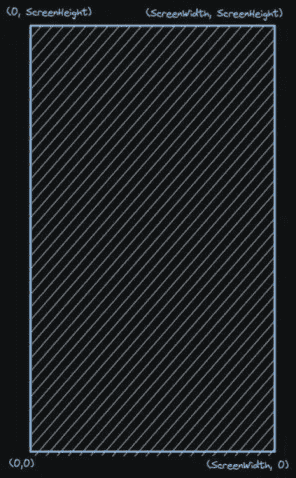
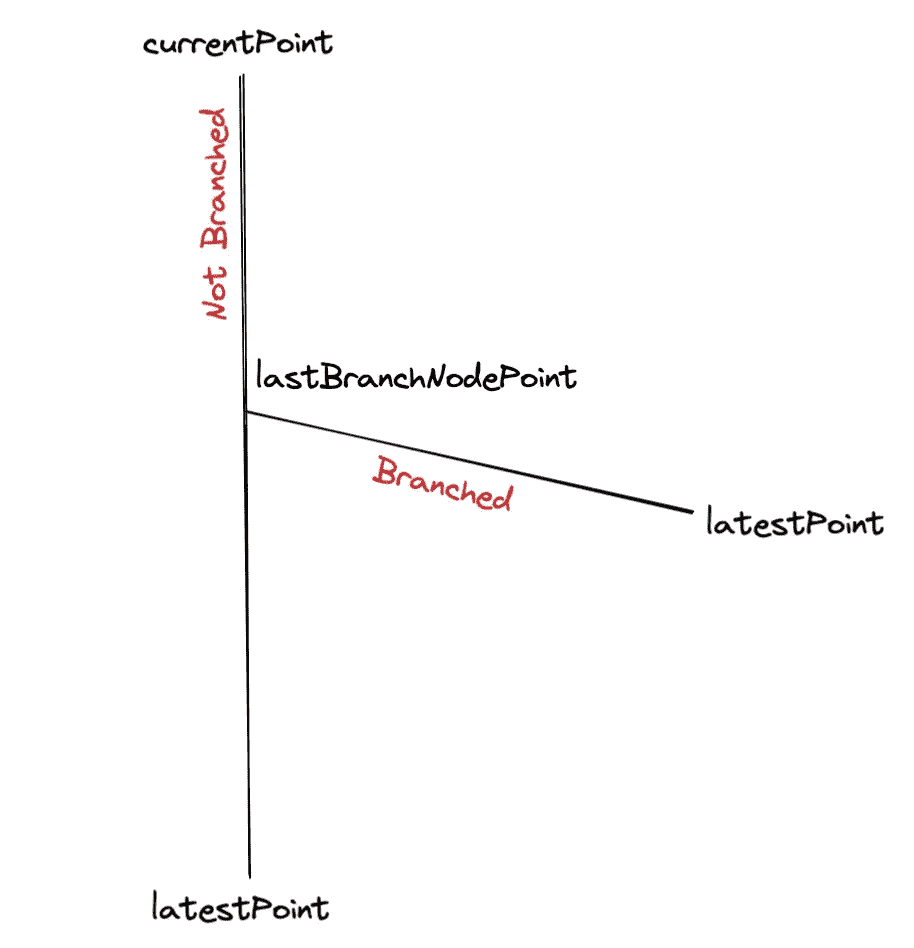

# 使用 SwiftUI 中的 SpriteKit 创建闪电动画

> 原文：<https://betterprogramming.pub/rain-lightning-animation-using-spritekit-in-swiftui-part-ii-837ee74f6bd3>

## 使用 SpriteKit 药水在 SwiftUI 中创建闪电体验


Johannes Plenio 在 [Unsplash](https://unsplash.com?utm_source=medium&utm_medium=referral) 上拍摄的照片

这个系列的第一部分可以在这里访问[。在开始给闪电编码之前，我们将尝试描绘一道闪电。每一个闪电都会发光，然后消失，大部分是一组锯齿状的线条。大多数情况下，闪电组是一组没有分支的锯齿状线条，很少会有分支。对于那些错过了第一部分的人来说，这里的](/rain-lightning-animation-using-spritekit-in-swiftui-part-1-️-e2cf489e5d25)就是。

现在让我们看看我们将如何使用 SKScene 来设置我们的螺栓节点。
sk scene 的坐标系大概如下图。



坐标系

现在我相信你可能已经有了一些想法，我们将在哪里开始我们的闪电和结束我们的闪电。

开始吧！！！

## 拉博尔特⚡️

为了让闪电发生，我们需要从闪电开始。然后通过添加越来越多的螺栓使其更加真实。让我们编写第一个函数来创建螺栓。我们将该函数命名为`addBolt`，该函数将接受 2 个输入`currentPoint`和`latestPoint`。
我们将使用`currentPoint`来设置绘图笔的位置。我们将使用`latestPoint`来设置从`currentPoint`到`latestPoint`所画直线的端点。通过使用`currentPoint`和`latestPoint`我们得到螺栓路径。

但这还不够，我们还需要划清界限。为此，我们将使用`SKShapeNode`并将螺栓路径设置为`SKShapeNode`。为了详细说明，我们将赋予形状节点一个`glowWidth`和一个`strokeColor`。一旦完成，我们将添加形状节点作为我们的 SKScene 的子节点。

## 为螺栓生成随机点🎲

现在我们已经看到了如何创建一个螺栓节点。我们将看到如何为螺栓生成随机点，使它们看起来更进步，更真实。为此，我们将使用两个随机化器，一个用于螺栓长度，另一个用于下一个螺栓角度。

对于螺栓角度，我将给出一些单位圆上的起始包信息-
在单位圆中，对于任何角度θ，我们可以将坐标为(x，y)的单位圆上的点 P 表示为:

```
y = sinθ
x = cosθ
```

如果这个圆不是单位圆，它的半径是 r，我们就写

```
y = r*sinθ
x = r*cosθ
```

现在我们不能保持一个固定的角度来生成(x，y)点，因为它看起来像一个镜像的曲折线。因此，我们将使用一个随机函数来生成下一个螺栓角度，而不是保持一个固定的角度，如下所示。

```
let randomAngle = Double.random(in: -180..<180)
```

现在我们有了一个随机的角度，我们将生成我们的(x，y)点。同样和我们的角度一样，我们也必须随机化**螺栓**的长度。我们将保持随机数发生器的范围为最小值=5，最大值=30。

```
let randomBoltLength = Double.random(in: 5..<30)
```

为了得到我们的 **x** 点，我们将把`cos(randomAngle)`值与生成的`randomBoltLength`相乘，并加上最后一个螺栓点的 **x** 值
为了得到我们的 **y** 点，我们将需要一个相乘的`randomBoltLength`和`sin(randomAngle)`的正值，并从最后一个螺栓点的 **y** 值中减去该值。为什么递减，因为就像我之前说的，在开始的时候，顶部的点会是`UIScreenHeight`，随着我们往下走，它会递减。

## 启动闪电⚡️

至此，我们已经具备了启动闪电的所有必要功能。我们将创建输入参数为`currentPoint`、`isBranchNode`和`currentIteration`的`startLightning`函数。我们将递归地使用`startLightning`函数来生成完整的闪电。该函数将有一个名为`latestPoint`的变量，它将保存`randomly generated bolt points`。另一个名为`randomedBranchNode`的变量将被赋予一个 0…100 之间的随机整数值。我们稍后将回到这一点。

在继续之前，我们将注释掉这部分
`self.addChild(rainEmitter)`
，这样我们就可以完全专注于创建闪电。🙂

为了使闪电渐进，我们将使用随机生成时间的`asyncAfter`。

```
DispatchQueue.main.asyncAfter(deadline: .now() + Double.random(in: 0..<0.03))
```

**核心逻辑**
现在我们将设置递归逻辑，我们还将设置分支逻辑。这里作为一个基本检查，我们将检查闪电点 **y** 是否越过小于 0，这意味着闪电已经到达地面或完成。如果螺栓点 **y** 没有达到或越过 0 值，那么我们将重复该函数调用。

**分支逻辑**
一个闪电可以有多个分支。为了选择分支节点，我们将使用从`randomedBranchNode`变量生成的值。如果`currentIteration`和`randomedBranchNode`持有相同的值，那么我们将再次调用`startLightning`函数，其中`isBranchNode`参数为真。对于分支节点，我们肯定不能不使用`currentPoint`，因为它已经被非分支节点消耗了。如果它是一个分支节点，那么我们将不断更新一个名为`lastBranchNodePoint`的变量。并且`lastBranchNodePoint`将保存`latestPoint`作为其值。下面是整个设置的简介。



分支和不分支

`startLightning`功能的最终功能如下所示。

在这一点上，最终的动画将看起来像下面的。


在设置了闪电之后

## 添加闪电闪光器和闪电闪光器🔦

为此，我们将使用`SKAction`序列运行闪电闪光器和闪电闪光器动画。为了闪烁螺栓，我们将在重复时将 SKScene 的`alpha`值从 1 切换到 0.5。我们将这个函数称为`boltFlasher`。该功能将以`glowCount`作为其输入。`glowCount`将是重复持续时间的因子。

添加完`boltFlasher`后，我们将在`startLightning`函数中再次调用这个函数，为`glowCount`使用一个随机生成器。

```
let randomBlinkCounter = Int.random(in: 0...5)self.boltFlasher(glowCount: randomBlinkCounter)
```

我们在这一级别的最终动画将如下所示。


添加闪电图标动画后

现在我们将添加闪电闪光器逻辑。
为此我们将把 SKScene 的背景色从`black`改为`white`，其`alpha`值为 **0.7** 。我们也不会每次都做 flash。如果我们这样做，看起来会很糟糕。因此，我们将使用`currentIteration`计数来切换闪电闪烁动画，而不是每次都闪烁。

我们将添加下面的代码行添加闪电闪光器。
在 **11** 的倍数上，我们将增加闪电闪光器。

```
if currentIteration % 11 == 0 {
self.lightningFlasher(flashCount: 1)
}
```

我们在这一级别的最终动画将如下所示。


添加闪电动画后

我希望你明白如何使用递归算法创建闪电效果，同时考虑闪电分支。在下一篇文章(第三部分)中，我们将把我们在第一部分创建的雨动画和我们刚刚创建的闪电动画连接起来。

谢谢你，祝你有美好的一天。❤