# Kubernetes 与 Rancher 2.x 和让我们加密免费证书

> 原文：<https://betterprogramming.pub/rancher-2-x-lets-encrypt-dns-01-challenge-and-route53-c636c8966aab>

## 使用“让我们加密”来展示您的 Kubernetes 工作负载


罗布·乔登在 [Unsplash](https://unsplash.com/s/photos/ranch?utm_source=unsplash&utm_medium=referral&utm_content=creditCopyText) 上的照片

[Rancher](https://rancher.com/) 是我最喜欢的 Kubernetes 管理平台，因为它不仅提供了一个制作精良的 UI，还允许你使用 [RKE](https://rancher.com/docs/rke/latest/en/) 快速配置你的 Kubernetes 集群。

使用 [Docker](https://docker.com) 准备好您的虚拟机后，您只需在每个虚拟机上复制/粘贴一个 Docker 命令，5-10 分钟后，您就可以启动并运行生产级 Kubernetes 集群。

在这篇文章中，我记录了我在配置 lab-Kubernetes 集群时的步骤，在该集群中，部署的资源会被自动分配。让我们使用带有 [DNS-01 质询](https://letsencrypt.org/docs/challenge-types/)的 [AWS Route53](https://aws.amazon.com/route53/) 加密证书(因为我的实验室设置无法从互联网访问)。

DNS-01 质询允许您获取可能无法通过互联网访问的域的证书，如果您需要获取通配符证书，这也是您的唯一选择。

在我探索这种设置的过程中，我查阅了两篇相关的伟大文章:

*   [牧场主 2 和 Letsencrypt](https://www.2stacks.net/blog/rancher-2-and-letsencrypt/#edit-the-ingress) 通过[2 堆栈](https://twitter.com/StanMan2Stacks)
*   [Rancher 2.x and Let's Encrypt，带 Cert-manager 和 Nginx Ingress](https://www.idealcoders.com/posts/rancher/2018/06/rancher-2-x-and-lets-encrypt-with-cert-manager-and-nginx-ingress/) 作者 [Daniel Hawton](https://www.idealcoders.com/posts/author/daniel/)

来自 2stacks 的帖子只处理 HTTP-01 挑战，而来自 Daniel 的帖子手动创建证书资源(例如，请求)。我希望在我的设置中有 DNS-01 挑战和自动证书生成。

# 为 Route53 设置 AWS IAM 权限

首先:创建一个 [AWS IAM](https://console.aws.amazon.com/iam) 用户，并提供必要的权限来处理您计划使用的域的托管区域。

因为我使用的 AWS 帐户是为这个特定的实验室创建的，所以我只是通过一个用户组授予了`AmazonRoute53FullAccess`策略；您也许可以选择一些权限:

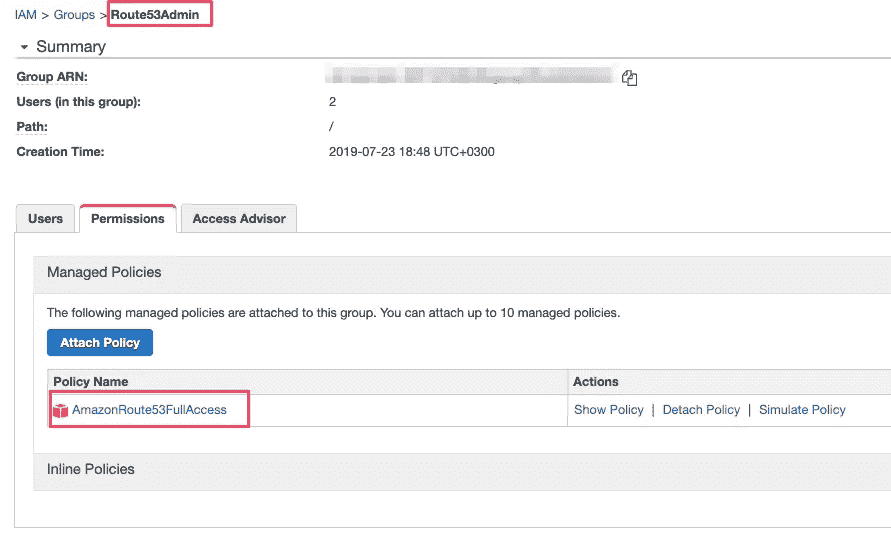

拥有处理 Route53 所需权限的 AWS IAM 用户 hroup

**注意:**确保为您的用户下载凭证，因为稍后会用到它们。

# 在 Rancher 上安装证书管理器

现在，在你的 Rancher-manager 节点上，进入系统>应用>启动>加密(cert-manager)>查看详细信息。

*   为你的应用选择一个名字— `cert-manager`似乎是一个不错的选择。
*   输入与将要创建的证书相关联的电子邮件。
*   现在，最好使用[让我们加密登台服务器](https://letsencrypt.org/docs/staging-environment)来避免测试期间的请求速率限制；稍后我将向您展示如何切换到生产环境。

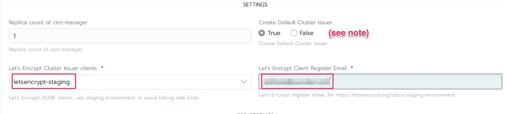

让我们加密证书的临时颁发者和电子邮件地址

**注意:**默认集群发布者使用 HTTP-01 质询。我们稍后再编辑。

等到`cert-manager` app 创建完成:

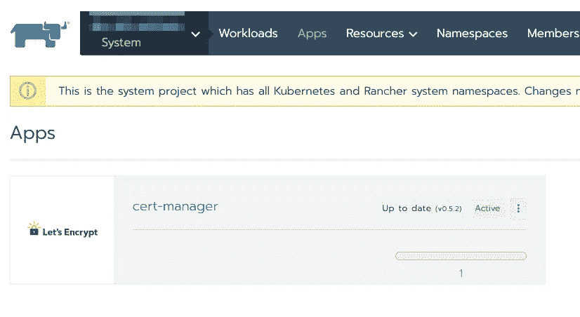

证书管理器已成功安装

# 将群集颁发者切换到 DNS-01 质询

如上所述，安装`cert-manager`时创建的默认集群发布者使用 HTTP-01 质询。如果您的群集暴露在 Internet 上，这种方法很有效；对于私有集群或颁发通配符证书，您唯一的选择是将“让我们加密验证”切换到 DNS-01 质询。我们就这么做吧。

我们首先为本文第一步中创建的 AWS IAM 帐户的秘密密钥定义一个 Kubernetes 秘密。转到系统项目>资源>机密>添加机密，并创建您的机密:

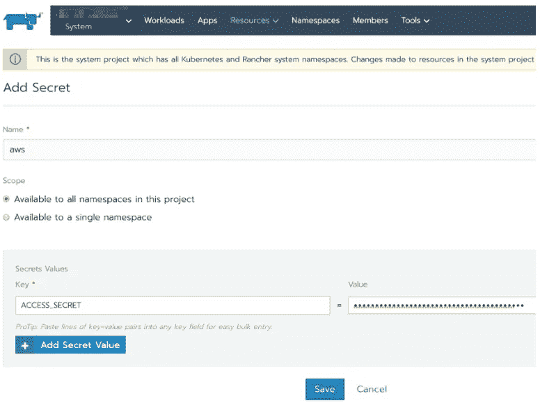

为有权访问 Route53 的 AWS IAM 用户创建密码

**注意:**确保在从 AWS IAM 下载的 CSV 文件中使用`Secret access key`的值。

现在，我们需要编辑由`cert-manager`创建的默认集群发布者，并将其切换到 DNS-01 质询。

转到您的集群的仪表板，点击`Launch kubectl`。一旦你得到控制台窗口，输入`kubectl edit clusterissuer`。您应该会得到与下面类似的输出:

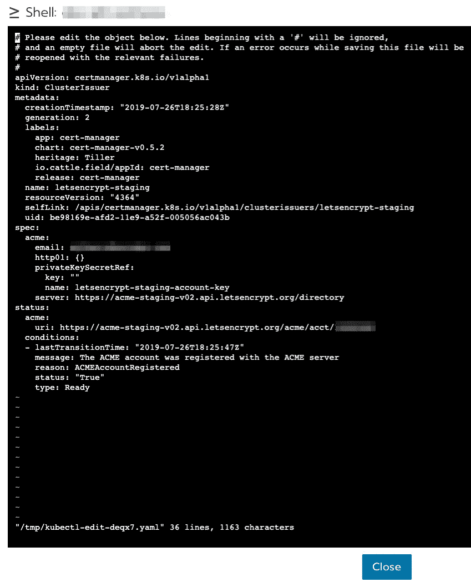

具有 HTTP-01 质询的默认群集颁发者

用以下挡块替换`spec:`:

确保您有所改变:

*   使用你在本文开头创建的 AWS IAM 用户
*   `hostedZoneID`route 53 中您要管理的域的托管区域 ID
*   `region`(你在这里放什么并不重要，因为 53 路是无区域的)
*   `email`(将创建证书的电子邮件地址)

为了检查您的更改是否被正确应用，您可以发出`kubectl describe clusterissuer`。

# 部署测试工作负载

为了实际查看我们迄今为止的工作成果，我们需要一个测试 web 工作负载。

挑选你最喜欢的网页测试 Docker 图片——我的是 [containous/whoami](https://hub.docker.com/r/containous/whoami) 。在`Default project > Workloads > Deploy`直接在 Rancher 部署:

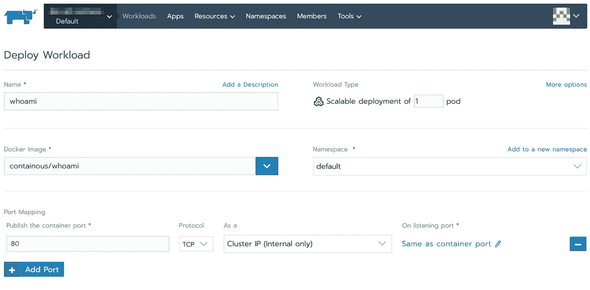

创建测试工作负载

下一步是在默认项目>负载平衡>添加入口中为我们的测试工作负载创建一个入口:

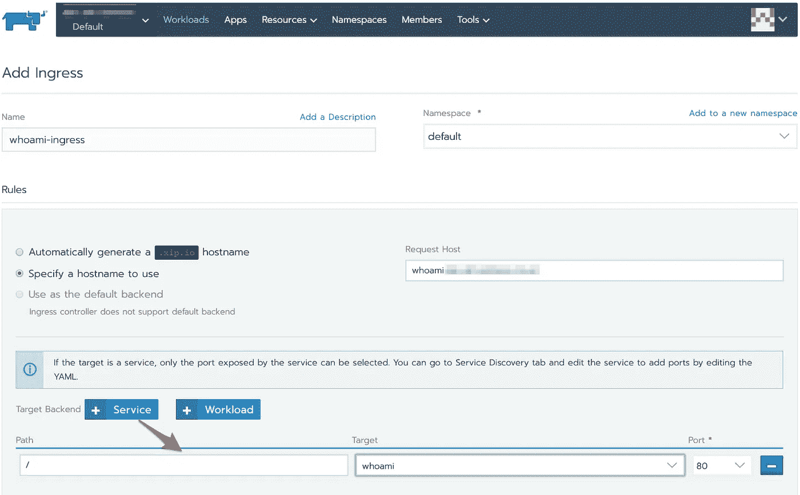

为测试工作流创建入口

**注意:**作为目标后端，Rancher 默认选择一个工作负载。请删除此建议，并选择一项服务。

选择“Specify a hostname to use”，并输入您的测试工作负载将可访问的(子)域。

假设您的 LB/DNS 被正确配置为将您的 Kubernetes-worker 节点路由到您上面指定的域，您现在应该能够通过在`hostname`之前请求它来查看您在端口 80 上的测试工作负载:

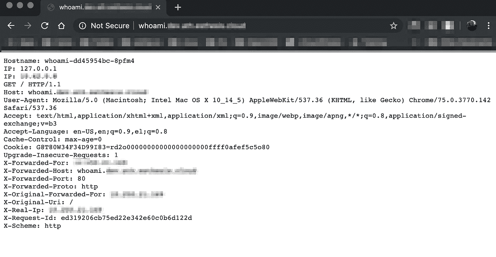

部署在端口 80 上的工作负载

此时，我们知道工作负载已正确部署，我们的入口工作正常，我们的 LB/DNS 配置能够为我们使用的`hostname`转发/解析流量。所以是时候去 HTTPS 了。

# 为 HTTPS 配置入口

转到默认项目>工作负载>负载平衡，然后选择“查看/编辑 YAML”

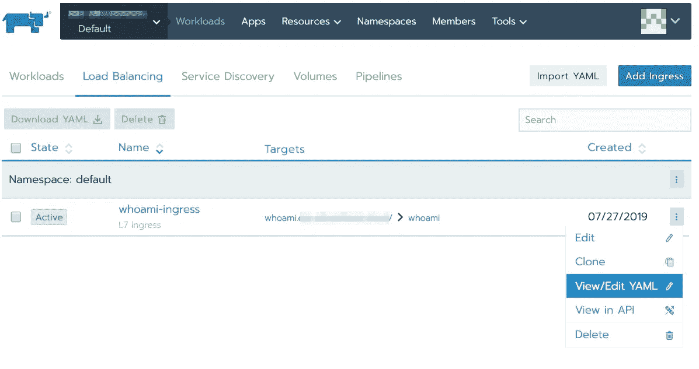

编辑入口以启用 HTTPS

**注意:**大部分的入口重新配置也可以在 Rancher 的 UI 中完成；然而，并不是所有的都可以，所以我们将选择直接编辑 YAML 文件，在一个地方做所有的修改。

以下是我们将要改变的概述:

*   添加注释以允许`cert-manager`被触发来创建证书(实际上，它是`cert-manager`监听您的注释)
*   在入口启用 TLS

要添加注释，在`metadata > annotations`下，添加:

```
certmanager.k8s.io/acme-challenge-type: dns01
certmanager.k8s.io/acme-dns01-provider: route53
certmanager.k8s.io/cluster-issuer: letsencrypt-staging
```

要启用 TLS，在`spec`下，添加:

**备注:** 1。)显然，您需要将`YOUR.DOMAIN`替换为您的工作负载在入口暴露的域。2.)注意使用牧场主 YAML 使用的相同缩进。

几秒钟(到几分钟)后，您应该能够通过 HTTPS 访问您的测试工作负载(此外，HTTP 到 HTTPS 重定向在入口上自动启用):

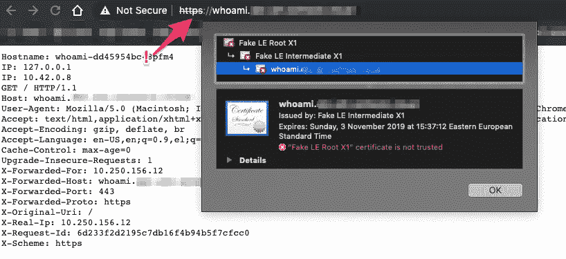

HTTPS 的工作量

假证书是意料之中的，因为我们一直在为 Let's Encrypt staging server 配置环境。我强烈建议你像那样开始你自己的第一次配置。Let's Encrypt 的生产服务器有非常具体的[速率限制](https://letsencrypt.org/docs/rate-limits/)您可以在测试期间轻松达到。

一旦您准备好迁移到 Let's Encrypt 的生产服务器，请继续阅读。

# 获取让我们加密生产证书

生产证书是您的浏览器信任的真实证书，因此不会显示任何警告。

还记得上面的“将群集颁发者切换到 DNS-01 挑战”中，我们是如何配置为群集颁发证书的群集颁发者的吗？在那里，我们输入了 Let's Encrypt 的临时服务器的详细信息。我们现在需要更改(或扩充)该配置，以包括 Let's Encrypt 的生产服务器。

## 方法 1:更改现有的集群颁发者

只需重复您在“将集群颁发者切换到 DNS-01 质询”中所做的编辑，但这次使用:
`server: https://acme-v02.api.letsencrypt.org/directory`

您可能还想更改资源的名称，以及为您的颁发者创建的私钥的名称(尽管这在技术上不是必需的；只是出于理智才这么做):

```
name: letsencrypt 
privateKeySecretRef:
  name: letsencrypt
```

下次部署入口时，选择`letsencrypt`作为集群发布者(而不是`letsencrypt-staging`发布者)。你现在有一个生产证书。

**注意:**最好保留临时集群发行者，并创建一个额外的发行者来处理生产证书。通过这种方式，您仍然可以在测试中使用 staging one，并在必要时切换到 production one。这就是下面的第二种方法，所以请继续阅读。

## **方法 2:创建新的集群发布者**

转到集群的仪表盘，点击`Launch kubectl`。使用以下 YAML 创建一个新的集群发布者(您可以使用`vi`创建 YAML，然后使用`kubectl apply -f yourfile.yaml`):

**注意:**用你自己的细节替换`__.*__`变量。

当您为您的服务创建一个新入口时，您现在可以在您认为合适的`letsencrypt`或`letsencrypt-staging`集群发布者之间进行选择。

为了测试 Let's Encrypt 的生产证书，我在`whoami2`主机名下部署了一个额外的工作负载:

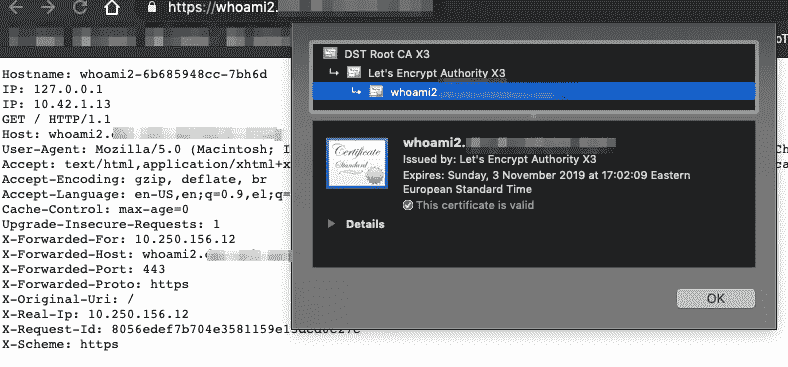

我们的服务带有生产证书

嗯，这一切听起来像是一个复杂的设置，但主要是`lets-encrypt`的初始配置需要时间。

一旦在集群中进行了配置，您就再也不需要接触它了。只需在工作负载的入口添加几个条目，就万事大吉了。

阅读这篇文章的更新，了解如何升级证书管理器:

[](https://itnext.io/rancher-cert-manager-upgrade-bd15468bac9c) [## Rancher 2.x 证书管理器升级

### 如何在为时已晚之前升级您的 Kubernetes 集群

itnext.io](https://itnext.io/rancher-cert-manager-upgrade-bd15468bac9c)