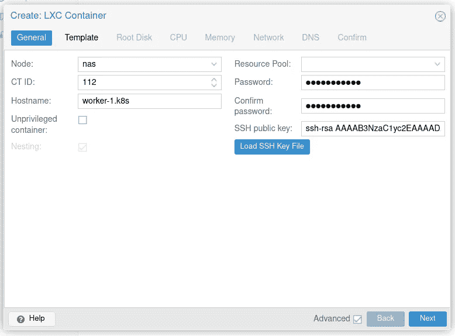
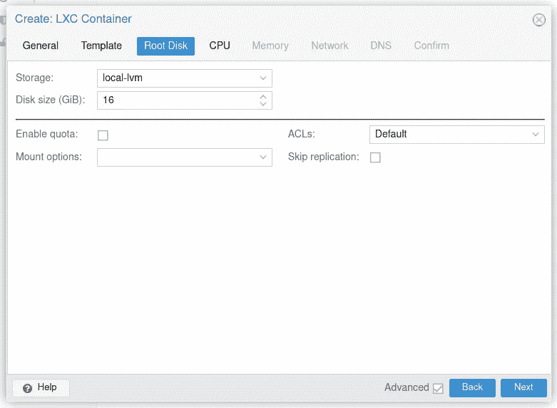
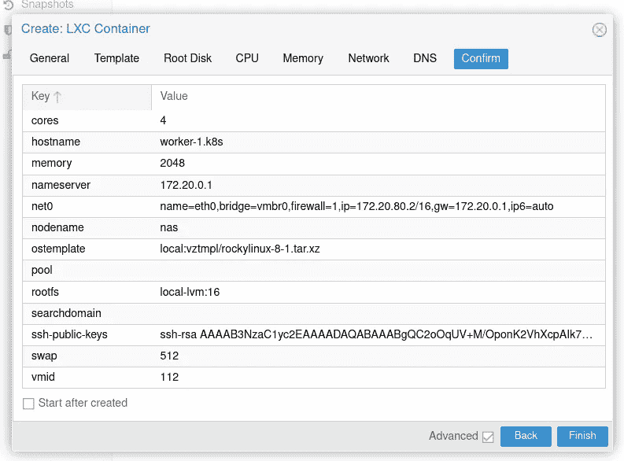
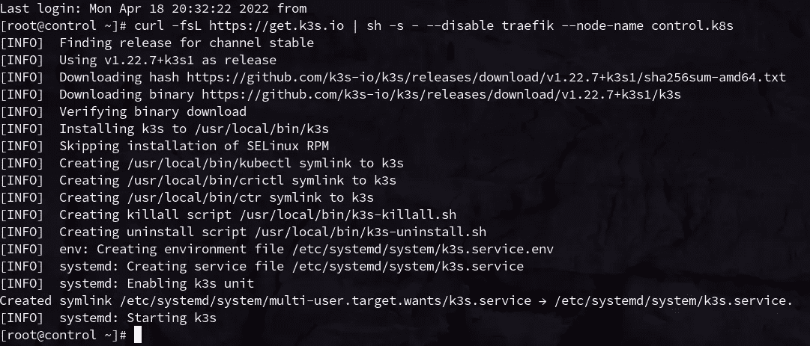
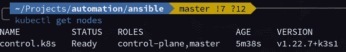
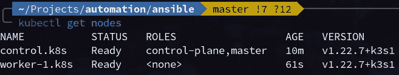
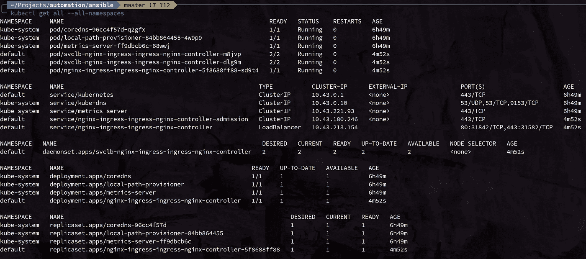
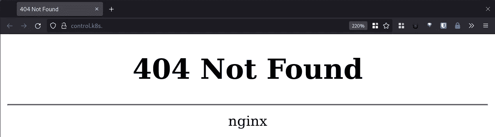

# 牧场主 K3s:prox MOX 集装箱上的 Kubernetes

> 原文：<https://betterprogramming.pub/rancher-k3s-kubernetes-on-proxmox-containers-2228100e2d13>

## 使用 LXC 容器和 K3s 启动带有 NGINX 入口控制器的 K8s 集群


很长一段时间以来，我一直自己托管我的大多数在线服务，如日历、联系人、电子邮件、云文件存储、我的网站等。我的设置的当前迭代依赖于一系列可翻译的行动手册，这些手册安装所有各种应用程序并配置它们以供使用。

这真的很稳定，对我来说效果很好。我将应用程序部署到 [Proxmox](https://www.proxmox.com/en/) 上的一组 LXC 容器(读作:[轻量级 Linux 虚拟机](https://linuxcontainers.org/lxd/))中，这是一个免费的开源管理程序，具有出色的管理界面。

然而，最近我一直在重新学习 Docker 和使用容器部署应用程序的好处。一些大的例子是:

*   有保证的可复制环境。应用程序附带了它的依赖项，随时可以运行。
*   便携性。假设您的环境支持容器运行时，它也支持应用程序。
*   基础设施即代码。与 Ansible playbooks 非常相似，Docker 非常适合使用代码来管理容器环境，代码可以被跟踪和版本化。

因此，我决定开始将我的裸机 Linux Ansible playbooks 转换为一组 Kubernetes 部署的旅程。

但是，Proxmox 还是有一些我喜欢的地方我不舍得放弃。首先，能够虚拟化无法轻松容器化的物理机(如我的路由器或接入点管理门户)。当我需要在主机上进行维护时，能够在服务器之间迁移“物理”操作系统安装非常有用。

因此，我将在 Proxmox 上安装 Kubernetes，我想在 LXC 容器上这样做。

# 我们正在构建的内容和理念

我将使用 [Rancher 的 K3s](https://rancher.com/docs/k3s/latest/en/) 发行版在 LXC 容器上部署一个 Kubernetes 集群。

K3s 是一个轻量级的生产级 Kubernetes 发行版，它预先配置了 DNS、网络和其他开箱即用的工具，从而简化了设置过程。K3s 还使得将新员工加入集群变得相当容易。这一点，再加上我的部署规模相对较小，使它成为一个相当容易的选择。

另一方面，LXC 集装箱可能看起来有点奇怪。我发现的几乎所有在 Proxmox 上部署 K8s 的文章都是使用全脂虚拟机，而不是容器。这当然是一条摩擦较小的路线，因为它在程序上与在物理主机上安装它是一样的。我选择 LXC 集装箱有两个主要原因:

1.  **LXC 集装箱*快*。几乎和裸机一样快。**由于 LXC 容器是在内核级虚拟化的，因此比传统虚拟机要轻得多。因此，它们几乎可以立即启动，以与主机内核几乎相同的速度运行，并且更容易动态地重新配置更多的 RAM/磁盘空间/CPU 内核。
2.  LXC 的集装箱更小。因为容器运行在主机的内核上，所以它们需要包含更小的一组包。这使得它们需要的开箱即用的磁盘空间少得多(因此，使它们更容易迁移)。

因此，首先，我将创建两个容器:一个控制节点和一个工作节点。

# 先决条件

我将假设您(1)有一个启动并运行的 Proxmox 服务器，(2)在 Proxmox 上有一个可用的[容器模板](https://us.lxd.images.canonical.com/images/rockylinux/8/amd64/default/)，以及(3)有某种 NFS 文件服务器。

最后一点很重要，因为我们将给容器一个相对较小的磁盘空间。因此，Kubernetes pods 需要的任何卷都可以创建为 [NFS 挂载](https://kubernetes.io/docs/concepts/storage/volumes/#nfs)。

您还需要在本地机器上设置`kubectl`和`helm`工具。

# 创建 LXC 容器

因为我们的 LXC 容器需要能够自己运行 Docker 容器，所以我们需要做一些开箱即用的额外配置来给它们适当的权限。

设置这两个容器的过程几乎是相同的，所以我将只介绍一次。

在 Proxmox 用户界面中，单击“创建联系类型”确保选中显示高级设置的复选框。



确保取消选中“无特权容器”

填写容器的详细信息。确保取消选中“无特权容器”复选框。在下一个屏幕上，选择您选择的模板。我用的是 [Rocky Linux 8 镜像](https://us.lxd.images.canonical.com/images/rockylinux/8/amd64/default/)。



我选择给每个容器一个 16 GiB 的根磁盘大小，只要我们不在磁盘上放置任何卷，这对 OS 和 K3s 的运行来说是绰绰有余的。

CPU 和内存值实际上取决于主机上的可用资源，以及您打算在 K8s 集群上运行的工作负载。对于我的，我给了每个容器 4 个 vCPU 核心和 4 GiB 的 RAM。


对于网络配置，请确保为每个节点设置一个静态 IP 地址。此外，如果您使用特定的内部 DNS 服务器(我强烈推荐！)，您应该在下一页进行配置。



最后，在最后一页，确保取消选中“创建后启动”复选框，然后单击“完成”。Proxmox 将创建容器。

# 附加配置

现在，我们需要调整一些底层的东西来给我们的容器适当的权限。您需要以`root`用户的身份 SSH 到您的 Proxmox 主机来运行这些命令。

在`/etc/pve/lxc`目录中，您会发现名为`XXX.conf`的文件，其中`XXX`是我们刚刚创建的容器的 ID 号。使用您选择的文本编辑器，编辑我们创建的容器的文件，添加以下行:

```
lxc.apparmor.profile: unconfined
lxc.cgroup.devices.allow: a
lxc.cap.drop:
lxc.mount.auto: "proc:rw sys:rw"
```

> *注意:当你试图编辑文件时，容器必须停止，否则 Proxmox 的网络文件系统会阻止你保存它。*

按顺序，这些选项(1)禁用 [AppArmor](https://www.apparmor.net/) , (2)允许容器的 cgroup 访问所有设备，(3)防止丢弃容器的任何功能，以及(4)在容器中以读写方式挂载`/proc`和`/sys`。

接下来，我们需要将内核引导配置发布到容器中。通常，容器不需要这样做，因为它使用主机的内核运行，但是 Kubelet 使用配置来确定运行时的各种设置，所以我们需要将其复制到容器中。为此，首先使用 Proxmox web UI 启动容器，然后在 Proxmox 主机上运行以下命令:

```
pct push <container id> /boot/config-$(uname -r) /boot/config-$(uname -r)
```

最后，**在每个容器**中，我们需要确保`/dev/kmsg`存在。Kubelet 将它用于一些日志功能，默认情况下它不存在于容器中。出于我们的目的，我们将它命名为`/dev/console`。在每个容器中，创建包含以下内容的文件`/usr/local/bin/conf-kmsg.sh`:

```
#!/bin/sh -e
if [ ! -e /dev/kmsg ]; then
	ln -s /dev/console /dev/kmsg
fimount --make-rshared /
```

如果`/dev/kmsg`不存在，这个脚本将`/dev/console`符号化为`/dev/kmsg`。最后，我们将配置它在容器启动 SystemD 一次性服务时运行。创建包含以下内容的文件`/etc/systemd/system/conf-kmsg.service`:

```
[Unit]
Description=Make sure /dev/kmsg exists[Service]
Type=simple
RemainAfterExit=yes
ExecStart=/usr/local/bin/conf-kmsg.sh
TimeoutStartSec=0[Install]
WantedBy=default.target
```

最后，通过运行以下命令来启用该服务:

```
chmod +x /usr/local/bin/conf-kmsg.sh
systemctl daemon-reload
systemctl enable --now conf-kmsg
```

# 设置容器操作系统和 K3s

现在我们已经设置好了容器，我们将在上面设置牧场主 K3s。幸运的是，Rancher 有意让这变得非常容易。

# 设置控制节点

**从控制节点**开始，我们将运行以下命令来设置 K3s:

```
curl -fsL [https://get.k3s.io](https://get.k3s.io) | sh -s - --disable traefik --node-name control.k8s
```

这里有一些注意事项:

*   默认情况下，K3s 配有一个 [Traefik 入口控制器](https://rancher.com/docs/k3s/latest/en/networking/#traefik-ingress-controller)。这很好，但我更喜欢使用行业标准的 [NGINX 入口控制器](https://kubernetes.github.io/ingress-nginx/)，所以我们将手动设置它。
*   我已经使用`--node-name`标志手动指定了节点名。这可能不是必要的，但我过去在 K3s 从 IP 地址反向查找主机名时遇到过问题，导致在集群重启之间出现不同的节点名称。明确指定名称可以避免这个问题。

如果一切顺利，您应该会看到类似如下的输出:



一旦完成，您就可以在您的本地机器上将`/etc/rancher/k3s/k3s.yaml`复制为`~/.kube/config`，并且您应该能够使用`kubectl get nodes`看到您的新(公认的单节点)集群！

> *注意:您可能需要将配置文件中的集群地址从* `*127.0.0.1*` *调整为控制节点的实际 IP/域名。*



# 设置工作节点

现在，我们需要将我们的工作节点加入 K3s 集群。这也很简单，但是您需要集群令牌来加入节点。

您可以通过在控制节点上运行以下命令**来发现这一点:**

```
cat /var/lib/rancher/k3s/server/node-token
```

现在，在工作节点上**运行以下命令来设置 K3s 并加入现有集群:**

```
curl -fsL [https://get.k3s.io](https://get.k3s.io) | K3S_URL=https://<control node ip>:6443 K3S_TOKEN=<cluster token> sh -s - --node-name worker-1.k8s
```

再次注意，我们明确指定了节点名。一旦这个过程完成，您现在应该看到 worker 节点出现在`kubectl get nodes`中:



您可以对将来要加入集群的任何其他工作节点重复此过程。

此时，我们有了一个功能正常的 Kubernetes 集群，但是因为我们禁用了 Traefik，所以它没有入口控制器。那么，让我们现在就开始吧。

# 设置 NGINX 入口控制器

我使用了`ingress-nginx/ingress-nginx`舵图来设置 NGINX 入口控制器。为此，我们将添加回购，加载回购的元数据，然后安装图表:

```
helm repo add ingress-nginx [https://kubernetes.github.io/ingress-nginx](https://kubernetes.github.io/ingress-nginx)
helm repo update
helm install nginx-ingress ingress-nginx/ingress-nginx --set controller.publishService.enabled=true
```

这里，`controller.publishService.enabled`设置告诉控制器向入口资源发布入口服务 IP 地址。

图表完成后，您应该看到各种资源出现在`kubectl get all`输出中。(请注意，控制器可能需要几分钟时间才能联机并将 IP 地址分配给负载平衡器。)



我们可以通过在 web 浏览器中导航到任何节点地址来测试控制器是否启动并运行:



在这种情况下，我们希望看到 404，因为我们还没有配置任何通过 NGINX 进入的服务。重要的是我们得到了 NGINX 提供的页面。

# 结论

现在，我们有了一个全功能的 Rancher K3s Kubernetes 集群，并且 NGINX 入口控制器已经配置好，随时可以使用。

我发现这个集群非常容易维护和扩展。如果您需要添加更多节点，只需启动另一个 LXC 容器(可能在另一个物理主机上，也可能不在)，然后重复该部分，将 worker 加入集群。

我计划再写几篇文章，记录我学习和过渡到 Kubernetes 的旅程，请继续关注更多类似的文章。这个过程的下一步是配置 [cert-manager](https://cert-manager.io/) 来自动生成 Let's Encrypt SSL 证书，并将一个简单的应用程序部署到我们的集群中。

> 这篇文章最初出现在我的博客[这里](https://garrettmills.dev/blog/2022/04/18/Rancher-K3s-Kubernetes-on-Proxmox-Container/)。