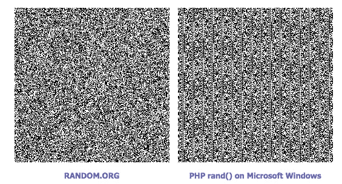
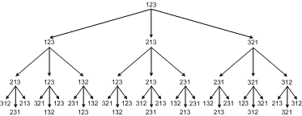

# 随机数和洗牌算法

> 原文：<https://betterprogramming.pub/random-numbers-and-card-shuffling-algorithms-f05e527d65f5>

## 伪随机数与真随机数


unsplash.com[@ origin spoker](https://unsplash.com/@originspoker)

随机数代表不确定性，在计算世界中广泛使用——在加密密钥、密码生成、模拟和游戏中。一些经典的随机化算法(如[蒙特卡罗算法](https://en.wikipedia.org/wiki/Monte_Carlo_algorithm))也依赖于随机数生成。

在本帖中，我们将讨论随机数是如何产生的，以及如何使用随机数洗牌。

# 随机数生成

实际上，仅通过计算机生成随机数存在一些困难。

计算机擅长执行确定的任务，并根据程序运行编码指令。

计算机生成的随机数有两种:真随机数和伪随机数，各有优缺点。

# 伪随机数发生器(PRNG)

顾名思义，一个伪随机数*在严格的数学意义上并不是真正的随机*，一般是通过某种数学公式(或计算表)生成的。

例如，一个简单的[线性同余发生器](https://en.wikipedia.org/wiki/Linear_congruential_generator)可以用来产生伪随机数。

让我们来看看 Borland 的随机数生成器:

```
long long RandSeed = 0xdeadbeaf ; // initialize a random seed
unsigned long Random(long max)
{
    long long x ;
    double i ;
    unsigned long final ;
    x = 0xffffffff;
    x += 1 ; RandSeed *= ((long long)134775813);
    RandSeed += 1 ;
    RandSeed = RandSeed % x ;
    i = ((double)RandSeed) / (double)0xffffffff ;
    final = (long) (max * i) ; return (unsigned long)final;
}
```

请注意，`RandSeed`每一代都会更新。

PRNG 的结果在统计意义上是随机的。伪随机数的行为是*可预测的*，这意味着如果我们知道 PRNG 的当前状态，我们就可以得到下一个随机数。

此外，伪随机数可以具有固定的周期。比如下面两张位图，分别是 Windows 下的一个真随机数生成器和一个 PHP 伪随机数生成器生成的。用伪随机发生器产生的右边一个具有明显的图案。



random.org

由于它的上述特性，伪随机生成的使用受到限制——它主要被用于仿真等程序中。

# 真随机数发生器(RNG)

“真正的”随机数发生器(RNG)是通过向计算机引入一些真正不可预测的物理噪声，如键盘敲击或鼠标移动而制成的。这就是所谓的`entropy`。真正的随机数很难预测或者根本不可预测。

每个操作系统的实现是不同的。在 Linux 上，所有随机性的根源是一种叫做`kernel entropy pool`的东西。

例如， [MAC](https://www.apple.com/) 地址可用于初始化熵池，其他随机来源包括中断时间、硬盘寻址时间等。

接口有`/dev/random`、`/dev/urandom`、`get_random_bytes`。`/dev/random`和`/dev/urandom`的区别在于`/dev/random`更强，阻挡更多，因为需要收集更多的熵。而`get_random_bytes`用在内核代码中。

# 随机数的使用

涉及随机数的程序需要特别小心。

例如，让我们写一个简单的程序。我们知道 C 编程语言中`rand()`产生的随机数有一个范围`0~32767`。我们怎么写一个函数在`0~10`的范围内生成一个随机数？

也许你干脆想出这个解决方案:`rand()%10`。我以前也用过这种方法，但它真的是随机的吗？

如果用`%10`的运算把 0 到 32767 的所有数字放在一起，可以看到有些数字出现的频率更高，所以有些数字出现在最后的概率相应更大。

# 洗牌算法


编写一个合适的洗牌程序似乎很容易，但事实并非如此。

> *如果你正在实施在线扑克游戏，这是一件非常困难的事情。你可能要确保，如果你在广告中说你在随机洗牌，你会继续这样做。*
> 
> *—罗伯特·塞奇威克，计算机科学教授*

ASF Software 在多年前编写了一个流行的在线扑克游戏，其中的洗牌程序是这样的 Pascal 代码:

```
procedure TDeck.Shuffle;
var
   ctr: Byte;
   tmp: Byte;
   random_number: Byte;
begin
   { Fill the deck with unique cards }
   for ctr := 1 to 52 do
      Card[ctr] := ctr;
   { Generate a new seed based on the system clock }
   randomize;
   { Randomly rearrange each card }
   for ctr := 1 to 52 do begin
      random_number := random(51)+1;
      tmp := card[random_number];
      card[random_number] := card[ctr];
      card[ctr] := tmp;
   end;
   CurrentCard := 1;
   JustShuffled := True;
end;
```

让我们只看核心洗牌算法(注意数组的索引在 Pascal 中从 1 开始):

```
for (i is 1 to N)
  j = random integer that 1 <= j <= N
  Swap a[i] with a[j]
```

这里的洗牌算法有一个问题——`52!`排列的概率不同。

我们以 1、2、3 三张卡为例。这是三次迭代后的结果:



我们可以看到`231`、`213`、`132`出现的频率更高，所以对应的概率也更大。

一种简单而优雅的洗牌算法被称为 [Fisher-Yates](https://en.wikipedia.org/wiki/Fisher%E2%80%93Yates_shuffle) 算法:

```
for (i is 1 to N)
  j = random integer that i <= j <= N // (not 1 <= j <= N here!)
  Swap a[i] with a[j]
```

上述程序中的另一个问题很难发现。用作种子的 32 位数字对于伪随机发生器是有问题的，因为给定伪随机发生器的行为是可预测的。

32 个种子的可能值的数量是`2^32`，比`52!(8.0658 * 10^67)`小得多。所以你甚至可以用蛮力破解一个 32 位的种子。

# 一些随机数练习

## 1.生成一个范围内的随机数

给你一个`rand()`，它可以在`[1, 5]`之间生成随机整数。如何用这个函数生成`[1, 7]`之间的随机整数？

## 2.彩票计划

写一个抽奖程序，从 30w 用户中随机抽取 10w 中奖用户。

## 3.平均工资(开放式问题)

有 10 个人围坐在一张桌子旁，他们想知道平均年薪，但他们都不愿意向别人透露自己的薪水。

有没有办法让他们得到答案，而不把任何人的工资暴露给别人？

# 参考

[Wiki:随机数生成。](https://en.wikipedia.org/wiki/Random_number_generation)

我们是如何学会在网上扑克中作弊的:一项软件安全研究。

罗伯特·塞奇威克的算法。