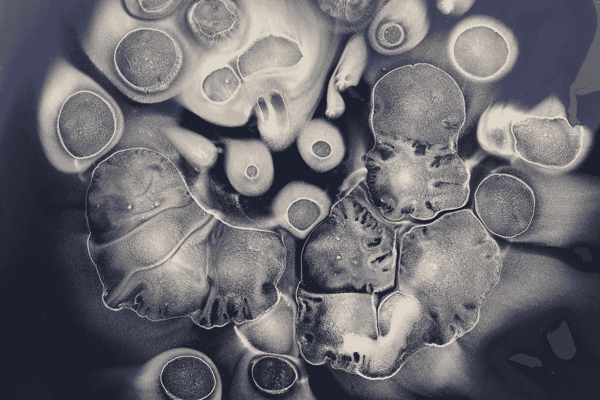
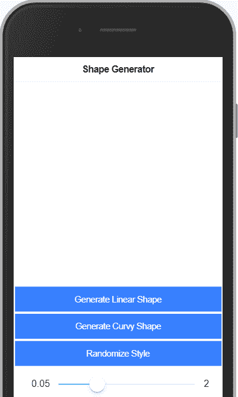

# 随机 SVG 斑点形状生成器

> 原文：<https://betterprogramming.pub/random-svg-blob-shape-generator-e3d5b9a55f50>

## 让我们写一些代码来生成随机的斑点形状。svg 文件



由[霍利·齐索姆](https://unsplash.com/@hollyachisholm?utm_source=medium&utm_medium=referral)在 [Unsplash](https://unsplash.com?utm_source=medium&utm_medium=referral) 上拍摄的照片

我们将对这个小部件使用 Ionic 4/Angular，但是如果你愿意的话，用纯 JavaScript 实现它应该是相当容易的。

# 步骤 1: HTML 模板

将下面的代码添加到您的。html 文件:

这里有三点值得注意:

*   我们的 SVG 元素包含一个简单的 SVG 路径，其样式和`d-path`属性被绑定到相关的 TS 属性。(注意:这里我们使用了`[attr.d]`属性绑定。)这样，我们可以在 TS 文件中操作这些属性，角度数据绑定将拾取这些更改并处理渲染。
*   我们这里有几个按钮，我们将用来生成我们的形状和随机化风格。所有按钮都绑定到它们的相关方法，我们将把它们添加到模板中。
*   最后，我们有一个范围(`ion-range`)元素，这将是一个方便的用户界面的 blob“复杂性因素”调整。(在我们的例子中，形状的复杂性将由该形状所具有的顶点的数量来定义。)

# 步骤 2: TS 文件

转到 TS 文件。这里，我们正在创建我们的基类(`HomePage`)，它具有我们将需要的所有属性:

一些注意事项:

*   `pathCoordinates`属性将路径的顶点数据存储在一个数组中，我们将生成`pathD`字符串，该字符串绑定到我们的 SVG 路径元素的属性`d`。
*   半径、角度、中心坐标以及顶点数——所有这些变量都用于在生成时定义我们的形状。(比如放在哪里，大小等等。)
*   最后，`pathStyle`属性是一个绑定(通过`[ngStyle]`)到我们的 path 元素的对象，它将定义我们的形状是如何设计的。

我们使用了`ngOnInit()`生命周期钩子来初始化所有的默认值。接下来，我们将添加帮助我们生成形状的方法。

## **生成线性形状**

下面我们来添加这些方法:

上面的逻辑如下:

*   我们使用一个简单的几何公式在圆形旁边放置随机坐标(并且`vertixCountFactor`定义了我们将有多少个顶点)。
*   我们在公式中为我们的随机坐标动态地操纵半径，以便它们不再在圆形路径上(放错位置)。
*   然后，对于线性随机形状，我们只需要通过用直线链接所有随机生成的顶点来“构建”d 路径。

在这一点上，我们的“生成线性形状”应该工作。耶！

## **生成斑点**

现在，生成曲线形状有点棘手。我从这个 [GitHub repo](https://github.com/ariutta/catmullrom2bezier) 中获得了一些灵感，并使用 Catmull-Rom 到 Bezier 的转换，在 Bezier 曲线的帮助下实现了我们创建形状的 d 路径的方法:

这个转换的最终结果被分配给我们的`pathD`属性，因此，我们可以渲染我们的曲线形状。试试看。

## **随机风格**

最后，我们可以为样式变更创建一些基本方法:

我们还可以添加一个 CSS 规则，以确保与我们的形状相关的所有更改都有一个平滑的过渡，包括 d-path 和 style 属性:

```
path { transition: all 0.3s;}
```

# 结局

我们刚刚创建了一个简单但有趣的小部件，它可以生成带有随机平滑和锐利边缘(斑点)的 SVG。有了 range UI，你可以改变顶点计数因子，并在生成随机样式时获得一些乐趣。



*   下面是[完整演示](https://ionic-v4-angular-tabs-1x83k4.stackblitz.io)。
*   [编辑链接](https://stackblitz.com/edit/ionic-v4-angular-tabs-1x83k4)。