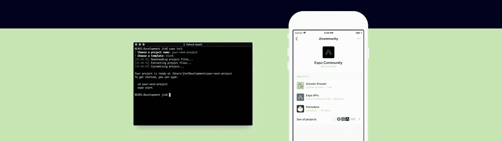
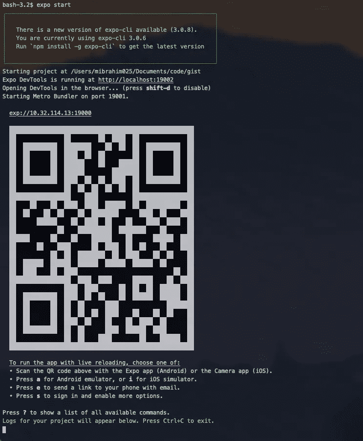
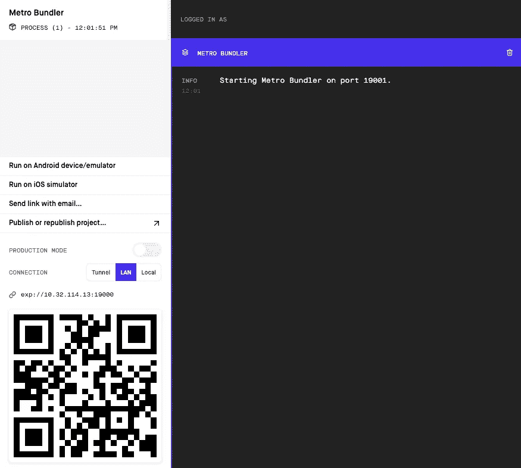
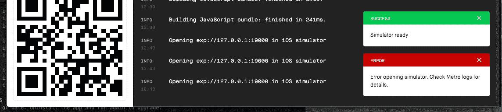
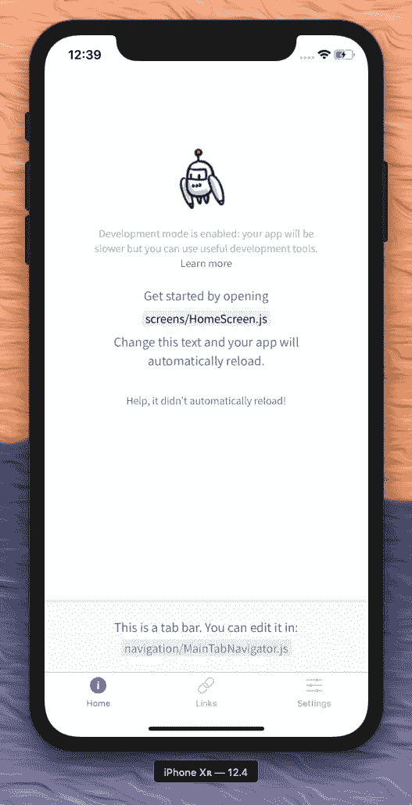
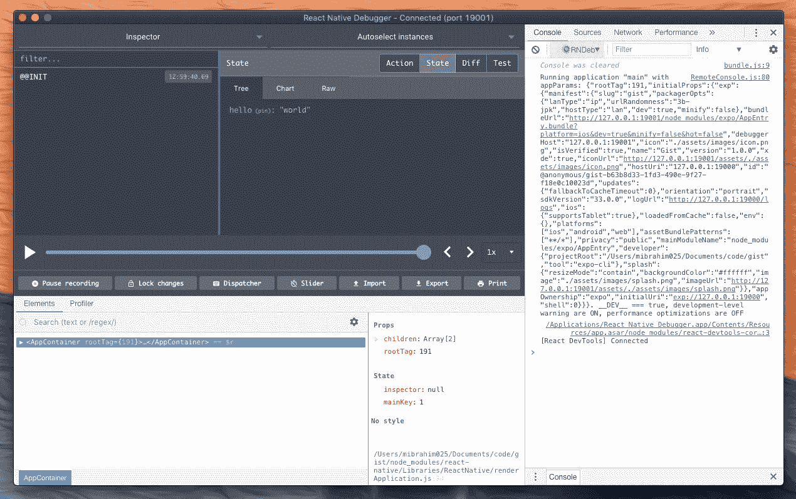
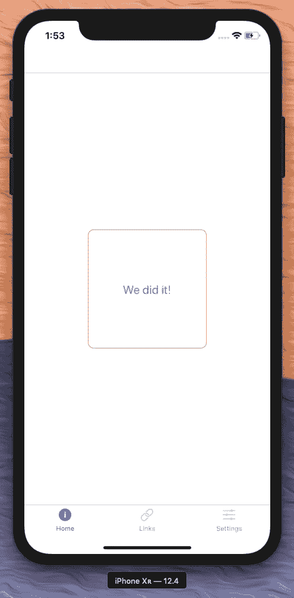
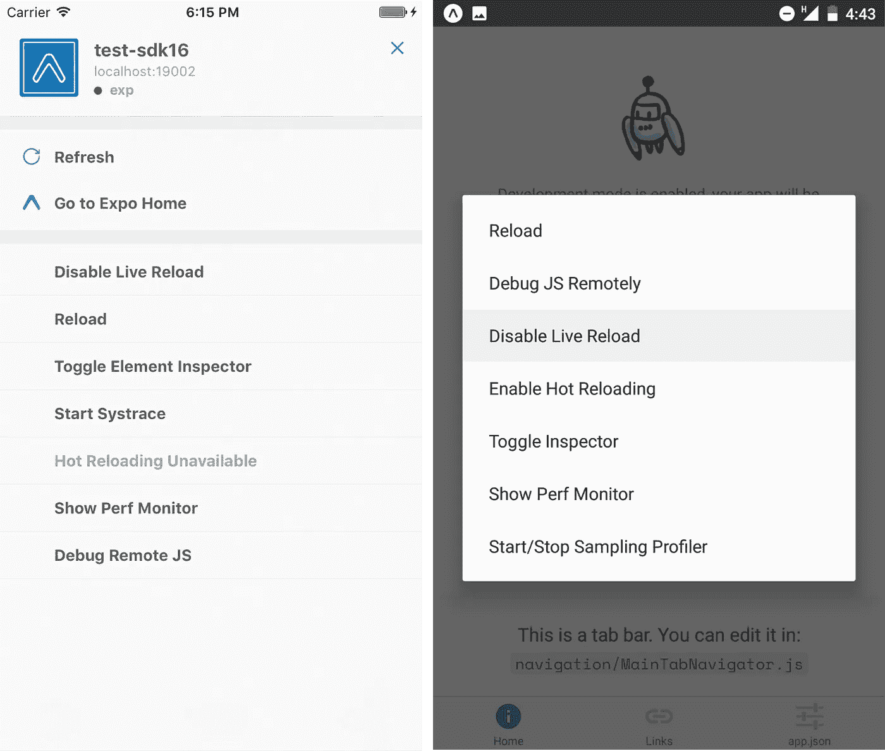

# 使用 Expo 客户端、Redux、本机调试器和样式化组件进行快速本机原型开发

> 原文：<https://betterprogramming.pub/rapid-native-prototyping-with-expo-client-redux-native-debugger-and-styled-components-5741ff052a11>

## 构建一台数据处理、实时重装、风格独特的机器



我已经可以听到纯粹主义者，甚至在我承认我有多爱这个堆栈之前。我不打算讨论多线程的优点或 APK 混淆的焦虑。

我的职业和热情是原型制作，任何试图使原型更接近生产的技术都会引起我的注意。

以下是这些库的链接以及我选择它们的原因的总结:

## [**世博客户端**](https://expo.io)

在部署项目之前运行项目。在物理设备上测试项目的 QR 码。Expo 甚至还有一个基于浏览器的 React 原生 IDE，叫做 [*零食*](https://snack.expo.io/) 。

您可能有充分的理由进行完全本地化，尤其是在 Expo 的构建过程中，但是您可以开始使用该客户端创建接口的速度太快了，不容忽视。

## [**Redux**](https://redux.js.org)

JavaScript 应用程序的可预测状态容器。

我是 Redux 的粉丝，因为它规范但灵活，而且调试起来很愉快。如果你认为 Redux 不能处理你的 UI 所需要的状态管理水平，那么很有可能你的 UI 做了太多的工作。

Redux 不是为了让后端逻辑更接近前端而创建的。

相反，它旨在为到达应用程序的数据提供一个合适的家，一个可以通过“视图”层(组件)和“控制器”层(操作)轻松访问的家。

## [**React 原生调试器**](https://github.com/jhen0409/react-native-debugger)

Redux [DevTools](https://github.com/zalmoxisus/redux-devtools-extension) ，但针对原生应用。多棒啊。毕竟看不到自己的状态 Redux 有什么用？

将它连接到您的`package.json`工作流，并使用终端命令启动调试器。就是这样！

## [**样式组件**](https://www.styled-components.com)

这个图书馆很棒，而且还会越来越好。扔掉你的 CSS，SCSS，CSS-in-JS…

Styled components 是用来管理所有组件的一个环，它利用 JavaScript 的新标记模板文字将 React 属性直接传递给样式代码，而没有任何映射。

如果这对你来说还不够革命性的话，他们还提供了 React Native。

# 入门指南

安装 Expo:

```
npm i -g expo-cli
```

从[发布页面](https://github.com/jhen0409/react-native-debugger/releases) (Windows)安装 React 本机调试器，或者:

```
brew cask install react-native-debugger
```

开始新项目:

```
expo init my-new-project
cd my-new-project
expo start
```

[Metro](https://facebook.github.io/metro/) bundler 将在端口`19001`上运行，您应该会在您的终端上看到以下结果:



另外，一个浏览器标签应该会自动打开，显示 Expo 开发者工具。从那里，你可以在虚拟的 iOS 或 Android 设备上运行你的项目，分享你的项目，或者发布。



点击“在 iOS 模拟器上运行”打开 [XCode](https://developer.apple.com/xcode/) 模拟器。

有时你会在第一次运行时得到一个错误，上面写着“错误打开模拟器”。有关详细信息，请查看 Metro 日志。


要解决这个问题，只需再次点击运行按钮，它应该工作。



一旦模拟器准备就绪，您应该会看到以下 UI:



# 设置 Redux 和本机调试器

安装 Redux 需求(最后两个不是必需的):

```
npm i react-redux redux redux-api-middleware redux-thunk
```

创建您的根`reducer.js`文件(稍后修改):

```
*import* {combineReducers} *from* 'redux'const hello = (state = 'world') => state*export default* combineReducers({
  hello,
})
```

创建您的`store.js`文件:

```
*import* {applyMiddleware, compose, createStore} *from* 'redux'
*import* {apiMiddleware} *from* 'redux-api-middleware'
*import* thunkMiddleware *from* 'redux-thunk'
*import* reducer *from* '../modules/reducer'*const* middleware = [
  apiMiddleware,
  thunkMiddleware,
]*const* middlewareEnhancer =
  applyMiddleware(...middleware)*const* enhancers = [middlewareEnhancer]*if* (process.env.NODE_ENV === 'development') {
  *const* devToolsExtension =
    window.__REDUX_DEVTOOLS_EXTENSION__*if* (*typeof* devToolsExtension === 'function') {
    enhancers.push(devToolsExtension())
  }
}*const* composedEnhancers = compose(...enhancers)*export default* createStore(reducer, {}, composedEnhancers)
```

用 Redux provider 将容器包装在`AppNavigator.js`中，并将存储传递给它:

```
*import* React *from* 'react'
*import* {
  createAppContainer,
  createSwitchNavigator,
} *from* 'react-navigation'
*import* {Provider} *from* 'react-redux'
*import* store *from* '../store'
*import* MainTabNavigator *from* './MainTabNavigator'*const* AppContainer = createAppContainer(
  createSwitchNavigator({Main: MainTabNavigator,
  })
)*class* AppNavigator *extends* React.Component {
  render() {
    *return* (
      <Provider *store*={store}>
        <AppContainer/>
      </Provider>
    )
  }
}*export default* AppNavigator
```

现在您已经建立了一个最小的 Redux 工作流。

最后一步是将本机调试器连接到您的`package.json`文件。在您的`scripts`中添加以下内容:

```
"debug": "open 'rndebugger://set-debugger-loc?host=localhost&port=19001'"
```

最后，在另一个终端实例中，运行以下命令:

```
npm debug
```

这将触发一个窗口打开:



并且可以看到状态中的`{hello: "world"}`对象。

从那以后，我鼓励您进一步研究 Redux 在可伸缩性方面的最佳实践。已经有一些很好的方法，比如 [Redux Modules](http://nicolasgallagher.com/redux-modules-and-code-splitting/) 或者 [Ducks](https://medium.com/@matthew.holman/what-is-redux-ducks-46bcb1ad04b7) 。

正确的选择取决于哪种数据最适合您的独特数据，以及哪种数据您使用起来最舒服，所以在您做出决定之前，请先熟悉一下。

# 样式组件

如果你是 UX 的工程师，还没有见过[风格的组件](https://www.styled-components.com/)，今天可能是你的幸运日。

创建一个名为`HomeScreen2.js`的新文件:

```
*import* React *from* 'react'
*import* styled *from* 'styled-components/native'*const* StyledText = styled.Text`
  color: ${props => props.color};
  font-size: 20px;
  line-height: 200px;
  text-align: center;
`*const* StyledView = styled.View`
  border: 1px solid ${props => props.borderColor};
  border-radius: 10px;
  height: 200px;
  left: 50%;
  position: absolute;
  top: 50%;
  transform: translate(-100px, -100px);
  width: 200px;
`*const* HomeScreen2 = props => (
  <StyledView *borderColor*={props.borderColor}>
    <StyledText *color*={props.color}>
      We did it!
    </StyledText>
  </StyledView>
)HomeScreen2.defaultProps = {
  borderColor: 'palevioletred',
  color: 'deepskyblue',
}*export default* HomeScreen2
```

现在，打开`MainTabNavigator.js`并更改`HomeScreen`组件的导入，这样您就可以使用`HomeScreen2.js`了。

您的应用程序应该实时重新加载，并向您显示以下内容:



就是这样！现在你已经有了一台数据处理、实时重装、喜欢时尚的机器来玩了。使用它可以快速构建原型，或者创建 React 原生组件以用于您的完全原生构建，甚至完全 React 原生。

您有广泛的选择和出色的开源工具来创建适合您需求的开发计划。

如果你想从本指南结束的地方开始，我还为你们准备了一份[回购](https://github.com/threecity/expo-redux-starter)。

# 解决纷争

## **实时重装未启用**

如果您能够打开本机调试器，并且状态显示为`Connected (port 19001)`，但是您看不到您的状态，请确保启用了实时重载。

要在 iOS 模拟器上打开移动开发者菜单，请前往`Hardware > Shake Gesture`:



## **访问权限错误**

如果您在尝试安装全局软件包时遇到`EACESS`权限错误，您可以通过为全局 npm 软件包创建新路径来解决此问题。

如果`~/.profile`存在于您的机器上，将下面的代码添加到第一行。否则，创建文件并添加它:

```
NPM_CONFIG_PREFIX=~/.npm-global
```

然后，运行以下命令:

```
mkdir ~/.npm-global
npm config set prefix '~/.npm-global'
export PATH=~/.npm-global/bin:$PATH
source ~/.profile
```

现在你可以访问安装在新的`npm-global`路径中的全局包。

## **证书链中的自签名证书**

如果在安装包时出现关于`self signed certificate in certificate chain`的错误(或者`yarn install`似乎没有安装任何包)，运行以下命令:

```
npm config set strict-ssl false -g
```