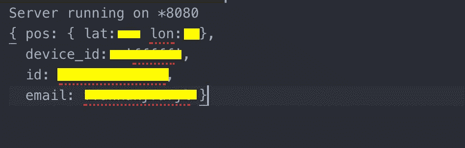
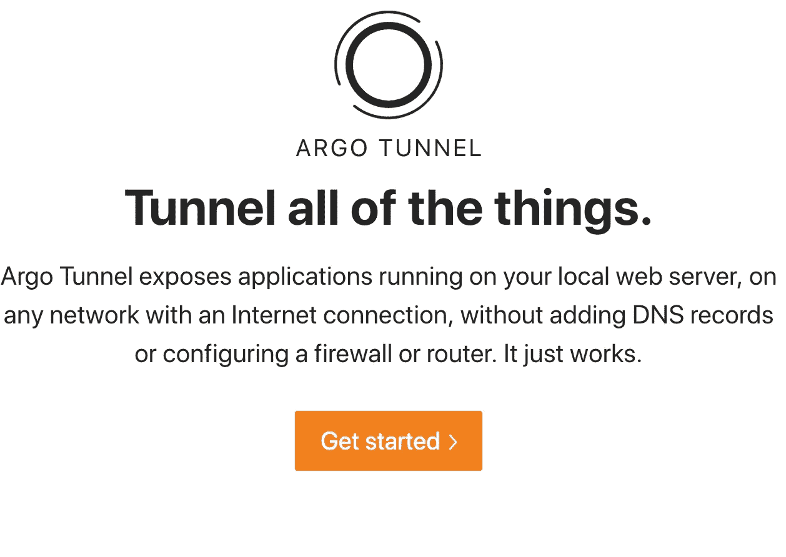
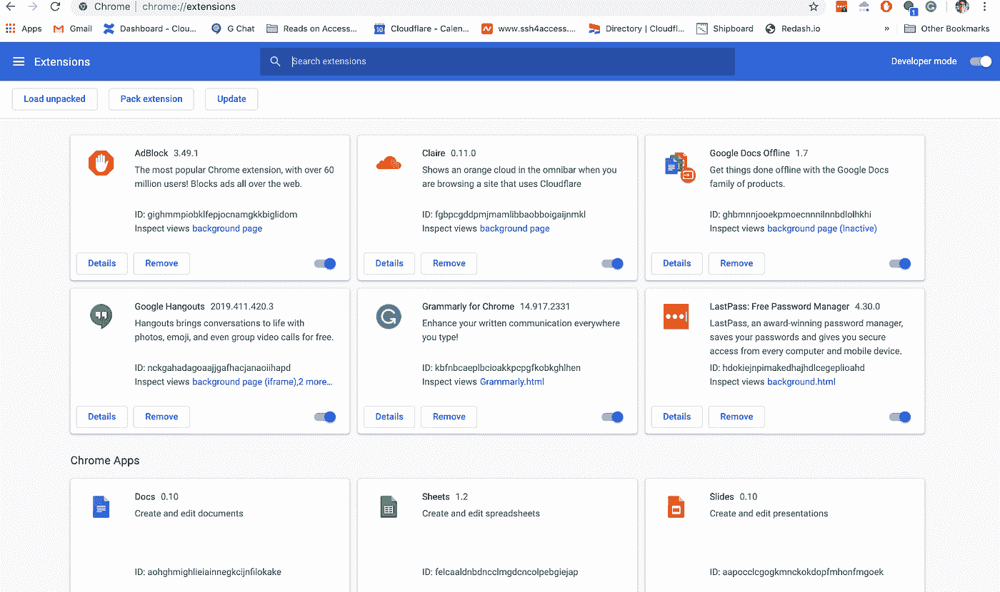

# 使用 Cloudflare 的 Argo 隧道快速制作 Chrome 浏览器原型

> 原文：<https://betterprogramming.pub/rapid-prototyping-of-a-chrome-browser-using-cloudflares-argo-tunnel-ceddd6c88764>

## 如何设置和使用隧道来秘密共享信息

丹尼尔·赫雷斯在 [Unsplash](https://unsplash.com/photos/CD4WHrWio6Q) 上的照片

我是一名产品管理实习生，每天坐在一群工程实习生中间。为什么？我们有机会聊天——关于工作，关于个人项目，以及这些如何重叠。实习生豆荚里最好的想法开始于我们部门里愚蠢的对话。然后，它们会演化成为我们遇到并想要解决的问题构建真正的解决方案。

一个实习同事和我正在讨论在业余爱好项目上的合作。我们还谈到了当我们不像今年夏天那样坐在一起工作时的困难。真正的困难一直是共享只存在于本地机器上的迭代服务——屏幕共享在很多方面都存在不足。一个更好的解决方案是将本地运行的服务公开到互联网上，如果需要的话，以某种方式保护我的朋友，而不需要通过部署生产级服务的过程。

多年来，我一直在寻找一个免费的隧道软件来解决我的共享困境。在这篇博文中，我将讲述一个团队如何使用隧道软件快速迭代一个新项目——在这个例子中，是一个 Chrome 扩展。

# **快速挖进隧道**

隧道是网络中最有用的工具之一。在任何网络事件中，专用网络连接都需要将其信息传输到另一个专用方或网络。但是这怎么可能呢？

一种方法是通过隧道。与现实世界中的隧道不同，互联网隧道的行为更像互联网空间中的虫洞。他们可以通过某个用户设置的专用网关任意连接到互联网上的任意空间或端点。这些类型的隧道被称为[隧道协议](https://tools.ietf.org/html/rfc4905)。

著名的包括 [GRE](https://tools.ietf.org/html/rfc2784) ，或通用路由封装，通过端到端、点对点连接建立传输。在 GRE 连接中，传输负载(您打算发送的数据)没有加密，因为不存在外部参与者窥视您的连接的威胁或恐惧。

另一个流行的隧道协议是 IPSec。在 IPSec 上，数据完整性和安全性是重中之重。在 IPSec 上，每个有效负载在传输之前和传输过程中都是加密的。然后，到了之后再解密。这确保了正在发送的数据不会受到任何潜在的攻击。

这两个隧道工具都可以帮助我共享我的本地主机环境，这是我的第一个目标。然而，他们都超级慢和[难以建立](https://community.cisco.com/t5/networking-documents/how-to-configure-a-gre-tunnel/ta-p/3131970)。

GRE 隧道的设置如下:

1.  要配置隧道源和目的地，在隧道的接口配置模式下，发出**隧道源** {ip 地址|接口类型}和隧道目的地{主机名| ip 地址}命令。
2.  配置完隧道后，两个隧道端点可以互相看见，并且可以使用一端的 ICMP 回应进行验证。
3.  由于 GRE 是一种封装协议，我们将最大传输单元(mtu)调整为 1400 字节，将最大数据段大小(mss)调整为 1360 字节。
4.  R1#平 172.16.1.2
5.  键入转义序列以中止。
6.  向 172.16.1.2 发送五个 100 字节的 ICMP 回应，超时时间为两秒:
7.  成功率为 100%(5/5)，往返最小/平均/最大= 1/2/4 毫秒

这显然是压倒性的第一步。那么有什么更简单的隧道选择呢？

# **Cloudflare 的 Argo 隧道**

[Argo Tunnel](https://developers.cloudflare.com/argo-tunnel/quickstart/) 是 Cloudflare 的免费隧道产品。阿尔戈隧道作为一种方式，通过没有专业的配置和简单的安装安全地连接你和任何选定的一方。它是一个运行在服务器上的守护程序，在原始 web 服务器和 Cloudflare 最近的数据中心之间创建一个加密隧道。它在不打开任何公共入站端口的情况下完成所有这些工作。

对于这个特定的项目，我们使用 Cloudflare 的 Argo 隧道来部署一个 Chrome 浏览器扩展，该扩展与我朋友的机器上运行的服务器进行通信。

# **建设扩建**

在建立本地托管的 web 服务器(运行在端口 8080 上)之后，我可以通过 Ajax post 请求(Ajax 是一种编程风格，web 应用程序可以异步地从服务器发送和检索数据，而不会干扰现有页面的显示和行为)将数据发送到本地服务器。在这里，我们可以临时托管我的 NodeJS app(后端，服务器 app)预部署。

# **在 Cloudflare 上建立隧道**

最后，我设置了我的[云辉隧道](https://developers.cloudflare.com/argo-tunnel/downloads/)。配置完成后，扩展应该可以启动和部署了！

Brew 命令安装 Cloudflare 守护程序

我运行此命令，并将其连接到我的本地主机，以便在我的主机名和离我最近的 Cloudflare 数据中心之间建立专用链接。

旋转隧道

这样做的结果是通过专用互联网连接实现快速安全的连接。没有公共 IP 或窥视恐惧。

# 在隧道上测试

为了进行测试，我使用 Argo Tunnel 向外界展示了我的本地服务器。在设置好我的隧道后，我通过一个 zip 文件将它部署给朋友。后来，他们能够在自己的浏览器中以 Chrome 的开发者模式将其解包。

# **共享分机**

为了在野外测试我们的 Chrome 扩展，我们需要我们的朋友能够在他们自己的浏览器上访问和实现它。

在 Chrome 上，只需几个步骤就可以轻松共享扩展。

1.  将你想安装的 Chrome 扩展的 CRX 文件下载到“我的电脑”。
2.  进入 **chrome://extensions/** ，在右上角勾选**开发者模式**的复选框。

3.使用 CRX 提取器应用程序( [CRX 提取器](https://crxextractor.com/)是一个很好的！)来解包扩展并将其转换为压缩的 Zip 文件。

4.回到 Chrome Extensions 页面，点击 unpack，选择解压后的文件夹。

恭喜你，你现在可以在其他机器上操作你的扩展了！

# **最终结果**

在运行时，Chrome 扩展将运行对您的 web 应用程序或网站的每个请求，以确保正确的流量尝试进入被允许访问。如果一个请求来自一个不寻常的地理位置，一个简单得多的搜索可以确保它来自一个已知的朋友或同行。

与过去的项目相比，Cloudflare 的隧道软件也是轻而易举的事情。我不再需要不断地保持入站端口打开、运行并同时进行维护。这既解决了我们安全地共享本地主机的需要，又减轻了对入站请求排序的控制。

现在，通过在我的浏览器中实现一个简单的扩展，我们可以更有效地保护我自己的 web 应用程序，因此，可以根据连接设备的状态(地理位置、设备 ID 等)检查流量。).