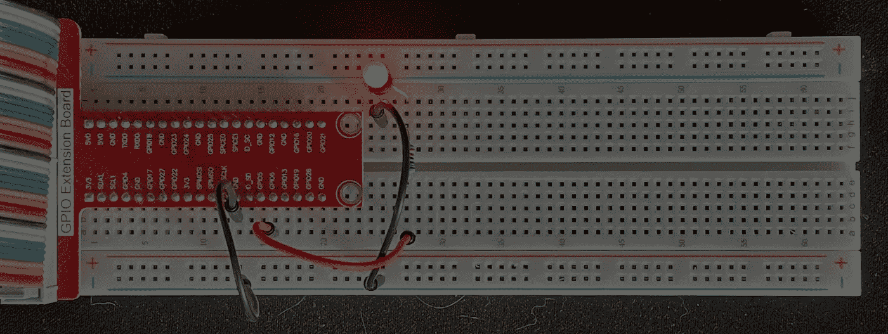

# Golang 和 C 中的 Raspberry Pi GPIO 闪烁 LED

> 原文：<https://betterprogramming.pub/raspberry-pi-gpio-blinking-led-in-golang-and-c-5382182fe570>

## 如何使用 Golang、C 和 GPIO 让 LED 闪烁



图片来源:作者

# 内容

*   概观
*   先决条件
*   C 中闪烁的 LED
*   会有帮助的信息
*   Go 中闪烁的 LED
*   摘要

这是探索在 Raspberry Pi 3B+上进行 GPIO 编程的系列文章的第一篇。你可以在这里找到完整的系列。它是对 [Sunfounder 闪烁 LED 项目](https://docs.sunfounder.com/projects/raphael-kit/en/latest/1.1.1_blinking_led_c.html)的补充。代码示例将放在 Go 和 c 中。

# 概观

我最近对树莓 Pi 上的 GPIO 编程产生了兴趣。这是一种很好的方式来观察由软件控制的具体事物。这也是学习一点电子学的好方法。这是我打算撰写的记录我的 GPIO 编程之旅的系列文章的第一篇。

为了降低入门门槛，我决定购买一个 GPIO/电子设备套件，并重新使用我的一个 Raspberry Pis。我选择了 [Sunfounder](https://www.sunfounder.com/) ，主要是因为他们似乎受到了好评，他们的工具包也得到了好评。我最终选择了 sun founder Raspberry Pi Ultimate Starter Kit(又名 Raphael ),因为它有很多有趣的电子组件和相关项目。

我马上注意到的一件事是，大多数 GPIO 文章都假设 Python 是编程语言。Sunfounder 的工具包和相关文档支持多种语言，包括 Python 和 C，但它们倾向于 Python，Python 中有更多的项目，而 C 中没有太多。我主要是一名 Go 开发人员，所以我也对在 Go 中实现 GPIO 项目感兴趣。

一些 Sunfounder 工具包评论提到，项目文档在解释事物如何工作方面有点稀疏和简短。我刚刚开始，我已经看到了一些，但第一个项目， [Sunfounder 闪烁 LED 项目](https://docs.sunfounder.com/projects/raphael-kit/en/latest/1.1.1_blinking_led_c.html)，是非常好的记录。我只是在几个地方挂了一下，没多久我就发现我做错了什么。第二个项目， [RGB LED](https://docs.sunfounder.com/projects/raphael-kit/en/latest/1.1.2_rgb_led_c.html) 有点不同。关于解释事物如何工作和为什么工作，这要复杂得多，也不太详细。如果你想做的只是按照食谱来实施这个项目，它就足够好了。但是，如果你想更详细地了解它是如何工作的，为什么会这样，这就很欠缺了。我花了很长时间在这个项目上，试图填补项目文档中缺失的信息。本系列的重点是从编码和电子学的角度填补这个空白。

本文的重点是 [Sunfounder 闪烁 LED 项目](https://docs.sunfounder.com/projects/raphael-kit/en/latest/1.1.1_blinking_led_c.html)。这是针对终极初学者/Raphael 工具包的一系列项目中的第一个项目。

# 先决条件

如果你没有，你需要一个树莓派。我在 Raspbian OS 的“拉伸”版本中使用了一个树莓派 3B+。鉴于 Sunfounder Ultimate Starter Kit 被宣传为与 Raspberry Pi 4 一起工作，我希望 4 系列也能工作。我对其他 Raspberry Pi 版本不太确定，尤其是 26 对 40 GPIO 引脚的版本。

接下来，您需要:

*   一个[试验板](https://www.amazon.com/dp/B082KBF7MM/ref=sspa_dk_detail_4?psc=1&pd_rd_i=B082KBF7MM&pd_rd_w=1tGTV&pf_rd_p=887084a2-5c34-4113-a4f8-b7947847c308&pd_rd_wg=fX8JB&pf_rd_r=44DE0RS1E9FD42RBYC7R&pd_rd_r=47cbdc7f-7834-455f-9429-ef74a438bd45&spLa=ZW5jcnlwdGVkUXVhbGlmaWVyPUFVVkdZVUZRNUw3ODkmZW5jcnlwdGVkSWQ9QTA4MzI4MzYyU0VLNzBJM0cxRUVMJmVuY3J5cHRlZEFkSWQ9QTA0Mjk1NTMzSzNSWlNFUjU0NURBJndpZGdldE5hbWU9c3BfZGV0YWlsJmFjdGlvbj1jbGlja1JlZGlyZWN0JmRvTm90TG9nQ2xpY2s9dHJ1ZQ==)
*   [跳线](https://www.amazon.com/dp/B08HZ26ZLF/ref=syn_sd_onsite_desktop_19?psc=1&spLa=ZW5jcnlwdGVkUXVhbGlmaWVyPUExRFpLWElCRjg1MUNMJmVuY3J5cHRlZElkPUEwMjMyMTE1M01aOFE3U1BQS09YSiZlbmNyeXB0ZWRBZElkPUEwODE5NTMxMktEMTlZRjEyQjBJNiZ3aWRnZXROYW1lPXNkX29uc2l0ZV9kZXNrdG9wJmFjdGlvbj1jbGlja1JlZGlyZWN0JmRvTm90TG9nQ2xpY2s9dHJ1ZQ==)
*   [一个 220 欧姆的电阻](https://www.amazon.com/ELEGOO-Electronics-Component-resistors-Potentiometer/dp/B01ERPXFZK/ref=sr_1_7_sspa?crid=3EJQNCOWP00IF&dchild=1&keywords=resistors&qid=1631478270&s=industrial&sprefix=resis%2Cindustrial%2C219&sr=1-7-spons&psc=1&spLa=ZW5jcnlwdGVkUXVhbGlmaWVyPUEzTktVSzNYMkxMSDlKJmVuY3J5cHRlZElkPUEwMjAzMDY0NVRERkFLVjVRTUFWJmVuY3J5cHRlZEFkSWQ9QTA5MjM2NjUxUFZYQUlETVAzRDA3JndpZGdldE5hbWU9c3BfbXRmJmFjdGlvbj1jbGlja1JlZGlyZWN0JmRvTm90TG9nQ2xpY2s9dHJ1ZQ==)
*   [安 LED](https://www.amazon.com/ELEGOO-Electronics-Component-resistors-Potentiometer/dp/B01ERPXFZK/ref=sr_1_7_sspa?crid=3EJQNCOWP00IF&dchild=1&keywords=resistors&qid=1631478270&s=industrial&sprefix=resis%2Cindustrial%2C219&sr=1-7-spons&psc=1&spLa=ZW5jcnlwdGVkUXVhbGlmaWVyPUEzTktVSzNYMkxMSDlKJmVuY3J5cHRlZElkPUEwMjAzMDY0NVRERkFLVjVRTUFWJmVuY3J5cHRlZEFkSWQ9QTA5MjM2NjUxUFZYQUlETVAzRDA3JndpZGdldE5hbWU9c3BfbXRmJmFjdGlvbj1jbGlja1JlZGlyZWN0JmRvTm90TG9nQ2xpY2s9dHJ1ZQ==)

您还应该考虑使用一个带有 T 型适配器的 [40 引脚母对母，将 GPIO 输出连接到试验板上。您只能使用跳线，但电缆会使事情变得更容易，并有助于防止损坏 Raspberry Pi 上的 GPIO 引脚。如果您选择不购买带 T 型适配器的 40 针电缆，您需要购买](https://www.amazon.com/dp/B082PRVRYR/ref=sspa_dk_detail_2?psc=1&pd_rd_i=B082PRVRYR&pd_rd_w=8mKhr&pf_rd_p=887084a2-5c34-4113-a4f8-b7947847c308&pd_rd_wg=e9psa&pf_rd_r=S09F37DF2G5FW8B8GX4B&pd_rd_r=c065c120-e60b-45e9-b93b-f581f048cf46&spLa=ZW5jcnlwdGVkUXVhbGlmaWVyPUFCMzhUQ09COFI2VlMmZW5jcnlwdGVkSWQ9QTA5NjU2ODUxRDkxNEYwSTYwV09KJmVuY3J5cHRlZEFkSWQ9QTAxOTg1MTUyRUhEUlc2VzQ2VDQ4JndpZGdldE5hbWU9c3BfZGV0YWlsJmFjdGlvbj1jbGlja1JlZGlyZWN0JmRvTm90TG9nQ2xpY2s9dHJ1ZQ==)[公母跳线](https://www.amazon.com/SinLoon-Breadboard-Arduino-Circuit-40-Pack/dp/B08M3QLL3Q/ref=pd_sbs_7/143-0445142-7950409?pd_rd_w=sVLrc&pf_rd_p=8b76d7a7-ab83-4ddc-a92d-e3e33bfdbf03&pf_rd_r=CDM5TGJT03VKF0ZFB577&pd_rd_r=8e58fd82-8503-41cf-b8f2-c78eaeb78d25&pd_rd_wg=tT1U0&pd_rd_i=B08M3QLL3Q&psc=1)。

然而，单独购买所有这些东西会比一套花费更多。[这里有一个简单的工具包，上面所有的](https://www.amazon.com/dp/B06WP7169Y/ref=sspa_dk_detail_5?psc=1&pd_rd_i=B06WP7169Y&pd_rd_w=OZVyf&pf_rd_p=887084a2-5c34-4113-a4f8-b7947847c308&pd_rd_wg=0V0IH&pf_rd_r=623YJTBQ2CN2B2GYXQG5&pd_rd_r=faa61f0f-3aec-4cf0-8e7e-d44eb1b3b92f&spLa=ZW5jcnlwdGVkUXVhbGlmaWVyPUEyUVlDQzMzVVZBMFYxJmVuY3J5cHRlZElkPUEwMzExNzk4MUhGSjFSS0VKTlBROCZlbmNyeXB0ZWRBZElkPUEwMzYwNjg2UUdMRU44N0YzNzIwJndpZGdldE5hbWU9c3BfZGV0YWlsJmFjdGlvbj1jbGlja1JlZGlyZWN0JmRvTm90TG9nQ2xpY2s9dHJ1ZQ==)。如果你想了解这个系列，我推荐你购买[sun founder Raspberry Pi Ultimate Starter Kit](https://www.amazon.com/gp/product/B09BMVT4CB/ref=ppx_yo_dt_b_asin_title_o02_s00?ie=UTF8&psc=1)。


*sun founder Ultimate Starter/Raphael 套件—图片来源:作者*

要编译和运行 C 程序，你需要 WiringPi 库。很容易得到:

```
sudo apt-get install wiringpi
```

然后使用以下命令测试安装:

```
pi@pi-node1:~/go/src/github.com/youngkin/gpio/rgbled $ gpio -v
gpio version: 2.50
Copyright (c) 2012-2018 Gordon Henderson
This is free software with ABSOLUTELY NO WARRANTY.
For details type: gpio -warrantyRaspberry Pi Details:
  Type: Pi 3B+, Revision: 03, Memory: 1024MB, Maker: Sony
  * Device tree is enabled.
  *--> Raspberry Pi 3 Model B Plus Rev 1.3
  * This Raspberry Pi supports user-level GPIO access.
```

在上面你会注意到`gpio version: 2.50`。如果您使用的是 Rasberry Pi 4，请使用 Sunfounder [中给出的说明检查接线 Pi](https://docs.sunfounder.com/projects/raphael-kit/en/latest/check_the_wiringpi_c.html) 。

您还需要一些基本的 C 和 Go 编程知识，并且熟悉登录到 Raspberry Pi 终端，或者登录到一些操作系统版本附带的桌面 GUI。根据您采用的方法，您可能需要将键盘和显示器连接到 Raspberry Pi。我只是简单地进入 Pi。您还需要熟悉如何使用像 Vi 或 nano 这样的编辑器。

我选择不从 Sunfounder 网站下载代码，而是自己编写代码，即使我所做的只是直接从项目文档中复制。因此，我创建了自己的位置来创建代码。其实[我的代码在 Github](https://github.com/youngkin/gpio) 里。如果你喜欢下载代码，你可以选择从我的 Github 库下载、克隆或派生代码。另外，用 Go 编写的项目代码也位于那里。该项目的代码位于 [gpio/ledblink](https://github.com/youngkin/gpio/tree/main/ledblink) 。

如果您对在 Raspberry Pi 上进行 Go 开发感兴趣，您需要将开发环境安装到 Raspberry Pi 上。[这里有一个简单的来源](https://www.jeremymorgan.com/tutorials/raspberry-pi/install-go-raspberry-pi/)解释了如何实现这一点。这个源代码有点过时了，但是唯一重要的问题是 Go to install 的版本。来源显示正在安装围棋 1.14.4.linux-arm64.tar.gz 和 1.14.4.linuxarmv6l.tar.gz 的****。目前的版本是**1.17.1.linux-arm64.tar.gz**和**1.17.1.linuxarmv6l.tar.gz**。对于树莓派 3B+正确的选择将是**1.17.1.linuxarmv6l.tar.gz**。另一个是为 64 位系统设计的，比如 Raspberry Pi 4 系列。****

最后，如果你想脱离 Sunfounder 文档的食谱风格，我假设你对 Linux 有基本的了解。例如，我不会解释什么是根特权。

# C 中闪烁的 LED

如上所述，本文是关于[闪烁 LED 项目](https://docs.sunfounder.com/projects/raphael-kit/en/latest/1.1.1_blinking_led_c.html)。这个项目的 Sunfounder 文档非常好。您应该从[简介](https://docs.sunfounder.com/projects/raphael-kit/en/latest/introduction.html)开始，逐步完成以下章节，直至[与 C 一起玩](https://docs.sunfounder.com/projects/raphael-kit/en/latest/play_with_c.html)章节。您应该按照项目文档或下图中的描述设置试验板:


*Sunfounder 闪烁 LED 试验板设置—图片来源:*[*sun founder*](http://_images/image49.png)

因为 Sunfounder 项目文档非常好，所以我只有几点意见。

# 会有帮助的信息

该项目的文件规定“*因此，要打开一个 LED，我们需要使 GPIO17 低(0V)电平。*”。它没有解释的是为什么。原因是 220 欧姆电阻器的一端连接到 3.3 伏电源，另一端连接到 LED 阳极(正极端子)。GPIO17 连接到 LED 的阴极(负端)。只有当电流从阳极流向阴极时，发光二极管才会发光。Raspberry Pi 上的 GPIO 引脚(如 GPIO17)通常默认为高电平(3.3 伏)。将 3.3 伏电源连接到阳极，并将 3.3 伏 GPIO17 引脚连接到阴极侧，则没有电流流过电路。所以 LED 不会打开。将 GPIO17 设置为低电平 0 伏，允许电流流动，点亮 LED。

这是一个小问题，但是程序不需要以 root (sudo)权限运行。简单的运行`./BlinkingLed`，对比`sudo ./BlinkingLed`，就可以了。对于 GPIO 程序来说，情况并非总是如此。当运行一个需要 root 权限的程序时，我会指出这一点。

# Go 中闪烁的 LED

这个版本的闪烁 LED 将与 C 版本的试验板设置一起工作。

首先，我们需要一个 Go 库来驱动 GPIO 接口。我使用 [go-rpio](https://github.com/stianeikeland/go-rpio) 有几个原因:

1.  它似乎被广泛使用
2.  它看起来相当完整
3.  它相对活跃
4.  它附带了示例代码和良好的文档
5.  它的 API 类似于 WiringPi

另一个选项是 [periph](https://github.com/periph/host) (代码)与[文档](https://periph.io/)。它更活跃，文档也非常好，比 go-rpio 好。使用 periph 做这个项目是微不足道的。总体而言，对于我能够找到的 LED 示例，go-rpio 更符合我的要求，特别是关于使用脉宽调制(PWM，在本系列的下一篇文章中有更多介绍)的 [RGB LED](https://docs.sunfounder.com/projects/raphael-kit/en/latest/1.1.2_rgb_led_c.html) 。但是这是 go-rpio 的一个很好的替代，反之亦然。

你可以只使用 [rpio-go blinker.go 示例](https://github.com/stianeikeland/go-rpio/blob/master/examples/blinker/blinker.go)。它使用`rpio.Pin.Toggle()`。我创建了一个包含 C 和 Go 示例的 [Github 库](https://github.com/youngkin/gpio)。我的 Go 版本的`blinker`使用直接写入而不是`rpio.Pin.Toggle`。我认为展示一种可选的方法会有所帮助，特别是因为后面的项目将使用直接写入。我的 [gpio 库](https://github.com/youngkin/gpio)使用的是 Go 的模块系统，它会在构建时自动下载`rpio-go`库。这是我对`blinker`的看法。我不会解释 Go sytax，因为我假设你熟悉 Go。

第 15 行导入 go-rpio 库，该库提供与 GPIO 板交互所需的功能。

```
"github.com/stianeikeland/go-rpio/v4"
```

程序的其余部分通过嵌入的注释来解释。可以在命令提示符下键入`go run blinkingled.go`并按回车键来运行该程序。

本文展示了如何配置一个带有 LED 的试验板，它可以由用 C 和 Go 编写的程序来控制。请随意提出修改建议或问题。