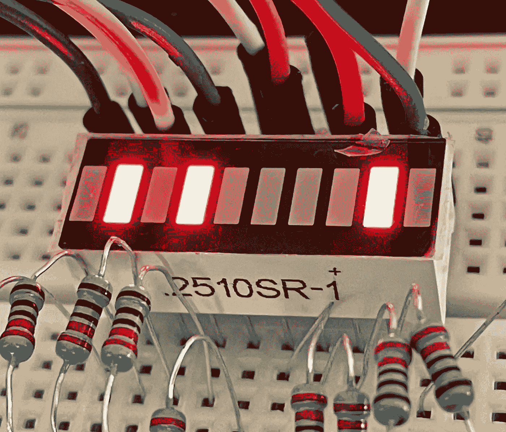
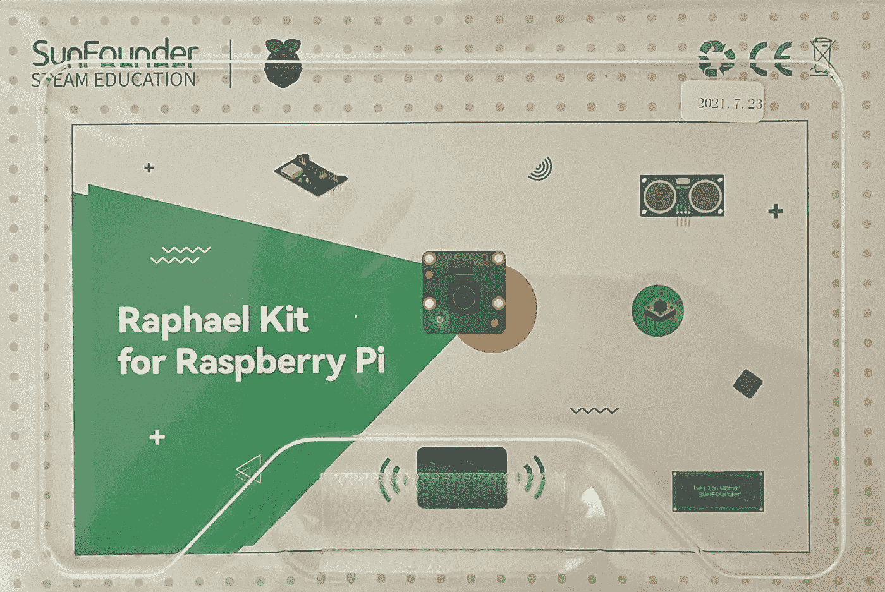
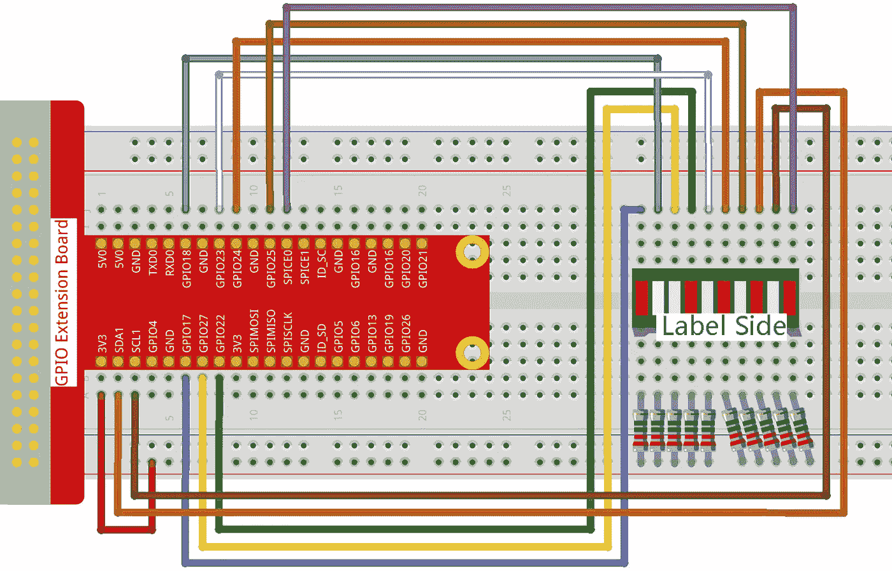
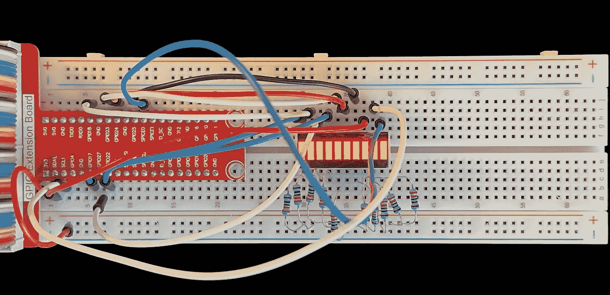

# 围棋和 C-LED 条形图中的 Raspberry Pi GPIO

> 原文：<https://betterprogramming.pub/raspberry-pi-gpio-in-go-and-c-led-bar-graph-8194eff66d2e>

## 如何在 Golang 和 C 中控制一个 LED 条形图


图片来源:作者

这是探索在 Raspberry Pi 3B+上进行 GPIO 编程的系列文章的第三篇。是对 [Sunfounder LED 条形图](https://docs.sunfounder.com/projects/raphael-kit/en/latest/1.1.3_led_bar_graph_c.html)项目的补充。你可以在这里找到完整系列。该系列的代码可以在我的 [gpio 库](https://github.com/youngkin/gpio)中找到。

Sunfounder LED 条形图项目提供了关于如何设置项目以及描述 C 代码的非常好的文档。本文更倾向于描述什么是 LED 条形图，它有什么用，以及如何使用 Go 和 c 来控制 LED 条形图。

LED 条形图由嵌入到单个组件中的几个 LED 组成。在右图中，条形图包含 10 个并排排列的 led。



LED 条形图组件—图片来源:作者

LED 条形图有多种用途，包括:

*   进展指标
*   蓄电池充电
*   伏特计
*   噪音表
*   速度

简而言之，几乎任何需要在秤的相对位置显示数值的东西都可以用 LED 条形图来表示。

# 先决条件

这一节在我的[树莓 Pi GPIO 系列](https://youngkin.github.io/categories/gpio/)的所有文章中都有重复。如果你已经完成了这些文章中的一个项目，你可以浏览这一部分。除了包含所需的 LED 条形图组件之外，该部分的其余部分是相同的。

如果你没有，你需要一个树莓派。我在 Raspbian OS 的“拉伸”版本中使用了一个树莓派 3B+。Raspberry Pi 网站上有关于如何[从头开始安装新的 Raspberry Pi 的说明](https://projects.raspberrypi.org/en/projects/raspberry-pi-setting-up)，如果你决定走那条路，而不是购买一套完整的套件。

你需要的其他物品包括:

*   一个[试验板](https://www.amazon.com/dp/B082KBF7MM/ref=sspa_dk_detail_4?psc=1&pd_rd_i=B082KBF7MM&pd_rd_w=1tGTV&pf_rd_p=887084a2-5c34-4113-a4f8-b7947847c308&pd_rd_wg=fX8JB&pf_rd_r=44DE0RS1E9FD42RBYC7R&pd_rd_r=47cbdc7f-7834-455f-9429-ef74a438bd45&spLa=ZW5jcnlwdGVkUXVhbGlmaWVyPUFVVkdZVUZRNUw3ODkmZW5jcnlwdGVkSWQ9QTA4MzI4MzYyU0VLNzBJM0cxRUVMJmVuY3J5cHRlZEFkSWQ9QTA0Mjk1NTMzSzNSWlNFUjU0NURBJndpZGdldE5hbWU9c3BfZGV0YWlsJmFjdGlvbj1jbGlja1JlZGlyZWN0JmRvTm90TG9nQ2xpY2s9dHJ1ZQ==) *(你可能会发现* [*这个教程对试验板*](http://wiki.sunfounder.cc/index.php?title=Breadboard_Basics_%E2%80%93_Types) *很有帮助)*，
*   一些[跳线](https://www.amazon.com/dp/B08HZ26ZLF/ref=syn_sd_onsite_desktop_19?psc=1&spLa=ZW5jcnlwdGVkUXVhbGlmaWVyPUExRFpLWElCRjg1MUNMJmVuY3J5cHRlZElkPUEwMjMyMTE1M01aOFE3U1BQS09YSiZlbmNyeXB0ZWRBZElkPUEwODE5NTMxMktEMTlZRjEyQjBJNiZ3aWRnZXROYW1lPXNkX29uc2l0ZV9kZXNrdG9wJmFjdGlvbj1jbGlja1JlZGlyZWN0JmRvTm90TG9nQ2xpY2s9dHJ1ZQ==)，
*   10 [220 欧姆电阻](https://www.amazon.com/Resistor-Tolerance-Resistors-Assortment-Certificated/dp/B08QR72BFW/ref=sr_1_8?crid=1E3LWKK431TDV&keywords=resistor+assortment&qid=1636936543&qsid=143-6049131-7886617&s=industrial&sprefix=resistor%2Cindustrial%2C203&sr=1-8&sres=B085NQZNTY%2CB072BL2VX1%2CB07N1ZK8CC%2CB098BKR447%2CB08QR72BFW%2CB07L851T3V%2CB09CZ18Z31%2CB08PF3HNMD%2CB07D54XMFK%2CB088WQMNYK%2CB08NY3XR96%2CB06WRQS97C%2CB07PXYVP3J%2CB07D2Z45CG%2CB089Q88QPN%2CB08ZRYH9VC%2CB08FD1XVL6%2CB08QRH6HFT%2CB07PTNN78Z%2CB07P3MFG5D) —这套实际上有各种电阻，包括 220 欧姆电阻，
*   一个 [10 段 LED 条形图](https://www.amazon.com/10-Segment-LED-BAR-Graph-Indicator/dp/B0155SPLN2/ref=pd_sbs_3/143-6049131-7886617?pd_rd_w=1Ex07&pf_rd_p=0a3ad226-8a77-4898-9a99-63ffeb1aef90&pf_rd_r=PSA6XYZEJZTWWA8QVHG1&pd_rd_r=63d233c3-3180-4b34-8452-eee71e2cc984&pd_rd_wg=GSCIp&pd_rd_i=B0155SPLN2&psc=1)
*   您还应该考虑使用一个带有 T 型适配器的 [40 引脚母对母，将 GPIO 输出连接到试验板上。您只能使用跳线，但 T 型适配器将使事情变得更容易，并有助于防止损坏 Raspberry Pi 上的 GPIO 引脚。如果您选择不购买带 T 型适配器的 40 针电缆，您需要购买](https://www.amazon.com/dp/B082PRVRYR/ref=sspa_dk_detail_2?psc=1&pd_rd_i=B082PRVRYR&pd_rd_w=8mKhr&pf_rd_p=887084a2-5c34-4113-a4f8-b7947847c308&pd_rd_wg=e9psa&pf_rd_r=S09F37DF2G5FW8B8GX4B&pd_rd_r=c065c120-e60b-45e9-b93b-f581f048cf46&spLa=ZW5jcnlwdGVkUXVhbGlmaWVyPUFCMzhUQ09COFI2VlMmZW5jcnlwdGVkSWQ9QTA5NjU2ODUxRDkxNEYwSTYwV09KJmVuY3J5cHRlZEFkSWQ9QTAxOTg1MTUyRUhEUlc2VzQ2VDQ4JndpZGdldE5hbWU9c3BfZGV0YWlsJmFjdGlvbj1jbGlja1JlZGlyZWN0JmRvTm90TG9nQ2xpY2s9dHJ1ZQ==)[公母跳线](https://www.amazon.com/SinLoon-Breadboard-Arduino-Circuit-40-Pack/dp/B08M3QLL3Q/ref=pd_sbs_7/143-0445142-7950409?pd_rd_w=sVLrc&pf_rd_p=8b76d7a7-ab83-4ddc-a92d-e3e33bfdbf03&pf_rd_r=CDM5TGJT03VKF0ZFB577&pd_rd_r=8e58fd82-8503-41cf-b8f2-c78eaeb78d25&pd_rd_wg=tT1U0&pd_rd_i=B08M3QLL3Q&psc=1)。然而，单独购买所有这些东西会比一套花费更多。

[这里有一个简单的工具包，上面所有的](https://www.amazon.com/dp/B06WP7169Y/ref=sspa_dk_detail_5?psc=1&pd_rd_i=B06WP7169Y&pd_rd_w=OZVyf&pf_rd_p=887084a2-5c34-4113-a4f8-b7947847c308&pd_rd_wg=0V0IH&pf_rd_r=623YJTBQ2CN2B2GYXQG5&pd_rd_r=faa61f0f-3aec-4cf0-8e7e-d44eb1b3b92f&spLa=ZW5jcnlwdGVkUXVhbGlmaWVyPUEyUVlDQzMzVVZBMFYxJmVuY3J5cHRlZElkPUEwMzExNzk4MUhGSjFSS0VKTlBROCZlbmNyeXB0ZWRBZElkPUEwMzYwNjg2UUdMRU44N0YzNzIwJndpZGdldE5hbWU9c3BfZGV0YWlsJmFjdGlvbj1jbGlja1JlZGlyZWN0JmRvTm90TG9nQ2xpY2s9dHJ1ZQ==)。我发现 sun founder Raspberry Pi Ultimate Starter Kit 特别有用。注意:Ultimate Starter Kit 和 Raphael Kit 是同一产品。



图片来源:作者

您还需要一些基本的 C 和 Go 编程知识，并且熟悉登录到 Raspberry Pi 终端，或者登录到一些操作系统版本附带的桌面 GUI。根据您采用的方法，您可能需要将键盘和显示器连接到 Raspberry Pi。我只是简单地进入 Pi。您还需要熟悉如何使用像 vim 或 nano 这样的编辑器。

为了编译和运行 C 程序，你需要 [WiringPi](https://github.com/WiringPi) 库。很容易得到:

```
sudo apt-get install wiringpi
```

然后使用以下命令测试安装:

```
pi@pi-node1:~/go/src/github.com/youngkin/gpio/rgbled $ gpio -v
gpio version: 2.50
Copyright (c) 2012-2018 Gordon Henderson
This is free software with ABSOLUTELY NO WARRANTY.
For details type: gpio -warrantyRaspberry Pi Details:
  Type: Pi 3B+, Revision: 03, Memory: 1024MB, Maker: Sony
  * Device tree is enabled.
  *--> Raspberry Pi 3 Model B Plus Rev 1.3
  * This Raspberry Pi supports user-level GPIO access.
```

在上面你会注意到`gpio version: 2.50`。如果你使用的是 Rasberry Pi 4，使用 Sunfounder [中给出的检查接线 Pi](https://docs.sunfounder.com/projects/raphael-kit/en/latest/check_the_wiringpi_c.html) 的说明。

WiringPi 的独特之处在于它包括一个命令行工具`gpio`，如上所示，可用于管理、控制和查询 GPIO 板。这非常方便。参见 [gpio 参考](http://wiringpi.com/the-gpio-utility/)了解更多关于它能做什么和如何使用的信息。

如果您对在 Raspberry Pi 上进行 Go 开发感兴趣，您需要将开发环境安装到 Raspberry Pi 上。这里有一个简单的来源解释了如何实现这一点。这个源代码有点过时了，但是唯一重要的问题是 Go to install 的版本。来源显示正在安装围棋**1.14.4.linux-arm64.tar.gz**和**1.14.4.linuxarmv6l.tar.gz**。目前的版本是**1.17.1.linux-arm64.tar.gz**和**1.17.1.linuxarmv6l.tar.gz**。对于树莓派 3B+正确的选择将是**1.17.1.linuxarmv6l.tar.gz**。另一个是为 64 位系统设计的，比如 Raspberry Pi 4 系列。你可以在 [Golang 下载网站](https://golang.org/dl/)找到当前 ARM 版本的 Go。

对于围棋开发，你还需要 go-rpio 库。

如果你想脱离 Sunfounder 文档的食谱风格，你需要一些 Linux 的基础知识。例如，我不会解释什么是根特权。

# 设置和代码



*Sunfounder 接线图—图片来源:*[*sun founder*](https://docs.sunfounder.com/projects/raphael-kit/en/latest/_images/image61.png)



实际布线—图片来源:作者

试验板的接线应该如上图所示。如果你不熟悉试验板和试验板图，这个[试验板教程](https://www.sciencebuddies.org/science-fair-projects/references/how-to-use-a-breadboard)应该会有帮助。

关于线路图需要注意的一点是，电阻的一端都连接到试验板的正极电源总线，另一端连接到 LED 条形图的正极端子(*标签侧*)。这意味着 LED 条形图一直在通电。为了使电力流过部件，部件的一个端子必须接收电力，另一个端子必须不接收电力或者连接到负极或接地端子。如上所述，电阻直接连接到电源总线。在该图中，GPIO 引脚连接到条形图的负极端子。当处于输出模式*(即引脚被写入)*时，GPIO 引脚被设置为**高电平**或**低电平**。**高**表示电压流向引脚，**低**表示没有电压流向引脚。由于完成一个电路需要电路的一端为零伏，并且条形图总是通过电源总线接收电源，因此 GPIO 引脚必须设置为低电压**以使电流流动并且 led 点亮。在下面的代码部分中，当 led 应该被点亮时，led 被设置为**低**。**

# C 语言中的 LED 条形图

该程序的代码可以在本系列附带的 [github 库](https://github.com/youngkin/gpio)中的 [ledbargraph.c](https://github.com/youngkin/gpio/blob/main/ledbargraph/ledbargraph.c) 文件中找到。它与 [Sunfounder 程序](https://docs.sunfounder.com/projects/raphael-kit/en/latest/1.1.3_led_bar_graph_c.html)基本相似，但有一些重要的区别:

*   该程序包括一个初始化功能，在继续程序的其余部分之前，先打开然后关闭所有的 led。这有助于验证 LED 条形图的接线是否正确。
*   该程序包括一个中断处理程序，当程序通过在终端输入`ctl-C`被中断时，该程序会进行清理。Sunfounder 代码没有。这种清理包括将条形图重置为程序启动前的状态，例如关闭所有的发光二极管。
*   最后，这个程序还包括一个随机点亮单个 led 的功能。

该计划的主要部分将在下面详细描述。Sunfounder 文章中对代码进行了很好的描述，所以我不会重复已经介绍过的内容。

第 8 & 9 行显示了如何构建和运行程序。第 19 行声明了用于拦截来自终端的`ctl-C`输入的中断处理程序。本节的其余部分展示了我添加的`init()`函数。它遍历`pins`数组，首先将所有的管脚设置为`LOW`，这具有点亮它们的效果。它们被设置为`LOW`，因为 LED 条形图的正极端子连接到正极电源总线。引脚连接到条形图的负极端子。为了让电流流动，引脚状态必须设置为 0 伏，或`LOW`。条形图保持点亮 500 微秒，然后 led 关闭，然后在程序继续之前有另一个 500 微秒的延迟。延迟提供了足够的时间来看到整个条形图亮起，然后在程序继续之前熄灭。这提供了条形图连接正确的视觉指示。

下一部分包含控制条形图 led 的功能。`oddLedBarGraph()`、`evenLedBarGraph()`和`allLedBarGraph()`函数直接取自 Sunfounder 代码。我在第 1 - 12 行添加了`randomBarGraph()`函数，只是为了让事情变得更有趣。它使用 C 标准库`rand()`函数第 5 行生成一个随机数，该随机数在第 6 行被调整到`pins`数组的范围内，偏移量为 0 到 9。得到的数字用作数组中的偏移量，以找到要切换的管脚(第 7 行和第 9 行)。点亮单个 led 之间有非常短暂的延迟。

这最后一段代码显示了`main()`函数和中断处理程序`interruptHandler()`。除了第 3、18 和 19 行之外，`main()`与 Sunfounder 代码相同。第 3 行注册了`interruptHandler()`功能，以接收与在终端输入`ctl-C`相关的`SIGINT`信号。

第 26 到 34 行定义了`interruptHandler()`功能。它的参数 sig 包含传递给函数的信号的整数值。在我们的例子中，不管传递什么信号，它都会退出程序。

第 27 行到第 30 行遍历`pins`数组，确保每个引脚都设置为`OUTPUT`模式，即可以写入，并将其值设置为`HIGH`。回想一下，将引脚设置为`LOW`将点亮引脚，设置为`HIGH`将关闭引脚。

最后，程序在第 33 行退出，显示“成功”，0，退出代码。

# Go 中的 LED 条形图

该程序的代码可以在本系列附带的 [github 库](https://github.com/youngkin/gpio)中的 [ledbargraph.go](https://github.com/youngkin/gpio/blob/main/ledbargraph/ledbargraph.go) 文件中找到。本节中的程序与上面的 C 程序非常相似。然而，还是有一些细微的差别。它不包括点亮偶数和奇数 led 的功能。该计划的主要部分将在下面详细描述。

第 6 行提供了运行程序的命令。第 34 行和第 35 行设置了包含管脚号和相关 go-rpio `rpio.Pin`实例的切片。第 33 行显示了作为交叉引用的可比较的 WiringPi 管脚号。

[Sunfounder GPIO 扩展板图](https://docs.sunfounder.com/projects/raphael-kit/en/latest/gpio_extension_board.html)未显示与 SDA1、SCL1 和 SPICE0 引脚相关的 GPIO 引脚。[树莓 Pi 引脚排列图](https://pinout.xyz/)有。使用该基准电压源，我们可以看到 SDA1 映射到 GPIO 引脚 2，SCL1 映射到 GPIO 引脚 3，SPICE0 映射到 GPIO 引脚 8。

程序的下一部分显示了`init`功能。第 4 - 9 行创建了`rpio.Pin`实例，将管脚定义为`rpio.OUTPUT`管脚，并将它们附加到程序第一部分中定义的`gpins`片上。第 10 - 13 行将管脚设置为`LOW`状态，点亮它们。回想一下上面关于 C 程序的讨论，它描述了为什么引脚被设置为`LOW`。第 14 行短暂地暂停了程序，这样就可以看到照亮它们的效果。最后，第 15 - 17 行通过将引脚设置为`HIGH`来关闭引脚。

这部分程序包含`randBarGraph()`和`ledAll()`功能。第 3 行是 Go 随机数生成器的种子，该生成器在第 9 行中用于生成要点亮的 pin 号。第 5 - 15 行和第 22 - 30 行包含 Go `select`模块，用于确保如果从终端接收到`ctl-C`信号，这两个功能将退出。具体来说，6 号线和 23 号线通过`stop`通道接收停止命令，7 号线& 24 号线退出功能。代码的其余部分是不言自明的，led 灯打开和关闭。

程序的最后部分包含`main()`和`signalHandler()`功能。线 11 & 15 创建无缓冲的 Go 通道。`stop`通道用于通知程序的其他部分程序正在退出。这是必要的，因为`signalHandler()`是在第 21 行的一个单独的 goroutine 中启动的。它必须能够在退出程序之前停止主 goroutine。`stop`通道被定义为采用`interface{}`类型。这意味着通道可以包含任何类型。对于这个通道，发送的数据类型并不重要。

Go 运行时使用第 15 行定义的`sigs`通道通知`signalHandler()`已经收到中断信号。`signalHandler()`在第 20 行向 Go 运行时注册。第 21 行启动将运行`signalHandler()`的 goroutine。

其余的`main()`只是初始化引脚并运行控制功能。

第 28–42 行包含了`signalHandler()`的定义。

# 摘要

这篇简短的文章简要概述了 LED 条形图组件及其在现实世界中的应用。它还包含了一些最初的 Sunfounder 程序中没有的 C 代码。这个附加代码用于显示如何以随机方式打开不同的 led。最后，Go 中提供了这个 C 程序的实现。这意味着演示如何使用 [go-rpio](https://github.com/stianeikeland/go-rpio) 库实现类似于 [WiringPi](https://github.com/WiringPi/WiringPi) 的功能。

希望您已经从这篇文章中学到了足够的知识，可以在自己的应用程序中使用 LED 条形图。

# 参考

*   [Sunfounder LED 条形图](https://docs.sunfounder.com/projects/raphael-kit/en/latest/1.1.3_led_bar_graph_c.html)项目
*   [Sunfounder GPIO 扩展板图](https://docs.sunfounder.com/projects/raphael-kit/en/latest/gpio_extension_board.html)
*   [树莓 Pi 引脚排列图](https://pinout.xyz/)
*   C 语言的 [WiringPi](https://github.com/WiringPi/WiringPi) 库
*   [WiringPi 网站](http://wiringpi.com/)
*   [go-rpio](https://github.com/stianeikeland/go-rpio) 用于 go 的库
*   我的[树莓 Pi GPIO 系列的其他文章](https://youngkin.github.io/categories/gpio/)
*   [包含本文代码的 gpio 存储库](https://github.com/youngkin/gpio)
*   [如何从头开始设置一个新的 Raspberry Pi](https://projects.raspberrypi.org/en/projects/raspberry-pi-setting-up)
*   [如何使用试验板](https://www.sciencebuddies.org/science-fair-projects/references/how-to-use-a-breadboard)