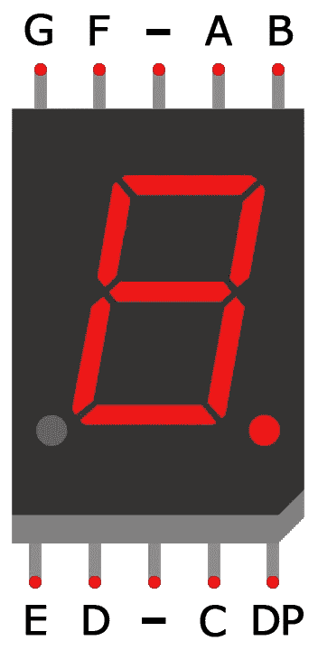
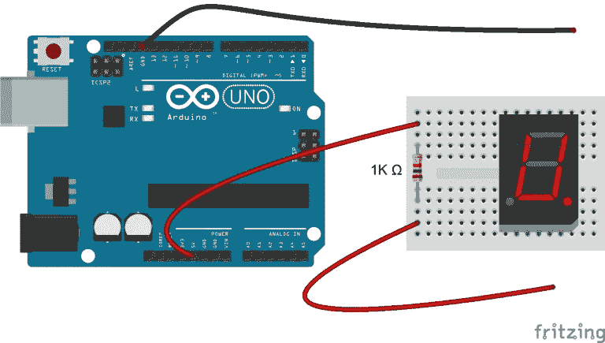
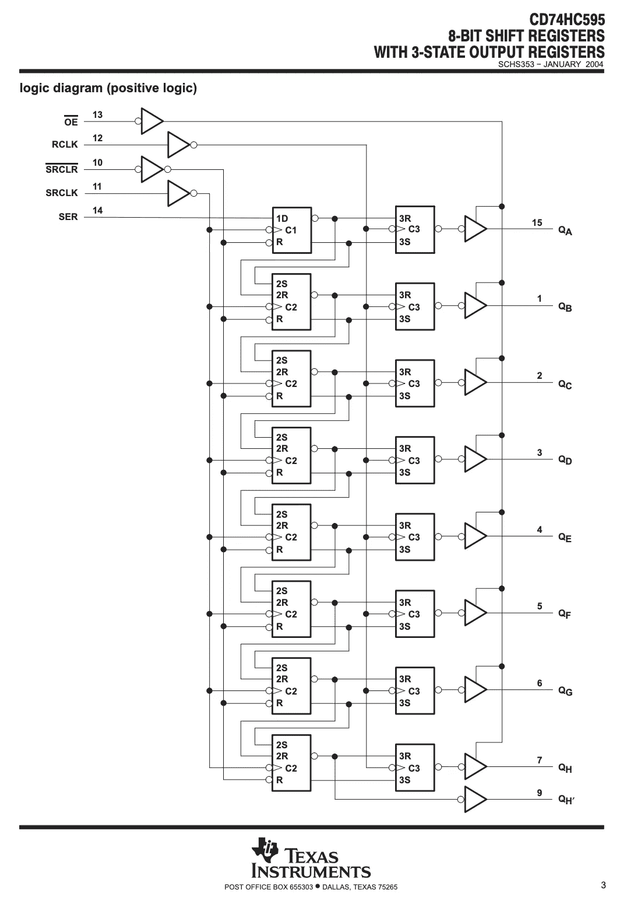
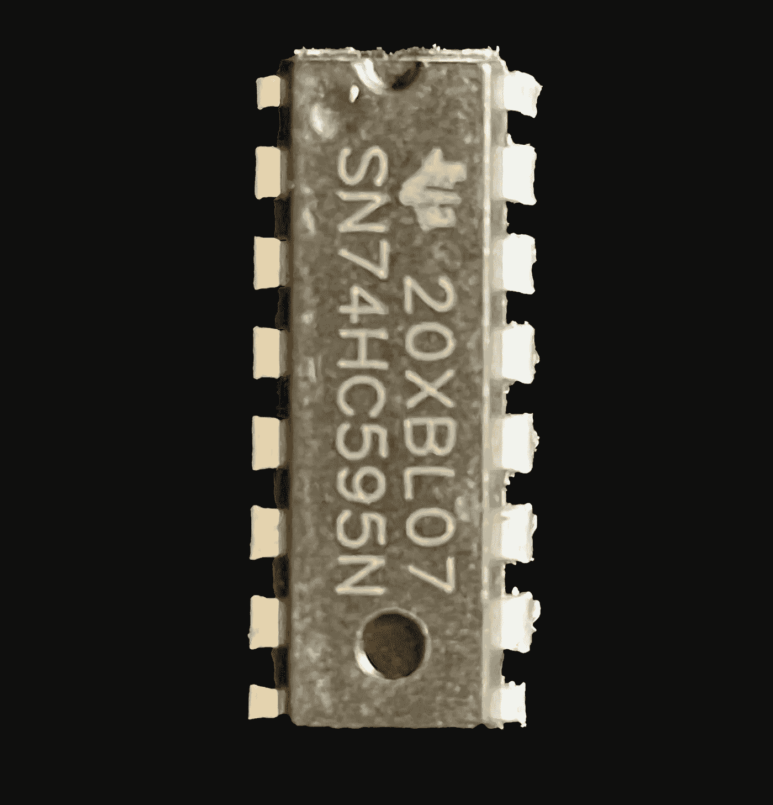
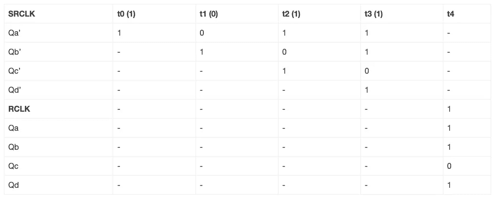
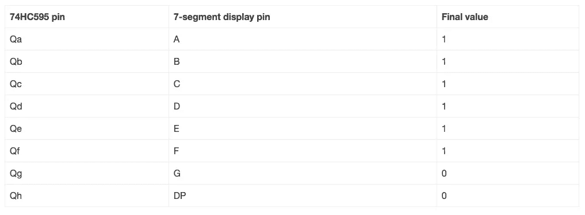
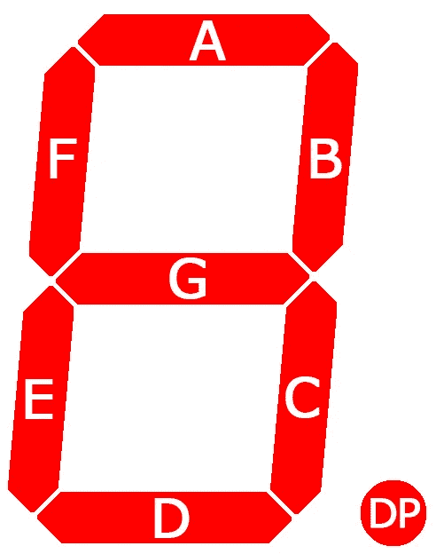
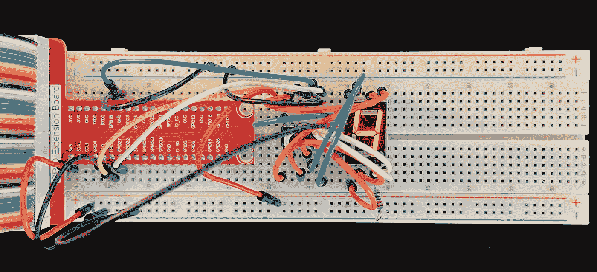
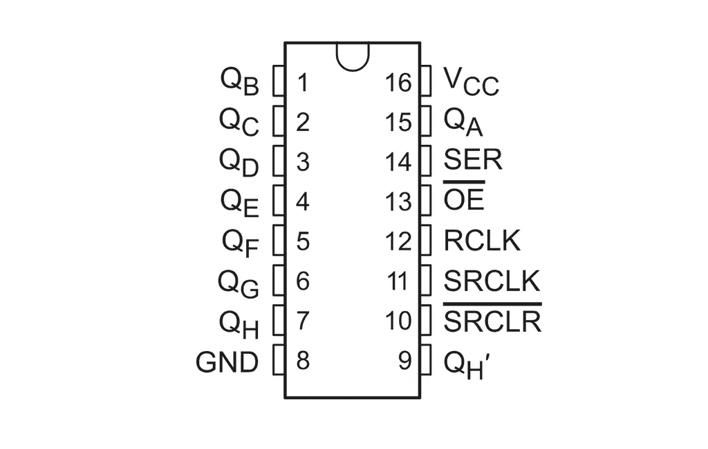
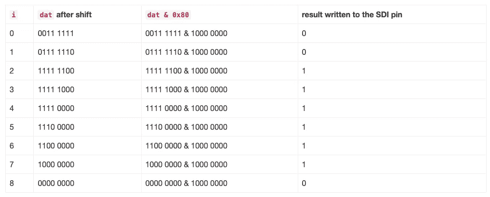

# Go 和 C 中的 Raspberry Pi GPIO 使用移位寄存器和 7 段显示器

> 原文：<https://betterprogramming.pub/raspberry-pi-gpio-in-go-and-c-using-a-shift-register-7-segment-display-aa8ad85dec70>

## 什么是移位寄存器和 7 段 led，以及如何使用 C & Golang 在 Raspberry Pi 上对它们进行编程


图片来源:作者

# 内容

*   概观
*   先决条件
*   会有帮助的信息
*   什么是 7 段显示器？
*   什么是移位寄存器，它有什么用途？
*   这个项目如何使用移位寄存器和 7 段显示器？
*   设置和代码
*   C 语言中的移位寄存器/7 段显示
*   Go 中的移位寄存器/7 段显示
*   摘要
*   参考

# 概观

这是探索在 Raspberry Pi 3B+上进行 GPIO 编程的系列文章的第四篇。是对 [Sunfounder 7 段显示](https://docs.sunfounder.com/projects/raphael-kit/en/latest/1.1.4_7-segment_display_c.html)项目的补充。你可以在这里找到完整系列。该系列的代码可以在 [github](https://github.com/youngkin/gpio) 上找到。

像 [Sunfounder RGB LED](https://docs.sunfounder.com/projects/raphael-kit/en/latest/1.1.2_rgb_led_c.html) 项目一样，这个项目有一些复杂的方面，Sunfounder 项目文档中没有很好地介绍。本文的目的就是填补这些空白，具体来说:

1.  什么是“移位寄存器”(74HC595 芯片)？
2.  移位寄存器的用途是什么？
3.  什么是 7 段显示器？
4.  移位寄存器如何与 7 段显示器结合使用？

本文的另一个目的是提供一个更完整的例子，说明使用 c 语言编写的程序实现移位寄存器和 7 段显示器的功能，该程序在这方面比 Sunfounder 代码先进得多。本文还将提供用 Go 编写的相同程序。

如果你以前没有使用过 LED，你应该考虑先看看我的 [Raspberry Pi GPIO in Go 和 C-闪烁 LED](https://youngkin.github.io/post/sunfoundergpionotesled/) 。那篇文章涵盖了将 LED 与 Raspberry Pi GPIO 一起使用的基础知识，以及相关的 C 和 Go 库，这在本文中没有讨论。

# 先决条件

这一节在我的[树莓 Pi GPIO 系列](https://youngkin.github.io/categories/gpio/)的所有文章中都有重复。如果你已经完成了这些文章中的一个项目，你可以浏览这一部分，只寻找不包括在其他项目中的必要项目，特别是移位寄存器和 7 段显示器。

如果你没有，你需要一个树莓派。我在 Raspbian OS 的“拉伸”版本中使用了一个树莓派 3B+。Raspberry Pi 网站上有关于如何[从头开始安装一个新的 Raspberry Pi 的说明](https://projects.raspberrypi.org/en/projects/raspberry-pi-setting-up)，如果你决定这样做而不是购买一个完整的套件。

你需要的其他物品包括:

*   一个[试验板](https://www.amazon.com/dp/B082KBF7MM/ref=sspa_dk_detail_4?psc=1&pd_rd_i=B082KBF7MM&pd_rd_w=1tGTV&pf_rd_p=887084a2-5c34-4113-a4f8-b7947847c308&pd_rd_wg=fX8JB&pf_rd_r=44DE0RS1E9FD42RBYC7R&pd_rd_r=47cbdc7f-7834-455f-9429-ef74a438bd45&spLa=ZW5jcnlwdGVkUXVhbGlmaWVyPUFVVkdZVUZRNUw3ODkmZW5jcnlwdGVkSWQ9QTA4MzI4MzYyU0VLNzBJM0cxRUVMJmVuY3J5cHRlZEFkSWQ9QTA0Mjk1NTMzSzNSWlNFUjU0NURBJndpZGdldE5hbWU9c3BfZGV0YWlsJmFjdGlvbj1jbGlja1JlZGlyZWN0JmRvTm90TG9nQ2xpY2s9dHJ1ZQ==) *(你可能会发现* [*这个教程对试验板*](https://www.sciencebuddies.org/science-fair-projects/references/how-to-use-a-breadboard) *很有帮助)*，
*   一些[跳线](https://www.amazon.com/dp/B08HZ26ZLF/ref=syn_sd_onsite_desktop_19?psc=1&spLa=ZW5jcnlwdGVkUXVhbGlmaWVyPUExRFpLWElCRjg1MUNMJmVuY3J5cHRlZElkPUEwMjMyMTE1M01aOFE3U1BQS09YSiZlbmNyeXB0ZWRBZElkPUEwODE5NTMxMktEMTlZRjEyQjBJNiZ3aWRnZXROYW1lPXNkX29uc2l0ZV9kZXNrdG9wJmFjdGlvbj1jbGlja1JlZGlyZWN0JmRvTm90TG9nQ2xpY2s9dHJ1ZQ==)，
*   一个 [220 欧姆的电阻](https://www.amazon.com/Resistor-Tolerance-Resistors-Assortment-Certificated/dp/B08QR72BFW/)，
*   一个 [74HC595 移位寄存器](https://www.amazon.com/Texas-Instruments-SN74HC595N-Registers-3-State/dp/B01J6WI7RA)
*   一个[共阴极七段显示器](https://www.amazon.com/microtivity-7-segment-Display-Common-Cathode/dp/B004S95VJE/)
*   您还应该考虑使用一个带有 T 型适配器的 [40 引脚母对母，将 GPIO 输出连接到试验板上。您只能使用跳线，但 T 型适配器将使事情变得更容易，并有助于防止损坏 Raspberry Pi 上的 GPIO 引脚。如果您选择不购买带 T 型适配器的 40 针电缆，您需要购买](https://www.amazon.com/dp/B082PRVRYR/ref=sspa_dk_detail_2?psc=1&pd_rd_i=B082PRVRYR&pd_rd_w=8mKhr&pf_rd_p=887084a2-5c34-4113-a4f8-b7947847c308&pd_rd_wg=e9psa&pf_rd_r=S09F37DF2G5FW8B8GX4B&pd_rd_r=c065c120-e60b-45e9-b93b-f581f048cf46&spLa=ZW5jcnlwdGVkUXVhbGlmaWVyPUFCMzhUQ09COFI2VlMmZW5jcnlwdGVkSWQ9QTA5NjU2ODUxRDkxNEYwSTYwV09KJmVuY3J5cHRlZEFkSWQ9QTAxOTg1MTUyRUhEUlc2VzQ2VDQ4JndpZGdldE5hbWU9c3BfZGV0YWlsJmFjdGlvbj1jbGlja1JlZGlyZWN0JmRvTm90TG9nQ2xpY2s9dHJ1ZQ==)[公母跳线](https://www.amazon.com/SinLoon-Breadboard-Arduino-Circuit-40-Pack/dp/B08M3QLL3Q/ref=pd_sbs_7/143-0445142-7950409?pd_rd_w=sVLrc&pf_rd_p=8b76d7a7-ab83-4ddc-a92d-e3e33bfdbf03&pf_rd_r=CDM5TGJT03VKF0ZFB577&pd_rd_r=8e58fd82-8503-41cf-b8f2-c78eaeb78d25&pd_rd_wg=tT1U0&pd_rd_i=B08M3QLL3Q&psc=1)。然而，单独购买所有这些东西会比一套花费更多。

[这里有一个简单的套件](https://www.amazon.com/dp/B06WP7169Y/ref=sspa_dk_detail_5?psc=1&pd_rd_i=B06WP7169Y&pd_rd_w=OZVyf&pf_rd_p=887084a2-5c34-4113-a4f8-b7947847c308&pd_rd_wg=0V0IH&pf_rd_r=623YJTBQ2CN2B2GYXQG5&pd_rd_r=faa61f0f-3aec-4cf0-8e7e-d44eb1b3b92f&spLa=ZW5jcnlwdGVkUXVhbGlmaWVyPUEyUVlDQzMzVVZBMFYxJmVuY3J5cHRlZElkPUEwMzExNzk4MUhGSjFSS0VKTlBROCZlbmNyeXB0ZWRBZElkPUEwMzYwNjg2UUdMRU44N0YzNzIwJndpZGdldE5hbWU9c3BfZGV0YWlsJmFjdGlvbj1jbGlja1JlZGlyZWN0JmRvTm90TG9nQ2xpY2s9dHJ1ZQ==)拥有所有(大部分？)以上的。套件的照片似乎显示了一个移位寄存器，但我不能肯定。我发现 sun founder Raspberry Pi Ultimate Starter Kit 特别有用。注意:Ultimate Starter Kit 和 Raphael Kit 是同一产品。


图片来源: [Sunfounder](https://docs.sunfounder.com/projects/raphael-kit/en/latest/1.1.4_7-segment_display_c.html)

您还需要一些基本的 C 和 Go 编程知识，并且熟悉登录到 Raspberry Pi 终端，或者登录到一些操作系统版本附带的桌面 GUI。根据您采用的方法，您可能需要将键盘和显示器连接到 Raspberry Pi。我只是简单地进入 Pi。您还需要熟悉如何使用像 vim 或 nano 这样的编辑器。

为了编译和运行 C 程序，你需要 [WiringPi](https://github.com/WiringPi) 库。很容易得到:

```
sudo apt-get install wiringpi
```

然后使用以下命令测试安装:

```
pi@pi-node1:~/go/src/github.com/youngkin/gpio/rgbled $ gpio -v
gpio version: 2.50
Copyright (c) 2012-2018 Gordon Henderson
This is free software with ABSOLUTELY NO WARRANTY.
For details type: gpio -warrantyRaspberry Pi Details:
  Type: Pi 3B+, Revision: 03, Memory: 1024MB, Maker: Sony
  * Device tree is enabled.
  *--> Raspberry Pi 3 Model B Plus Rev 1.3
  * This Raspberry Pi supports user-level GPIO access.
```

在上面你会注意到`gpio version: 2.50`。如果你使用的是 Rasberry Pi 4，使用 Sunfounder [中给出的检查接线 Pi](https://docs.sunfounder.com/projects/raphael-kit/en/latest/check_the_wiringpi_c.html) 的说明。

WiringPi 的独特之处在于它包括一个命令行工具`gpio`，如上所示，可用于管理、控制和查询 GPIO 板。这非常方便。参见 [gpio 参考](http://wiringpi.com/the-gpio-utility/)了解更多关于它能做什么和如何使用的信息。

如果您对在 Raspberry Pi 上进行 Go 开发感兴趣，您需要将开发环境安装到 Raspberry Pi 上。[这里有一个简单的来源](https://www.jeremymorgan.com/tutorials/raspberry-pi/install-go-raspberry-pi/)解释了如何实现这一点。这个源代码有点过时了，但是唯一重要的问题是 Go to install 的版本。来源显示正在安装围棋**1.14.4.linux-arm64.tar.gz**和**1.14.4.linuxarmv6l.tar.gz**。目前的版本是**1.17.1.linux-arm64.tar.gz**和**1.17.1.linuxarmv6l.tar.gz**。对于树莓派 3B+正确的选择将是**1.17.1.linuxarmv6l.tar.gz**。另一个是为 64 位系统设计的，比如 Raspberry Pi 4 系列。你可以在 [Golang 下载网站](https://golang.org/dl/)找到当前 ARM 版本的 Go。

对于 Go 开发，你还需要 go-rpio 库。

如果你想脱离 Sunfounder 文档的食谱风格，你需要一些 Linux 的基础知识。例如，我不会解释什么是根特权。

# 会有帮助的信息

Sunfounder 7 段显示器项目文档只是简单地介绍了如何连接试验板和代码，而没有提及太多硬件组件，尤其是移位寄存器。鉴于我对移位寄存器缺乏了解，甚至代码描述也有点混乱。我偶然发现了 [Sunfounder 7 段 Python](https://docs.sunfounder.com/projects/electronic-kit/en/latest/lesson_19_7-segment.html) 项目文档，该文档确实提供了一些关于 7 段显示的有用信息，但仍然没有提到移位寄存器。这个项目不需要移位寄存器就可以轻松完成，事实上许多关于 7 段显示器的[其他文章](https://www.circuitbasics.com/arduino-7-segment-display-tutorial/)就是这么做的。那么这个项目为什么要用移位寄存器呢？为什么不直接将 7 段显示器连接到 GPIO 引脚？显然移位寄存器有问题，我想知道那是什么。无论如何，对我来说，这个项目实际上是关于移位寄存器，7 段显示器仅仅是一个可视化移位寄存器如何工作的工具。但在讨论移位寄存器之前，我们先来简单讨论一下 7 段显示器。

# 什么是 7 段显示器？

那么什么是 7 段显示器呢？嗯，说得迂腐一点，如果算上器件上的小数点，它有 8 段。除此之外，这是一种常见的设备，你已经很熟悉了，可以看到它们被用在从时钟到计算器和其他需要数字显示的设备上。就物理实现而言，我们需要了解一些细节。



引脚排列图— [*图像来源:电路基础*](https://www.circuitbasics.com/arduino-7-segment-display-tutorial/)


LED ID 图— [*图像来源:电路基础*](https://www.circuitbasics.com/arduino-7-segment-display-tutorial/)

首先，上面的第一张图显示了 7 段显示器的引脚排列。此图显示了顶部和底部的中间引脚，并带有(-)注释。这将这些引脚指定为显示器的接地引脚。其余针脚上的字母与下方 LED 标识图中的字母相对应。例如，给显示屏上的“A”引脚通电将点亮下方 LED ID 图中标有“A”的 LED。字母“DP”代表小数点。

对于这个项目，我们需要什么是众所周知的公共阴极 7 段显示器。这就是上图显示的*(顶部和底部的中间引脚有一个(-)标注)*。这意味着显示器中 led 的所有负极端子都连接到公共接地引脚。公共阳极是另一种类型，正如你所料，这意味着所有 led 的正极端子都连接到同一个引脚。



确定共阴极或共阳极— [*图像学分:电路基础知识*](https://www.circuitbasics.com/arduino-7-segment-display-tutorial/) *&* [*烧结*](https://fritzing.org/)

如果您使用 Sunfounder 套件，7 段显示器是常见的阴极显示器。如果您从其他来源获得了 7 段显示，您可能需要验证它的类型。确定 7 段显示器是公共阴极还是公共阳极相当容易。根据[如何在 Arduino](https://www.circuitbasics.com/arduino-7-segment-display-tutorial/) 上设置七段显示，步骤如下:

> 虽然上图显示了一个 Arduino，但是将它挂接到一个 Raspberry Pi 上是非常相似的。

1.  如上图所示连接 Raspberry Pi 的电源(或连接到试验板的电源总线)。
2.  在试验板的两侧之间连接一个电阻，或者从电源总线连接到试验板的一侧。
3.  将一根跨接导线(红色)连接到电源电阻器的远端。
4.  将跳线(黑色)连接到 Raspberry Pi 的 GPIO 接地引脚。
5.  将黑色跳线(接地)连接到显示器顶部或底部的中间针脚。
6.  将红色跳线(正极)连接到任何其他引脚(除了中间的引脚！).

如果一个 LED 点亮，显示是一个共同的阴极。

> 如果指示灯不亮，请尝试以下步骤:

1.  从显示器上断开跳线
2.  将红色跳线连接到其中一个中间引脚，顶部或底部
3.  将黑线连接到另一个针脚上。

> 此时，LED 应该会亮起，您已经验证了该显示器是一个公共阳极显示器。如果没有 LED 灯亮起，则再次检查您的接线。

[这段 YouTube 视频](https://youtu.be/Fa7BHbPAM98)展示了如何使用万用表来实现这一点，而不是如上所述在试验板上布线。

# 什么是移位寄存器，它有什么用途？

移位寄存器有[几种类型。对于这个项目，我们使用的是所谓的“串行输入，并行输出”(SIPO)移位寄存器。这种类型的移位寄存器将串行输入转换成并行输出。例如，单个 Raspberry Pi GPIO 引脚上产生的几个信号脉冲可以由移位寄存器累加，然后作为单个并行输出发送到 7 段显示器。这正是这个项目正在做的事情。](https://www.elprocus.com/what-is-a-shift-register-different-types-counters-and-applications/)

那么为什么要使用移位寄存器呢？首先，如上所述，只需要一个 GPIO 引脚来驱动 7 段显示器上的 8 个引脚*(不完全正确，这将在本文后面更详细地解释)*。没有移位寄存器的这个项目的版本需要 8 个 GPIO 引脚来完成同样的事情。因此，移位寄存器的一个用途是节省 GPIO 引脚。这对于具有大量 LED 的 LED 显示器来说尤其如此，由于缺少可用的 GPIO 引脚，这些 LED 显示器可能无法使用。虽然这不是 7 段显示器的真实情况，但一些设备只接受并行输入。因此，对于这种情况，在将串行源转换为并行输出时，必须使用 SIPO 移位寄存器。

## 移位寄存器解剖学

74HC595 移位寄存器有几个与本文相关的逻辑组件:

*   输入移位寄存器——这是一系列相连的触发器器件，在收到每个同步时钟脉冲时接收输入(串行)数据(稍后将详细介绍)。该寄存器由从 Qa '到 Qh '顺序命名的输出组成，即 Qa '、Qb '、…、Qh '。
*   输出或存储寄存器——这是另一系列相连的触发器器件，将串行数据并行传输到相连的器件。该寄存器由从 Qa 到 Qh 和 Qh’的顺序命名的输出组成(更多关于 Qh’的信息见下文)。

虽然有些复杂，但这种剖析在下面的图中以图形方式显示，该图来自[德州仪器 CD74HC595 带 3 态输出寄存器数据表](https://www.ti.com/lit/ds/symlink/cd74hc595.pdf?ts=1636840974607&ref_url=https%253A%252F%252Fwww.google.com%252F)的 8 位移位寄存器。左边第一列 8 个框，标为 C1 或 C2，组成输入移位寄存器。右边第二列 8 个框，标为 C3，组成输出移位寄存器。输出寄存器的输出引脚位于最右侧，标记为 Qa 至 Qh 和 Qh’。图左上角的 OE、RCLK、SRCLR、SRCLK 和 SER 所示的输入和控制通道将在下文详细讨论。



[*TI CD74HC595 原理图—图片鸣谢:德州仪器*](https://www.ti.com/lit/ds/symlink/cd74hc595.pdf?ts=1636840974607&ref_url=https%253A%252F%252Fwww.google.com%252F%22)

下面提供了关于寄存器输出的 Q*名称的更多信息。

将整个器件称为移位寄存器，而将输入元件也称为移位寄存器，这有点令人困惑。为了区分这两者，如果从上下文看不清楚，我将确保在本文后面使用该术语时引用我所指的那一个。


74HC595 引脚排列图— [*图片来源:德州仪器*](https://www.ti.com/lit/ds/symlink/cd74hc595.pdf?ts=1636840974607&ref_url=https%253A%252F%252Fwww.google.com%252F%22)



SN744HC595N 照片—图片来源:作者

上面的第一张图显示了 SN74HC595 移位寄存器的引脚排列。上面的 SN74HC595N 图中的照片与引脚图的方向相同，即 GND 在左下方，Vcc 在右上方，“凹口”在顶部中央。上图中的引脚定义如下:

*   **Qa 引脚 15** (右侧，从上往下数第二个)是第一个输出引脚。Qa 也称为 Q0。
*   **引脚 1–7**，Qb-Qh，是剩余的输出引脚。注意，有 8 个输出引脚(包括上面的 Qa)。8 路输出使其成为 8 位移位寄存器。Qb-Qh 也被称为 Q1-Q7。
*   **引脚 8** ，GND 为接地引脚。
*   **Vcc 引脚 16** 是电源输入引脚。
*   **引脚 14**SER 是串行输入引脚。这是从 Raspberry Pi 获取输入串行数据脉冲的引脚。这有时被称为 DS、SI 或 SDI。
*   **引脚 11** 、SRCLK 是接收同步信号的引脚，该信号表示已向 SER 引脚发送 1 位数据。这种信号被称为时钟。SRCLK 代表移位寄存器时钟。SRCLK 也称为 sh_cp。
*   **引脚 12**RCLK 是接收同步信号的引脚，该信号指示所有 8 个移位寄存器位已被填充，是时候将这些位并行传输到输出/存储寄存器，从而传输到连接到输出引脚 Qa-Qh 的器件。RCLK 也称为 st_cp 或 latch。
*   **引脚 10** ，SRCLR，用于清除移位寄存器的当前值。SRCLR 代表移位寄存器清零。SRCLR 也称为 MR，如果不需要清除移位寄存器，可以将其连接到产生高电平信号(或 1)的电源。要清除移位寄存器，SRCLR 引脚应设为低电平(或 0)。在移位寄存器再次工作之前，必须将其设置回高电平。
*   **引脚 13**OE 用于阻止输出或存储寄存器的可用性。OE 引脚的影响是暂时的。当设为低电平(0)时，输出寄存器中的数据可以访问。当它为高电平(1)时，数据不可访问。将它从高设置为低可以再次访问数据。与 SRCLR 引脚不同，它不清零寄存器。如果不需要禁用输出寄存器，可以将其接地。
*   **引脚 9** ，Qh’，用于菊花链多个移位寄存器。例如，想象一个需要以并行方式控制 16 个 led 的项目。在这种情况下，单个 8 位移位寄存器是不够的，我们需要两个能够以某种方式进行通信的寄存器。我们可以从第二个 8 位移位寄存器中获得其他所需的 8 位。为了连接两个移位寄存器，我们将第一个移位寄存器的 Qh’输出连接到第二个移位寄存器的引脚 14 SER。菊花链移位寄存器超出了本项目的范围，但您可以在 Arduino 第 1 部分的[多移位寄存器中了解更多信息。](https://www.electroschematics.com/multiple-shift-registers-arduino-part-1/)

## 操作中的移位寄存器

如上所述，输入数据存储在输入移位寄存器中。数据在 SRCLK 输入的每个脉冲上传输。当接收到 SRCLK 输入时，前一个 Q* '引脚上的数据被移位到序列中的下一个 Q* '寄存器。当输入移位寄存器被填充后，RCLK 信号会将所有输入寄存器内容传输至输出寄存器。下表说明了这种行为。为了简单起见，我将示例限制为 4 位，Qa*到 Qd*。输入位序列将为`1011`。第一位`1`将在时间 *t0* 被发送。发送的位在时间指示旁边的括号中指示(例如`t0(1)`)。在 t4，RCLK 发出信号时，输出寄存器中的 4 位变为可用。



移位寄存器的操作—图片来源:作者

请注意，在输出位序列中，如果输出位从 Qa 读取到 Qd，则位序列相反。即`1101`对`1011`的输入顺序。这种移位方式称为最高有效位(MSB)移位。它从最左边的位开始，如本例所示。这一点必须牢记在心，否则可能会出现意想不到的结果。可以以更直观的方式移位最低有效位(LSB)。为此，移位必须从最少或最右边的输入位开始。在 C & Go 中，使用`<<`移位运算符完成 MSB 移位。LSB 移位通过使用`>>`移位操作符完成。当我们了解移位寄存器(不是输入移位寄存器)如何与 7 段显示器结合使用时，移位方法的影响将变得更加明显。[参见维基百科了解更多关于 MSB 和 LSB](https://en.wikipedia.org/wiki/Bit_numbering) 的信息。

> 如前所述，当我在上面提到只需要一个 Raspberry Pi GPIO 引脚来驱动 7 段显示器中的 8 个 LED 段时，我稍微简化了事情。我确定的一个引脚用于 SER(串行数据输入)引脚。至少还需要 2 个；1 用于 SRCLK 引脚，另一个用于 RCLK 引脚。如上所示，这是分别推进输入移位寄存器上的时钟和从输入移位寄存器向输出寄存器传输数据所必需的。因此，现在有 3 个引脚来驱动 7 段显示器上的 8 个 led。这仍然是一个很好的权衡。但如果需要 SRCLR 和 OE 引脚，则还需要 2 个 GPIO 引脚。因此，现在需要 5 个 GPIO 引脚来驱动 8 个 LED 段。仍然有 3 针的净增益。然而，如上所述，当移位寄存器以菊花链形式连接时，节省会更大。无需额外的 GPIO 引脚，就可以从这 5 个 GPIO 引脚控制 16 个甚至更多的 led。随着需要控制更多的设备，例如 led，节省变得更加显著。

# 这个项目如何使用移位寄存器和 7 段显示器？

该项目使用移位寄存器器件来捕获串行输入，累加直到写入 8 位，然后将其提供给输出寄存器。由于移位寄存器组件连接到 7 段显示器，输出寄存器的内容可用于 7 段显示器，控制最终显示的内容。从移位寄存器元件到 7 段显示引脚的引脚连接细节，以及所使用的移位方法(本例中为 MSB ),决定了 7 段显示器上将点亮哪些 led。下表提供了具体的引脚分配，以及当输入数为`0x3f`、`0011 1111`、使用 MSB 移位时，输出寄存器给出的最终值。



移位寄存器到 7 段显示值映射—图片来源:作者

使用下图，我们可以确定 7 段 LED 将显示什么数字。


七段显示排线图— [*图片来源:电路基础*](https://www.circuitbasics.com/arduino-7-segment-display-tutorial/)



7 段显示 LED ID 图— [*图像来源:电路基础*](https://www.circuitbasics.com/arduino-7-segment-display-tutorial/)

7 段显示引脚 A-F 的值为 1，G 和 DP 的值为 0。将它映射到上面的 LED 识别图中，我们可以看到显示的数字是`0`。

# 设置和代码


*Sunfounder 接线图—* [*图片来源— Sunfounder*](https://docs.sunfounder.com/projects/raphael-kit/en/latest/1.1.4_7-segment_display_c.html)



*实际布线(大部分)—图片鸣谢:作者*

试验板应如上图所示*(如* [*Sunfounder 7 段显示器*](https://docs.sunfounder.com/projects/raphael-kit/en/latest/1.1.4_7-segment_display_c.html) *项目文档中所示)*。有一点非常重要，我花了太多时间调试，那就是连接 7 段显示器接地引脚的电阻必须连接到试验板上的地或负总线。在我之前的所有项目中，我都将电阻连接到正试验板总线。我最初错过了这个细节，7 段显示器没有显示任何东西。我在初始布线中犯的另一个错误是，我将 74HC595 输出寄存器引脚错误地连接到 7 段显示器。这很容易做到。我通过记录哪个 LED 段点亮了哪个预期数字来调试这个问题。看了几个数字后，很明显我把 7 段显示器上的 G 和 E 引脚颠倒了。

如果你不熟悉试验板和试验板图，这个[试验板教程](https://www.sciencebuddies.org/science-fair-projects/references/how-to-use-a-breadboard)应该会有帮助。

# C 语言中的移位寄存器/7 段显示

这段代码与 Sunfounder 代码有很大不同。这是因为我选择添加几项功能，包括:

1.  支持中断处理程序。这将通过清除输入移位寄存器从而关闭所有 led 来优雅地退出程序。Sunfounder 程序将使 led 保持在该版本退出时的状态。
2.  它支持设置 SRCLR 和 OE 移位寄存器引脚。
3.  它增加了对 7 段显示中小数点的照明支持。
4.  它增加了几个功能，能够测试 74HC595 移位寄存器的不同功能，包括使用 SRCLR 和 OE 引脚。
5.  它接受来自键盘的用户输入，允许用户指定他们希望程序如何驱动移位寄存器，从而驱动 LED。这包括清除输入移位寄存器、禁用和重新启用输出寄存器、写入所有十六进制数字/小数点以及向显示器写入`8.`。

嵌入的注释很好地解释了大部分内容，但我将提到几个亮点。

第 12 行和第 13 行提供了关于如何构建和运行程序的信息。



74HC595 引脚排列图— [*图片来源:德州仪器*](https://www.ti.com/lit/ds/symlink/cd74hc595.pdf?ts=1636840974607&ref_url=https%253A%252F%252Fwww.google.com%252F%22)

第 27 和 28 行定义了分别驱动 SRCLR 和 OE 引脚的 GPIO 引脚。请注意，GPIO 引脚号是[接线引脚](https://github.com/WiringPi/WiringPi)引脚号。如果您想看到这种行为，应将引脚 24 连接到 SRCLR 移位寄存器引脚，将引脚 29 连接到 OE 移位寄存器引脚，而不是分别连接正极和地。

第 32 行和第 33 行定义了一个数组`SegCode`，它包含将被移入移位寄存器的十六进制数，以便显示与数组中特定数字的索引相匹配的数字。例如，要显示 8 应该使用`SegCode[8]`。请注意，这些数字反映了 MSB 形式移位的使用。如果使用 LSB 移位形式，数字会有所不同。例如，用于显示 0 的数字，如第 32 行所示，是`0x3F` ( `0011 1111`)。要使用 LSB 方法显示 0，应使用十六进制数`0xFC` ( `1111 1100`)和 C 右移运算符`>>`。

下面的代码片段显示了移位寄存器的初始化。简而言之，我们使用的所有引脚都处于输出模式，因此我们可以对它们进行写入。接下来，除 SRCLR 引脚之外的所有引脚都被设为低电平(0)。回想一下，SRCLR 引脚必须设为高电平，移位寄存器才能工作。

> 引脚模式输出的替代方案是 PWM(脉宽调制)。由于 PWM 通过快速脉动相关引脚来模拟较低电压，因此不适合与移位寄存器一起使用。回想一下，SRCLK 和 RCLK 引脚的一个脉冲代表一个时钟前进。使用 PWM 以及由此产生的快速脉冲会干扰时钟以可靠的方式前进。

这个代码片段演示了关闭 7 段显示器中所有 led 的两种方法。具体来说，它显示了如何使用 SRCLR 引脚并向所有输入移位寄存器位写入 0 来清除输入移位寄存器，这将导致 7 段显示器不显示任何内容。

在`shiftRegClr`的第 1 行到第 11 行，注意第 4 行和第 6 行 RCLK 引脚的使用。该引脚的时钟信号必须是脉冲信号，即先设为高电平，再设为低电平，以便输出寄存器可以使用输入移位寄存器的内容。另请注意，重新使能移位寄存器的操作完成后，SRCLR 引脚需要复位至高电平。

第 16 行到第 28 行显示了向所有输入移位寄存器位写 0 以清除输入移位寄存器(`zeroClear()`)的方法。这在功能上等同于使用 SRCLR 方法，两者都将输入移位寄存器位设为 0。然而，这确实需要付出更多的努力。第 18 到 23 行中的`for`循环将一个零移入输入移位寄存器的每一位。该过程重复 8 次，每次写操作都推进 SRCLK，以填充输入移位寄存器位。线 20 和 22 发送 SRCLK 脉冲，以提升输入移位寄存器位。严格来说，没有必要把`0`和`&`移到 19 行的`0x80`。仅将`0`写入 SDI 引脚就足够了。然而，有必要使用这种写入 SDI 引脚的方法，将任何其他数字，例如`0x3F`写入输入移位寄存器。

与上面的`shiftRegClr()`一样，第 25 和 27 行切换 RCLK 引脚，将位传输到输出寄存器。

下一段代码演示了如何点亮所有 led，包括小数点，以及切换 OE 引脚以暂时禁用输出寄存器。

第 3 行到第 15 行显示`writeAllOnes()`。它的实现几乎和上面的`zeroClear()`一模一样。一个值得注意的例外是，在写入引脚之前，它不会将 1 和`&`左移到`0x80`。这表明，当所有输入移位寄存器位具有相同的值，即 1 或 0 时，没有必要这样做。不过，它会重复 8 次写入引脚的过程，每次写入后都会提升 SRCLK 时钟。

第 22 到 29 行实现了`oeToggle()`，它将 OE 引脚切换到高电平(1)，然后再次切换到低电平。写入之间有 1 秒钟的延迟，以确保效果可见。回想一下，将 OE 引脚设为高电平是禁用输出寄存器的原因。从观察者的角度来看，7 段显示器将关闭 1 秒钟，然后恢复到切换之前的显示状态。在调用该函数之前，由调用函数决定在 7 段显示器上显示什么。

`hc595_shift()`负责将输入数`dat`的各个位移入输入移位寄存器。除了输入数字根据`dat`的值是可变的之外，该功能的实现与上面的`zeroClr()`完全一样。事实上，`zeroClr()`和`writeAllOnes()`都可以，而且很可能已经使用`hc595_shift()`实现了。

对于那些像我一样难以想象`<<`如何与`&`操作符协同工作的人，这里有一个简短的例子，以`0x3f`或`0011 1111`为例。注意，操作的优先顺序是`<<`先发生，然后是`&`。



移位示例—图片来源:作者

最后一个条目`i = 8`，是如果`dat`移动 9 次而不是 8 次会发生的情况。这只是为了清楚地说明`dat`已经向左移动了 8 位，所有 8 位都设置为 0。

上面代码片段中的大多数函数只是通过将显示设置为`8`来设置测试，然后将行为委托给我们上面看到实现的函数(例如`shiftRegClr()`)。`testWriteNums()`不是只显示十六进制数`0-F`，而是会在所有的十六进制数和小数点之间循环。

最后，这段代码实现了`main()`和`interruptHandler()`功能。

第 3 行记录了一个对`SIGINT`信号感兴趣的信号处理器`interruptHandler()`。`SIGINT`是在终端输入`ctl-C`时产生的。

第 6 到 9 行初始化 WiringPi 库，如果初始化失败就退出。

第 16 行提示用户他们希望看到演示的行为。

第 17 行到第 25 行首先读取用户的终端输入，并用结果填充一个以 null 结尾的字符串。除了第一个字符之外，代码不关心任何可能已经输入的字符。它和换行符之间的任何附加字符都将被忽略。

第 26 行释放第 19 行的`getline()`分配的内存。这是避免内存泄漏所必需的。如果你不明白这些，也不要担心。这个程序演示了什么并不重要。如果您感兴趣，可以研究一下 C 中的内存分配，包括内存是如何分配的(`malloc`)、如何释放的(`free`)、为什么这很重要，以及最后的`getline()`函数的操作。否则，请记住这是必需的。

> 旁白:严格地说，这个程序实际上并不需要这样做，因为在正常使用中，由此产生的内存泄漏可能是微不足道的。至少，当不再需要时，不`free`所有分配的内存是不好的。最坏的情况是，一旦分配完所有可用内存，程序可能会以各种方式失败。因此，当不再需要与像`line`这样的变量相关联的内存时，调用`free`。
> 
> [维基百科](https://en.wikipedia.org/wiki/C_dynamic_memory_allocation)有非常详细的关于内存分配和管理的讨论。

第 28 到 56 行检测用户选择了哪个选项，并调用与该选项相关的函数。重复从第 15 行开始的整个过程，直到用户选择`(q)uit`选项。

第 63 到 67 行记录了信号处理器，如果在终端输入`ctl-C`，它将优雅地退出程序。它调用`toggle8()`，在关闭 7 段显示器中的所有 led 之前，短暂显示一个`8`。

# Go 中的移位寄存器/7 段显示

围棋程序和 C 版本很像。在实现和运行时输出中有一些微小的差异。其中一些差异是由于语言之间的结构差异以及编码约定的差异造成的。下面的片段代表了程序的大部分，但不是全部。我留下了一些锅炉板和空白。

这个片段有 4 个主要部分。第一个是第 3 行的`segcode`变量的定义。它的作用与 C 程序中的`SegCode`相同，即定义要左移到移位寄存器中的值。需要注意的是，与 C 版本一样，这些值取决于最高有效位移位(MSB)的使用。为了方便起见，下面是 C 版本的说明文字:

> `SegCode` …包含应移入移位寄存器的十六进制数，以便显示与数组中特定数字的索引相匹配的数字。例如，要显示 8 应该使用`SegCode[8]`。请注意，这些数字反映了 MSB 形式移位的使用。如果使用 LSB 移位形式，数字会有所不同。例如，用于显示 0 的数字，如第 32 行所示，是`0x3F` ( `0011 1111`)。要使用 LSB 方法显示 0，应使用十六进制数`0xFC` ( `1111 1100`)和 C 右移运算符`>>`。

第二，第 7–13 行，在`main()`中，初始化 go-rpio 库，如果有问题就退出。第 13 行保证 go-rpio 库持有的资源将在程序终止时被释放。

第三，第 15–20 行，创建 go-rpio `rpio.Pin`对象，由程序的其余部分操作。

最后，第 22–35 行定义了一个信号/中断处理程序来捕捉来自终端的`ctl-C`输入。如果用户在键盘上输入`ctl-C`，这是优雅地退出程序所需要的。在这个代码片段中需要注意的一个关键点是名为`stop`的通道的使用。信号/中断处理程序运行在自己的 goroutine 中(第 35 行)。此时，有 2 个 goroutine 正在运行，`main()` goroutine 和与信号/中断处理程序相关的 goroutine。它们是独立运行和调度的，因此控制权可以以任意和不可预测的方式从一个例程转移到另一个例程。为了优雅地关闭程序，必须以受控的方式停止它们。否则退出程序会导致不可预知的行为。例如，在程序退出时，7 段显示器可能仍有一些发光二极管。使用`stop`通道同步程序退出可防止这种情况发生。请参见 [Goroutines](https://tour.golang.org/concurrency/1) 和 [Channels](https://tour.golang.org/concurrency/2) 上的 Go 课程之旅，快速了解 Goroutines 和 Channels。如果你不太理解这些，不要担心，Go 中的并发性是一个高级话题。我主要只是想提供一个高层次的解释，说明为什么要这样写代码。

程序注释提供了额外的细节。`main()`的其余部分在下面的代码片段中。

如上所示的`main()`的其余部分处理提示用户他们希望看到演示的功能是相当不言自明的。需要指出的一点是从第 2-8 行开始的`for/select`循环。`for/select`是围棋程序中常用的模式。它在这里的使用可以追溯到之前关于`stop`通道的讨论。`for/select`模式的`select`部分在`stop`上监听指示该 goroutine 应该退出的消息。注意`select`有两个`case`选择。第一个是用来听`stop`频道的。如果收到消息，则`for`循环和程序将退出。如果没有收到消息，则控制将立即转到`default`情况，继续正常程序流程。在`default`的情况下，在第 18-57 行提示用户选择，这将导致其中一个测试函数被调用。

下一个代码片段有 3 个部分。第一个是 go-rpio `rpio.Pin`对象的创建，这些对象表示到移位寄存器物理引脚的逻辑连接。GPIO/BCM 引脚 17、18、27、19 和 21 分别用于 SDI、RCLK、SRCLK、SRCLR 和 OE 引脚。

第二部分将引脚设置为输出模式，以便可以写入。

最后一部分将引脚上的电压设置为初始值。注意，SRCLR 引脚设为高电平。这是移位寄存器工作所必需的。在后面的代码片段中，我们将看到，通过将 SRCLR 引脚设为低电平来清除输入移位寄存器，然后再设为高电平来重新使能移位寄存器的正常操作，从而清除输入移位寄存器。

这个代码片段显示了测试函数的实现，调用这些函数是为了响应用户关于他们希望看到演示的功能的选择。如果有任何数据被写入 7 段显示器，在功能退出前将被清除。

这个代码片段展示了程序核心功能`hc595_shift()`的实现，它实际上是对输入移位寄存器的写操作。注释对该函数的功能提供了很好的详细解释。关于位移如何工作的更多细节，请参见上面的 C 版本。

这个最后的代码片段展示了两个助手函数和信号/中断处理程序的实现。第一个辅助函数`writeNums()`，写入照亮 7 段显示屏上的十六进制数字所需的实际数据。

第二个是`shiftRegClr()`，显示如何结合使用 SRCLR 和 RCLK 引脚来清除移位寄存器，最终清除 7 段显示。注意，如上所述，为了重新使能移位寄存器，需要将 SRCLR 引脚置回高电平。

在`shiftRegClr`的第 12 行到第 18 行，注意第 14 行和第 16 行 RCLK 引脚的使用。该引脚的时钟信号必须是脉冲信号，即先设为高电平，再设为低电平，以便输出寄存器可以使用输入移位寄存器的内容。另请注意，重新使能移位寄存器的操作完成后，SRCLR 引脚需要复位至高电平。

最后，`signalHandler()`功能通过`sigs`通道捕捉来自操作系统(第 23 行)的信号。然后在(第 25 行)它关闭停止通道。关闭通道的一个副作用是会向通道另一端的所有侦听器发送通知。这是围棋中常见的模式。最后，它清空移位寄存器，释放 go-rpio 资源(第 28 行)，并退出程序。

# 摘要

这篇文章涉及了相当多的领域。如果你一直在关注我的系列，从 [Raspberry Pi GPIO in Go 和 C-Blinking LED](https://youngkin.github.io/post/sunfoundergpionotesled/)项目开始，你已经熟悉使用 GPIO 驱动 LED。你可能会同意 [Sunfounder 7 段显示器](https://docs.sunfounder.com/projects/raphael-kit/en/latest/1.1.4_7-segment_display_c.html)项目并没有真正增加你在以前的项目中没有涉及的 GPIO 和 led 知识。这就是为什么，对我来说，这个项目实际上是关于学习移位寄存器的基础知识，并以一种非平凡的方式使用它们。

这篇文章涵盖了几件有趣的事情:

1.  它演示了在试验板上连接一个相对复杂的电路。正如我所做的那样，您可能在这个过程中犯了一些错误，这给了您一些如何调试电路的有用知识。
2.  通过学术讨论和动手实践，你已经对移位寄存器及其用途有了相当多的了解。
3.  尽管我在这个项目中有点轻视 led 的使用，但这个项目确实揭示了如何以更现实的方式使用 led。控制单个 LED 很有趣，但能够并行控制 LED 阵列并在阵列上显示数字是一大进步。您还了解了 7 段显示器有两种类型，公共阳极和公共阴极。

欢迎对本文提出评论和问题(掌声也是一样):

# 参考

*   [Sunfounder 7 段显示](https://docs.sunfounder.com/projects/raphael-kit/en/latest/1.1.4_7-segment_display_c.html)项目文档。
*   [Sunfounder 7 段 Python](https://docs.sunfounder.com/projects/electronic-kit/en/latest/lesson_19_7-segment.html) 项目包含一些 C 版本项目中没有的附加信息。
*   [Raspberry Pi GPIO 引脚排列图](https://pinout.xyz/)包括物理板引脚号、BCM/GPIO 引脚号和 WiringPi 引脚号。
*   [移位寄存器:串行输入、并行输出(SIPO)转换](https://www.allaboutcircuits.com/textbook/digital/chpt-12/serial-in-parallel-out-shift-register/)是详细介绍移位寄存器，尤其是 74HC595 移位寄存器的好资源。
*   [德州仪器 CD74HC595 数据手册](https://www.ti.com/lit/ds/symlink/cd74hc595.pdf?ts=1636840974607&ref_url=https%253A%252F%252Fwww.google.com%252F)包含一些有趣的信息，包括时序图。
*   [如何在 Arduino 上设置七段显示器](https://www.circuitbasics.com/arduino-7-segment-display-tutorial/)提供了一个不使用移位寄存器的七段 LED 项目示例。它还有一些其他有用的信息，如如何确定 7 段显示器是共阴极还是共阳极显示器。
*   [wiring pi](https://github.com/WiringPi/WiringPi)C 库
*   [WiringPi 网站](http://wiringpi.com/)
*   [go-rpio](https://github.com/stianeikeland/go-rpio) 用于 go 的库
*   我的[树莓 Pi GPIO 系列其他文章](https://youngkin.github.io/categories/gpio/)
*   包含本文代码的 gpio 库
*   [如何从头开始设置一个新的 Raspberry Pi](https://projects.raspberrypi.org/en/projects/raspberry-pi-setting-up)
*   [如何使用试验板](https://www.sciencebuddies.org/science-fair-projects/references/how-to-use-a-breadboard)