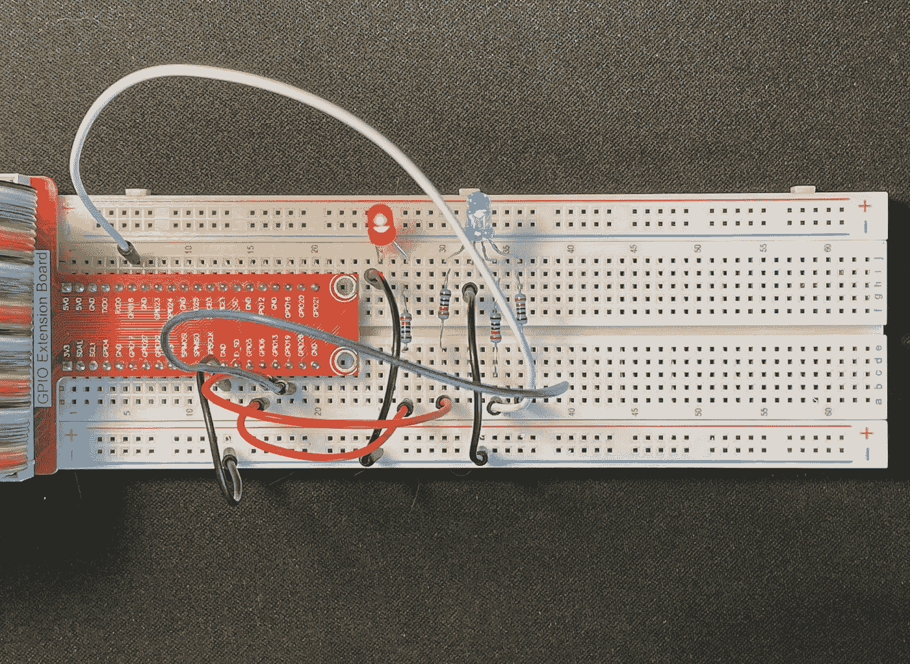
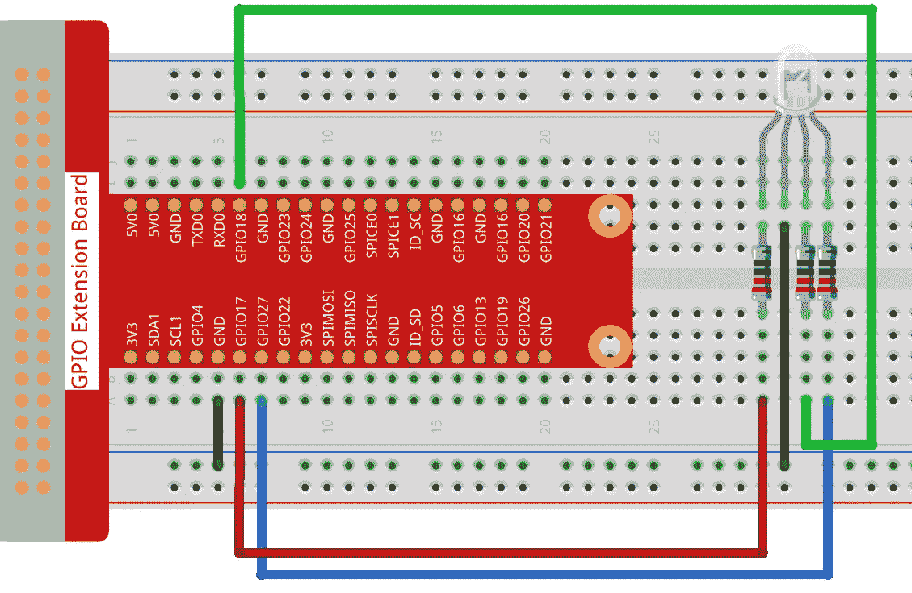

# Golang 和 C-RGB LED 中的 Raspberry Pi GPIO

> 原文：<https://betterprogramming.pub/raspberry-pi-gpio-in-golang-and-c-rgb-led-cebdb9b456a9>

## 如何使用 Golang 和 C 控制 RGB LED



图片来源:作者

# 内容

*   概观
*   先决条件
*   会有帮助的信息
*   RGB LED in C(软件 PWM)
*   RGB LED in C(硬件 PWM)
*   RGB LED in Go(硬件 PWM)
*   摘要
*   参考

# 概观

这是探索在 Raspberry Pi 3B+上进行 GPIO 编程的系列文章的第二篇。第一个是 [Raspberry Pi GPIO in Go 和 C —闪烁 LED](https://youngkin.github.io/post/sunfoundergpionotesled/) 。它是对 [Sunfounder RGB LED 项目](https://docs.sunfounder.com/projects/raphael-kit/en/latest/1.1.2_rgb_led_c.html)的补充。你可以在这里找到完整系列。

本文探讨如何使用脉宽调制(PWM)来驱动 RGB LED，以及如何控制单个 LED 引脚的亮度。代码示例将放在 Go 和 c 中。

# 先决条件

如果你没有，你需要一个树莓派。我在 Raspbian OS 的“拉伸”版本中使用了一个树莓派 3B+。鉴于 Sunfounder Ultimate Starter Kit 被宣传为与 Raspberry Pi 4 一起工作，我希望 4 系列也能工作。我对其他 Raspberry Pi 版本不太确定，尤其是 26 对 40 GPIO 引脚的版本。

接下来你需要

1.  一个[试验板](https://www.amazon.com/dp/B082KBF7MM/ref=sspa_dk_detail_4?psc=1&pd_rd_i=B082KBF7MM&pd_rd_w=1tGTV&pf_rd_p=887084a2-5c34-4113-a4f8-b7947847c308&pd_rd_wg=fX8JB&pf_rd_r=44DE0RS1E9FD42RBYC7R&pd_rd_r=47cbdc7f-7834-455f-9429-ef74a438bd45&spLa=ZW5jcnlwdGVkUXVhbGlmaWVyPUFVVkdZVUZRNUw3ODkmZW5jcnlwdGVkSWQ9QTA4MzI4MzYyU0VLNzBJM0cxRUVMJmVuY3J5cHRlZEFkSWQ9QTA0Mjk1NTMzSzNSWlNFUjU0NURBJndpZGdldE5hbWU9c3BfZGV0YWlsJmFjdGlvbj1jbGlja1JlZGlyZWN0JmRvTm90TG9nQ2xpY2s9dHJ1ZQ==)
2.  一些[跳线](https://www.amazon.com/dp/B08HZ26ZLF/ref=syn_sd_onsite_desktop_19?psc=1&spLa=ZW5jcnlwdGVkUXVhbGlmaWVyPUExRFpLWElCRjg1MUNMJmVuY3J5cHRlZElkPUEwMjMyMTE1M01aOFE3U1BQS09YSiZlbmNyeXB0ZWRBZElkPUEwODE5NTMxMktEMTlZRjEyQjBJNiZ3aWRnZXROYW1lPXNkX29uc2l0ZV9kZXNrdG9wJmFjdGlvbj1jbGlja1JlZGlyZWN0JmRvTm90TG9nQ2xpY2s9dHJ1ZQ==)
3.  一个 [220 欧姆电阻和一个 RGB LED](https://www.amazon.com/EDGELEC-Tri-Color-Multicolor-Diffused-Resistors/dp/B077XGF3YR/ref=asc_df_B077XGF3YR/?tag=hyprod-20&linkCode=df0&hvadid=242051162351&hvpos=&hvnetw=g&hvrand=11064062033670066895&hvpone=&hvptwo=&hvqmt=&hvdev=c&hvdvcmdl=&hvlocint=&hvlocphy=9028749&hvtargid=pla-430228081645&psc=1) 。

您还应该考虑使用一个带有 T 型适配器的 [40 引脚母对母，将 GPIO 输出连接到试验板上。您只能使用跳线，但电缆会使事情变得更容易，并有助于防止损坏 Raspberry Pi 上的 GPIO 引脚。如果您选择不购买带 T 型适配器的 40 针电缆，您需要购买](https://www.amazon.com/dp/B082PRVRYR/ref=sspa_dk_detail_2?psc=1&pd_rd_i=B082PRVRYR&pd_rd_w=8mKhr&pf_rd_p=887084a2-5c34-4113-a4f8-b7947847c308&pd_rd_wg=e9psa&pf_rd_r=S09F37DF2G5FW8B8GX4B&pd_rd_r=c065c120-e60b-45e9-b93b-f581f048cf46&spLa=ZW5jcnlwdGVkUXVhbGlmaWVyPUFCMzhUQ09COFI2VlMmZW5jcnlwdGVkSWQ9QTA5NjU2ODUxRDkxNEYwSTYwV09KJmVuY3J5cHRlZEFkSWQ9QTAxOTg1MTUyRUhEUlc2VzQ2VDQ4JndpZGdldE5hbWU9c3BfZGV0YWlsJmFjdGlvbj1jbGlja1JlZGlyZWN0JmRvTm90TG9nQ2xpY2s9dHJ1ZQ==)[公母跳线](https://www.amazon.com/SinLoon-Breadboard-Arduino-Circuit-40-Pack/dp/B08M3QLL3Q/ref=pd_sbs_7/143-0445142-7950409?pd_rd_w=sVLrc&pf_rd_p=8b76d7a7-ab83-4ddc-a92d-e3e33bfdbf03&pf_rd_r=CDM5TGJT03VKF0ZFB577&pd_rd_r=8e58fd82-8503-41cf-b8f2-c78eaeb78d25&pd_rd_wg=tT1U0&pd_rd_i=B08M3QLL3Q&psc=1)。然而，单独购买所有这些东西会比一套花费更多。[这里有一个简单的工具包，上面所有的](https://www.amazon.com/dp/B06WP7169Y/ref=sspa_dk_detail_5?psc=1&pd_rd_i=B06WP7169Y&pd_rd_w=OZVyf&pf_rd_p=887084a2-5c34-4113-a4f8-b7947847c308&pd_rd_wg=0V0IH&pf_rd_r=623YJTBQ2CN2B2GYXQG5&pd_rd_r=faa61f0f-3aec-4cf0-8e7e-d44eb1b3b92f&spLa=ZW5jcnlwdGVkUXVhbGlmaWVyPUEyUVlDQzMzVVZBMFYxJmVuY3J5cHRlZElkPUEwMzExNzk4MUhGSjFSS0VKTlBROCZlbmNyeXB0ZWRBZElkPUEwMzYwNjg2UUdMRU44N0YzNzIwJndpZGdldE5hbWU9c3BfZGV0YWlsJmFjdGlvbj1jbGlja1JlZGlyZWN0JmRvTm90TG9nQ2xpY2s9dHJ1ZQ==)。如果你希望了解这个系列，我推荐你购买[sun founder Raspberry Pi Ultimate 初学者工具包](https://www.amazon.com/gp/product/B09BMVT4CB/ref=ppx_yo_dt_b_asin_title_o02_s00?ie=UTF8&psc=1)。


*sun founder Ultimate Starter/Raphael 套件—* 图片来源:作者

您还需要一些基本的 C 和 Go 编程知识，并且熟悉登录到 Raspberry Pi 终端，或者登录到一些操作系统版本附带的桌面 GUI。根据您采用的方法，您可能需要将键盘和显示器连接到 Raspberry Pi。我只是简单地进入 Pi。您还需要熟悉如何使用像 Vi 或 nano 这样的编辑器。

为了编译和运行 C 程序，你需要 [WiringPi](https://github.com/WiringPi/WiringPi) 库。很容易得到:

```
sudo apt-get install wiringpi
```

然后使用以下命令测试安装:

```
pi@pi-node1:~/go/src/github.com/youngkin/gpio/rgbled $ gpio -v
gpio version: 2.50
Copyright (c) 2012-2018 Gordon Henderson
This is free software with ABSOLUTELY NO WARRANTY.
For details type: gpio -warrantyRaspberry Pi Details:
  Type: Pi 3B+, Revision: 03, Memory: 1024MB, Maker: Sony
  * Device tree is enabled.
  *--> Raspberry Pi 3 Model B Plus Rev 1.3
  * This Raspberry Pi supports user-level GPIO access.
```

在上面你会注意到`gpio version: 2.50`。如果你使用的是 Rasberry Pi 4，使用 Sunfounder [中给出的检查接线 Pi](https://docs.sunfounder.com/projects/raphael-kit/en/latest/check_the_wiringpi_c.html) 的说明。

WiringPi 的独特之处在于它包括一个命令行工具`gpio`，如上所示，可用于管理、控制和查询 GPIO 板。这非常方便。参见 [gpio 参考](http://wiringpi.com/the-gpio-utility/)了解更多关于它能做什么和如何使用的信息。

我选择不从 Sunfounder 网站下载代码，而是自己编写代码，即使我所做的只是直接从项目文档中复制。因此，我创建了自己的位置来创建代码。实际上，[我的代码在 Github](https://github.com/youngkin/gpio) 里。如果你喜欢下载代码，你可以选择从我的 Github 库下载、克隆或派生代码。另外，用 Go 编写的项目代码也位于那里。该项目的代码位于 [gpio/rgbled](https://github.com/youngkin/gpio/tree/main/rgbled) 。

如果您对在 Raspberry Pi 上进行 Go 开发感兴趣，您需要将开发环境安装到 Raspberry Pi 上。[这里有一个简单的来源](https://www.jeremymorgan.com/tutorials/raspberry-pi/install-go-raspberry-pi/)解释了如何实现这一点。这个源代码有点过时了，但是唯一重要的问题是 Go to install 的版本。来源显示正在安装围棋**1.14.4.linux-arm64.tar.gz**和**1.14.4.linuxarmv6l.tar.gz**。目前的版本是**1.17.1.linux-arm64.tar.gz**和**1.17.1.linuxarmv6l.tar.gz**。对于树莓派 3B+正确的选择将是**1.17.1.linuxarmv6l.tar.gz**。另一个是为 64 位系统设计的，比如 Raspberry Pi 4 系列。

对于 Go 开发，你还需要 go-rpio 库。我选择它有几个原因:

1.  它似乎被广泛使用
2.  它看起来相当完整
3.  它相对活跃
4.  它附带了示例代码和良好的文档
5.  它的 API 类似于 WiringPi

另一个 Go 选项是 [periph](https://github.com/periph/host) (代码)与[文档](https://periph.io/)。它更活跃，文档也非常好，比 go-rpio 好。但是对于我能找到的 LED 例子，go-rpio 更好地匹配了我正在寻找的，特别是关于这个项目。但是这是 go-rpio 的一个很好的替代，反之亦然。

最后，如果你想脱离 Sunfounder 文档的食谱风格，我假设你对 Linux 有基本的了解。例如，我不会解释什么是**根特权**。

# 会有帮助的信息

该项目使用 GPIO 引脚上的 PWM(脉宽调制)来实现所需的效果，即演示如何使用简单的 RGB LED 创建不同的颜色。不幸的是，Sunfounder 文档遗漏了关于 PWM 的信息，比如什么是 PWM，它是如何在 Raspberry Pi 上实现的？我开始在这一节中包括我在 Sunfounder 项目文档中发现缺失的所有信息，但是很快就发现最好留在一篇单独的文章中。因此，如果你还没有很好地理解 PWM，我建议在继续这篇文章之前，阅读我的[假人脉宽调制，以及一片树莓 Pi](https://youngkin.github.io/post/pulsewidthmodulationraspberrypi/) 文章。在这篇文章中，我将使用那篇文章中解释的术语。

# RGB LED in C(软件 PWM)

根据您的经验，您应该考虑从[组件列表和简介](https://docs.sunfounder.com/projects/raphael-kit/en/latest/component_list.html)开始审查 [RGB LED](https://docs.sunfounder.com/projects/raphael-kit/en/latest/1.1.2_rgb_led_c.html) 项目。仔细阅读*与 C 一起玩*部分。如果你熟悉基本的电子器件和元件，如试验板和电阻，你可以跳过它。

您应该按照项目文档或下图中的描述设置试验板:



*Sunfounder RGB LED 试验板设置—* 图片来源: [Sunfounder](https://docs.sunfounder.com/projects/raphael-kit/en/latest/_images/image61.png)

如果有必要，WiringPi `gpio`实用程序可以帮助进行调试。您已经有了这个实用程序，并在上面的先决条件一节中使用它来验证 WiringPi 安装。

Sunfounder [RGB LED 项目](https://docs.sunfounder.com/projects/raphael-kit/en/latest/1.1.2_rgb_led_c.html)中描述的 C 代码使用软件 PWM。运行时，RGB LED 的颜色会按预期变化。使用软件 PWM 改变各个 RGB 引脚的电压，可产生不同亮度的光(关闭至全亮)，从而产生各种颜色。

下面是 Sunfounder C 程序的一个稍加修改的版本，它控制一个 RGB LED:

第 8 行提供了构建程序所需的命令— `gcc -o rgbled rgbled.c -lwiringPi -lpthread`。`-l`标志引用构建程序所需的库。`-lwiringPi`指 WiringPi 库。它应该和 WiringPi 一起安装在正确的位置，并且 build 命令应该可以正常工作。图书馆通常位于`/usr/lib`。第 9 行提供了运行程序的命令。

第 18–20 行使用 WiringPi 引脚编号方案分别指定了`LedPinRed`、`LedPinGreen`和`LedPinBlue`的 GPIO 引脚 0、1 和 2。

第 24 行包含中断信号的信号处理程序声明(SIGINT)。

第 27–29 行使用`softPwmCreate()`函数初始化管脚。功能名称`softPwm`中的初始字符表示引脚正在为软件 PWM 进行初始化。该函数的第一个参数是 pin 号。第二个参数是起始脉冲宽度。最后一个参数是范围。如果你不理解这些术语，请参见[假人脉宽调制，以及一片树莓酱](https://youngkin.github.io/post/pulsewidthmodulationraspberrypi/)。

第 33–35 行，`softPwmWrite()`向相关引脚发送所需信号/电压。第一个参数是 pin 号，与上面的`softPwmCreate()`相同。第二个参数是脉冲宽度。注意`softPwmCreate()`中的脉冲宽度为`0`。这具有将引脚设置为零伏的效果。在`softPwmWrite()`中，脉冲宽度被设置为由`r_val`、`g_val`和`b_val`指定的值。这些值分别代表红色、绿色和蓝色值。脉冲宽度的最大有效值是范围。这将导致全亮度/电压。任何大于范围的值都不会有额外的影响。值得注意的是，所需电压将继续流向引脚，直到被另一个`softPwmWrite()`复位。

上面的代码片段是程序的延续。它显示了`main()`功能。第 2–5 行初始化 WiringPi 库。如果初始化失败，程序将退出。

第 7 行指定了程序收到 SIGINT 信号时要调用的信号处理程序。这是用户在键盘上输入 ctl-C 时设置的信号。这个信号处理器将终止程序。这个函数是在前面的代码片段中声明的。

第 11 行的`while(keepRunning)`循环中对`ledColorSet(...)`的调用使用十六进制数来设置颜色。这些用于生成所有可用的颜色。它们必须在`0`到`0xff`的范围内，回想一下`softPwmCreate()`中指定的范围值。我确实改变了原始 Sunfounder 代码的值，因为所用的绿色 LED 显然电阻较小，因为它比红色和蓝色 LED 亮得多，因此会丢弃生成的颜色。同样，蓝色 LED 的电阻似乎更大，因为它比其他两个 LED 更暗。改变数值，至少对于我的特定 RGB LED，产生了更真实的颜色。代码循环，改变 LED 颜色，直到通过键盘上的 ctl-C 终止。

上面的代码片段是前面代码片段的延续。它包含前面描述的中断处理程序的实现。它关闭所有 RGB LED 的引脚，导致 LED 完全关闭。`pinMode()`将指定管脚的模式(第一参数)设置为`OUTPUT`(第二参数)。这将使引脚从 PWM 引脚变为只能设置为开或关的引脚。输出引脚的电压不能改变。`digitalWrite()`将指定管脚的电压设置为零(低)。

程序编译后可以使用`./rgbled`运行。

# RGB LED in C(硬件 PWM)

由于 Sunfounder 文档不包含 C 语言的硬件 PWM 解决方案，我决定自己创建一个。对于该程序，修改试验板，如下所示:


*改良 Sunfounder RGB LED 试验板设置—* 图片来源: [Sunfounder](https://docs.sunfounder.com/projects/raphael-kit/en/latest/_images/image61.png) &作者

这一次，我使用 WiringPi 引脚 24、1 和 23 来显示红色、绿色和蓝色，它们分别对应于 BCM 引脚 19、18 和 13。这是因为这是 Broadcomm BCM2835 板上 4 个硬件 PWM 引脚中的 3 个。请务必重新布线板，以匹配这些新的引脚分配。如有必要，WiringPi `gpio`实用程序可以帮助调试。您已经有了这个实用程序，并在上面的先决条件一节中使用它来验证 WiringPi 安装。

这个版本的 RGB LED 与上面的软件 PWM 版本非常相似。有两个显著的区别。

1.  请注意第 14–16 行中使用的引脚编号。这里使用的 WiringPi 引脚编号对应于 GPIO 板上可用的硬件 PWM 引脚。
2.  `ledInit()`和`ledColorSet()`功能(第 30-48 行)非常不同。在这些功能中，引脚模式设置为`PWM_OUTPUT`而不是使用`softPwmCreate()`，并且使用`pwmWrite()`而不是`softPwmWrite()`。第 34 行设置了范围。请注意，pin 号码不是为`pwmSetRange()`调用指定的。这有两个原因。首先，范围是在通道级设置的，而不是针对单个引脚。第二是 WiringPi 库不允许分别指定这两个通道。它将两个通道设置为相同的值。第 35 行，`pwmSetClock()`，(间接)设置频率。它指定了一个*除数*，在本例中为`2`，用于将电路板振荡器的时钟频率划分为用于控制引脚的频率。*除数*必须是介于 2 和 4095 之间的数字。与`pwmSetRange()`一样，`pwmSetClock()`是在通道级指定的，而不是针对单个引脚。关于时钟、频率和*除数*与 PWM 相关的更多讨论，请参见[虚拟脉宽调制，以及一片树莓派](https://youngkin.github.io/post/pulsewidthmodulationraspberrypi/)。

上面的代码片段包含程序的剩余部分，`main()`和中断处理程序。中断处理程序与软件 PWM 版本中的中断处理程序完全相同。像软件 PWM 版本的程序，该程序循环，直到通过 ctl-C 中断。

使用根权限和`sudo ./rgbledHardware`运行程序。需要`sudo`是因为直接硬件访问仅限于具有 root 权限的用户。`sudo`为前缀为`sudo`的命令提供根权限。

运行该程序时，您会注意到 RGB LED 没有产生预期的颜色。有时它应该显示蓝色，却可能显示紫色。有时候，当它应该显示一种颜色时，它可能会被完全关闭。出现这种现象是因为 BCM 的第 13 号针脚(蓝色)和 BCM 的第 19 号针脚(红色)位于同一硬件通道上。如上所述，当信号发送到一个通道时，它会传播到共享该通道的两个引脚。BCM 针 12 上的绿色不受影响。我不明白的一个行为是，为什么有时 LED 应该显示一种颜色却不亮。这只发生在红色(BCM19)和蓝色(BCM 13)引脚上。也许共享一个通道的引脚不会在完全相同的时间产生信号。假设蓝色引脚设为 0xff，红色引脚设为 0x00。如果红色引脚的信号稍晚于蓝色信号，它将覆盖关闭 LED 的蓝色引脚信号。所有这一切的要点是，对于所有意图和目的，只有 2 个硬件 PWM 引脚可以同时使用，并且它们不能在同一通道上。

# RGB LED in Go(硬件 PWM)

这个版本的 RGB LED 将与 C 硬件 PWM 版本的试验板设置一起工作。也就是说，它使用 GPIO 板上的硬件 PWM 引脚。与 Sunfounder C 版本以及本文中的第一个 C 版本不同，Go 库只支持硬件 PWM。在我的[假人脉宽调制，用一片树莓 Pi](https://youngkin.github.io/post/pulsewidthmodulationraspberrypi/) 的文章中，我确实包含了一个软件版本的 PWM 在 Go 中。它是在一个配套程序中实现的，`runSoftwarePWM()`函数中的 [freqtest.go](https://github.com/youngkin/gpio/blob/main/pwmdemo/pwmexplorer/apps/freqtest.go) 。代码如下:

第 27–29 行定义了用于 LED 的红色、绿色和蓝色元件的引脚。

第 30–31 行定义了用于设置的默认值。

第 35–75 行将`Mode`设置为 PWM，将`DutyCycle`设置为 LED 引脚。在`DutyCycle()`中，第一个参数是脉冲宽度，被 go-rpio 称为 *duty* 。第二个参数是范围，被 go-rpio 称为*周期*。其余几行包含注释和代码，用于解决试图使用位于同一通道上的 2 个硬件 PWM 引脚时出现的问题，如上文 C 语言中的*硬件 PWM*部分所述。

这个代码片段是上面程序的延续。此要诀显示`ledInit()`。它初始化程序中使用的 GPIO 引脚。它们设置模式(PWM)、频率和占空比(提供脉冲宽度(即占空比)和范围(即周期)的参数)。如[假人脉宽调制中所述，用一片树莓 Pi](https://youngkin.github.io/post/pulsewidthmodulationraspberrypi/) ，指定频率必须在 4688 到 9600000 之间。

这是程序的第 3 部分，展示了`main()`的实现。第 2-4 行初始化 go-rpio 库。第 5 行确保当程序退出时，所使用的资源被释放。

程序的其余部分提示用户输入要使用的红色、绿色和蓝色值，并适当设置引脚。

完整的程序， [rgbled.go](https://github.com/youngkin/gpio/blob/main/rgbled/rgbled.go) ，可以在 [gpio github repo](https://github.com/youngkin/gpio) 中找到。

# 摘要

就这些，希望你觉得这篇文章有趣。为了快速回顾，本文介绍了以下内容:

1.  设置在 Raspberry Pi 3B+上试验 RGB LED 所需的物理环境。
2.  通过与[虚拟脉宽调制的链接，提供了一片树莓 Pi](https://youngkin.github.io/post/pulsewidthmodulationraspberrypi/) ，详细介绍了 [Sunfounder RGB LED 项目](https://docs.sunfounder.com/projects/raphael-kit/en/latest/1.1.2_rgb_led_c.html)中缺少的 PWM 知识。
3.  提供并解释了使用硬件和软件 PWM 在 RGB LED 中设置颜色所需的 C 和 Go 代码。

# 参考

1.  [Sunfounder RGB LED 项目](https://docs.sunfounder.com/projects/raphael-kit/en/latest/1.1.2_rgb_led_c.html)是本文的基础
2.  [WiringPi](https://github.com/WiringPi/WiringPi) —本文中用于 GPIO 编程的 C 库
3.  [go-rpio](https://github.com/stianeikeland/go-rpio) —本文中用于 GPIO 编程的 go 库
4.  [脉宽调制的假人，用一片树莓皮](https://youngkin.github.io/post/pulsewidthmodulationraspberrypi/)包含所有你需要知道的关于一个树莓皮上的 PWM，至少直到你想成为一个 PWM 专家！