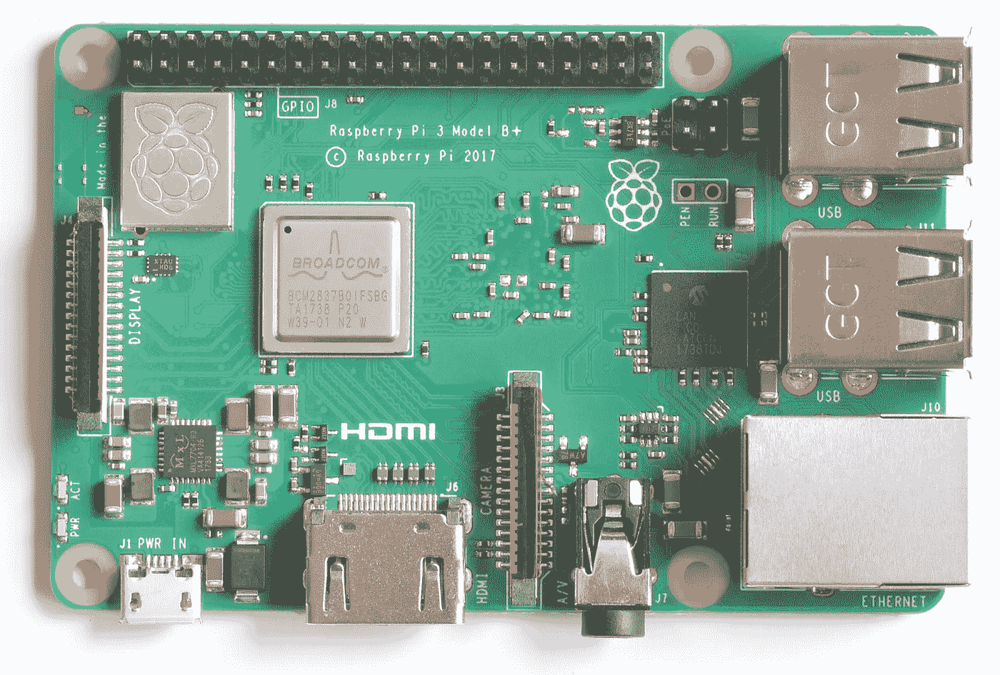
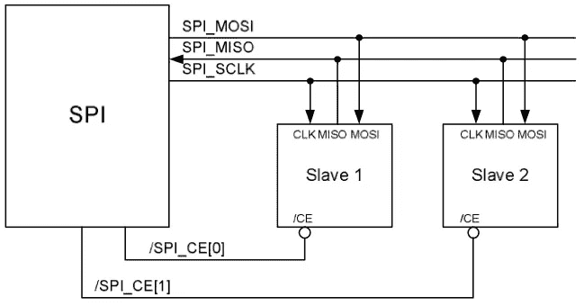
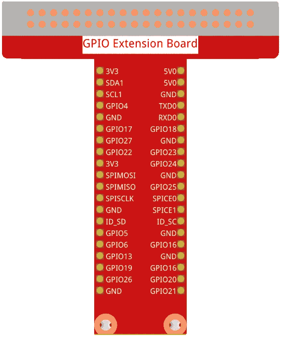
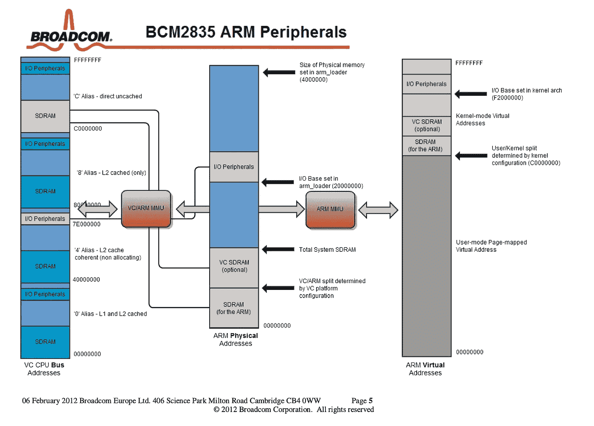
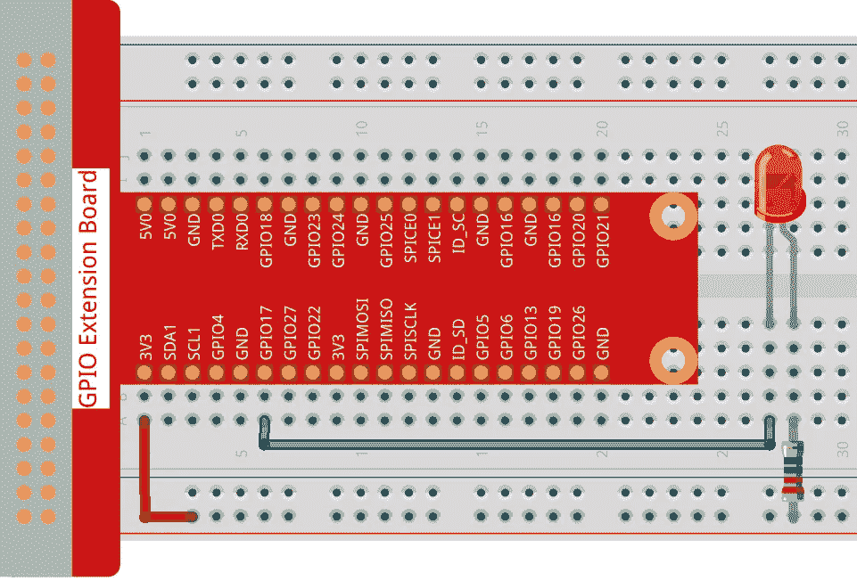

# raspberry Pi GPIO——Broadcom BCM 2835 ARM 外设编程简介

> 原文：<https://betterprogramming.pub/raspberry-pi-gpio-introduction-to-programming-broadcom-bcm2835-arm-peripherals-33e6d9423f98>

## 了解如何在 Raspberry Pi 上使用 BCM2835 的寄存器直接对其进行编程，以执行写入 GPIO 引脚或使用 SPI 等高级功能等任务



图片来源:RasPi.tv

# 概观

这是探索在 Raspberry Pi 3B+ 上进行 [GPIO 编程的系列文章的第六篇。它介绍了如何通过直接与 BCM2835 SoC(片上系统)上的适当寄存器交互来控制 GPIO 外设。这是一个简介，因为它仅涵盖其中一种功能，使用 BCM2835 ARM 外设指南](https://youngkin.github.io/categories/gpio/)的[第 6 节中描述的基本 GPIO 功能。这不包括 BCM2835 对串行外设接口(SPI)、脉宽调制(PWM)和内部集成电路(IC2)等协议的支持，这些协议通过利用映射到给定协议的底层引脚来覆盖特定的协议功能(例如，GPIO 引脚 8–11 与 SPI 协议相关联，并且具有针对该协议可以使能的行为)。也就是说，使用基本引脚级功能涵盖了利用 SPI 等高级协议功能所需的相同概念。本文，再加上](https://www.raspberrypi.org/app/uploads/2012/02/BCM2835-ARM-Peripherals.pdf) [BCM2835 ARM 外设指南](https://www.raspberrypi.org/app/uploads/2012/02/BCM2835-ARM-Peripherals.pdf)，将为驱动通过这些功能控制的设备提供足够的背景知识。

当然，还有多个库，如 C [BCM2835](https://www.airspayce.com/mikem/bcm2835/index.html) 和 [WiringPi](https://github.com/WiringPi/WiringPi) 库、Python [pgpio](http://abyz.me.uk/rpi/pigpio/) 和 [RPi。GPIO](https://pypi.org/project/RPi.GPIO/) 库和 Go [go-rpio](https://github.com/stianeikeland/go-rpio) 库使这变得更加容易。虽然这些库通常更适合大多数项目，但了解 BCM2835 SoC 如何工作以及这些库如何与 BCM2835 交互会有所帮助。如果您发现自己正在阅读库代码和/或想要为这些项目做出贡献，或者甚至编写自己的库，这种背景也是有帮助的。

本文假设您已经对 Raspberry Pi 上的 BCM2835 和 GPIO 编程有所了解。如果你没有，你可以考虑尝试一下我的其他 GPIO 文章中的项目。系列中最简单的文章是 [Raspberry Pi GPIO in Go 和 C —闪烁 LED](https://youngkin.github.io/post/sunfoundergpionotesled/) 。它演示了与本文相同的功能，使 LED 闪烁，但它也演示了 [WiringPi](https://github.com/WiringPi/WiringPi) 和 Go [go-rpio](https://github.com/stianeikeland/go-rpio) 库的用法。这是对在 Raspberry Pi 上使用 GPIO 的一个很好的介绍，但它只涵盖了基本的 GPIO 概念以及如何将试验板连接到 Raspberry Pi 的 GPIO 输出。

将涵盖以下主题:

1.  **先决条件** —描述本文所需的硬件和库。
2.  **BCM2835 GPIO 外设简介** —概述 BCM 2835 的架构和功能。
3.  **使用 BCM2835 板通过 GPIO 引脚控制 LED**—提供使用 BCM2835 GPIO 寄存器控制 LED 的详细信息，包括代码。
4.  **总结** —总结本文中涉及的重要概念。
5.  **参考文献** —提供了一个我认为有用的参考文献列表，其中一些在本文的创作中使用过。

# 先决条件

如果你没有，你需要一个树莓派。我在 Raspbian OS 的“拉伸”版本中使用了一个树莓派 3B+。如果您还没有树莓 Pi 并且需要帮助设置，请参见[如何从头设置新的树莓 Pi](https://projects.raspberrypi.org/en/projects/raspberry-pi-setting-up)。

接下来你需要一个[试验板](https://www.amazon.com/dp/B082KBF7MM/ref=sspa_dk_detail_4?psc=1&pd_rd_i=B082KBF7MM&pd_rd_w=1tGTV&pf_rd_p=887084a2-5c34-4113-a4f8-b7947847c308&pd_rd_wg=fX8JB&pf_rd_r=44DE0RS1E9FD42RBYC7R&pd_rd_r=47cbdc7f-7834-455f-9429-ef74a438bd45&spLa=ZW5jcnlwdGVkUXVhbGlmaWVyPUFVVkdZVUZRNUw3ODkmZW5jcnlwdGVkSWQ9QTA4MzI4MzYyU0VLNzBJM0cxRUVMJmVuY3J5cHRlZEFkSWQ9QTA0Mjk1NTMzSzNSWlNFUjU0NURBJndpZGdldE5hbWU9c3BfZGV0YWlsJmFjdGlvbj1jbGlja1JlZGlyZWN0JmRvTm90TG9nQ2xpY2s9dHJ1ZQ==)，一些[跳线](https://www.amazon.com/dp/B08HZ26ZLF/ref=syn_sd_onsite_desktop_19?psc=1&spLa=ZW5jcnlwdGVkUXVhbGlmaWVyPUExRFpLWElCRjg1MUNMJmVuY3J5cHRlZElkPUEwMjMyMTE1M01aOFE3U1BQS09YSiZlbmNyeXB0ZWRBZElkPUEwODE5NTMxMktEMTlZRjEyQjBJNiZ3aWRnZXROYW1lPXNkX29uc2l0ZV9kZXNrdG9wJmFjdGlvbj1jbGlja1JlZGlyZWN0JmRvTm90TG9nQ2xpY2s9dHJ1ZQ==)，[一个 220 欧姆的电阻，和一个 LED](https://www.amazon.com/Gikfun-Resistor-Experiment-Raspberry-Arduino/dp/B01G3FCMVA/ref=sr_1_19?keywords=220+ohm+resistor&qid=1648933499&sr=8-19) 。您还应该考虑使用一个带有 T 型适配器的 [40 引脚母对母，将 GPIO 输出连接到试验板上。您只能使用跳线，但适配器会使事情变得更容易，并有助于防止损坏 Raspberry Pi 上的 GPIO 引脚。如果您选择不购买带 T 型适配器的 40 针电缆，您需要购买](https://www.amazon.com/dp/B082PRVRYR/ref=sspa_dk_detail_2?psc=1&pd_rd_i=B082PRVRYR&pd_rd_w=8mKhr&pf_rd_p=887084a2-5c34-4113-a4f8-b7947847c308&pd_rd_wg=e9psa&pf_rd_r=S09F37DF2G5FW8B8GX4B&pd_rd_r=c065c120-e60b-45e9-b93b-f581f048cf46&spLa=ZW5jcnlwdGVkUXVhbGlmaWVyPUFCMzhUQ09COFI2VlMmZW5jcnlwdGVkSWQ9QTA5NjU2ODUxRDkxNEYwSTYwV09KJmVuY3J5cHRlZEFkSWQ9QTAxOTg1MTUyRUhEUlc2VzQ2VDQ4JndpZGdldE5hbWU9c3BfZGV0YWlsJmFjdGlvbj1jbGlja1JlZGlyZWN0JmRvTm90TG9nQ2xpY2s9dHJ1ZQ==)[公母跳线](https://www.amazon.com/SinLoon-Breadboard-Arduino-Circuit-40-Pack/dp/B08M3QLL3Q/ref=pd_sbs_7/143-0445142-7950409?pd_rd_w=sVLrc&pf_rd_p=8b76d7a7-ab83-4ddc-a92d-e3e33bfdbf03&pf_rd_r=CDM5TGJT03VKF0ZFB577&pd_rd_r=8e58fd82-8503-41cf-b8f2-c78eaeb78d25&pd_rd_wg=tT1U0&pd_rd_i=B08M3QLL3Q&psc=1)。然而，单独购买所有这些东西会比一套花费更多。[这里有一个简单的工具包，上面所有的](https://www.amazon.com/dp/B06WP7169Y/ref=sspa_dk_detail_5?psc=1&pd_rd_i=B06WP7169Y&pd_rd_w=OZVyf&pf_rd_p=887084a2-5c34-4113-a4f8-b7947847c308&pd_rd_wg=0V0IH&pf_rd_r=623YJTBQ2CN2B2GYXQG5&pd_rd_r=faa61f0f-3aec-4cf0-8e7e-d44eb1b3b92f&spLa=ZW5jcnlwdGVkUXVhbGlmaWVyPUEyUVlDQzMzVVZBMFYxJmVuY3J5cHRlZElkPUEwMzExNzk4MUhGSjFSS0VKTlBROCZlbmNyeXB0ZWRBZElkPUEwMzYwNjg2UUdMRU44N0YzNzIwJndpZGdldE5hbWU9c3BfZGV0YWlsJmFjdGlvbj1jbGlja1JlZGlyZWN0JmRvTm90TG9nQ2xpY2s9dHJ1ZQ==)。如果你想了解这个系列，我推荐你购买[sun founder Raspberry Pi Ultimate 初学者工具包](https://www.amazon.com/gp/product/B09BMVT4CB/ref=ppx_yo_dt_b_asin_title_o02_s00?ie=UTF8&psc=1)。


*图片来源:sun founder Ultimate Starter/Raphael 套件*

您需要一些基本的 C 编程知识，并且熟悉登录到 Raspberry Pi 终端，或者登录到一些操作系统版本附带的桌面 GUI。根据您采用的方法，您可能需要将键盘和显示器连接到 Raspberry Pi。我只是简单地进入 Pi。你需要熟悉如何使用像 Vi 或 nano 这样的编辑器。您还需要对 Linux 命令行有基本的了解。

最后，您需要克隆或派生[我的 GPIO 库](https://github.com/youngkin/gpio)，因为它包含用于访问 BCM2835 上 GPIO 功能的底层库代码。正如在其他章节中提到的，这个库代码基于迈克·麦考利开发的 [BCM2835 C 库](http://www.airspayce.com/mikem/bcm2835/index.html)。

# BCM2835 ARM 外设简介

本节概述 BCM2835 外设。它首先概述了各种类型的外设的功能。然后，它将概述 BCM2835 寻址。理解寻址是理解文章其余部分的基础。最后更详细地讨论了如何使用寄存器来访问外设及其相关的 I/O 功能。

这并不是对 BCM2835 的详尽描述。本文将详细讨论的唯一功能是与 GPIO I/O 功能的交互，即定义引脚的功能以及设置和清除引脚的值(例如，将其设置为高电平和低电平)，特别是对 BCM2835 GPIO 进行编程以使 LED 闪烁。

有多种引脚编号方案。Raspberry Pi 具有物理 pin 号码，即印刷在 Pi 板上的号码。BCM2835 有一个称为 GPIO 编号的编号方案。它与 Pi 的物理编号方案不同，也不兼容。最后，有些库，如 C WiringPi 库，有自己的编号方案，与 Pi 和 BCM2835 方案不兼容。本文仅使用 BCM2835 编号方案。有一个很好的[引脚排列图](https://pinout.xyz/)可以在这三种编号方案之间进行映射。其中一个引脚支持特定的 I/O 功能，如下所述，也在该引脚输出图上标出。

关于术语的快速说明…术语“外围设备”在本文的标题和某些部分使用。对我来说，外设这个术语有点用词不当。让我解释一下。BCM2835 最基本的 GPIO 功能是通过器件上的一组物理引脚实现的。其中一些引脚提供驱动 led、传感器和电机等外部设备所需的电源和接地。其他引脚可以通过编程控制，从这些外部设备获取输入或输出。在更高的层面上，GPIO 引脚子集支持完整的协议，实现更复杂的功能，如控制电机的速度和方向，以及控制显示文字的 LED 显示器，如高速公路标志中的文字。这些基本和更复杂的功能通过设置引脚的功能来控制。输入和输出是两个可以设置的功能。还有各种各样的其他将被涵盖。设置引脚的功能描述了 BCM2835 如何与器件或外设交互。正因为如此，我更喜欢用 I/O 函数这个术语。我认为这比“外设”一词更准确地描述了这个概念。对我来说，“外围设备”是外部设备。术语 **I/O 功能**的第一次使用是下一节的标题。

# 输入输出功能

BCM2835 支持各种 I/O 功能。这些是 [BCM2835 ARM 外设指南](https://www.raspberrypi.org/app/uploads/2012/02/BCM2835-ARM-Peripherals.pdf)的主题。本节将只详细描述其中的几个功能。还有其他来源，如维基百科，可以提供其他人的信息。

BCM2835 支持的主要 I/O 功能有:

*   GPIO
*   精力
*   脉宽调制（pulse-width modulating 的缩写）
*   补助的
*   理科学士
*   直接存储器存取
*   外部大众媒体控制器
*   中断
*   音频(PCM/I2s 音频)
*   系统记时器
*   通用非同步收发传输器(Universal Asynchronous Receiver/Transmitter)

由于我对前三种 I/O 功能(GPIO、SPI 和 PWM)有直接经验，本节将重点讨论这些功能。这将提供足够的背景知识，以便对 BCM2835 的功能有一个基本的了解，并利用下面的寻址和寄存器部分的信息来了解和使用其余的 I/O 功能。

## 通用输入/输出

GPIO 代表通用输入输出。在 BCM2835 ARM 外设指南中，术语 GPIO 指的是物理引脚的最通用或最基本的控制级别。这是用来控制引脚功能的，例如将其设置为输入或输出引脚，或者更高级的 I/O 功能，如 SPI 和 PWM。它还用于设置或获取 pin 的值。数值在概念上被称为高电平和低电平，但它们由通过引脚的电压或电压缺失来表示。引脚还有其他类型的设置。这些设置之一用于控制是否在引脚电压变化的上升沿或下降沿检测状态变化。另一种设置控制连接到每个引脚的所谓上拉/下拉电阻。当引脚电压处于不确定状态时，这些电阻用于明确控制引脚的值，1 或 0。本教程对为什么需要上拉和下拉电阻有一个合理的解释。

与本文相关的代码导致 LED 闪烁。实现这一点需要以下步骤:

1.  将引脚的功能设置为输出，即，为了向 LED 发送信号，它将被写入。
2.  向引脚写入低电平，使 LED 开启。
3.  中止
4.  向引脚写入高电平，使 LED 关闭。
5.  重复步骤 2 至 4。

实现这一点需要使用 GPIO I/O 功能。更准确地说，它使用 GPIO 寄存器来设置引脚的功能(例如输出)并控制外设(本例中为 LED)的行为。

## SPI(串行外设接口)

SPI 用于将数据串行发送到可以并行接受或要求数据的外设。这很有帮助，因为仅使用 3 个 GPIO 引脚就可以写入相对较大的一组并行输入，不包括电源(VCC)和地(GND)。如果不使用 SPI，每个并行输入需要一个 GPIO 引脚。这很容易被禁止，因为引脚是有限的资源。让我们通过一个例子来看看这是如何工作的。


图片来源:作者

上图显示的是 MAX7219 LED 点阵显示屏。它通常用于显示任意形状，如字母、数字和笑脸。它控制一个 8×8 的 led 矩阵。控制一个 LED 需要 1 个引脚，不包括电源或地。一个 8×8 的 LED 矩阵有 64 个 LED。这个数字远远超过标准 Raspberry Pis 上可用的 26 或 40 个 GPIO 引脚。如下所述，利用 SPI 需要的 GPIO 引脚要少得多。

MAX7219 具有以下输入引脚:

1.  DIN —这是串行数据输入引脚。
2.  CS —这通常称为片选(CS)或片使能(CE)引脚。
3.  CLK —此引脚连接到 Raspberry Pi 上的时钟引脚，用于同步 Raspberry Pi 和 MAX7219 之间的数据传输。

还有 2 个引脚不用于控制 MAX7219。

1.  VCC——这是电源输入引脚。它连接到 Raspberry Pi 上的电源，通常是 3.3v 电源。
2.  GND——这是接地引脚。它连接到 Raspberry Pi 的接地引脚。

从 Raspberry Pi 到 MAX7219 至少需要 3 个 GPIO 引脚，特别是 DIN、CS 和 CLK 引脚。Raspberry Pi 只需使用这三个引脚，就能以一种成本(引脚方式)高效的方式控制所有 64 个 led。通常的方法是使用 Raspberry Pi 引脚来驱动 DIN、CS 和 CLK 引脚。这 3 个引脚被命名为:

1.  (SPI)MOSI —这代表主机输出从机输入。MOSI 引脚将连接到 MAX7219 DIN 引脚，用于向 MAX7219(或任何 SPI 外设)发送串行数据信号。
2.  (SPI)SCLK —这些代表 SPI 时钟。此引脚将连接到 MAX7219 CLK 引脚。它用作同步 BCM2835 和 MAX7219(或任何 SPI 外设)之间数据传输的时钟信号源。当 MOSI 引脚和 SCLK 引脚都被设为高电平时，数据传输就会发生。
3.  (SPI)CS 或(SPI)CE——代表片选或片使能。无论哪种情况，将引脚设为低电平都会指示 MAX7219 接受数据，如前所述。

> 我很不情愿地使用“主人”和“奴隶”这两个词。然而，我在 SPI 上阅读的所有文档中都使用了这些术语。为了避免混淆，我将继续使用它们。

Raspberry Pi 的 SPI 功能可能需要多达 5 个 GPIO 引脚。这两个附加引脚是:

1.  (SPI)MISO —代表主机输入从机输出。此引脚允许 MAX7219(或任何 SPI 外设)将数据发送回 BCM2835。
2.  (SPI)CS 或(SPI)CE——这是第二个片选/片使能引脚。第二个 CS/CE 引脚允许 BCM2835 控制 2 个 SPI 外设。如上所述，当 CS/CE 引脚设为低电平时，SPI 外设将接受来自 BCM2835 的数据。因此，通过将一个 CS/CE 引脚设为高电平，另一个设为低电平，我们可以控制哪个从机可以接收和发送数据。文章[将多个 SPI 从器件与 Raspberry Pi](https://adikedia.com/2016/08/10/using-multiple-spi-slave-devices-with-wiringpi/) 配合使用提供了有关如何使用 2 个 CE/CS 引脚的更多信息。下图说明了这是如何实现的:



*图片来源:BCM2835 ARM 外设指南*

BCM2835 的主 SPI 接口 SPI0 通过 GPIO 引脚 7–11 实现。引脚 7 和 8 是 BCM2835 上可用的 2 个 CE/CS 引脚。引脚 9 是 MISO，10 是 MOSI，11 是时钟(SPICLK/SCLK)。BCM2835 有两个辅助 SPI 接口:SPI1(也称为 AUX_SPI0)和 SPI2(也称为 AUX_SPI1)。根据 BCM2835 ARM 外设指南，SPI1 位于引脚 16–21，SPI2 位于引脚 35–39。这些辅助接口可通过 AUX I/O 功能获得。

下图显示了一个常用于将 BCM2835 GPIO 引脚连接到试验板的 GPIO 扩展板。这些引脚标有 GPIO 引脚编号或它们支持的 I/O 功能(例如 SPI)。注意，SPI 引脚在电路板上使用与上述相同的术语进行标记:



图片来源:Sunfounder

除了 MAX7219 之外，SPI 还可以用来控制各种外设来显示图像，从触摸屏接收输入，并与各种传感器进行交互。[维基百科有一篇很好的文章](https://en.wikipedia.org/wiki/Serial_Peripheral_Interface)更详细地描述了 SPI。

我的文章标题为[Raspberry Pi GPIO——使用 SPI 在 MAX7219 点阵显示模块上显示任意图案](http://youngkin.github.io/post/spidotmatrixmodule/),详细介绍了 SPI I/O 功能以及如何对其进行编程。与本文类似，它还详细介绍了如何使用 BCM2835 上的相关寄存器直接对 BCM2835 进行编程，但针对 SPI 而不是通用 GPIO I/O 功能。通过阅读该文章，您将更深入地了解如何使用 BCM2835 寄存器对 BCM2835 支持的 I/O 功能进行编程。

## 脉宽调制

PWM 用于将 BCM2835 产生的数字信号转换为模拟信号。从某种意义上说，它不是真正的模拟信号。它仍然是一个数字信号，但它的周期如此之快，就像视频一样，看起来像是一个模拟信号。许多外设，如电动机、可调光 led 和彩色 led，都需要模拟信号。与 SPI 一样，可以使能专用引脚来利用 PWM I/O 功能。这些是 GPIO 引脚 12、13、18 和 19。通过这些引脚，BCM2835 支持硬件 PWM。BCM2835 内置 PWM 功能。它实现了一个基于硬件的时钟环路，控制模拟信号的频率。可以使用其他 GPIO 引脚进行 PWM，这称为软件 PWM。然而，在软件 PWM 中，时钟环路是在 Raspberry Pi CPU 上运行的代码中编写的。因为 CPU 正在做许多其他事情，所以不可能产生可靠的时钟信号。这可能会导致一些不良的副作用，例如闪烁的 LED 代替了暗淡的 LED。参见我的文章 [Raspberry Pi GPIO in Go 和 C — RGB LED](https://youngkin.github.io/post/sunfoundergpionotesrgbled/) 和[dummy 的脉冲宽度调制](https://youngkin.github.io/post/pulsewidthmodulationraspberrypi/)，了解更多关于 PWM 的信息以及使用中的 PWM 示例。

# 演说

所有 GPIO I/O 功能都是通过寄存器访问的。这些寄存器位于片上存储器的不同偏移位置。访问寄存器需要了解 BCM2835 和 Raspberry Pi 的寻址方式。这是来自 [BCM2835 ARM 外设指南](https://www.raspberrypi.org/app/uploads/2012/02/BCM2835-ARM-Peripherals.pdf)第 1.2.1 节的图表，显示了存储器如何从 Pi 的物理地址映射到 BCM2835 地址。



*BCM2835 寻址:图像信用 BCM2835 ARM 外设指南*

Raspberry Pi 将 BCM2835 存储器映射到 Pi 的物理地址`0x2000 0000`。这显示在标有“ARM 物理地址”的中间一栏中。标有 I/o 外设的灰色阴影区域是 BCM2835 外设(如 GPIO 引脚)的 Pi 物理存储位置。向左移动，你会看到一个标有“VC/ARM MMU”的金色盒子。这是负责将 Pi 的物理内存映射到 BCM2835 内存的[内存管理单元](https://en.wikipedia.org/wiki/Memory_management_unit)。沿着中间一列的“I/O 外设”分区的线，通过 VC/ARM MMU，到最左边一列的“VC CPU 总线地址”,通向 BCM2835 的 CPU 地址总线上的“I/O 外设”分区。它的地址是`0x7E00 0000`。

I/O 外设地址可以通过两种方式之一提供给应用程序。传统的方法是通过安装在文件系统上的`/dev/mem`设备。访问此设备需要 root 权限。从 Raspberry Pi 2 开始，一种更新的方法变得可用。该方法通过`/dev/gpio`访问 I/O 外设地址。使用这种方法的一个优点是它不需要 root 访问权限。使用这种方法的缺点是只能访问 BCM2835 的 GPIO I/O 功能。这意味着 PWM 和 SPI 等高级功能不可用。使用`/dev/mem`访问 I/O 外设也需要更多的工作，即将物理内存从`/dev/mem`映射到应用程序的虚拟内存。这将在后面详细介绍。

> 还有第三种方式与 GPIO 寄存器接口。对于 SPI，有 2 个器件(通常在许多 Raspberry Pi 型号上提供)，`/dev/spidev0.0`和通过`ioctl()`的`/dev/spidev0.1`。这种方法不在本文讨论范围之内。

# 登记

如上所述，通过 BCM2835 上的寄存器来指定一个或一组引脚的 I/O 功能。每个 I/O 功能都有一个相关的寄存器集，位于 BCM2835 的 I/O 外设地址空间内的某个偏移量处。例如，GPIO 寄存器组从 CPU 总线地址`0x7E20 0000`开始。SPI 寄存器组从 CPU 总线地址偏移`0x7E20 4000`开始。PWM 寄存器组从偏移量`0x7E20 C000`开始。等等，每个 I/O 函数都有自己的一组寄存器来管理它的行为。也就是说，它们的工作原理都是一样的。也就是说，找到每个 I/O 功能的寄存器组的开始的偏移量，然后在适当的偏移量设置(或获取)适当的位来控制行为。为了使这个例子更清楚，并突出更多的细节，让我们做一个如何控制 GPIO 引脚使 LED 闪烁的高级演练。

如前所述，GPIO 寄存器从总线地址`0x7e2000 0000`开始。从第 90 页开始的 [BCM2835 ARM 外设指南](https://www.raspberrypi.org/app/uploads/2012/02/BCM2835-ARM-Peripherals.pdf)的第 6.1 节提供了有关 GPIO 寄存器的详细信息。要使 LED 闪烁，我们首先需要指定引脚的功能，在这种情况下是输出，然后在高低之间切换 LED 的值。

## 指定引脚的功能

首先，需要设置引脚的 I/O 功能。引脚的功能通过 8 个可选功能之一来定义。对每个函数进行编码需要 3 位，000–111。这些位包含在所谓的 GPIO 功能选择寄存器中。每个寄存器的长度为 32 位。因此，每个 32 位寄存器可以控制 10 个引脚，剩余 2 位。为了控制所有的 GPIO 引脚，有 6 个功能选择寄存器。如果支持，BCM2835 可以通过功能选择寄存器控制多达 54 个引脚(在 Raspberry Pi 3B+上只有 40 个引脚可用)。支持 54 个引脚，每个寄存器 10 个引脚，需要 6 个寄存器。第一个功能选择寄存器位于`0x7E20 0000`，从 GPIO 寄存器组的开始处零偏移。第 6 个功能选择寄存器从偏移量`0x7E20 0014`开始。这 8 个可选功能是:

*   输入—由位模式`000`表示
*   输出—由位模式`001`表示
*   以及分别由位模式`010`到`111`表示的交替功能 0 到 5。

在本例中，我们将引脚 17 用作输出引脚。查看 BCM2835 ARM 外设指南，我们看到引脚 17 位于功能选择寄存器 1(也称为 GPFSEL1)中。GPFSEL1 位于偏移量`0x7E20 0004`。寄存器中引脚 17 的功能选择失调位于第 21-23 位。回想一下，输出位模式是`001`,因此我们需要将该位模式放在位 21-23 中。在下面的编码部分，我们将看到这是如何实现的。

## 设置 pin 值

本文假设引脚 17 连接到 LED 的接地端子(阴极)。这意味着我们必须将引脚设置为低电平，以便电流从电源输入端流向阳极，通过引脚 17 到达 LED 地，点亮 LED。将引脚设为高电平将导致 LED 关闭。在高低之间切换会导致 LED 闪烁，这正是我们所期待的。

GPIO 引脚值通过 GPIO 引脚输出设置寄存器控制。有 2 个 GPIO 引脚输出设置寄存器。引脚 17 在第一个寄存器中，GPIO 引脚输出设置 0，也称为 GPSET0，位于 GPIO 寄存器偏移量`0x7E20 002C`。引脚 17 位于 GPSET0 内的位偏移 17 处。将位 17 设为 1 会将寄存器设为高电平。GPIO 引脚输出设置寄存器只能将一个引脚设为高电平，将一个引脚设为 0 不起作用。但是回想一下，我们需要将引脚设置为低电平。既然在 GPSET0 中设置一个引脚不会导致引脚被设置为低电平，我们该如何实现呢？原来还有另一组 GPIO 寄存器，称为 GPIO 引脚输出清零寄存器。这些用来设置一个引脚的值为低。引脚 17 在 GPIO 引脚输出清零寄存器 0(也称为 GPCLR0)中，从偏移量`0x7E20 0028`开始。它在寄存器中的位置也是在第 17 位。将位 17 设为 1 会将引脚设为低电平。因此，我们需要将一个`1`向左移动到第 17 位，以便打开 LED。我们将使用 GPSET0 关闭 LED。与指定引脚的功能一样，如何完成这一点将在本文后面介绍。依次使用 GPCLR0 和 GPSET0 寄存器，我们可以使 LED 闪烁。

## 其他 GPIO 设置

除了选择功能和设置/清除引脚值之外，GPIO 寄存器集还可以用来控制 GPIO 引脚的许多其他功能。它也可以用来读取一个引脚的值。如上文“I/O 功能”部分所述，可以管理的其他事项包括指定如何检测状态变化(上升/下降沿检测)以及如何在引脚处于不确定状态时设置其电压(上拉/下拉电阻)。讨论这些寄存器是一个高级主题，超出了本文的范围。

# 设置和代码

本节从一个使 LED 闪烁的程序开始。它相当简单，将显示 BCM2835 编程所需的基本步骤。本节的下一部分将更详细地介绍 BCM2835 编程。但在此之前，先来看看如何连接试验板，使其与闪烁的 LED 示例一起工作。



*图片来源:Sunfounder*

试验板的接线应该如上图所示。注意，LED 的(弯曲的)长引线(阳极)通过电阻器连接到 3.3 伏电源引脚，阴极(或地)连接到 GPIO 引脚 17。如果你不熟悉试验板和试验板图，这个[试验板教程](https://www.sciencebuddies.org/science-fair-projects/references/how-to-use-a-breadboard)应该会有帮助。

本节将首先描述使 LED 闪烁的主程序。之后，将详细介绍与 BCM2835 交互的代码如何控制 I/O 功能。

本文中的所有代码都可以在 [my gpio repository](https://github.com/youngkin/gpio/tree/main/ledblink) 的`ledblink`目录中找到。

# 控制 LED —主程序

包含该代码的文件的代码可以在`[gpio/ledblink/blinkinglednolib.c](https://github.com/youngkin/gpio/blob/main/ledblink/blinkinglednolib.c)`找到。

第一段代码展示了几件重要的事情:

1.  第 1 行给出了编译和链接程序的命令。
2.  第 3 行提供了导入直接与 BCM2835 交互的 BCM2835 函数所需的包含指令。
3.  第 8 行定义了用于控制 LED 的 BCM GPIO 引脚。它符合上面的接线图。

这个代码片段声明了一个中断处理程序，用于优雅地退出程序。这确保了引脚和 LED 处于已知状态。中断处理程序的定义将在后面给出。

这个代码片段显示了 main 函数的开始。

**第 3 行**注册 SIGINT 信号的中断处理程序(即 ctrl-C)。

**第 5–10 行**初始化 BCM2835 GPIO 功能。简而言之，它在主存储器中找到 GPIO 外设的偏移量和长度，并将其映射到`/dev/mem`，这样就可以在程序中安全地访问它。然后，它将变量设置为各种功能寄存器(如 GPIO 或 SPI)的偏移量。如果初始化失败，程序退出。下面将更详细地描述`bcm_init()`功能。

**第 13 行**将`LEDPIN`设置为 GPIO 输出功能。这允许程序将值(高或低)写入引脚。下面将更详细地描述`bcm_gpio_fsel()`功能。

这个代码片段实现了程序的主要功能。**第 2–10 行**使 LED 闪烁。

**第 5 行和第 8 行**通过调用`bcm_gpio_write()`设置`LEDPIN`的值，并将引脚的值设置为`LOW`打开 LED，或`HIGH`关闭 LED。`LOW`关闭 LED，因为连接 BCM GPIO 引脚 17 和 LED 的导线连接到 LED 的接地引脚。要让电流流过，引脚必须设置为 0 伏。同样，`HIGH`关闭 LED。`bcm_gpio_write()`将在下面更详细地描述。

**第 6 行和第 9 行**导致程序休眠 500 毫秒，因此可以观察到 LED 闪烁。

如注释所述，**第 13 行**释放`bcm_init()`获得的 GPIO 资源。这也会将 GPIO 系统设置回已知状态。`bcm_close()`将在下面更详细地描述。

这个代码片段定义了中断处理函数。**3、4 线**先关闭 LED，然后释放`bcm_init()`获得的 GPIO 资源。

# 控制 LED —与 BCM2835 交互

本节描述代码如何与 GPIO 外设交互并控制它们，特别是设置与 BCM 2835 I/O 功能相关的各种寄存器的值。设置寄存器值用于控制 GPIO 外设，读取寄存器值允许访问相关 GPIO 外设的当前状态。

这个部分的代码可以在[我的 gpio 库](https://github.com/youngkin/gpio)的 [bcmfuncs.c](https://github.com/youngkin/gpio/blob/main/ledblink/bcmfuncs.c) 中找到。[头文件可以在 bcmfuncs.h](https://github.com/youngkin/gpio/blob/main/ledblink/bcmfuncs.h) 中找到。

## bcm_init()

上面关于寄存器的部分提到，BCM2835 外设上的所有操作都是通过操作与该类型外设相关的寄存器来完成的。`bcm_init()`的目的是确定所有类型寄存器的地址偏移量，如 GPIO、PWM、SPI 等。以便可以控制它们的相关外围设备。

这个代码片段显示了`bcm_init()`函数的开始。

**第 10 行**打开`BCM_RPI2_DT_FILENAME`。如注释所示，`fopen()`调用中的`rb`打开一个二进制文件进行读取。`BCM_RPI2_DT_FILENAME`在相关的`bcmfuncs.h`头文件中定义。它的值是`/proc/device-tree/soc/ranges`。如 [Linux 和设备树](https://www.kernel.org/doc/html/latest/devicetree/usage-model.html)中所述，

> 操作系统使用设备树在运行时发现硬件的拓扑结构，从而支持大多数可用的硬件，而无需硬编码信息(假设驱动程序可用于所有设备)。

设备树包含的信息之一(对我们的目的很重要)是 BCM2835 物理地址空间中 I/O 外设分区的位置和长度。下面是树莓派 3B+上`/proc/device-tree/soc/ranges`内容的十六进制转储:

```
pi@pi-node1:/ $ hexdump -C /proc/device-tree/soc/ranges
00000000  7e 00 00 00 3f 00 00 00  01 00 00 00 40 00 00 00  |~...?.......@...|
00000010  40 00 00 00 00 00 10 00                           |@.......|
00000018
```

我们将在下一个代码片段中引用它。根据[devicetree.org](https://www.devicetree.org/specifications/)，在[device tree 规范](https://github.com/devicetree-org/devicetree-specification/releases/download/v0.4-rc1/devicetree-specification-v0.4-rc1.pdf)v 0.4-rc1 中，`soc/ranges`属性定义如下:

> ranges 属性提供了一种定义总线地址空间(子地址空间)和总线节点父地址空间(父地址空间)之间的映射或转换的方法。ranges 属性的值的格式是任意数量的三元组(子总线地址、父总线地址、长度)

在 I/O 外设地址块的情况下，如上述[寻址部分](https://youngkin.github.io/post/gpioprogramming/#addressing)所述，*“子总线地址”*是指*“VC CPU 总线地址”*内存空间中的*“I/O 外设”*地址块。*“母总线地址”*是指*“ARM 物理地址”*块中的*“I/O 外设”*地址块。*的“长度”是指*【I/O 外设】*地址块的实际长度。Raspberry Pi 3B+具有 32 位地址空间，因此三元组中的每个值都是 32 位或 4 个字节。*

*下一段代码使用来自`/proc/device-tree/soc/ranges`的数据找到 I/O 外设块的*父总线地址*和*长度*。回想一下，父总线地址是三元组中的第二个条目，它也定义了子总线地址和长度。**第 1 到 4 行**将*母总线地址*的内容，即`buf`偏移量 4 到 7 处的字节，移入`base_address`。`3F`被移入`base_address`的高位字节。剩余的`buf`单元同样从左(最高有效字节)到右(最低有效字节)移位到`base_address`。换档完成后，`base_address`将被设置为`0x3F000000`。回头看看上面[寻址部分](https://youngkin.github.io/post/gpioprogramming/#addressing)中的图表，你会注意到它与 *I/O 外设*地址块中`0x20000000`的基址不匹配 *ARM 物理地址*。这是因为寻址部分中的图表是针对 Raspberry Pi 1 的。这种偏移在 Raspberry Pi 型号 2 & 3 中有所不同。在 Raspberry Pi 4 模型中又有所不同。*

*继续，以与`base_address`类似的方式，**线 6 至 9** 通过从`buf`偏移 8 至 11 移动到`peri-size`获得*长度*。对于树莓派 3B+，`0x01000000`是地址块的预期长度。*

*下一个代码片段完成了从`/proc/device-tree/soc/ranges`获取寻址信息。具体来说，它验证了*“子总线地址”*和*“父总线地址”*具有预期值。回想一下，*“子总线地址”*是地址/长度三元组的第一个值，`buf`偏移量 0 到 3。第 1 行到第 6 行执行以下操作:*

1.  ***行 1 到 4** 验证`buf`、*子总线地址*的前 4 个字节是否为`0x7E000000`，如*“VC CPU 总线地址”*内存空间中的*、【I/O 外设】*地址块所定义。*
2.  ***第 5 行**验证*父总线地址*、`base_address`是否与 Raspberry Pi 模型 1 到 4 的预期基址之一相匹配。*

***第 7 行和第 8 行**然后将 *I/O 外设*地址块的基址和长度设置为将在程序其余部分使用的变量。这一行的重要之处在于，它将源变量转换为目标变量所期望的类型。*

*下一段代码将 BCM2835 的*“I/O 外设”*地址块映射到`/dev/mem`的*“ARM 物理地址”*内存空间中，以便它可以安全地用于程序中。*

***第 1 行**首先检查运行程序的用户是否以 *root* 身份运行(或者是 *root* 用户或者是 *sudo* )。否则，`/dev/mem`装置不能使用。`/dev/mem`提供对 CPU 内存的无限制访问。因为这显然是一件危险的事情，所以它的使用仅限于*根*。您可能还记得[寻址部分](https://youngkin.github.io/post/gpioprogramming/#addressing)，还有一个`/dev/mem`、`/dev/gpio`的替代方案。这将在本节的后面部分显示。*

***线 4** 打开`/dev/mem`准备映射操作。*

***第 13 行**将`bcm_peripherals`变量分配给 *I/O 外设*地址块的偏移量和长度`bcm_peripherals_base`和`bcm-peripherals_size`。这种映射有效地限制了程序对物理存储器的 *I/O 外设*地址块的访问。*

*下一段代码计算各种类型寄存器(例如 GPIO、PWM、SPI 等)的失调。每个偏移量都相对于`bcm_peripherals`的值，它是前面代码片段中`mapmem()`操作的结果。因此，要获得像 GPIO 寄存器组这样的寄存器组的地址，我们需要将`BCM_GPIO_BASE`加到`bcm_peripherals`基址上。但是您可能已经注意到，在将这些偏移量添加到`bcm_peripherals`之前，代码会将它们除以 4。这些被指定为整数的偏移量，例如`BCM_GPIO_BASE`，指向特定的字节地址，即在 8 位边界处。`bcm_peripherals`被指定为`uint32_t*`，一个指针。你不能天真地给指针加一个整数。您可能还记得，指针算法是基于相关变量的类型大小来操作指针变量的。对于`unint32_t`，它们的大小是 32 位或 4 字节。将一个`uint32_t`指针加 1 将导致该指针指向下一个`uint32_t`，从当前位置开始 4 个字节。天真地将像`BCM_GPIO_BASE`这样的偏移量添加到`bcm_peripherals`会导致`bcm_peripherals`指向内存中比当前位置晚 4 秒的位置，而不是我们想要的比当前位置晚 1 秒的位置。这就是为什么像`BCM_GPIO_BASE`这样的每个寄存器类型偏移在加到`bcm_peripherals`之前要除以 4。*

> *如果你是 C 语言的新手，你可能不知道指针算法本身是危险的。很难确切知道指针运算的结果是指针将引用什么。指针可能是意外的类型或具有意外的值。这可能会导致难以调试的意外行为。在某些情况下，例如执行除法，指向包含零值的意外位置将导致程序突然结束(出现分段错误)。这很好，这样你就知道出了问题，甚至知道问题出在哪里。指针甚至可能指向程序地址空间之外，这可能导致系统崩溃。然而在我们的例子中，寄存器位置和相关类型是众所周知的，使用指针是相对安全的。也就是说，只要我们正确地执行指针算法…*

## *bcm_fsel()*

*`bcm_fsel`负责设置与给定管脚相关的 I/O 功能。总共有 8 种功能可用。其中一个定义了相关联的管脚将被设置为输入管脚，这意味着它将被读取。另一个函数将相关联的引脚定义为输出引脚，这意味着该引脚将被写入。其余 6 个被称为“备用功能”，并被赋予类似“备用功能 0”的名称。为各种备用功能分配的 I/O 功能因各种 GPIO 引脚而异。例如，将 BCM GPIO 引脚 17 设置为备用功能 4 可将其 I/O 功能定义为 SPI。它实际上将该引脚定义为 SPI 功能的一个特定子集，称为芯片使能或芯片选择，但这是后续文章的主题。回想一下，在上面的`main()`中，函数被设置为`BCM_GPIO_FSEL_OUTP`，它将引脚 17 定义为输出引脚。*

*尽管这个函数很短，但它还是有很多内容。*

***第 1 行**将函数定义为采用两个参数`pin`和`mode`。很明显`pin`是要分配功能的引脚。`mode`是与`pin`关联的 I/O 功能。`mode`实际上是分配给特定寄存器偏移量的位模式。位模式分配在第 6 节 **GPIO** 的[BCM 2835 I/O 外设数据表](https://www.raspberrypi.org/app/uploads/2012/02/BCM2835-ARM-Peripherals.pdf)中定义。模式定义如下:*

```
*000 = GPIO Pin X is an input
001 = GPIO Pin X is an output
100 = GPIO Pin X takes alternate function 0
101 = GPIO Pin X takes alternate function 1
110 = GPIO Pin X takes alternate function 2
111 = GPIO Pin X takes alternate function 3
011 = GPIO Pin X takes alternate function 4
010 = GPIO Pin X takes alternate function 5*
```

*要理解该函数的其余部分，还需要一些额外的背景知识。首先，[BCM 2835 I/O 外设数据手册](https://www.raspberrypi.org/app/uploads/2012/02/BCM2835-ARM-Peripherals.pdf)第 6 节显示，共有 54 个 GPIO 引脚可通过功能选择寄存器(GPFSEL0-GPFSEL5)寻址。每个功能选择寄存器的长度为 32 位。由于上述每个功能选择模式都是 3 位长，每个功能选择寄存器可以指定 10 个引脚的 I/O 功能，剩余 2 位。每个寄存器 10 个引脚，总共 54 个引脚解释了为什么有 6 个功能选择寄存器，编号为 0 到 5。下面的数学公式就是从这些信息中推导出来的。*

***第 3 行**定义将根据`mode`设置的位的寄存器偏移量`paddr`。`BCM_GPFSEL0`是功能选择寄存器的基址偏移量，以字节为单位。下面是对这一行中执行的算法的解释。*

1.  *请注意，正在执行指针运算。回想一下，指针算法的结果是基于目标变量的类型的(参见上面的`bcm_init()`部分)。由于`uint32_t`的长度为 4 字节，因此`BCM_GPFSEL0`需要除以 4 才能正确计算出来。于是`... paddr = bcm_gpio + BCM_GPFSEL0/4 ...`。*
2.  *此外，回想一下，每个寄存器保存 10 个引脚的功能选择信息。对于给定的引脚，我们需要确定哪个功能选择寄存器(GPFSEL0 至 GPFSEL5)指定给定引脚的 I/O 功能。在 C #中，产生分数的整数除法的结果将被向下舍入。因此，如果我们将引脚数除以 10，`(pin/10`，我们将得到正确功能选择寄存器的偏移。因此，引脚 9 将导致`9/10`等于 0，这意味着引脚 9 的功能选择位置在 GPFSEL0 中。同样，引脚 17 的`17/10 = 1`功能选择寄存器是 GPFSEL1。诸如此类。*

*综上所述，等式`paddr = bcm_gpio + BCM_GPFSEL0/4 + (pin/10)`得出适合给定`pin`的功能选择寄存器偏移。对于引脚 17，这将导致`paddr`逻辑指向地址`0x7E20 0004`处的 GPFSEL1，`7E`是总线地址，`20004`是 GPIO 寄存器的偏移量加上 GPFSEL1 的偏移量，`4`，从 GPIO 寄存器组开始。我说逻辑上是因为`bcm_gpio`是从作为`mmap()`操作结果返回的地址的偏移。`mmap()`返回一个指向进程虚拟内存的指针，而`0x7E20 0004`是 BCM2835 的 *VC CPU 总线地址*空间中的一个地址。*

***第 4 行**计算给定引脚的功能选择值在功能选择寄存器中的位置。由于我们将使用位移位来设置引脚的功能选择值，因此该位置成为**位移位**的位数，引脚的功能选择值在`mode`参数中提供。为了进行计算，我们首先需要找到引脚的逻辑位置，即功能选择寄存器中的哪个 3 位单元(回想一下，每个功能选择值都是 3 位长)。对此的计算由`shift = (pin % 10) ...`给出。用于销 17 `(pin % 17) = 7`。因此，引脚 17 的 3 位单元位于第 7 个 3 位偏移处。接下来，我们必须找到寄存器中的实际位偏移。由于每个功能选择值为 3 位长，每个引脚的边界是 3 的倍数，因此完成了`shift = (pin % 10) * 3`的计算。对于引脚 17，这导致`(17%10)*3`等于`7*3`，从而导致绝对位偏移为 21。查阅第 92 页的 BCM2835 I/O 外设数据手册第 6 节，我们可以确认 GPFSEL0 寄存器中引脚 17 的偏移位于位 21 至 23。*

*现在我们来看看**第 5 行**。当将位的子集设置为给定值时，我们希望保留周围位的值。使用掩模来实现这一点。掩码包含一个(或多个)位，该位位于目标值中我们要更改的位的位置。例如，在位模式`0101 1111`中，如果我们想要将位 6 的值从 1 设置为 0，我们只需要定义一个位序列，其中设置了 1 位。为了创建最通用的解决方案，我们只需设置最低有效位。因为我们只需要一个位组，我们将掩码定义为十六进制数`0x1`，它指定了位模式`0000 0001`。接下来，我们需要根据需要移动该位模式，以便将`1`位移动到正确的位置。在我们的例子中，由于我们想改变第 6 位，我们将把掩码模式左移 6 位，例如`newMask = 0000 0001 << 6`。这导致`newMask`等于`0100 00000`，这将`1`位放置在我们期望的位置 6。我们可以直接将掩码定义为`0100 0000`，但这不会产生一个通用的解决方案，该方案适用于在任意位位置(如 21-23 位)设置位所需的任何掩码。*

*如`bcmfuncs.h`所示，`BCM_GPIO_FSEL_MASK`的值为 0x7 或`0000 0111`，这是因为每个 GPIO 功能选择模式的长度为 3 位。因此，对于屏蔽 3 位序列，这是一个有用的位模式。如果我们按照上面第 4 行的计算，将这个模式移位 21 的**移位**，我们将得到一个 32 位的模式，看起来像这样，`0000 0000 1110 0000 0000 0000 0000 0000`。该掩码现在位于位位置 21-23，这是 GPFSEL1 功能选择寄存器中引脚 17 的功能选择模式的位置。*

*总之，**行 5** 创建设置 3 位功能选择模式所需的屏蔽，如所提供的`pin`参数中的`mode`参数所指定。*

***第 6 行**创建新的 3 位值，该值将被放入 GPFSEL1 寄存器。回想一下，GPFSEL1 是一个 32 位寄存器。为了使用诸如`mode`的 3 比特值在任意位置(例如，比特 21-23)设置 3 比特序列，我们创建一个值掩码，该值掩码将期望位置的比特设置为期望的值。与上面的掩码一样，最通用的解决方案规定这些位从最低有效位置开始设置。假设在我们的示例中，我们希望将引脚 17 设置为备用功能 1。查看上面的位模式，我们可以看到备用功能 1 的 3 位值是`101`。`mode`参数将包含这个值。为了将引脚 17 设置为备用功能 1，我们需要将`0000 0101`的`mode`位模式左移 21 位。与第 5 行一样，第 6 行以一种通用的方式做到了这一点，`value = mode << shift`。给定我们的值`mode`和计算的值`shift`，我们得到`0000 0000 1010 0000 0000 0000 0000 0000`的 32 位`value`。*

*现在我们有了计算 GPFSEL1 寄存器新值所需的 4 个变量，`paddr`、`mode`、`mask`和`value`。*

***第 7 行**调用函数`bcm_peri_set_bits()`完成该操作。该操作在一个单独的函数中完成，因为还有其他寄存器值需要设置，我们将在后面看到。*

## *bcm_peri_set_bits()*

*`bcm_peri_set_bits()`是使用如上所述的`mask`在位置`paddr`将 32 位序列`v`设置为新值`value`的功能。和`bcm_fsel()`一样，这个函数只用了几行代码就完成了很多工作。*

***第 3 行**使用`bcm_peri_read()`读取位于`paddr`的 32 位值`v`。稍后将详细介绍。*

***第 4 行**将`v`设置为新值。回想一下，使用掩码时，可以设置一部分位，而其余位保持不变。第 4 行分 3 步完成。首先，它在当前值`v`和掩码的补码之间进行位与运算`&`。以上一节中的`BCM_GPIO_FSEL_MASK`为例，其位值(为简洁起见，只有位位置 16 和 23)从`... 1110 0000 ...`反转到`... 0001 1111 ...`。当在求反后的`mask`和`v`之间发生位与时，如在`(v & ~mask)`中，只有原始值`v`的位 21-23 被修改，位 21-23 被重置为`0` s。其余位不变。如果`v`的位 16-23 最初被设置为`... 0100 1010 ...`，位 16-23 的新值现在将看起来像`... 0000 1010 ...`。在我们的示例中，引脚 17 的功能选择位已重置为零。请注意，位置 16 至 20 的位保持不变。*

*下一个操作`(value & mask)`仅保留新值`value`的位置 21-23 处的比特值，将剩余比特设置为`0`。`value`的第 16-23 位是`... 1010 0000 ...`,指定引脚 17 将被设置为替代功能 1。操作`... 1010 0000 ... & ... 1110 0000 ...`的结果是`... 1010 0000 ...`，这是意料之中的。该操作被指定为`(value & mask)`，因为我们不能提前说只有位 21-23 将被复位到`value`。`value`和`mask`都可以在其他位置设置位。*

*综上所述，第三步也是最后一步，`(v & ~mask) | (value & mask)`将对两个结果进行“或”运算，`... 0000 1010 ... | ... 1010 0000 ...`将导致`v`被重置为`... 1010 1010 ...`。请记住，只有 21-23 位发生了变化。这在这里由保留其先前值的位 16-20 示出。同样，`v`的其他部分将保持不变。*

***第 5 行**通过`bcm_peri_write()`将`paddr`的 32 位设置为`v`。稍后还会有更多的介绍。*

## *bcm_peri_read()*

*`bcm_peri_read()`将从`paddr`开始读取 32 位，并将它们作为 32 位值返回给调用者。与`bcm_fsel()`和`bcm_peri_set_bits()`不同，该功能非常简单。*

***第 4 行和第 6 行**同步对内存的访问，这样读取就不会被中断。*

***第 5 行**简单地将返回值`ret`设置为位于`paddr`的内容。*

## *bcm_peri_write()*

*`bcm_peri_write()`将从`paddr`开始的 32 位写入`value`中包含的值。像`bcm_peri_read()`这个功能挺简单的。*

***第 3 行和第 5 行**同步访问(锁定)从`paddr`开始的 32 位。*

***第 4 行**将位于`paddr`的 32 位设置为`value`。*

## *bcm_gpio_write()*

*`bcm_gpio_write()`将 32 位`value`写入指定的`pin`。它使用了两个辅助函数，`bcm_gpio_set()`和`bcm_gpio_clr()`。参数`on`用于指定`pin`的`value`是否应该设置或清除。有一组 4 个 GPIO 寄存器:GPSET0 和 GPSET1，以及 GPCLR0 和 GPCLR1，用于指定引脚的值是高还是低。高电平对应于 GPSETn。低电平对应 GPCLRn。当`on`的值为`1`时，与`pin`的值相关联的 GPSETn 寄存器被设置为 1。如果`on`被设置为`0`，则与`pin`的值相关联的 GPCLRn 寄存器被设置为 1。GPSETn 的值仅在引脚的 I/O 功能设置为输出时使用。GPCLRn 的值同样仅在引脚的 I/O 功能设置为输出时使用。这些寄存器中`0`的值被忽略。回想一下，BCM2835 允许为 54 个引脚指定 GPIO 功能(预期为 40 个)。由于每个引脚需要 1 位来指定是置位还是清零，因此总共需要 54 位。这解释了为什么设置和清除需要两个 32 位寄存器。*

*这些寄存器的使用在[BCM 2835 I/O 外设数据表](https://www.raspberrypi.org/app/uploads/2012/02/BCM2835-ARM-Peripherals.pdf)第 95 页第 6 节中有进一步描述。*

## *bcm_gpio_set()和 bcm_gpio_clr()*

*`bcm_gpio_set()`和`bcm_gpio_clr()`在功能上是双胞胎。它们只在操作的寄存器上有所不同。`*set()`作用于 GPSETn 寄存器，而`*clr()`作用于 GPCLRn 寄存器。它们负责为所提供的`pin`参数在适当的寄存器中设置适当的位偏移。本节将只描述`bcm_gpio_set()`。除了在寄存器组上操作之外，它们的实现是相同的。事实上，通过添加另一个参数来指定起始偏移量，它们可以合并成一个函数。*

*在`bcm_gpio_set()` **中，第 3 行**计算目标寄存器的地址`paddr`。`bcm_gpio`是 GPIO 寄存器的起始偏移量。`BCM_GPSET0`是置位和清零寄存器的起始偏移量。回想一下上面 bcm_init()部分的讨论，指针算法用于确定给定操作使用的内存偏移量。这就是为什么在这个操作中`BCM_GPSET0`被 4 除。`pin/32`用于计算哪个`GP*n`寄存器将用于给定的`pin`。回想一下，整数除法总是向下舍入。因此`pin 17/32`的结果是`0`，它指定将使用第一个`GP*n`寄存器。这与 BCM2835 ARM 外设指南一致。由于使用了整数运算，所以`0`在`paddr`的计算中是正确的。*

***第 4 行**计算需要多大的`shift`来设置`GP*n`寄存器中与`pin`相关的适当位。以引脚 17 为例，`17%32`为 17，对应于 GPSET0 中的位 17。同样，根据 BCM2835 ARM 外设指南，这是正确寄存器内的正确偏移量。*

***行 5** 然后使用`bcm_peri_write()`将`1`、`shift`位向左移位，以便写入正确寄存器中的正确偏移量。根据第 4 行的计算，`1`向左移动 17 位。*

## *bcm_close()*

*`bcm_close`释放所有资源，并将所有 GPIO 偏移量重置为初始值，在本例中为`MAP_FAILED`。关于`MAP_FAILED`，该值防止对 BCM2835 外设寄存器进行任何操作。*

***第 3 行**释放`bcm_init()`中`mapmem()`操作预留的内存。*

***第 4–14 行**将所有寄存器偏移量重置为默认设置。*

# *摘要*

*本文详细介绍了如何在不使用第三方库的情况下，直接与 BCM2835 的外设寄存器交互，使 led 闪烁。它首先概述了 BCM2835 的 ARM 外设的主要概念，包括在外部设备/外设上运行的 I/O 功能的类型，BCM2835 寻址如何作为描述如何与 BCM2835 寄存器交互以控制外部设备(如 LED)的先决条件。然后描述了控制 LED 所需的实验室设置。接下来，它给出了主程序使用的代码，并解释了代码的作用。最后，本文介绍了与各种外设相关的 BCM2835 寄存器直接交互的代码和解释。*

*至此，您应该对如何使用 BCM2835 支持的各种 I/O 功能直接对 BCM2835 进行编程以控制各种外设类型有了很好的理解。虽然 SPI 等特定 I/O 功能的底层细节可能有所不同，但 BCM2835 的编程机制是相同的。*

*敬请关注我即将发表的文章“Raspberry Pi GPIO——使用 SPI 在 MAX7219 点阵显示模块上显示字母数字字符”,这篇文章将演示如何仅使用 BCM2835 寄存器的低级访问来控制点阵 led 显示器。它是本文的一个很好的补充，因为它将介绍一组新的外设寄存器，用于对 SPI I/O 功能进行编程。*

*欢迎对这篇文章的反馈。*

# *参考*

*   *Sunfounder 闪烁 LED 项目是试验板图的来源。这也是本系列关于 Raspberry Pi GPIO 编程的灵感来源。查看我的[闪烁 LED 项目](https://youngkin.github.io/post/sunfoundergpionotesled/) t 了解更多详情。*
*   *[Raspberry Pi GPIO 引脚排列图](https://pinout.xyz/)包括物理板引脚号、BCM/GPIO 引脚号和 WiringPi 引脚号。*
*   *包含这篇文章和其他文章的代码的 gpio 存储库*
*   *[如何从头开始设置新的树莓 Pi](https://projects.raspberrypi.org/en/projects/raspberry-pi-setting-up)*
*   *[如何使用试验板](https://www.sciencebuddies.org/science-fair-projects/references/how-to-use-a-breadboard)*
*   *[树莓 Pi 上的 GPIO 编程 3B+](https://youngkin.github.io/categories/gpio/) 包含了我关于树莓 Pi 上的 GPIO 编程的文章列表*
*   *[BCM 2835 外设指南](https://www.raspberrypi.org/app/uploads/2012/02/BCM2835-ARM-Peripherals.pdf)。*
*   *麦克·麦考利的 C [图书馆](https://www.airspayce.com/mikem/bcm2835/index.html)*
*   *C [WiringPi](http://wiringpi.com/) 库和相关的 [GitHub 库](https://github.com/WiringPi/WiringPi)*
*   *Python [pgpio](http://abyz.me.uk/rpi/pigpio/) 库*
*   *Python [RPi。GPIO](https://pypi.org/project/RPi.GPIO/) 库*
*   *Go [go-rpio](https://github.com/stianeikeland/go-rpio)*
*   *[Linux 和设备树](https://www.kernel.org/doc/html/latest/devicetree/usage-model.html)描述了什么是 Linux 设备树以及如何使用它。*