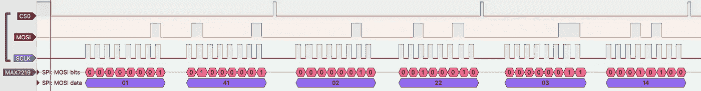
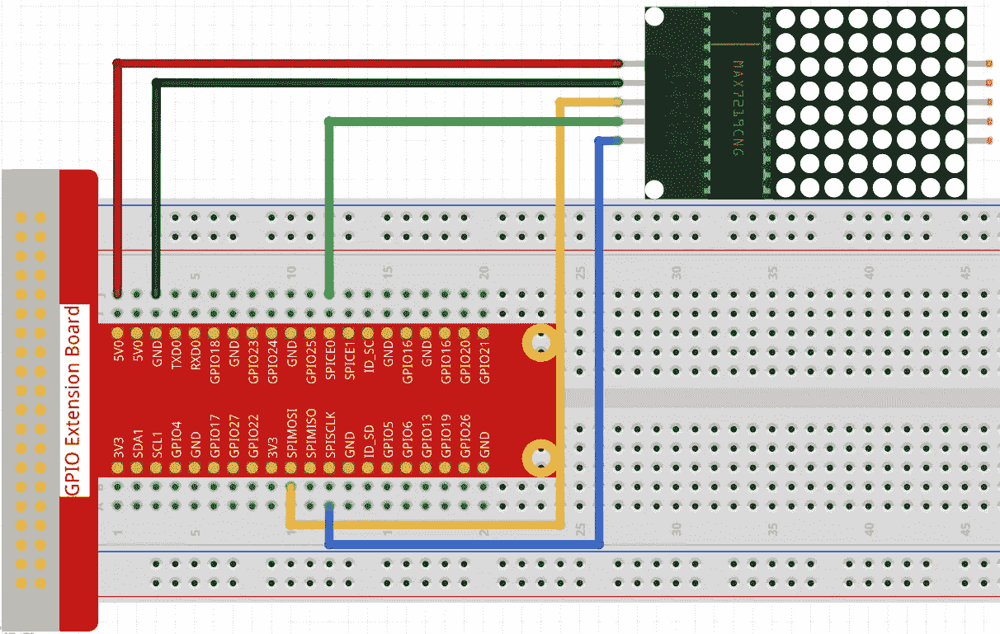

# raspberry Pi GPIO——使用 SPI 在 MAX7219 点阵显示模块上显示任意图案

> 原文：<https://betterprogramming.pub/raspberry-pi-gpio-using-spi-to-display-arbitrary-patterns-on-a-max7219-dot-matrix-display-module-34a269f35c60>

## 了解如何在 Raspberry Pi 上使用 SPI 外设


图片来源: [Sunfounder](https://docs.sunfounder.com/projects/raphael-kit/en/latest/1.1.6_led_dot_matrix_c.html)

# 概观

这是探索在 Raspberry Pi 上进行 [GPIO 编程的系列文章的第七篇。它描述了如何控制串行外设接口(SPI)外设，如](https://youngkin.github.io/categories/gpio/) [MAX7219 LED 点阵显示模块](https://datasheets.maximintegrated.com/en/ds/MAX7219-MAX7221.pdf)。

阅读这篇文章有两种方法。第一种方法是跳过控制 MAX7219 的[——与 BCM2835 的直接交互](https://youngkin.github.io/post/spidotmatrixmodule/#controlling-the-max7219---direct-interaction-with-the-bcm2835)部分，只关注本文的 SPI 和点阵显示方面。第二种方法还包括学习如何通过直接访问 SPI 寄存器集来控制 SPI 外设，而不是使用第三方库。这需要阅读控制 MAX7219 的[——与 BCM2835](https://youngkin.github.io/post/spidotmatrixmodule/#controlling-the-max7219---direct-interaction-with-the-bcm2835) 部分的直接交互。

如果采用第二种方法，那么[Raspberry Pi GPIO——Broadcom BCM 2835 ARM 外设编程简介](https://youngkin.github.io/post/gpioprogramming/)文章应被视为本文的先决条件。这篇文章介绍了直接控制连接到 BCM2835 的外设的关键技术，或者更一般地说，Raspberry Pi 上的 GPIO 接口。这些关键概念包括:

*   BCM2835 输入/输出功能
*   BCM2835 寻址
*   使用 BCM2835 寄存器

如果你只对学习 SPI 感兴趣，而没有学习 BCM2835 编程的细节，那么第一种方法是最好的。

将涵盖以下主题:

1.  **先决条件** —描述本文所需的硬件和软件库。
2.  **串行外设接口(SPI)概述** —介绍 SPI 协议和 MAX7219 点阵显示模块。
3.  **使用 BCM2835 板控制 MAX7219 点阵显示模块** —提供控制 MAX7219 的详细信息，包括代码。它还包含一个小节，描述如何直接与 BCM2835 上的 SPI 寄存器集交互。
4.  **总结** —总结本文中涉及的重要概念。
5.  **参考资料** —提供了一个我认为有用的参考资料列表，以及一些在本文创作中使用的参考资料。

# 先决条件

如果你没有，你需要一个树莓派。我用了一个树莓派 3B+与'伸展'或更高版本的 Raspbian 操作系统。下面引用的 BCM2835 库支持 Raspberry Pi 模型 1 到 4。

接下来你需要一个[试验板](https://www.amazon.com/dp/B082KBF7MM/ref=sspa_dk_detail_4?psc=1&pd_rd_i=B082KBF7MM&pd_rd_w=1tGTV&pf_rd_p=887084a2-5c34-4113-a4f8-b7947847c308&pd_rd_wg=fX8JB&pf_rd_r=44DE0RS1E9FD42RBYC7R&pd_rd_r=47cbdc7f-7834-455f-9429-ef74a438bd45&spLa=ZW5jcnlwdGVkUXVhbGlmaWVyPUFVVkdZVUZRNUw3ODkmZW5jcnlwdGVkSWQ9QTA4MzI4MzYyU0VLNzBJM0cxRUVMJmVuY3J5cHRlZEFkSWQ9QTA0Mjk1NTMzSzNSWlNFUjU0NURBJndpZGdldE5hbWU9c3BfZGV0YWlsJmFjdGlvbj1jbGlja1JlZGlyZWN0JmRvTm90TG9nQ2xpY2s9dHJ1ZQ==)，一些[跳线](https://www.amazon.com/dp/B08HZ26ZLF/ref=syn_sd_onsite_desktop_19?psc=1&spLa=ZW5jcnlwdGVkUXVhbGlmaWVyPUExRFpLWElCRjg1MUNMJmVuY3J5cHRlZElkPUEwMjMyMTE1M01aOFE3U1BQS09YSiZlbmNyeXB0ZWRBZElkPUEwODE5NTMxMktEMTlZRjEyQjBJNiZ3aWRnZXROYW1lPXNkX29uc2l0ZV9kZXNrdG9wJmFjdGlvbj1jbGlja1JlZGlyZWN0JmRvTm90TG9nQ2xpY2s9dHJ1ZQ==)，和一个 [MAX7219 点阵显示器](https://www.amazon.com/dp/B07VM6HXN5/ref=sspa_dk_detail_5?pf_rd_p=0c758152-61cd-452f-97a6-17f070f654b8&pd_rd_wg=wF4pR&pf_rd_r=8MBD40495EV7X8RR61NP&pd_rd_w=A5eiC&pd_rd_r=281b8d49-a176-4535-bc99-bd6108f5bc24&s=toys-and-games&spLa=ZW5jcnlwdGVkUXVhbGlmaWVyPUE1NDJPSEtMOFRCWjImZW5jcnlwdGVkSWQ9QTA4MTEwODgyN0lZRFdWVkhIOFRaJmVuY3J5cHRlZEFkSWQ9QTA4NzU0NjYyQkE5UTNXTzM3SjIwJndpZGdldE5hbWU9c3BfZGV0YWlsJmFjdGlvbj1jbGlja1JlZGlyZWN0JmRvTm90TG9nQ2xpY2s9dHJ1ZQ&th=1)。您还应该考虑使用一个带有 T 型适配器的 [40 引脚母对母，将 GPIO 输出连接到试验板上。您只能使用跳线，但适配器会使事情变得更容易，并有助于防止损坏 Raspberry Pi 上的 GPIO 引脚。如果您选择不购买带 T 型适配器的 40 针电缆，您需要购买](https://www.amazon.com/dp/B082PRVRYR/ref=sspa_dk_detail_2?psc=1&pd_rd_i=B082PRVRYR&pd_rd_w=8mKhr&pf_rd_p=887084a2-5c34-4113-a4f8-b7947847c308&pd_rd_wg=e9psa&pf_rd_r=S09F37DF2G5FW8B8GX4B&pd_rd_r=c065c120-e60b-45e9-b93b-f581f048cf46&spLa=ZW5jcnlwdGVkUXVhbGlmaWVyPUFCMzhUQ09COFI2VlMmZW5jcnlwdGVkSWQ9QTA5NjU2ODUxRDkxNEYwSTYwV09KJmVuY3J5cHRlZEFkSWQ9QTAxOTg1MTUyRUhEUlc2VzQ2VDQ4JndpZGdldE5hbWU9c3BfZGV0YWlsJmFjdGlvbj1jbGlja1JlZGlyZWN0JmRvTm90TG9nQ2xpY2s9dHJ1ZQ==)[公母跳线](https://www.amazon.com/SinLoon-Breadboard-Arduino-Circuit-40-Pack/dp/B08M3QLL3Q/ref=pd_sbs_7/143-0445142-7950409?pd_rd_w=sVLrc&pf_rd_p=8b76d7a7-ab83-4ddc-a92d-e3e33bfdbf03&pf_rd_r=CDM5TGJT03VKF0ZFB577&pd_rd_r=8e58fd82-8503-41cf-b8f2-c78eaeb78d25&pd_rd_wg=tT1U0&pd_rd_i=B08M3QLL3Q&psc=1)。然而，一个树莓派的全套电子设备并不比这 4 个组件贵多少。我推荐购买 [Sunfounder Raspberry Pi 终极入门套装](https://www.amazon.com/gp/product/B09BMVT4CB/ref=ppx_yo_dt_b_asin_title_o02_s00?ie=UTF8&psc=1)。


*sun founder Ultimate Starter/Raphael 套件*

您需要一些基本的 C 编程知识，并且熟悉登录到 Raspberry Pi 终端，或者登录到一些操作系统版本附带的桌面 GUI。根据您采用的方法，您可能需要将键盘和显示器连接到 Raspberry Pi。我只是简单地进入 Pi。您还需要熟悉如何使用像 Vi 或 nano 这样的编辑器。您需要对 Linux 命令行有基本的了解。

最后，您需要克隆或派生[我的 GPIO 库](https://github.com/youngkin/gpio)，因为它包含用于访问 BCM2835 上 GPIO 功能的底层库代码。正如在其他章节中提到的，这个库代码基于迈克·麦考利开发的 [BCM2835 C 库](http://www.airspayce.com/mikem/bcm2835/index.html)。

# SPI(串行外设接口)概述

SPI 用于将数据串行发送到可以并行接受或要求数据的外设。这很有帮助，因为仅使用 3 个 GPIO 引脚就可以写入相对较大的一组并行输入，不包括电源(VCC)和接地(GND)引脚。如果不使用 SPI，每个并行输入需要一个 GPIO 引脚。这很容易被禁止，因为引脚是有限的资源。让我们通过一个例子来看看这是如何工作的。


*图片来源:作者*

上图显示的是 MAX7219 LED 点阵显示屏。它通常用于显示任意形状，如字母、数字和笑脸。除了 MAX7219 之外，SPI 还可以用来控制各种外设来显示图像，从触摸屏接收输入，并与各种传感器进行交互。[维基百科有一篇很好的文章](https://en.wikipedia.org/wiki/Serial_Peripheral_Interface)更详细地描述了 SPI。

MAX7219 控制一个 8×8 的 led 矩阵。控制一个 LED 需要 1 个引脚，不包括电源或地。一个 8×8 的 LED 矩阵有 64 个 LED。这个数字远远超过标准 Raspberry Pis 上可用的 26 或 40 个 GPIO 引脚。如下所述，利用 SPI 需要的 GPIO 引脚要少得多。

MAX7219 具有以下输入引脚:

1.  DIN —这是串行数据输入引脚。
2.  CS —这通常称为片选(CS)或片使能(CE)引脚，有时也称为从机选择(SS)。
3.  CLK —此引脚连接到 Raspberry Pi 上的时钟引脚，用于同步 Raspberry Pi 和 MAX7219 之间的数据传输。

还有 2 个引脚不用于控制 MAX7219。

1.  VCC——这是电源输入引脚。它连接到 Raspberry Pi 上的电源，通常是 5 伏电源。
2.  GND——这是接地引脚。它连接到 Raspberry Pi 的接地引脚。

从 Raspberry Pi 到 MAX7219 至少需要 3 个 GPIO 引脚，特别是 DIN、CS 和 CLK 引脚。Raspberry Pi 只需使用这三个引脚，就能以经济高效的方式(按引脚方式)控制所有 64 个 led。通常的方法是使用 SPI 专用的 Raspberry Pi 引脚来驱动 DIN、CS 和 CLK 引脚。这 3 个引脚被命名为:

1.  (SPI)MOSI —这代表主机输出从机输入。MOSI 引脚将连接到 MAX7219 DIN 引脚，用于向 MAX7219(或任何 SPI 外设)发送串行数据信号。
2.  (SPI)SCLK —这代表 SPI 时钟。此引脚将连接到 MAX7219 CLK 引脚。它用作同步 BCM2835 和 MAX7219(或任何 SPI 外设)之间数据传输的时钟信号源。当 MOSI 引脚和 SCLK 引脚都被设为高电平时，数据传输就会发生。
3.  (SPI)CS 或(SPI)CE——代表片选或片使能。无论哪种情况，将引脚设为低电平都会指示 MAX7219 接受数据，如前所述。

> 我很不情愿地使用“主人”和“奴隶”这两个词。然而，我在 SPI 上阅读的所有文档中都使用了这些术语。为了避免混淆，我将继续使用它们。

Raspberry Pi 的 SPI 功能可能需要多达 5 个 GPIO 引脚。这两个附加引脚是:

1.  (SPI)MISO —代表主机输入从机输出。此引脚允许 MAX7219(或任何 SPI 外设)将数据发送回 BCM2835。
2.  (SPI)CS 或(SPI)CE——这是第二个片选/片使能引脚。第二个 CS/CE 引脚允许 BCM2835 控制 2 个 SPI 外设。如上所述，当 CS/CE 引脚设为低电平时，SPI 外设将接受来自 BCM2835 的数据。因此，通过将一个 CS/CE 引脚设为高电平，另一个设为低电平，我们可以控制哪个从机可以接收和发送数据。

文章[将多个 SPI 从器件与 Raspberry Pi](https://adikedia.com/2016/08/10/using-multiple-spi-slave-devices-with-wiringpi/) 配合使用提供了有关如何使用 2 个 CE/CS 引脚的更多信息。下图说明了如何利用 2 个 CE/CS 引脚:


*图片来源:BCM2835 ARM 外设指南*

在该原理图上方的图像中，您可能已经注意到 MAX7219 右侧的 5 个引脚。这些引脚将相应输入引脚上的信号输出到其他 MAX7219s。这允许将两个以上的 MAX7219s“链接”在一起，以创建更大的显示器，例如 128 个 LED 或 256 个 LED 显示器。这个过程称为菊花链。这可以通过将主 SPI 外设的输出引脚连接到链中下一个外设的相应输入引脚来实现。菊花链可用于在逻辑上更大的 LED 矩阵上显示多个字符，或创建滚动显示。这个 [Arduino 论坛主题](https://forum.arduino.cc/t/daisy-chaining-multiple-max7219-chips/3305)提供了关于如何实现这一点的高级解释。[带有三个 MAX7219 8×8 点阵 led 设备的新闻报道](https://thesolaruniverse.wordpress.com/2016/05/10/news-ticker-with-three-max7219-8x8-dot-led-matrix-devices/)是我能找到的关于实现特定项目的最佳文章。然而，它描述了如何用 Sketch(一种编写基于 Python 的代码片段的方法)来完成这一点，而不是 c。在这两个来源之间，可能有足够的关于如何使用 c 来完成这一点的提示。

> [可以购买大于 8x8](https://www.amazon.com/HiLetgo-MAX7219-Arduino-Microcontroller-Display/dp/B07FFV537V/ref=sr_1_9?crid=DWVTBTEX09G8&keywords=8x64+led+matrix+module&qid=1650744886&sprefix=8x64+led+matrix+module%2Caps%2C117&sr=8-9) 的 LED 矩阵模块，避免了手动菊花链连接多个器件。

BCM2835 的主 SPI 接口 SPI0 通过 GPIO 引脚 7–11 实现。引脚 7 和 8 是 BCM2835 上可用的 2 个 CE/CS 引脚。引脚 9 是 MISO，10 是 MOSI，11 是时钟(SPICLK/SCLK)。BCM2835 有两个辅助 SPI 接口:SPI1(也称为 AUX_SPI0)和 SPI2(也称为 AUX_SPI1)。根据 BCM2835 ARM 外设指南，SPI1 位于引脚 16–21，SPI2 位于引脚 35–39。这些辅助接口可通过 AUX I/O 功能获得。

下图显示了一个常用于将 BCM2835 GPIO 引脚连接到试验板的 GPIO 扩展板。这些引脚标有它们的 GPIO 引脚编号或它们支持的 I/O 功能(例如 SPI)。注意:SPI 引脚在电路板上的标签使用与上述相同的术语:


图片来源:Sunfounder

以下是显示发送到 MAX7219 点阵显示器的实际信号的时序图。这是来自 [PulseView/sigrok 逻辑分析仪](https://sigrok.org/wiki/PulseView)应用程序的截图。我使用了一个便宜的[逻辑分析仪设备](https://www.amazon.com/dp/B07K6HXDH1?psc=1&ref=ppx_yo2ov_dt_b_product_details)来捕捉 PulseView 中显示的信号。



*图片来源:作者*

*(为了更好地看到上面的图像，在一个单独的标签中打开它并放大)*

此图显示了字母“Y”的 LED 矩阵前 3 行的值。下面就来解读一下:

1.  从左到右共有 5 行/线，分别标记为 CS0、MOSI、SCLK、MAX7219/SPI MOSI 位和 MAX7219/SPI MOSI 数据。上面三行是实际的数字信号。尖峰表示高信号。底部 2 行是对上述 3 行信号的 SPI 特定解码。MAX7219/SPI MOSI 位显示与上述信号相关的位值，0(低)或 1(高)。MAX7219/SPI MOSI 数据代表上述位值的十六进制值。
2.  CS0 是片选线。这很难看到，但在图的最左边，它开始设置为高。垂直线出现的地方设置为低。这表示向连接到 CS0 的 SPI 外设的数据传输即将开始。当该信号设置为低电平时，会发生以下情况:
3.  当 CS0 设为低电平时，SCLK 线在高电平和低电平之间脉动 16 次。这是一个时序信号，当设为高电平时，指示 SPI 外设接受 MOSI 线上的当前值。
4.  对于 SCLK 的前 7 个脉冲，MOSI 线被设置为低。就在第 8 个脉冲之前，MOSI 线被设置为高。
5.  MAX7219/SPI MOSI 位线显示了 SCLK 线和 MOSI 线组合的二进制解释。与 SCLK 线的前 7 个脉冲一致，MOSI 线被解释为零(0)。第 8 位被解释为 1。所以发送的 8 位二进制值是`0000 0001`。
6.  MAX7219/SPI MOSI 数据线显示十六进制解释，即`0x1`。

CS0 线路设置为低电平时发送的第二个 8 位是十六进制数`0x41`的`0100 0001`。

MAX7219 移位寄存器为 16 位宽。因此，每个数据传输由 16 位组成，这就是我们在上面的时序图中看到的。当 CS0 线路设为低电平时，传输 16 位。对于 MAX7219，前 8 位是将要设置的寄存器的地址。用于填充该寄存器的值在接下来的 8 位中发送。因此，第一次数据传输将位于偏移量`0x1`的寄存器设置为值`0x41`。偏移量`0x1`处的寄存器控制点阵模块的第一/顶行。请注意，每行有 8 个 led。每个 LED 对应寄存器中二进制值的一位。那个值是`0x41`，`0100 0001`，会导致 LED 的第一行看起来是这样的(`-` s 为 0，`*` s 为 1):

```
-*-----*
```

下一组 8 位是`0000 0010`，相当于`0x2`。因此，第 2 个 8 位中的值将被写入寄存器的偏移量`0x2`，该偏移量对应于点阵显示器中第 2 行 8 个 LEDS。接下来 8 位的二进制值是`0010 0010`。目标寄存器将被设置为该值。传输后，LED 矩阵的前两行看起来像这样:

```
-*-----*
--*---*-
```

下一组 16 位具有值`0000 0011`和`0001 0100`。前 8 位是目标寄存器的地址。其遵循上述模式，指定目标寄存器位于对应于 LED 矩阵的第 3 行的偏移量`0x3`。后 8 位写入寄存器后，LED 矩阵将如下所示:

```
-*-----*
--*---*-
---*-*--
```

上图中未显示的下 5 组 16 位指定寄存器`0x4`至`0x7`，对应于 LED 矩阵的其余行。写入这些寄存器的值`0000 1000`产生以下模式，代表字母“Y”。

```
-*-----*
--*---*-
---*-*--
----*---
----*---
----*---
----*---
----*---
```

下一部分将提供关于 SPI 协议以及如何对 MAX7219 进行编程的更多细节。

# 设置和代码

下图说明了如何连接试验板，以配合 MAX7219 LED 点阵模块示例。如果你不熟悉试验板和试验板图，这个[试验板教程](https://www.sciencebuddies.org/science-fair-projects/references/how-to-use-a-breadboard)应该会有帮助。



*图片来源:Sunfounder*

黄线连接到 Raspberry Pi 的 SPIMOSI 引脚(GPIO 引脚 10)和 MAX7219 的 DIN 引脚。蓝线连接到 Raspberry Pi 的 SPISCLK 或 SCLK (GPIO 引脚 11)和 MAX7219 的 CLK 引脚。绿线连接到 Raspberry Pi 上的 SPICE0 或 CE0 (GPIO 引脚 8)和 MAX7219 上的 CS 引脚。红色和黑色电线分别连接到 5 伏电源/VCC 和接地/GND。

下一节将描述控制 MAX7219 的主程序。下一节描述使用 BCM2835 寄存器直接控制 I/O 功能的代码。

# 控制 MAX7219 —主程序

我之前提到过，阅读这篇文章有两种方法。第一种方法是最简单的，只需要阅读这一部分。下一节[控制点阵显示器——与 BCM2835](https://youngkin.github.io/post/spidotmatrixmodule/#controlling-a-dot-matrix-display---interacting-with-the-bcm2835) 交互，更高级，可以跳过。

本节和下一节中的代码引用以`bcm_`为前缀的函数。所有这些函数都取自 Mike McCauley 编写的 [BCM2835 C 库](https://www.airspayce.com/mikem/bcm2835/index.html)，只做了很小的改动。当用这个代码使用这个库时，只需用`bcm2835_`替换`bcm_`的所有实例。创建了`bcm_`函数，以便我可以添加解释性注释，并使 BCM2835 代码在本文中更容易访问。`bcm_`功能将在下一节详细描述。

## 全局变量

第一个代码片段显示了如何创建一个字符显示在 MAX7219 点阵显示模块上。二维矩阵`disp1`包含一组行`NUM_CHARS`，每一行定义一个要显示的特定字符。矩阵中的每一列`MATRIX_ROW`定义了在点阵显示模块中打开单个 MAX7219 LED 行中的哪些 LED。MAX7219 显示模块是一个 8×8 的 led 阵列。在上面的代码片段中，矩阵包含 3 行 8 列。`disp1[0][0]`处的第一个单元包含十六进制值`0x3C`。这定义了在显示模块的 8 行中的第一行打开哪些 led。`0x3C`翻译成`0011 1100`。每个数字指定该行中的哪个 LED 将被打开。`0x3C`指定打开 8 个 LED 行中第一行中间的 4 个 LED。`disp[0][1]`包含转换成二进制数`0100 0010`的十六进制值`0x42`，该二进制数指定 8 个 LED 行的第二行中的第二个和第七个 LED 将被打开。显示这两个单元格后，点阵显示将如下所示:

```
--****--
-*----*-
```

带有`-`的 LED 单元关闭，带有`*`的单元打开。一旦显示了从`disp1[0][0]`到`disp1[0][7]`的所有 8 个单元，点阵模块上将显示以下字符，即零:

```
--****--
-*----*-
-*----*-
-*----*-
-*----*-
-*----*-
-*----*-
--****--
```

其余的`disp1`行定义了程序将显示的其余字符和形状。

用于 LED 矩阵 8x8 的 [Sprint 生成器是一个工具，帮助生成使 LED 矩阵显示给定形状所需的十六进制数。](http://robojax.com/learn/arduino/8x8LED/)

## 主()

下一个代码片段显示了`main`函数的代码。每个重要的行将在代码片段下面解释。

**第 1 行**解释了 GPIO 管脚是硬编码的。这是因为程序正在使用`SPIO`接口。另外两个接口`SPI1`和`SPI2`是辅助 SPI 接口。BCM2835 臂外设指南第 20 页第 2.3 节规定如下:

> 两个通用 SPI 主机是辅助低吞吐量 SPI 接口。…通用 SPI 主机已经开发出来，甚至可以与最“非标准”的 SPI 设备配合使用。

言外之意，“次要”、“低吞吐量”和“非标准”似乎不是我们想要的属性。 [BCM2835](https://www.airspayce.com/mikem/bcm2835/index.html) 库是本文给出的代码的基础，它支持`SPI0`作为主接口。有支持`SPI1`接口的辅助功能，没有支持`SPI2`的功能。鉴于这一切，我选择硬编码`SPI0`接口。注意，BCM2835 ARM 外设指南规定，当指定 ALT0 功能时，GPIO 引脚 7-11 专用于`SPI0`。

**第 3 行**定义了一个信号处理器，用于在应用程序被终止时提供优雅的关闭(例如，^C).

**第 8 行**，调用 [bcm_init()](https://youngkin.github.io/post/spidotmatrixmodule/#bcm_init) ，初始化 BCM2835。其中，它为 I/O 外设的地址空间找到合适的内存偏移量并映射`/dev/mem`,以便可用于对 I/O 功能进行编程。`bcm_init()`是一个低级功能，将在下一节[控制点阵显示-与 BCM2835](https://youngkin.github.io/post/spidotmatrixmodule/#controlling-a-dot-matrix-display---interacting-with-the-bcm2835) 交互中详细描述。

**第 13 行**， [init_spi()](https://youngkin.github.io/post/spidotmatrixmodule/#init_spi) ，初始化 spi 接口，包括将 GPIO 引脚上的 I/O 功能设置为 ALT0(使能 SPI0)。

**第 14 行**、`Delay_xms(50);`产生一个 50 毫秒的短暂延迟，给 spi 接口时间完成初始化。

**第 15 行**， [Init_MAX7219()](https://youngkin.github.io/post/spidotmatrixmodule/#init_max7219) ，初始化 MAX7219 显示模块。其中，它设置显示器的亮度。与 BCM2835 一样，其功能由一组寄存器控制。下面函数定义中的注释提供了关于它做什么的附加信息。

**第 18–37 行**是`main`功能的核心。对于`disp1`和`scrollDisp`数组中的每一行，它将一整行的值写入显示模块，从而显示一个字符(例如`0`)。**第 29-36 行**演示了如何创建一个简单的滚动显示。

**行 40 ad 41** ， [bcm_spi_end()](https://youngkin.github.io/post/spidotmatrixmodule/#bcm_spi_end) 和 [bcm_close()](https://youngkin.github.io/post/spidotmatrixmodule/#bcm_close) 复位 BCM2835 GPIO 功能并释放资源(如`/dev/mem`)。

## init_spi()

该代码片段显示了 SPI 接口的初始化方式。

**线路 4** ， [bcm_spi_begin()](https://youngkin.github.io/post/spidotmatrixmodule/#bcm_spi_begin) ，是另一个与 BCM2835 接口的低级功能。正如注释所述，它负责将 GPIO 引脚 7–11 设置为备用功能 0，从而使能这些引脚的 SPI0 接口。这将在下一节中详细介绍。

**第 6 行**， [bcm_spi_setBitOrder()](https://youngkin.github.io/post/spidotmatrixmodule/#bcm_spi_setbitorder) ，比较复杂，取决于你是否理解最高有效位和最低有效位排序(MSB 和 LSB)的概念。简单地说，二进制数中最重要的位是最左边的位。同样，二进制数中的最低有效位是最右边的位。在二进制数`100`中，MSB 是`1`，LSB 是`0`。重要的是，当数据以串行方式传输时，位顺序指定首先发送哪个位。在 MSB 中，首先发送最高有效位。因此，将串行数据传输的接收端视为一个堆栈，MSB 首先被推入堆栈。其余位从 MSB 转移到 LSB。因此，如果数字`100`按 MSB 顺序串行传输，它在接收端将被表示为`001`。不同的器件需要 MSB 或 LSB 格式的数据。

了解与您交互的设备对于位顺序的期望是很重要的。BCM2835 SPI0 需要 MSB 中的位。SPI1 和 SPI2 可以接受 AUXSPI0/1_CNTL0 寄存器的位 6 中指定的 MSB 或 LSB(详情参见[BCM 2835 ARM 外设指南](https://www.raspberrypi.org/app/uploads/2012/02/BCM2835-ARM-Peripherals.pdf)，第 22–23 页)。`bcm_spi_setBitOrder()`允许指定 MSB 或 LSB。然而，对于 SPI 数据传输，数据必须以 MSB 形式发送。因此，对于 SPI，该功能基本上是无效的。有关数据如何传输到 MAX7219 的直观表示，请参见第 5 页底部的 [MAX7219 数据手册](https://datasheets.maximintegrated.com/en/ds/MAX7219-MAX7221.pdf)、*功能图*。在页面的最底部中间有一个图表，显示了数据如何通过`DIN`引脚传输到 MAX7219 内部移位寄存器的位位置。在最后一个时钟脉冲(`CLK`引脚)，LSB 位于位偏移`0`、`D0`，MSB 位于位偏移`15`、`D15`。如果你想看更完整的位排序示例，请参阅我的文章[Raspberry Pi GPIO in Go and C——使用移位寄存器& 7 段显示](http://youngkin.github.io/post/shiftregistersevensegdisplay/#what-is-a-shift-register-and-what-is-it-good-for)。它详细描述了如何结合移位寄存器使用位排序。如果您想了解更多关于强制 BCM2835 SPI 接口以 LSB 发送数据的信息，请参见此 Google Groups 主题 [BCM2835 SPI 通信- LSB 优先](https://groups.google.com/g/bcm2835/c/9H6rDEKTru0?pli=1)。

**第 9 行**，[BCM _ SPI _ set data mode(BCM _ SPI _ mode 0)](https://youngkin.github.io/post/spidotmatrixmodule/#bcm_spi_setdatamode)设置时钟极性和相位。如果你不明白这意味着什么，就接受这个设定，继续前进。在大多数情况下，这是默认设置。如果您想了解更多细节，请参见第 149 页的[BCM 2835 ARM 外设指南](https://www.raspberrypi.org/app/uploads/2012/02/BCM2835-ARM-Peripherals.pdf)，第 10 节— SPI，图 10–3。

**第 10 行**，[BCM _ spi _ setClockDivider(BCM _ SPI _ CLOCK _ DIVIDER _ 256)](https://youngkin.github.io/post/spidotmatrixmodule/#bcm_spi_setclockdivider)设置 SPI 时钟的频率(Rasberry Pi 上的 SPISCLK、GPIO 引脚 11)。简而言之，Raspberry Pi 的系统时钟除以该函数中的参数来设置 SPI 时钟的频率。在大多数情况下，256 是一个很好的默认值。更多详细信息，请参见 [bcmfuncs.h](https://github.com/youngkin/gpio/blob/main/ledblink/bcmfuncs.h) 或 [BCM2835 C 库文档](https://www.airspayce.com/mikem/bcm2835/group__constants.html#gaf2e0ca069b8caef24602a02e8a00884e)。

**第 12 行**， [bcm_gpio_fsel()](https://youngkin.github.io/post/spidotmatrixmodule/#bcm_gpio_fsel) 将`Max7219_pinCS`引脚 SPICE0/gpio 引脚 8 设置为 GPIO 输出功能。这允许程序将值(高或低)写入引脚。这是 SPI 片选/片使能引脚。此引脚指示 MAX7219 从 Raspberry Pi 接收数据。向 MAX7219 发送数据时，此引脚需要设为低电平。下面将更详细地描述`bcm_gpio_fsel()`功能。

## Init_MAX7219()

该代码片段初始化 MAX7219 显示模块。与 BCM2835 一样，MAX7219 的功能也是通过一组寄存器来控制的。**第 3 行到第 9 行**将各种控制寄存器设置为不同的值。

以**行 1** 为例，它将偏移量`0x09`处的 MAX7219 寄存器设置为值`0x00`。 [Write_Max7219()](https://youngkin.github.io/post/spidotmatrixmodule/#write_max7219) 中的第一个参数指定寄存器的地址偏移量。第二个参数指定要写入寄存器的值。寄存器及其失调在 [MAX7219 数据表](https://datasheets.maximintegrated.com/en/ds/MAX7219-MAX7221.pdf)、*表 2 中描述。第 7 页的寄存器地址映射*。*表 1。第 6 页的串行数据格式*描述了数据在各寄存器中的布局。每个寄存器的长度为 16 位，如表 1 所示。共有 14 个控制寄存器。每个寄存器的名称在标题为*寄存器*的表 2 的第 1 列中给出。每个寄存器的偏移量在*十六进制代码*栏中给出。再次查看`Write_Max7219()`、`0x09`的第一个参数，我们可以看到该地址指向*解码模式*寄存器，该寄存器位于*十六进制代码*列中给出的偏移量`0xX9`。与创建字符、符号或形状相关的各种 LED 行由寄存器*数字 0* 至*数字 7* 控制。表 3、4、7、8 和 10 给出了除 *Digitn* 寄存器以外的各寄存器值的含义。`Write_Max7219()`的第二个参数是`0x00`。在表 4 中，我们看到这个值意味着没有为数字 0-7 设置解码。

以类似的方式，**第 4 行到第 9 行**将初始化剩余的寄存器，如注释中所述。

## Write_Max7219()

`Write_Max7219()`将数据`dat1`写入位于地址`address1`的寄存器。对 MAX7219 的写入一次只发生一个字节。写入的第一个字节是寄存器地址。第二个字节是数据。

**第 1 行**， [bcm_gpio_write()](https://youngkin.github.io/post/spidotmatrixmodule/#bcm_gpio_write) 使用常规 gpio 写方法将片选引脚`Max7219_pinCS`设为低电平，以便 MAX7219 接受来自 Raspberry Pi 的数据。

**第 6 行**， [Write_Max7219_byte()](https://youngkin.github.io/post/spidotmatrixmodule/#write_max7219_byte) ，向 Max7219 发送`address1`参数。如 [MAX7219 数据手册](https://datasheets.maximintegrated.com/en/ds/MAX7219-MAX7221.pdf)、*功能图*所示，在第 5 页的底部，目标寄存器的地址将被写入位偏移 8 至 11(如数据手册所述，位 12 至 15 将被忽略)。

**第 7 行**， [Write_Max7219_byte()](https://youngkin.github.io/post/spidotmatrixmodule/#write_max7219_byte) ，向 Max7219 发送`dat1`参数。`dat1`位将被写入 MAX7219 移位寄存器中的最低有效位，偏移量 0 到 7。

**线 8** ， [bcm_gpio_write()](https://youngkin.github.io/post/spidotmatrixmodule/#bcm_gpio_write) ，复位`Max7219_pinCS`引脚回到高电平，表示数据传输结束，防止 MAX7219 接收数据。

## Write_Max7219_byte()

`Write_Max7219_byte()`相当直白。它获取`data`参数，并通过 [bcm_spi_transfer()](https://youngkin.github.io/post/spidotmatrixmodule/#bcm_spi_transfer) 调用将其发送给 SPI 外设 vi。`bcm_spi_transfer()`将在下文详细介绍。

# 控制 MAX7219 —与 BCM2835 直接交互

本部分描述代码如何与 GPIO 外设交互并控制这些外设，特别是设置与 BCM2835 的 SPI I/O 功能相关的各种寄存器的值。设置寄存器值用于控制 GPIO 外设，读取寄存器值允许访问相关 GPIO 外设的当前状态。

其中许多功能描述都是从[Raspberry Pi GPIO——Broadcom BCM 2835 ARM 外设编程简介](https://youngkin.github.io/post/gpioprogramming/)文章中复制的。这样做是为了避免经常交叉引用该文章。

包含该代码的文件的代码可以在[gpio/led blink/BCM funcs . c](https://github.com/youngkin/gpio/blob/main/ledblink/bcmfuncs.c)中找到。相关的头文件可以在[gpio/led blink/BCM funcs . h](https://github.com/youngkin/gpio/blob/main/ledblink/bcmfuncs.h)中找到。

## bcm_init()

在*Broadcom BCM2835 ARM 外设编程简介*一文中，Raspberry Pi GPIO 部分的[寄存器提到，BCM 2835 外设上的所有操作都是通过操作与该类型外设相关的寄存器来完成的。`bcm_init()`的目的是确定所有类型寄存器的地址偏移量，如 GPIO、PWM、SPI 等。以便可以控制它们的相关外围设备。](https://youngkin.github.io/post/gpioprogramming/#registers)

这个代码片段显示了`bcm_init()`函数的开始。

**第 10 行**打开`BCM_RPI2_DT_FILENAME`。如注释所示，`fopen()`调用中的`rb`打开一个二进制文件进行读取。`BCM_RPI2_DT_FILENAME`在相关的`bcmfuncs.h`头文件中定义。它的值是`/proc/device-tree/soc/ranges`。如 [Linux 和设备树](https://www.kernel.org/doc/html/latest/devicetree/usage-model.html)中所述，

> 操作系统使用设备树在运行时发现硬件的拓扑结构，从而支持大多数可用的硬件，而无需硬编码信息(假设驱动程序可用于所有设备)。

设备树保存的信息之一，对我们的目的很重要，是 BCM2835 的物理地址空间中 I/O 外设分区的位置和长度(详见[Broadcom BCM 2835 ARM 外设编程简介-寻址](https://youngkin.github.io/post/gpioprogramming/#addressing))。下面是树莓派 3B+上`/proc/device-tree/soc/ranges`内容的十六进制转储:

```
pi@pi-node1:/ $ hexdump -C /proc/device-tree/soc/ranges
00000000  7e 00 00 00 3f 00 00 00  01 00 00 00 40 00 00 00  |~...?.......@...|
00000010  40 00 00 00 00 00 10 00                           |@.......|
00000018
```

我们将在下一个代码片段中引用它。根据[devicetree.org](https://www.devicetree.org/specifications/)，在[device tree 规范](https://github.com/devicetree-org/devicetree-specification/releases/download/v0.4-rc1/devicetree-specification-v0.4-rc1.pdf)v 0.4-rc1 中，`soc/ranges`属性定义如下:

> ranges 属性提供了一种定义总线地址空间(子地址空间)和总线节点父地址空间(父地址空间)之间的映射或转换的方法。ranges 属性的值的格式是任意数量的三元组(子总线地址、父总线地址、长度)

对于 I/O 外设地址块，如[Broadcom BCM 2835 ARM 外设编程简介—寻址](https://youngkin.github.io/post/gpioprogramming/#addressing)中所述，*“子总线地址”*指的是*“VC CPU 总线地址”*内存空间中的*“I/O 外设”*地址块。*“母总线地址”*是指*“ARM 物理地址”*块中的*“I/O 外设”*地址块。*的“长度”是指*【I/O 外设】*地址块的实际长度。Raspberry Pi 3B+具有 32 位地址空间，因此三元组中的每个值都是 32 位或 4 个字节。*

*下一段代码使用来自`/proc/device-tree/soc/ranges`的数据找到 I/O 外设模块的*父总线地址*和*长度*。回想一下，父总线地址是三元组中的第二个条目，它也定义了子总线地址和长度。根据上面的十六进制转储，这里是三元组(数组单元 0 在最左边，数组单元 11 在最右边):*

```
*7e 00 00 00 3f 00 00 00  01 00 00 00*
```

> *注意:在 Raspberry Pi 4 上，该命令的输出有些不同。它看起来更像这样:*
> 
> *`pi@kubemaster:~ $ hexdump -C /proc/device-tree/soc/ranges`*
> 
> *`00000000 7e 00 00 00 00 00 00 00 fe 00 00 00 01 80 00 00 |~……………|`*
> 
> *在这个转储中，父总线地址的起始地址是偏移量 8，值是`fe 00 00 00`。对于树莓 Pi 3，它在偏移量 4 处。在这两种情况下，地址的长度都是 4 字节或 32 位。I/O 外设分区的长度从偏移量 12 开始，值为`01 80 00 00`。虽然上面的代码片段没有反映出这种差异，但是完整函数的代码确实考虑到了这一点。*

***第 1 行到第 4 行**将*母总线地址*、`3f 00 00 00`的内容，即`buf`偏移量 4 到 7 的字节，移入`base_address`。`3F`被移入`base_address`的高位字节。剩余的`buf`单元同样从左(最高有效字节)到右(最低有效字节)移位到`base_address`。换档完成后，`base_address`将被设置为`0x3F000000`。回顾[Broadcom BCM 2835 ARM 外设编程简介-寻址](https://youngkin.github.io/post/gpioprogramming/#addressing)中的图表，您会注意到**与 *ARM 物理地址*中的 *I/O 外设*地址块中的`0x20000000`的基址**不匹配。这是因为寻址部分中的图表是针对 Raspberry Pi 1 的。这种偏移在 Raspberry Pi 型号 2 & 3 中有所不同。在 Raspberry Pi 4 模型中又有所不同。*

*继续，以与`base_address`类似的方式，**线 6 至 9** 通过从`buf`偏移 8 至 11 移入`peri-size`获得*长度*。对于树莓派 3B+，`0x01000000`是地址块的预期长度。*

*下一个代码片段完成了从`/proc/device-tree/soc/ranges`获取寻址信息。具体来说，它验证了*“子总线地址”*和*“父总线地址”*具有预期值。回想一下*“子总线地址”*是地址/长度三元组的第一个值，`buf`偏移量 0 到 3。第 1 行到第 6 行执行以下操作:*

1.  ***第 1 行到第 4 行**验证`buf`的前 4 个字节，即*子总线地址*，是由*“VC CPU 总线地址”*内存空间中的*“I/O 外设”*地址块定义的`0x7E000000`。我们在上面的十六进制转储中也看到了这一点，其中前 32 位的*子总线地址*包含值`7e 00 00 00`。*
2.  ***第 5 行**验证*父总线地址*，`base_address`是否与 Raspberry Pi 模型 1 至 4 的预期基址之一相匹配。*

***第 7 行和第 8 行**然后将 *I/O 外设*地址块的基址和长度设置为将在程序其余部分使用的变量。这一行的重要之处在于，它将源变量转换为目标变量所期望的类型。*

*下一段代码将 BCM2835 的*“I/O 外设”*地址块映射到`/dev/mem`的*“ARM 物理地址”*内存空间中，以便它可以安全地用于程序中。*

***第 1 行**首先检查运行程序的用户是否以 *root* 身份运行(要么是 *root* 用户，要么是 *sudo* )。否则，`/dev/mem`装置不能使用。`/dev/mem`提供对 CPU 内存的无限制访问。因为这显然是一件危险的事情，所以它的使用仅限于*根*。还有一个替代`/dev/mem`，`/dev/gpio`。这将在本节的后面部分显示。*

***线 4** 打开`/dev/mem`准备映射操作。`O_SYNC`指定对`/dev/mem`的写操作必须在任何写操作返回之前完成(即，写操作不被缓存)。*

***第 13 行**在 *I/O 外设*地址块的偏移量和长度`bcm_peripherals_base`和`bcm-peripherals_size`处将`bcm_peripherals`变量分配给存储块。这种映射有效地限制了程序对物理存储器的 *I/O 外设*地址块的访问。*

*下一段代码计算各种类型寄存器(例如 GPIO、PWM、SPI 等)的失调。每个偏移量都相对于`bcm_peripherals`的值，它是前面代码片段中`mapmem()`操作的结果。因此，要获得像 GPIO 寄存器组这样的寄存器组的地址，我们需要将`BCM_GPIO_BASE`加到`bcm_peripherals`基址上。但是您可能已经注意到，代码在将这些偏移量添加到`bcm_peripherals`之前会将它们除以 4。这些被指定为整数的偏移量，例如`BCM_GPIO_BASE`，指向特定的字节地址，即在 8 位边界处。`bcm_peripherals`被指定为`uint32_t*`，一个指针。你不能天真地给指针加一个整数。您可能还记得，指针算法是基于相关变量的类型大小来操作指针变量的。对于`unint32_t`，它们的大小是 32 位或 4 字节。向`uint32_t`指针加 1 将导致该指针指向下一个`uint32_t`，从当前位置开始 4 个字节。天真地将像`BCM_GPIO_BASE`这样的偏移量添加到`bcm_peripherals`会导致`bcm_peripherals`指向内存中比当前位置晚 4 秒的位置，而不是我们想要的比当前位置晚 1 秒的位置。这就是为什么像`BCM_GPIO_BASE`这样的每个寄存器类型偏移在加到`bcm_peripherals`之前要除以 4。*

> *如果你是 C 语言的新手，你可能不知道指针算法本身是危险的。很难确切知道指针运算的结果是指针将引用什么。指针可能是意外的类型或具有意外的值。这可能会导致难以调试的意外行为。在某些情况下，例如执行除法，指向包含零值的意外位置将导致程序突然结束(出现分段错误)。这很好，这样你就知道出了问题，甚至知道问题出在哪里。指针甚至可能指向程序地址空间之外，这可能导致系统崩溃。然而在我们的例子中，寄存器位置和相关类型是众所周知的，使用指针是相对安全的。也就是说，只要我们正确地执行指针算法…*

## *bcm_spi_begin()*

*初始化 BCM2835 上的 SPI 接口。*

***第 2 行**定义了 32 位地址变量`paddr`，它将包含我们将要操作的 GPIO 寄存器的地址。*

***行 4 & 5** 验证 SPI0 寄存器偏移量是否在 [bcm_init()](https://youngkin.github.io/post/spidotmatrixmodule/#bcm_init) 中成功初始化。在调用 [bcm_init()](https://youngkin.github.io/post/spidotmatrixmodule/#bcm_init) 之前，所有寄存器组偏移量都被设置为值`MAP_FAILED`，以防止程序在`bcm_init()`未被调用或未成功完成时运行。*

***第 7 行到第 11 行**调用 [bcm_gpio_fsel()](https://youngkin.github.io/post/spidotmatrixmodule/#bcm_gpio_fsel) 来定义替代函数、`BCM_GPIO_FSEL_ALT0`或替代函数零，用于设置`BCM_GPIO_P1_*`变量引用的管脚的 I/O 功能。请注意，左边的注释指定了正在设置的 SPI 引脚，例如`CE1`(片选/片使能)。当设置为备用功能 0 时，这些引脚执行 SPI 协议。*

***第 13 行**将`paddr`设置为 SPI0 地址集的偏移量加上 BCM2825 SPI 主控制和状态寄存器(CS)的偏移量，如[BCM 2835 外设指南](https://www.raspberrypi.org/app/uploads/2012/02/BCM2835-ARM-Peripherals.pdf)第 152 页所述(在这种情况下使用缩写*“CS”*可能会造成混淆，但在这种情况下，这不是“芯片选择”偏移量)。注意`BCM_SPI0_CS`偏移量除以 4。原因已在上文 [bcm_init](https://youngkin.github.io/post/spidotmatrixmodule/#bcm_init) 部分的讨论中讨论过。*

***第 14 行**使用 [bcm_peri_write()](https://youngkin.github.io/post/spidotmatrixmodule/#bcm_peri_write) 函数向`paddr`指向的 SPI 控制和状态(CS)寄存器写入 0。根据 BCM2835 ARM 外设指南第 155 页，在此偏移量设置 1 字节域会将 CS 寄存器(控制和状态)中的片选域设置为 0，表示片选引脚 0。这与 Raspberry Pi 引脚`BCM_GPIO_P1_24`、GPIO 引脚 8 的规格相匹配，GPIO 引脚 8 是`CE0`引脚(芯片使能/芯片选择引脚 0)。*

***第 17 行**如注释所示，使用 [bcm_peri_write_nb()](https://youngkin.github.io/post/spidotmatrixmodule/#bcm_peri_write) 清零发送和接收 FIFOs。再次查看 BCM2835 ARM 外设指南的第 155 页，我们可以看到 *CS* 寄存器中的`CLEAR`域位于位偏移量 4 和 5 处。它给出了清除 FIFOs 的位值，每个位中的`1`。`BCM_SPI0_CS_CLEAR`指定的值为`0x30`(参见 [bcmfuncs.h 文件](https://github.com/youngkin/gpio/blob/main/ledblink/bcmfuncs.h))。将它转换成二进制，我们得到了`0011 0000`。位 4 和 5 确实被设置为 1，因此这些位将在`CS`寄存器中被设置。*

## *bcm_spi_setBitOrder()*

*`bcm_spi_setBitOrder()`设置 SPI 接口的位顺序，MSB (1)或 LSB (0)。*

## *bcm_spi_setDataMode()*

*`bcm_spi_setDataMode()`指定用于数据传输的时钟极性和相位。*

***第 3 行**设置`paddr`，SPI0 控制和状态(CS)寄存器相对于 SPI0 寄存器组基址的存储器偏移量。回想一下 [bcm_init()](https://youngkin.github.io/post/spidotmatrixmodule/#bcm_init) 部分的第 13 行，寄存器偏移量需要除以 4。*

***第 5 行**调用 [bcm_peri_set_bits()](https://youngkin.github.io/post/spidotmatrixmodule/#bcm_peri_set_bits) 将 SPI0 CS 寄存器中的位设置为由`mode`指定的位模式。极性和相位位分别是`BCM_SPI0_CS_CPOL` ( `0x8`)和`BCM_SPI0_CS_CPHA` ( `0x4`)掩码，用于确保仅设置 SPI0 CS 寄存器中的这些位。有关屏蔽工作原理的更多详情，请参见 [bcm_gpio_fsel()部分](https://youngkin.github.io/post/spidotmatrixmodule/#bcm_gpio_fsel)第 5 行。*

## *bcm_spi_setClockDivider()*

*`bcm_spi_setClockDivider()`用于设置 SPI 时钟的频率(SCLK)。它通过将系统时钟频率除以`divider`参数来实现这一点。更多详情参见 [bcmfuncs.h](https://github.com/youngkin/gpio/blob/main/ledblink/bcmfuncs.h) 或 [BCM2835 C 库文档](https://www.airspayce.com/mikem/bcm2835/group__constants.html#gaf2e0ca069b8caef24602a02e8a00884e)。*

***第 3 行**将`paddr`设置为 SPI 时钟(`BCM_SPI0_CLK`)寄存器相对于 SPI0 寄存器组基址的存储器偏移量。回想一下 [bcm_init()](https://youngkin.github.io/post/spidotmatrixmodule/#bcm_init) 部分的第 13 行，寄存器偏移量需要除以 4。*

***第 5 行**调用 [bcm_peri_write()](https://youngkin.github.io/post/spidotmatrixmodule/#bcm_peri_write) 设置分频器值。*

## *bcm_gpio_fsel()*

*`bcm_fsel`负责设置与给定管脚相关的 I/O 功能。总共有 8 种功能可用。其中一个定义了相关联的管脚将被设置为输入管脚，这意味着它将被读取。另一个函数将相关联的引脚定义为输出引脚，这意味着该引脚将被写入。其余 6 个被称为“备用功能”，并被赋予类似“备用功能 0”的名称。为各种备用功能分配的 I/O 功能因各种 GPIO 引脚而异。例如，将 BCM GPIO 引脚 17 设置为备用功能 4 可将其 I/O 功能定义为 SPI。它实际上将该引脚定义为 SPI 功能的一个特定子集，称为芯片使能或芯片选择，但这是后续文章的主题。回想一下，在上面的`main()`中，该功能被设置为`BCM_GPIO_FSEL_OUTP`，它将`pin`定义为输出引脚。*

*尽管这个函数很短，但它还是有很多内容。*

***第 1 行**将函数定义为采用两个参数`pin`和`mode`。很明显`pin`是要分配功能的引脚。`mode`是与`pin`关联的 I/O 功能。`mode`实际上是分配给特定寄存器偏移量的位模式。位模式分配在第 92 页第 6 节 **GPIO** 的[BCM 2835 I/O 外设数据表](https://www.raspberrypi.org/app/uploads/2012/02/BCM2835-ARM-Peripherals.pdf)中定义。模式定义如下:*

```
*000 = GPIO Pin X is an input
001 = GPIO Pin X is an output
100 = GPIO Pin X takes alternate function 0
101 = GPIO Pin X takes alternate function 1
110 = GPIO Pin X takes alternate function 2
111 = GPIO Pin X takes alternate function 3
011 = GPIO Pin X takes alternate function 4
010 = GPIO Pin X takes alternate function 5*
```

*要理解该函数的其余部分，还需要一些额外的背景知识。首先， [BCM2835 ARM 外设指南](https://www.raspberrypi.org/app/uploads/2012/02/BCM2835-ARM-Peripherals.pdf)第 91 页第 6 节指出，共有 54 个 GPIO 引脚可通过功能选择寄存器(GPFSEL0-GPFSEL5)寻址。每个功能选择寄存器的长度为 32 位。由于上述每个功能选择模式都是 3 位长，每个功能选择寄存器可以指定 10 个引脚的 I/O 功能，剩余 2 位。每个寄存器 10 个引脚，总共 54 个引脚解释了为什么有 6 个功能选择寄存器，编号为 0 到 5。下面的数学公式就是从这些信息中推导出来的。*

***第 3 行**、`volatile uint32_t* paddr = bcm_gpio + BCM_GPFSEL0/4 + (pin/10);`定义了将根据`mode`设置的位的寄存器偏移量`paddr`。`BCM_GPFSEL0`是功能选择寄存器的基址偏移量，以字节为单位。下面是对这一行中执行的算法的解释。*

1.  *请注意，正在执行指针运算。回想一下，指针算法的结果是基于目标变量的类型的(参见上面的 [bcm_init()](https://youngkin.github.io/post/spidotmatrixmodule/#bcm_init) 一节)。由于`uint32_t`的长度为 4 字节，因此`BCM_GPFSEL0`需要除以 4 才能正确计算出来。于是`... paddr = bcm_gpio + BCM_GPFSEL0/4 ...`。*
2.  *还记得每个寄存器保存 10 个引脚的功能选择信息。对于给定的引脚，我们需要确定哪个功能选择寄存器(GPFSEL0 至 GPFSEL5)指定给定引脚的 I/O 功能。在 C #中，产生分数的整数除法的结果将被向下舍入。因此，如果我们将引脚数除以 10，`(pin/10`，我们将得到正确功能选择寄存器的偏移。因此，引脚 9 将导致`9/10`等于 0，这意味着引脚 9 的功能选择位置在 GPFSEL0 中。同样，引脚 17 的`17/10 = 1`功能选择寄存器是 GPFSEL1。诸如此类。*

*综上所述，等式`paddr = bcm_gpio + BCM_GPFSEL0/4 + (pin/10)`得出适合给定`pin`的功能选择寄存器偏移。对于引脚 17，这将导致`paddr`逻辑指向地址`0x7E20 0004`处的 GPFSEL1，`7E`是总线地址，`20004`是 GPIO 寄存器的偏移量加上 GPFSEL1 的偏移量，`4`，从 GPIO 寄存器组开始。我说逻辑上是因为`bcm_gpio`是从作为`mmap()`操作结果返回的地址的偏移。`mmap()`返回一个指向进程虚拟内存的指针，而`0x7E20 0004`是 BCM2835 的 *VC CPU 总线地址*空间中的一个地址。*

***第 4 行**，`uint8_t shift = (pin % 10) * 3;`，计算给定引脚的功能选择值在功能选择寄存器中的位置。由于我们将使用位移位来设置引脚的功能选择值，因此该位置将成为**位移位**的位数，引脚的功能选择值在`mode`参数中提供。为了进行计算，我们首先需要找到引脚的逻辑位置，即功能选择寄存器中的哪个 3 位单元(回想一下，每个功能选择值都是 3 位长)。对此的计算由`shift = (pin % 10) ...`给出。用于销 17 `(17 % 10) = 7`。因此，引脚 17 的 3 位单元位于第 7 个 3 位偏移处。接下来，我们必须找到寄存器中的实际位偏移。由于每个功能选择值为 3 位长，每个引脚的边界是 3 的倍数，因此完成了`shift = (pin % 10) * 3`的计算。对于引脚 17，这导致`(17%10)*3`等于`7*3`，从而导致 21 的绝对位偏移。查阅第 92 页的 [BCM2835 ARM 外设指南第 6 节](https://www.raspberrypi.org/app/uploads/2012/02/BCM2835-ARM-Peripherals.pdf)，我们可以确认 GPFSEL0 寄存器中引脚 17 的偏移位于位 21 至 23。*

*现在我们来看**第 5 行**，`uint32_t mask = BCM_GPIO_FSEL_MASK << shift;`。当将位的子集设置为给定值时，我们希望保留周围位的值。使用掩模来实现这一点。掩码包含一个(或多个)位，该位位于目标值中我们要更改的位的位置。例如，在位模式`0101 1111`中，如果我们想将位 6 的值从 1 设置为 0，我们只需定义一个设置了 1 位的位序列。为了创建最通用的解决方案，我们只需设置最低有效位。由于我们只需要一个位组，我们将掩码定义为十六进制数`0x1`，它指定了位模式`0000 0001`。接下来，我们需要根据需要移动该位模式，以便将`1`位移动到正确的位置。在我们的例子中，由于我们想要改变位 6，我们将把掩码模式左移 6 位，例如`newMask = 0000 0001 << 6`。这导致`newMask`等于`0100 00000`，这就把`1`位放到了我们想要的位置 6。我们可以直接将掩码定义为`0100 0000`，但这不会产生一个通用的解决方案，该方案适用于在任意位位置(如 21-23 位)设置位所需的任何掩码。*

*如`bcmfuncs.h`所示，`BCM_GPIO_FSEL_MASK`的值为 0x7 或`0000 0111`，这是因为每个 GPIO 功能选择模式的长度为 3 位。因此，对于屏蔽 3 位序列，这是一个有用的位模式。如果我们按照上面第 4 行的计算，将这个模式移位 21 的**移位**，我们将得到一个 32 位的模式，看起来像这样，`0000 0000 1110 0000 0000 0000 0000 0000`。该掩码现在位于位位置 21-23，这是 GPFSEL1 功能选择寄存器中引脚 17 的功能选择模式的位置。*

*总之，**行 5** 创建设置 3 位功能选择模式所需的屏蔽，如所提供的`pin`参数中的`mode`参数所指定。*

***第 6 行**，`uint32_t value = mode << shift;`创建新的 3 位值，该值将被放入 GPFSEL1 寄存器。回想一下，GPFSEL1 是一个 32 位寄存器。为了使用诸如`mode`的 3 位值在任意位置(例如，位 21-23)设置 3 位序列，我们创建一个值掩码，将所需位置的位设置为所需值。与上面的掩码一样，最通用的解决方案规定这些位从最低有效位置开始设置。假设在我们的示例中，我们希望将引脚 17 设置为备用功能 1。查看上面的位模式，我们可以看到备用功能 1 的 3 位值是`101`。`mode`参数将包含该值。为了将引脚 17 设置为备用功能 1，我们需要将`mode`的 21 位位模式向左移位。与第 5 行一样，第 6 行以一种通用的方式来做这件事，`value = mode << shift`。给定我们的值`mode`和计算的值`shift`，我们得到`0000 0000 1010 0000 0000 0000 0000 0000`的 32 位`value`。*

*现在我们有了计算 GPFSEL1 寄存器新值所需的 4 个变量，`paddr`、`mode`、`mask`和`value`。*

***第 7 行**调用函数 [bcm_peri_set_bits()](https://youngkin.github.io/post/spidotmatrixmodule/#bcm_peri_set_bits) 完成本次操作。该操作在一个单独的函数中完成，因为还有其他寄存器值需要设置，我们将在后面看到。*

## *bcm_gpio_write()*

*`bcm_gpio_write()`将 32 位值写入指定的`pin`。它使用了两个辅助函数， [bcm_gpio_set()](https://youngkin.github.io/post/spidotmatrixmodule/#bcm_gpio_set-and-bcm_gpio_clr) 和 [bcm_gpio_clr()](https://youngkin.github.io/post/spidotmatrixmodule/#bcm_gpio_set-and-bcm_gpio_clr) 。参数`on`用于指定`pin`的值是否应该设置或清除。有一组 4 个 GPIO 寄存器:GPSET0 和 GPSET1，以及 GPCLR0 和 GPCLR1，用于指定引脚的值是高还是低。高电平对应于 GPSETn 值为 1。低电平对应于 GPCLRn 值 1。*

*当`on`的值为`1`时，与`pin`的值相关的 GPSETn 寄存器被设置为 1。如果`on`被设置为`0`，则与`pin`的值相关联的 GPCLRn 寄存器被设置为 1。这就产生了一个问题，如果 GPSETn 和 GPCLRn 位都设置为`1`会怎么样？根据 BCM2835 ARM 外设指南，“ *…该位将根据最后一次设置/清除操作*进行设置。*

*GPSETn 和 GPCLRn 的值仅在引脚的 I/O 功能设置为输出时使用。这些寄存器中`0`的值被忽略。回想一下，BCM2835 允许为 54 个引脚指定 GPIO 功能(预期为 40 个)。由于每个引脚需要 1 位来指定是置位还是清零，因此总共需要 54 位。这解释了为什么设置和清除需要两个 32 位寄存器。*

*这些寄存器的使用在 [BCM2835 ARM 外设指南](https://www.raspberrypi.org/app/uploads/2012/02/BCM2835-ARM-Peripherals.pdf)第 95 页第 6 节中有进一步描述。*

## *bcm_peri_read()*

*`bcm_peri_read()`将从`paddr`开始读取 32 位，并将它们作为 32 位值返回给调用者。与`bcm_fsel()`和`bcm_peri_set_bits()`不同，这个功能相当简单。*

***第 4 行&第 6 行**同步对内存的访问，这样读取就不会被中断。*

***第 5 行**简单地将返回值`ret`设置为位于`paddr`的内容。*

*这个函数还有另一个版本叫做`bcm_peri_read_nb()`。不同版本之间的区别在于`nb`版本是非阻塞的，这意味着不使用`__sync_synchoronize()`调用。*

## *bcm_peri_write()*

*`bcm_peri_write()`将从`paddr`开始的 32 位设置为`value`中包含的值。像`bcm_peri_read()`这个功能挺简单的。*

***第 3 行和第 5 行**同步访问(锁定)从`paddr`开始的 32 位。*

***第 4 行**将位于`paddr`的 32 位设置为`value`。*

*这个函数还有另一个版本，叫做`bcm_peri_write_nb()`。不同版本的区别在于`nb`版本是非阻塞的，这意味着不使用`__sync_synchoronize()`调用。*

## *bcm_gpio_set()和 bcm_gpio_clr()*

*`bcm_gpio_set()`和`bcm_gpio_clr()`在功能上是双胞胎。它们只在操作的寄存器上有所不同。`*set()`作用于 GPSETn 寄存器，而`*clr()`作用于 GPCLRn 寄存器。它们负责为所提供的`pin`参数在适当的寄存器中设置适当的位偏移。本节将只描述`bcm_gpio_set()`。除了在寄存器组上操作之外，它们的实现是相同的。事实上，通过添加另一个参数来指定起始偏移量，它们可以合并成一个函数。*

*在`bcm_gpio_set()` **中，第 3 行**计算目标寄存器的地址`paddr`。`bcm_gpio`是 GPIO 寄存器的起始偏移量。`BCM_GPSET0`是置位和清零寄存器的起始偏移量。回想一下上面 [bcm_init()](https://youngkin.github.io/post/spidotmatrixmodule/#bcm_init) 部分的讨论，指针算法用于确定给定操作的内存偏移量。*

*这就是为什么`BCM_GPSET0`在这个操作中被 4 除。`pin/32`用于计算哪个`GP*n`寄存器将用于给定的`pin`。回想一下，整数除法总是向下舍入。因此`pin 17/32`的结果是`0`，它指定将使用第一个`GP*n`寄存器。与[BCM 2835 ARM 外设指南](https://www.raspberrypi.org/app/uploads/2012/02/BCM2835-ARM-Peripherals.pdf)第 95 和 96 页一致，这是正确寄存器内的正确偏移量。*

***第 4 行**计算目标 GPSETn/GPCLRn 寄存器中置位/清零位的位位置。由于每个引脚仅使用一位，模数(`%`)运算符将提供正确的位置。例如，引脚 17 的结果是 17。这是 GPSETn/GPCLRn 寄存器中引脚 17 的位。*

***第 5 行**然后使用`[bcm_peri_write()](https://youngkin.github.io/post/spidotmatrixmodule/#bcm_peri_write)`将`1`、`shift`位向左移位，以便写入正确寄存器中的正确偏移量。例如，对于引脚 17，第 4 行`17%32`、`1`上的计算向左移动 17 位。*

*您可能已经注意到，与`[bcm_gpio_fsel()](https://youngkin.github.io/post/spidotmatrixmodule/#bcm_gpio_fsel)`不同，没有使用掩码来保护指定寄存器中的其他位。我不确定为什么会这样。这很奇怪，因为这种方法会导致寄存器中的所有其他位被设置为零(0)。我在这里只是推测，但我猜这是因为这些寄存器中的零值被忽略，并且根据 [BCM2835 ARM 外设指南](https://www.raspberrypi.org/app/uploads/2012/02/BCM2835-ARM-Peripherals.pdf)，第 95 页，“ *…该位将根据最后的设置/清除操作*来设置。我认为这意味着当一个`1`被写入适当的寄存器时，一个输出引脚的值将被设置，GPSETn 的`1`和 GPCLRn 的`0`将被设置，并且随后对`0`的更改将不会产生任何影响。然而，这只是一个有根据的猜测。*

## *bcm_spi_transfer()*

*`bcm_spi_transfer()`向 SPI0 FIFO 寄存器的 SPI0 FIFO 位写入和读取一个字节。SPI 传输是全双工的，这意味着数据可以写入 SPI 从机，也可以从 SPI 从机接收数据。*

*有关 CS 和 FIFO 寄存器设置的更多详情，请参见[BCM 2835 ARM 外设指南](https://www.raspberrypi.org/app/uploads/2012/02/BCM2835-ARM-Peripherals.pdf)的第 10 节，从第 153 页开始。*

***第 3 行**定义了`paddr`变量，它是 SPI0 CS 寄存器的偏移量。回想一下`[bcm_init()](https://youngkin.github.io/post/spidotmatrixmodule/#bcm_init)` [部分](https://youngkin.github.io/post/spidotmatrixmodule/#bcm_init)第 13 行，这些偏移需要除以 4。*

***第 4 行**定义了`fifo`变量，它是 SPI0 FIFO 寄存器的偏移量。*

***第 7 行**使用`[bcm_peri_set_bits()](https://youngkin.github.io/post/spidotmatrixmodule/#bcm_peri_set_bits)`清除发送和接收 FIFOs，为数据传输做准备。更多关于`bcm_peri_set_bits()`的报道如下。*

***第 10 行**使用`[bcm_peri_set_bits()](https://youngkin.github.io/post/spidotmatrixmodule/#bcm_peri_set_bits)`来设置 SPI0 CS 寄存器中的`TA`位。`TA`位用于指示 SPI 传输有效。*

***第 13 行**暂停执行，直到 FIFO 寄存器可以接收数据。`BCM_SPI0_CS_TXD`值是一个在第 18 位包含`1`的掩码，这意味着如果“TX FIFO 至少有 1 个字节的空间”，表达式将返回 true。*

***第 17 行**写入 FIFO 寄存器，确保发送的字节按 MSB 顺序排列(详情见上文 [bcm_correct_order()](https://youngkin.github.io/post/spidotmatrixmodule/#bcm_correct_order) )。它使用非阻塞/非同步版本的 [bcm_peri_write](https://youngkin.github.io/post/spidotmatrixmodule/#bcm_peri_write) 进行传输，但我不确定为什么。在我看来，阻塞/同步版本更安全，可以确保并发写入不会相互冲突。*

***第 20 行**等待 SPI 从机的传输完成。*

***第 24 行**首先读取 SPI 从机，然后根据需要将输出转换为 MSB 顺序。*

***第 27 行**清零`TA`位，表示 SPI 传输完成。*

***线 29** 返回**线 24** 上的读取结果。*

## *bcm_correct_order()*

*`bcm_correct_order()`确保发送到 SPI0 的数据以 MSB 顺序排列。更多详情参见 [bcm_init_spi](https://youngkin.github.io/post/spidotmatrixmodule/#init_spi) 部分第 6 行。*

*如果在*行 4* 上的检查显示字节顺序当前被设置为`BCM_SPI_BIT_ORDER_LSBFIRST`，则**行 5** 反转位顺序。根据`bcm_byte_reverse_table`的评论:*

```
*/* SPI bit order. BCM2835 SPI0 only supports MSBFIRST, so we instead 
 * have a software based bit reversal, based on a contribution by Damiano Benedetti
 */*
```

*这句话的重点是*“BCM 2835 SPI 0 只支持 msb first”*。另外两个 SPI I/O 功能`SPI1`和`SPI2`支持 MSB 和 LSB。更多详情参见第 23 页 [BCM2835 ARM 外设指南](https://www.raspberrypi.org/app/uploads/2012/02/BCM2835-ARM-Peripherals.pdf)第 *2.3.4 SPI 寄存器详情*章节。具体来说，AUXSPI0/1_CNTL0 寄存器的位 6 用于指定 MSB 或 LSB - *“移出 MS 位优先”*和*(如果为 1，则数据从 MS 位开始移出)。(位 15 或位 11)。如果为 0，则数据从 LS 位开始移出。*(位 0)。BCM2835 版本 1.53 中增加了对此的支持。更多详情请参见此 [BCM2835 谷歌群组主题](https://groups.google.com/g/bcm2835/c/bkCc8mzq7io/m/DtmVmOyqAQAJ)。*

## *bcm_peri_set_bits()*

*`bcm_peri_set_bits()`在将`mask`应用于提供的`value`后，将更新值写入地址`paddr`。*

***第 3 行**使用`[bcm_peri_read()](https://youngkin.github.io/post/spidotmatrixmodule/#bcm_peri_read)`从提供的地址`paddr`读取当前值。*

***第 4 行**根据`value`和`mask`计算新值`v`，并写入`paddr`。这里有一个例子来演示这个有点复杂的代码行是如何实现这一点的。这个过程类似于在`[bcm_gpio_fsel()](https://youngkin.github.io/post/spidotmatrixmodule/#bcm_gpio_fsel)`部分第 5 行解释的过程。它是以不同的方式实现的，因此有必要描述一下这个应用遮罩的替代过程。*

*先从下面说起:*

```
*value = 0000 0100 
mask  = 0000 1100*
```

*`mask`将位 2 和位 3 设置为`11`。这指定这些是要复位的位(在本例中)。在过程结束时，这 2 位将被设置为与`value`中指定的位相同的值，即`01`。存储在`paddr`的当前值的剩余位将保持不变。*

*在读取上面第 3 行`paddr`的当前内容后，`v`被设置为`1100 1011`。由于上面的`value`指定位 2 和 3 应设置为`01`，写入`paddr`的新值预计为`1100 0111`。*

*现在让我们逐步建立在**行 4** 中执行的`v`的最终值:*

```
*~mask   = 1111 0011
v       = 1100 1011
v&~mask = 1100 0011*
```

*我们首先取`mask`、`~mask`的补码，这样我们可以将位 2 和 3 重置为`00`，同时保持原始值`v`的剩余位不变。当我们计算`v&~mask`时，我们得到`1100 0011`。这提供了期望的结果，除 2 & 3 之外的所有位保持其当前值。*

*下一步，我们计算第 2 位和第 3 位的新值。*

```
*value      = 0000 0100
mask       = 1111 1100
value&mask = 0000 0100*
```

*如果我们将这个值与`v&~mask`的结果进行`|`(或)运算，我们将得到如下所示的最终结果*

```
*v&~mask                  = 1100 0011
value&mask               = 0000 0100
(v&~mask) | (value&mask) = 1100 0111*
```

*因此**行 4** 中计算的最终值是`1100 0111`，第 2 位和第 3 位已被设置为所需值，其余位保持不变。下面是寄存器的旧值和当前值的比较:*

```
*original value = 1100 1011
new value      = 1100 0111*
```

***第 5 行**使用 [bcm_peri_write()](https://youngkin.github.io/post/spidotmatrixmodule/#bcm_peri_write) 简单地将新值`v`写入`paddr`。*

## *bcm_spi_end()*

*`bcm_spi_end()`反转 [bcm_init()](https://youngkin.github.io/post/spidotmatrixmodule/#bcm_init) 的效果。它使用 [bcm_gpio_fsel()](https://youngkin.github.io/post/spidotmatrixmodule/#bcm_gpio_fsel) 将所有 SPI0 GPIO 引脚从 SPI 模式、`BCM_GPIO_FSEL_ALT0`备用功能反转回输入模式、`BCM_GPIO_FSEL_INPT`。在下面的代码中，引脚引用，例如`BCM_GPIO_P1_26`，指的是交叉引用 Raspberry Pi 引脚号的`#define`，例如`26`到 GPIO 引脚号。例如，`BCM_GPIO_P1_26`指的是 Raspberry Pi 引脚 26，它映射到 GPIO 引脚 7，即 CE1 引脚。*

## *bcm_close()*

*`bcm_close`解除分配所有资源，并将所有 GPIO 偏移量重置为其原始值，本例中为`MAP_FAILED`。关于`MAP_FAILED`，该值防止对 BCM2835 外设寄存器进行任何操作。*

***第 3 行**释放`[bcm_init()](https://youngkin.github.io/post/spidotmatrixmodule/#bcm_init)`中`mapmem()`操作预留的内存。*

***第 4–14 行**将所有寄存器偏移重置为默认设置。*

# *摘要*

*如果您已经读到这里，特别是如果您已经阅读了关于直接与 BCM2835 交互的部分，那么恭喜您！这是一篇又长又详细的文章。我真的希望你发现它值得你投入时间和精力。*

*这篇文章涉及了相当多的领域。首先，它通过一个工作示例带您完成了遵循本文所需的物理设置。*

*其次，它相当详细地概述了 SPI 协议。这包括:*

1.  *SPI 概述以及您可能使用它的方式和原因*
2.  *MAX7219 LED 点阵显示模块的描述*
3.  *MAX7219 中的物理引脚以及 BCM2835 上相应的 GPIO 引脚的描述*
4.  *说明信号工作原理的 SPI 时序图示例*

*第三，它引导您完成主程序，演示如何对 MAX7219 进行编程以显示一系列数字、字符和形状。这个主程序本身足以帮助您理解如何使用 BCM2835 C 库对 SPI 进行编程。*

*第四，它详细描述了如何直接对 BCM2835 上与 SPI 协议相关的寄存器进行编程。*

*就这些，感谢阅读！欢迎对本文提出评论和问题。*

# *参考*

*   *[sun founder LED 点阵模块](https://docs.sunfounder.com/projects/raphael-kit/en/latest/1.1.6_led_dot_matrix_c.html)是试验板图的来源，也是 [main()](https://youngkin.github.io/post/spidotmatrixmodule/#controlling-the-max7219---main-program) 和支持功能的原始版本。*
*   *[Raspberry Pi GPIO 引脚排列图](https://pinout.xyz/)提供了物理板引脚编号的位置及其与相应的 BCM/GPIO 引脚编号和 WiringPi 引脚编号的映射。*
*   *gpio 存储库包含了这篇文章和其他文章的代码*
*   *[如何从头开始设置新的树莓 Pi](https://projects.raspberrypi.org/en/projects/raspberry-pi-setting-up)*
*   *[如何使用试验板](https://www.sciencebuddies.org/science-fair-projects/references/how-to-use-a-breadboard)*
*   *[树莓 Pi 上的 GPIO 编程 3B+](https://youngkin.github.io/categories/gpio/) 是我关于树莓 Pi 上的 GPIO 编程的文章的链接*
*   *[BCM 2835 臂外设指南](https://www.raspberrypi.org/app/uploads/2012/02/BCM2835-ARM-Peripherals.pdf)。*
*   *[维基百科串行外设接口](https://en.wikipedia.org/wiki/Serial_Peripheral_Interface)文章详细介绍了 SPI 协议。*
*   *[max 7219 数据手册](https://datasheets.maximintegrated.com/en/ds/MAX7219-MAX7221.pdf)描述了 MAX7219 LED 点阵显示器的底层细节，称为串行接口 8 位 LED 显示器驱动器。它包括关于寄存器的详细信息、它们的作用以及如何设置它们。*
*   *麦克·麦考利的 T21 图书馆*
*   *C [WiringPi](http://wiringpi.com/) 库和相关的 [GitHub 库](https://github.com/WiringPi/WiringPi)*
*   *Python [pgpio](http://abyz.me.uk/rpi/pigpio/) 库*
*   *Python [RPi。GPIO](https://pypi.org/project/RPi.GPIO/) 库*
*   *Go [go-rpio](https://github.com/stianeikeland/go-rpio)*
*   *[用于 LED 矩阵 8x8 的 Sprite 生成器](http://robojax.com/learn/arduino/8x8LED/)是一个在线工具，在 LED 矩阵上给定一个输入形状，它将输出显示该形状所需的十六进制数。*