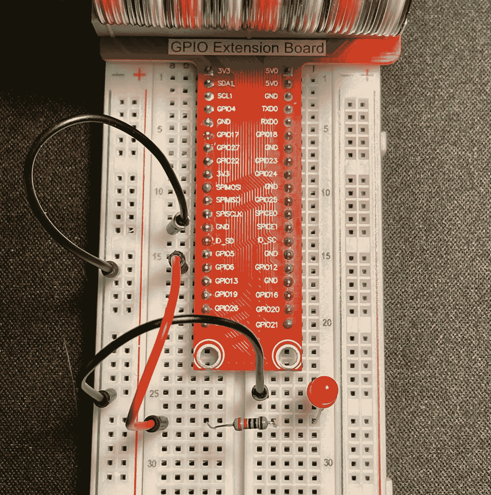
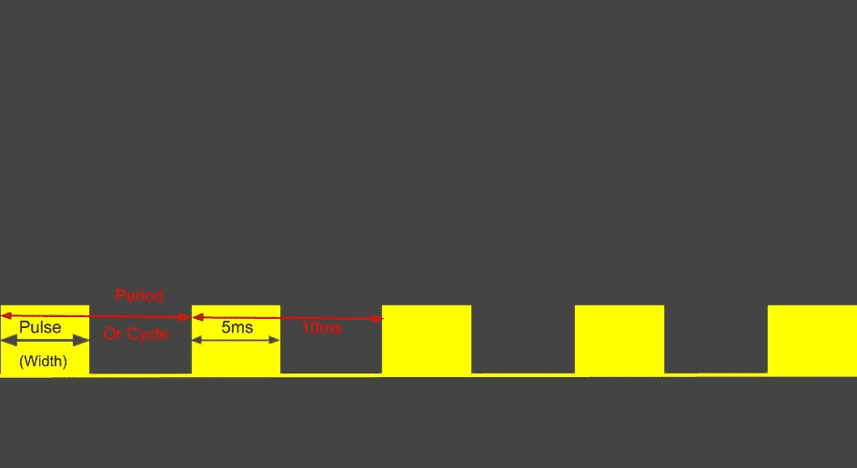
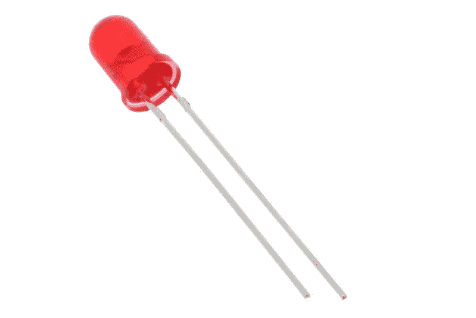
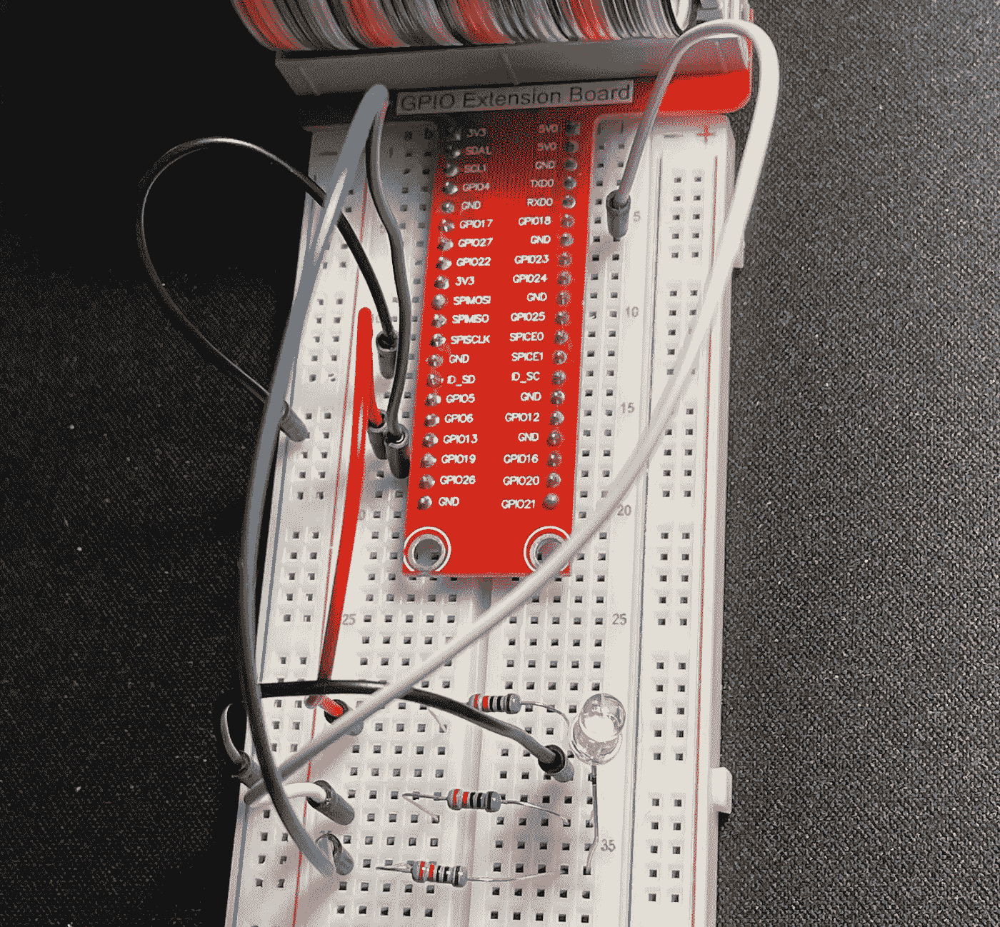
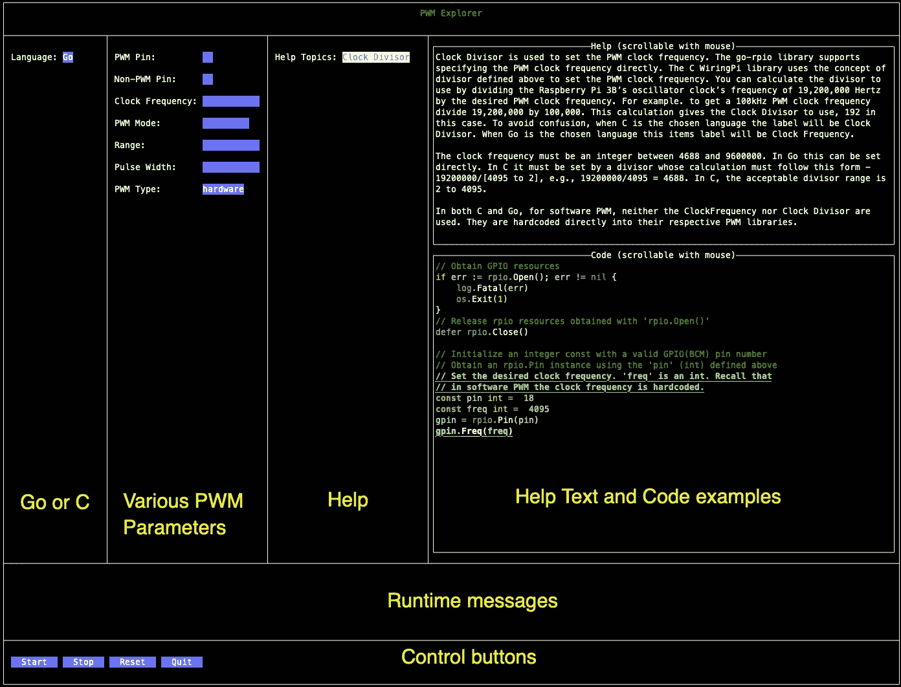
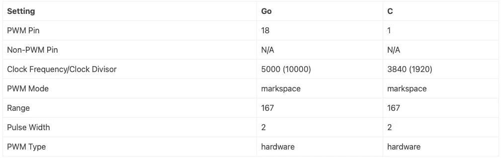
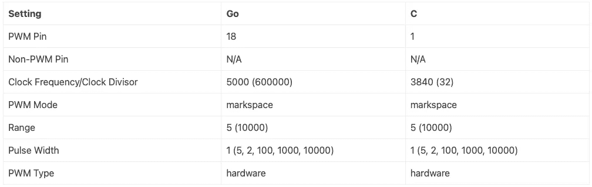
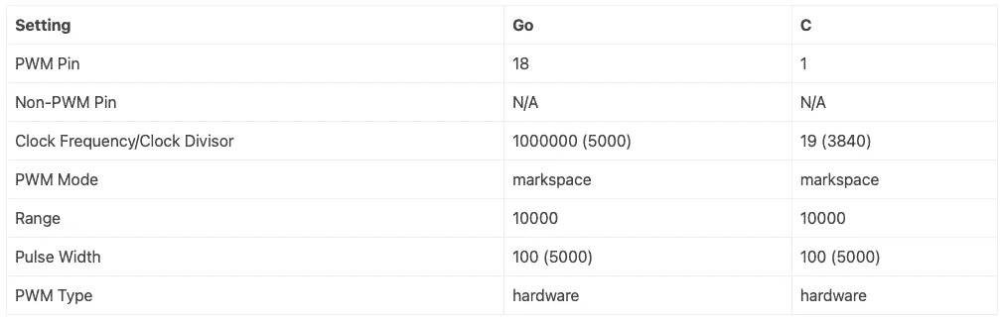
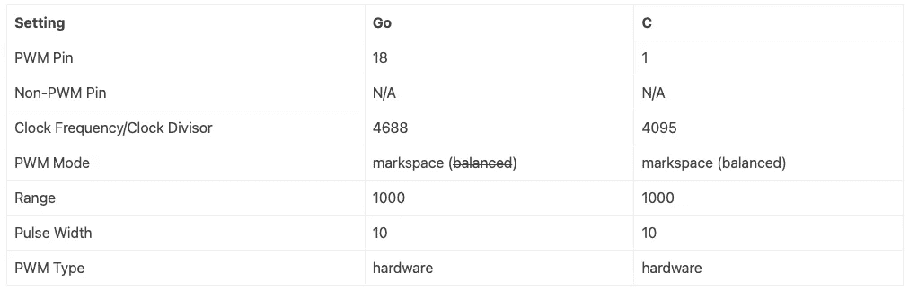

# 仿树莓 Pi 脉宽调制

> 原文：<https://betterprogramming.pub/raspberry-pi-pulse-width-modulation-for-dummies-10005f3f3583>

## 使用 C 和 Golang 了解 Raspberry Pi 上的脉冲宽度调制



图片来源:作者

本文详细介绍了基于硬件和软件的 rampberry Pi PWM，特别是带有 [Broadcomm BCM2835 板](https://www.raspberrypi.org/app/uploads/2012/02/BCM2835-ARM-Peripherals.pdf)的 3B+。本文附带了一个应用程序， [PWM Explorer](https://github.com/youngkin/gpio) ，可以用来试验 PWM 设置和功能。

# 概观

我正在写一篇[文章](https://youngkin.github.io/post/sunfoundergpionotesrgbled)作为 [SunFounder RGB LED 项目](https://docs.sunfounder.com/projects/raphael-kit/en/latest/1.1.1_blinking_led_c.html)的配套文章，以涵盖该项目中遗漏的一些领域，例如什么是 PWM，它是如何工作的，以及为什么代码是这样写的。我不知道 PWM 是什么，也不知道我在做什么，也不知道为什么。为了填补这个空白，我开始研究 PWM，并找到了许多关于 PWM 的文章(参考文献 2、3、4，以及一些软件库，如 [WiringPi](https://github.com/WiringPi/WiringPi) (C)、 [go-rpio](https://github.com/stianeikeland/go-rpio) (Go)、Mike McCalley 的[BCM 2835](https://www.airspayce.com/mikem/bcm2835)(C)和 [pigpio](https://abyz.me.uk/rpi/pigpio/pdif2.html) (Python & C)。因此，我仍然专注于通过 GPIO 和 PWM 控制 RGB LED，并开始用 C 和 Go 编写程序。我很快在几个方面遇到了困难:

1.  文章和库中的术语使用不一致。例如，有些人用术语*循环*和*范围*来表示同一事物。
2.  这些库都有不同程度的文档记录。加上缺乏通用术语，很难弄清楚如何使用它们。
3.  在弄清楚如何使用库的同时，很难理解不同的参数如何影响硬件的行为，在本例中是 RGB LED。

我写这篇文章的目的是:

1.  概述 PWM 及其主要概念。
2.  提供一个词汇表，将各种 PWM 术语与一致的定义联系起来。
3.  解释各种 PWM 设置如何相互作用(不仅仅是*占空比*)。
4.  提供在 Raspberry Pi 3B+上安装 GPIO 测试平台所需的信息(有时通过外部参考)。
5.  提供用 Go 和 C 编写的程序，演示如何有效地使用 [WiringPi](https://github.com/WiringPi/WiringPi) 和 [go-rpio](https://github.com/stianeikeland/go-rpio) 。
6.  提供可用于实时试验各种 PWM 参数的应用程序。
7.  提供一些难以找到的概念和 PWM 设置信息(例如，最小/最大 PWM 频率)。

以免有人认为我是 GPIO 和 PWM 方面的专家，我不是。尽管我尽了最大努力来总结我所学到的东西，但我确信我犯了错误，或者让事情变得更加混乱。我犯的任何错误都是我自己的。如果任何人遇到任何可以澄清的错误主题，我会很感激评论，这样我就可以修改这篇文章。

我写这篇文章并不是为了成为 PWM 的权威来源。有更好的资源。参见下面的**参考资料**部分，获得我认为特别有用的资源。

现在来看这篇文章的大纲。这些部分如下:

1.  **先决条件**涵盖了如何获得本文中使用的软件库以及 *PWM Explorer* 应用程序演示行为所需的硬件等内容。
2.  **什么是 PWM？**提供了 PWM 的基本介绍。它提供了文章和软件库中常用术语和别名的定义。
3.  **Raspberry Pi 3B+**概述 GPIO 和 PWM 如何在 Raspberry Pi 上实现。
4.  **探索 Raspberry Pi 上的 PWM**提供了各种 PWM 设置的描述，它们如何相互作用，一些很难找到的关于 PWM 设置的花絮，以及应用概述 *PWM Explorer* ，它可用于驱动 Raspberry Pi 上的 PWM，以查看设置如何实时相互作用。
5.  一个**总结**来总结事情。
6.  还有一套有用的**参考资料**。

# 先决条件

如果你没有，你需要一个树莓派。我在 Raspbian OS 的“拉伸”版本中使用了一个树莓派 3B+。Raspberry Pi 网站上有关于如何[从头开始设置一个新的 Raspberry Pi 的说明](https://projects.raspberrypi.org/en/projects/raspberry-pi-setting-up)，如果你决定走那条路，而不是购买一个完整的套件。

你需要的其他物品包括:

*   一个[试验板](https://www.amazon.com/dp/B082KBF7MM/ref=sspa_dk_detail_4?psc=1&pd_rd_i=B082KBF7MM&pd_rd_w=1tGTV&pf_rd_p=887084a2-5c34-4113-a4f8-b7947847c308&pd_rd_wg=fX8JB&pf_rd_r=44DE0RS1E9FD42RBYC7R&pd_rd_r=47cbdc7f-7834-455f-9429-ef74a438bd45&spLa=ZW5jcnlwdGVkUXVhbGlmaWVyPUFVVkdZVUZRNUw3ODkmZW5jcnlwdGVkSWQ9QTA4MzI4MzYyU0VLNzBJM0cxRUVMJmVuY3J5cHRlZEFkSWQ9QTA0Mjk1NTMzSzNSWlNFUjU0NURBJndpZGdldE5hbWU9c3BfZGV0YWlsJmFjdGlvbj1jbGlja1JlZGlyZWN0JmRvTm90TG9nQ2xpY2s9dHJ1ZQ==) *(你可能会发现* [*这个教程对试验板*](http://wiki.sunfounder.cc/index.php?title=Breadboard_Basics_%E2%80%93_Types) *很有帮助)*，
*   一些[跳线](https://www.amazon.com/dp/B08HZ26ZLF/ref=syn_sd_onsite_desktop_19?psc=1&spLa=ZW5jcnlwdGVkUXVhbGlmaWVyPUExRFpLWElCRjg1MUNMJmVuY3J5cHRlZElkPUEwMjMyMTE1M01aOFE3U1BQS09YSiZlbmNyeXB0ZWRBZElkPUEwODE5NTMxMktEMTlZRjEyQjBJNiZ3aWRnZXROYW1lPXNkX29uc2l0ZV9kZXNrdG9wJmFjdGlvbj1jbGlja1JlZGlyZWN0JmRvTm90TG9nQ2xpY2s9dHJ1ZQ==)，
*   [一个 220 欧姆的电阻和一个 RGB LED](https://www.amazon.com/EDGELEC-Tri-Color-Multicolor-Diffused-Resistors/dp/B077XGF3YR/ref=asc_df_B077XGF3YR/?tag=hyprod-20&linkCode=df0&hvadid=242051162351&hvpos=&hvnetw=g&hvrand=11064062033670066895&hvpone=&hvptwo=&hvqmt=&hvdev=c&hvdvcmdl=&hvlocint=&hvlocphy=9028749&hvtargid=pla-430228081645&psc=1) 。
*   您还应该考虑使用一个带有 T 型适配器的 [40 引脚母对母，将 GPIO 输出连接到试验板上。您只能使用跳线，但 T 型适配器将使事情变得更容易，并有助于防止损坏 Raspberry Pi 上的 GPIO 引脚。如果您选择不购买带 T 型适配器的 40 针电缆，您需要购买](https://www.amazon.com/dp/B082PRVRYR/ref=sspa_dk_detail_2?psc=1&pd_rd_i=B082PRVRYR&pd_rd_w=8mKhr&pf_rd_p=887084a2-5c34-4113-a4f8-b7947847c308&pd_rd_wg=e9psa&pf_rd_r=S09F37DF2G5FW8B8GX4B&pd_rd_r=c065c120-e60b-45e9-b93b-f581f048cf46&spLa=ZW5jcnlwdGVkUXVhbGlmaWVyPUFCMzhUQ09COFI2VlMmZW5jcnlwdGVkSWQ9QTA5NjU2ODUxRDkxNEYwSTYwV09KJmVuY3J5cHRlZEFkSWQ9QTAxOTg1MTUyRUhEUlc2VzQ2VDQ4JndpZGdldE5hbWU9c3BfZGV0YWlsJmFjdGlvbj1jbGlja1JlZGlyZWN0JmRvTm90TG9nQ2xpY2s9dHJ1ZQ==)[公母跳线](https://www.amazon.com/SinLoon-Breadboard-Arduino-Circuit-40-Pack/dp/B08M3QLL3Q/ref=pd_sbs_7/143-0445142-7950409?pd_rd_w=sVLrc&pf_rd_p=8b76d7a7-ab83-4ddc-a92d-e3e33bfdbf03&pf_rd_r=CDM5TGJT03VKF0ZFB577&pd_rd_r=8e58fd82-8503-41cf-b8f2-c78eaeb78d25&pd_rd_wg=tT1U0&pd_rd_i=B08M3QLL3Q&psc=1)。然而，单独购买所有这些东西会比一套花费更多。

[这里有一个简单的工具包，上面所有的](https://www.amazon.com/dp/B06WP7169Y/ref=sspa_dk_detail_5?psc=1&pd_rd_i=B06WP7169Y&pd_rd_w=OZVyf&pf_rd_p=887084a2-5c34-4113-a4f8-b7947847c308&pd_rd_wg=0V0IH&pf_rd_r=623YJTBQ2CN2B2GYXQG5&pd_rd_r=faa61f0f-3aec-4cf0-8e7e-d44eb1b3b92f&spLa=ZW5jcnlwdGVkUXVhbGlmaWVyPUEyUVlDQzMzVVZBMFYxJmVuY3J5cHRlZElkPUEwMzExNzk4MUhGSjFSS0VKTlBROCZlbmNyeXB0ZWRBZElkPUEwMzYwNjg2UUdMRU44N0YzNzIwJndpZGdldE5hbWU9c3BfZGV0YWlsJmFjdGlvbj1jbGlja1JlZGlyZWN0JmRvTm90TG9nQ2xpY2s9dHJ1ZQ==)。我发现 sun founder Raspberry Pi Ultimate Starter Kit 特别有用。*注:Ultimate Starter Kit 和 Raphael Kit 是同一产品。*


图片来源:作者

您还需要一些基本的 C 和 Go 编程知识，并且熟悉登录到 Raspberry Pi 终端，或者登录到一些操作系统版本附带的桌面 GUI。根据您采用的方法，您可能需要将键盘和显示器连接到 Raspberry Pi。我只是简单地进入 Pi。您还需要熟悉如何使用像 vim 或 nano 这样的编辑器。

为了编译和运行 C 程序，你需要 [WiringPi](https://github.com/WiringPi/WiringPi) 库。很容易得到:

```
sudo apt-get install wiringpi
```

然后使用以下命令测试安装:

```
pi@pi-node1:~/go/src/github.com/youngkin/gpio/rgbled $ gpio -v
gpio version: 2.50
Copyright (c) 2012-2018 Gordon Henderson
This is free software with ABSOLUTELY NO WARRANTY.
For details type: gpio -warrantyRaspberry Pi Details:
  Type: Pi 3B+, Revision: 03, Memory: 1024MB, Maker: Sony
  * Device tree is enabled.
  *--> Raspberry Pi 3 Model B Plus Rev 1.3
  * This Raspberry Pi supports user-level GPIO access.
```

在上面你会注意到`gpio version: 2.50`。如果你使用的是 Rasberry Pi 4，使用 Sunfounder [中给出的检查接线 Pi](https://docs.sunfounder.com/projects/raphael-kit/en/latest/check_the_wiringpi_c.html) 的说明。

WiringPi 的独特之处在于它包括一个命令行工具`gpio`，如上所示，可用于管理、控制和查询 GPIO 板。这非常方便。参见 [gpio 参考](http://wiringpi.com/the-gpio-utility/)了解更多关于它能做什么和如何使用的信息。

如果您对在 Raspberry Pi 上进行 Go 开发感兴趣，您需要将开发环境安装到 Raspberry Pi 上。[这里有一个简单的来源](https://www.jeremymorgan.com/tutorials/raspberry-pi/install-go-raspberry-pi/)解释了如何实现这一点。这个源代码有点过时了，但是唯一重要的问题是 Go to install 的版本。来源显示正在安装围棋**1.14.4.linux-arm64.tar.gz**和**1.14.4.linuxarmv6l.tar.gz**。目前的版本是**1.17.1.linux-arm64.tar.gz**和**1.17.1.linuxarmv6l.tar.gz**。对于树莓派 3B+正确的选择将是**1.17.1.linuxarmv6l.tar.gz**。另一个是为 64 位系统设计的，比如 Raspberry Pi 4 系列。你可以在 Golang 下载网站找到当前 ARM 版本的 Go。

对于围棋开发，你还需要 [go-rpio](https://github.com/stianeikeland/go-rpio) 库。

如果你想脱离 Sunfounder 文档的食谱风格，你需要一些 Linux 的基础知识。例如，我不会解释什么是根特权。

最后，我编写了一个应用程序，支持在树莓 Pi 3B+上试验各种 PWM 设置。获取代码有两种选择。首先，你可以从 GitHub 中克隆或者派生出[项目](https://github.com/youngkin/gpio.git)。如果你这样做，你需要有 git 的经验，并把它安装在 Raspberry Pi 上。更多细节参见这篇关于安装 git 的文章。安装完`git`后，您可以通过运行以下命令下载该项目:

```
git clone https://github.com/youngkin/gpio.git
```

如果你想为这个项目做贡献，请转到仓库。作为使用 git 的替代方法，您也可以通过导航到[项目的 URL](https://github.com/youngkin/gpio.git) ，点击文件列表上方和右侧的*代码*按钮，并选择*下载 ZIP* 来下载项目的 *zip* 文件。

# 什么是 PWM？

最基本的是，PWM 用于利用数字源(如 GPIO 引脚)模拟模拟信号。例如，可以通过改变提供给 LED 的电压来修改 LED 的亮度和/或颜色。各种模拟设备，如电机的速度，都可以用同样的方式控制。PWM 通过在给定持续时间内改变数字功率脉冲的长度来模拟变化的电压。

除了这里介绍的内容之外，[PWM 简介:脉宽调制如何工作](https://www.kompulsa.com/introduction-pwm-pulse-width-modulation-works/)描述了这里描述的一些相同的概念，以及一些如何使用 PWM 的例子。**参考**部分有更多 PWM 信息来源的链接。

以下部分涵盖了要点:

*   **术语**定义了将在整个文档中使用的术语
*   **主要概念**描述了主要概念

## 术语

我对 PWM 的研究包括阅读几篇文章以及检查几种不同语言的 PWM 软件库的代码。这些不同的来源使用的术语并不完全一致。以下是一些常用术语、它们的别名和定义。有关术语的直观表示，请参见下图。



PWM 时序图—图片来源:作者

*   **频率**——根据[维基百科](https://en.wikipedia.org/wiki/Frequency)，*频率是单位时间内重复事件发生的次数*。在电子学中，一个事件是一个波峰到下一个波峰(模拟)。在数字术语中，事件是从一个脉冲的前沿到下一个脉冲的前沿。频率以赫兹为单位，即每秒重复事件的次数。
*   **周期**——同样来自维基百科，*周期是重复事件中一个周期的持续时间。*周期以秒为单位。所以周期是一件事需要多长时间，而频率是一件事在给定时间内发生的次数。这使得周期是频率的倒数，反之亦然，即。、*每事件单位时间*与*每时间单位事件*。在上图中，周期为 10 毫秒(ms)。所以上图中的频率是`1/.01`或者 100。由于频率是以赫兹或事件/秒为单位测量的，所以上图中的频率是 100 赫兹。
*   **时钟源** —也称为时钟，它设置时钟前进的速率。
*   **PWM 时钟**——有时也被称为时钟，所以这有点让人困惑。PWM 时钟的基本输入是时钟源。不同的硬件设备，如电机和伺服系统，只在特定的周期范围内工作。对于这些器件来说，时钟源通常太快。PWM 时钟是通过将时钟源的频率除以一个数字来创建的，该数字将导致 PWM 时钟以适合给定器件的频率工作。不同的器件需要不同的 PWM 时钟速度。在此计算中用作分母的数字在软件库和 [BCM2835 数据手册](https://www.raspberrypi.org/app/uploads/2012/02/BCM2835-ARM-Peripherals.pdf)中经常被称为**除数**。
*   **脉冲** —来自 PWM 中的“P”。这是 PWM 引脚输出设为高电平或低电平的最短时间。其最小长度由 PWM 时钟的速度决定。我将在整个文档中使用 pulse，主要是因为它在名称中。
*   **范围** —范围可以被认为是一个计数 PWM 时钟脉冲的计数器。范围与 PWM 时钟频率之比可视为发送至 PWM 引脚的信号频率。我还见过周期长度这个术语被用作范围的别名。
*   **脉冲宽度** —脉冲宽度是一个脉冲的持续时间。在各种软件库中我见过叫*宽度*、*数值*、*数据*、*占空比长度*的。

# 基本概念

*   **占空比**是脉冲宽度与范围的比值，即`Pulse-Width/Range`。对于 10 的范围和 5 的脉冲，占空比是 5/10 或 50%。占空比调节 PWM 器件的输出电压。对于 50%的占空比和 5 伏的输入电压，输出电压将是 2.5 伏。
*   **软件与硬件 PWM**——就本文而言，有两种方式产生 PWM 信号，基于软件的和基于硬件的([还有一种方式](https://stackoverflow.com/questions/50427275/raspberry-how-does-the-pwm-via-dma-work))。基于硬件的 PWM 由专用硬件 PWM 设备产生，该专用硬件 PWM 设备可以被配置成产生如上所述的 PWM 信号。基于硬件的 PWM 产生非常一致的时序信号。例如，需要均匀的信号来产生无闪烁的光源，如 LED。基于软件的 PWM 直接在执行程序中实现，使用一个永不结束的`while(true)` for 循环，控制引脚允许电流流动(脉冲)的时间量与引脚不允许电流流动的时间量。在这种情况下，信号的一致性由语言的`sleep()`函数和 OS (Linux)调度程序的准确性决定。例如，不均匀的信号可能导致光源闪烁。在 Raspberry Pi 堆栈交换网站上有关于软 PWM 和 PWM 之间的差异以及相关利弊的更完整描述。
*   **平衡与传号/空号**是指用于确定如何产生 PWM 输出信号的方法。有两种算法，平衡和标记/间隔。平衡表示占空比将在整个范围内均匀分布。也就是说，脉冲宽度将被分成一组分布在整个范围内的更短的脉冲。相比之下，在传号/空号中，脉冲是作为称为“传号”的单个信号产生的。范围内剩余的时间`range-pulseWidth`称为“空间”。在空间持续时间内没有信号出现。标记/间隔通常足够好，但是随着周期变长，标记和间隔持续时间之间的绝对时间差也变长。对于大比率的`range/PWMClockFrequency`，例如 1 ( *，其等于 1Hz，因为分母单位是频率*)和 50%的占空比，空间将是 500 毫秒，标记将是 500 毫秒。这种差异大到足以在设备的行为中辨别出来。例如，电机可能会喘振或灯光闪烁。相反，平衡模式将消除这些差异。对于相同的 1Hz 范围和 50%占空比，平衡模式可能每 2 毫秒产生 500 个 1 毫秒信号(`1/(500 * .002) = 1 = 1Hz`)。产生相同的 50%占空比，但输出信号更加平滑。BCM2835 等硬件实现支持这两种算法。在软件中支持这两种算法是可能的，但是根据所实现的算法，它们可能会消耗大量的 CPU。

# 树莓 Pi 3B+上的 PWM 概述

物理 PWM 通过 BCM2835 的 GPIO 引脚实现。BCM2835 板有 40 个引脚，其中一部分是 GPIO 引脚。在 [GPIO 引脚](https://pinout.xyz/)中，有 4 个硬件 PWM 引脚，分别是 13、19、12 和 18。其余的 GPIO 引脚以及硬件 GPIO 引脚可用于软件 PWM。

BCM2835 板上有多个时钟源。本文中 GPIO 库使用的时钟源称为振荡器。它的频率在几个参考文献中记载为 19.2MHz，周期约为 52 纳秒(1 / 19，200，000 = ~0.000000052 秒)。

BCM2835 板还实现了一个称为通道的东西。硬件 PWM 引脚由一个通道控制。PWM 时钟、范围和脉冲宽度是为一个通道指定的。连接到该通道的所有硬件引脚将共享相同的范围、脉冲宽度和占空比。BCM2835 板有两个通道。GPIO 引脚 18 和 12 在一个通道上，13 和 19 在另一个通道上。这意味着，发送到共用一个通道的任一引脚的信号都会同时到达这两个引脚。例如，在 GPIO12 上发送信号也将与 GPIO18 共享，反之亦然。

# 在树莓 Pi 上探索 PWM

本练习的设置类似于组合 [SunFounder 闪烁 LED](https://docs.sunfounder.com/projects/raphael-kit/en/latest/1.1.1_blinking_led_c.html) 和 [Sunfounder RGB LED](https://docs.sunfounder.com/projects/raphael-kit/en/latest/1.1.2_rgb_led_c.html) 项目。如果你熟悉试验板的布线，下面的图表可能就是你需要开始的全部。否则，可能值得看看 Sunfounder 的 LED 项目和对试验板的[介绍](http://wiki.sunfounder.cc/index.php?title=Breadboard_Basics_%E2%80%93_Types) [10](https://youngkin.github.io/post/pulsewidthmodulationraspberrypi/#fn:10) 。两个图中使用的电阻都是 220 欧姆。



图片来源:[oomloout](http://www.oomlout.co.uk)


软件 PWM 的试验板布线—图片来源:作者

第一个设置将用于演示非 PWM 引脚上的软件 PWM。黑线是地线。上面的黑线将电路板 *GND* 引脚连接到试验板上的接地总线。下面的黑线将接地总线连接到红色 LED 的负极引脚(负极引脚较短)。红线代表正电流。它将 GPIO6 连接到红色 LED 的正极引脚(正极引脚较长)。注意跨接在红色导线和 LED 正极引脚之间的 220 欧姆电阻。这是为了避免烧坏 LED。



硬件 PWM 的 RGB 试验板设置—图片来源:作者

下一个设置将用于演示硬件 PWM 引脚上的硬件和软件 PWM。俯视试验板，RGB LED 引脚设置如下:

*   红色引脚位于 RGB LED 的顶部。它用红线连接到 GPIO 引脚 13。
*   地面是下一个倒下的。它用黑线连接到地面总线。与上面的红色 LED 一样，较长的那条腿是地面。
*   绿色大头针离地 1。它用白线连接到 GPIO 引脚 18。
*   蓝色引脚位于 RGB LED 的底部。它用蓝线连接到 GPIO 引脚 19。

与上图一样，220 欧姆电阻将 GPIO 引脚桥接至 LED 的红色、绿色和蓝色引脚。

该设置显示了连接到 GPIO 硬件 PWM 引脚 18 的 LED(白线)上的绿色引脚。可以使用不同的硬件 PWM 引脚，例如 12、13 和 19。此外，不需要使用 RGB LED。任何类型的 LED 都可以工作。不过，它必须以类似的方式接线，即 LED 正极引线应连接到硬件 PWM 引脚(白线)，LED 的接地引线(最长的引线)应连接到电路板的地。

如果您选择使用 RGB LED 引脚，请务必注意，只有两种颜色可以由硬件 PWM 控制。这些引脚需要位于不同的 PWM 通道上。在上图中，连接到 GPIO 引脚 13 和 19(蓝色和红色)的红色和蓝色引脚演示了这种限制。回想一下，GPIO 引脚 13 和 19 共享一个通道。因此，发送到一个引脚的信号会传播到另一个引脚。为了获得真正的 RGB LED 颜色，需要软件 PWM，以及不同通道上最多 2 个硬件引脚。虽然可以使用硬件引脚，但也可以使用所有非硬件引脚。

当上述两种设置同时连接时，使用不同的 PWM 设置组合会更容易。它允许任何 GPIO 引脚由 *PWM Explorer* 使用，但对于硬件 PWM，LED 必须安装在硬件 PWM 引脚上(GPIO 引脚 13、19、18 和 12)。如果使用一个以上的硬件引脚，它们必须在不同的通道上。

# 使用 PWM Explorer 驱动 PWM

PWM Explorer 支持 C 和 Go。选择 C，您可以尝试传号/空号和平衡 PWM 模式。我用的 Go 库， [go-rpio](https://github.com/stianeikeland/go-rpio) ，只支持 Mark/Space。

如上面的**先决条件**部分所述，我写了一个名为 *PWM Explorer* 的应用程序，在 Raspberry Pi 上试验 PWM。该软件可用于驱动 PWM 和非 PWM 引脚上的 PWM。它还支持改变各种 PWM 参数，如除数、范围和脉冲宽度，以直观地反馈这些参数对连接到引脚的 led 行为的影响。这个软件可以在我的 [gpio GitHub 库](https://github.com/youngkin/gpio)上获得。



PWM Explorer —图片来源:作者

上图是主程序的屏幕截图，标签上简要描述了用户界面的各个部分。这是一个基于文本的 UI，所以它可以在没有安装桌面功能的 Raspberry Pi 上运行。它可以通过导航到`gpio/pwmdemo/pwmexplorer`目录下的安装目录并运行`sudo /usr/local/go/bin/go run main.go`在命令行运行。需要`sudo`是因为一些 GPIO 访问需要`root`权限。除了主 UI 应用程序，在`gpio/pwmdemo/pwmexplorer/apps`目录中还有两个支持程序`freqtest.go`和`freqtest.c`。这些是使用 go-rpio 和 WiringPi 库与 Raspberry Pi 3B+上的 PWM 功能进行交互所需的代码的实际实现。分别用 Go 和 C 写的。必须在运行 PWM Explorer 之前构建 C 程序。这是通过切换到`gpio/pwmdemo/pwmexplorer/apps`目录并运行`gcc -o freqtest freqtest.c -lwiringPi -lpthread`来完成的。

支持多种 PWM 参数。这些是:

1.  **PWM 引脚** —此项允许您选择要使用的 PWM 硬件引脚。下拉列表中可用的 pin 特定于所选的语言。c 使用 WiringPi 库，该库使用自己的管脚编号方案。Go 使用标准 GPIO 引脚编号
2.  **非 PWM 引脚** —此项允许您指定要使用的 PWM 引脚，甚至是硬件引脚。PWM 引脚和非 PWM 引脚是互斥的，程序将阻止您指定两者。与上面的 PWM 引脚一样，编号方案特定于所选的语言，C 或 Go。该计划没有提供保护，防止使用错误的引脚编号方案，所以要小心你所指定的。如果所选的插针不符合预期，可能是因为您使用了错误的插针编号方案。
3.  **时钟频率/时钟除数** —此项用于设置 PWM 时钟频率。go-rpio 库支持直接指定 PWM 时钟频率。C WiringPi 库使用上面定义的除数概念来设置 PWM 时钟频率。通过将 Raspberry Pi 3B 振荡器时钟的频率 19，200，000 赫兹除以所需的 PWM 时钟频率，可以计算出要使用的除数。比如说。要获得 100kHz PWM 时钟频率，请将 19200000 除以 100000。这一计算给出了要使用的时钟除数，本例中为 192。为了避免混淆，当选择 C 语言时，标签将是*时钟除数*。当 Go 为所选语言时，该项目标签将为*时钟频率*。
4.  **PWM 模式** —此项用于指定是使用传号/空号模式还是平衡模式。注意:语言、引脚类型(PWM 与非 PWM)和 PWM 类型(硬件/软件)的某些组合不支持平衡模式。在这种情况下，在*消息*区域会显示一条消息。Go go-rpio 库不支持平衡模式。
5.  **范围** —在上面的**术语**部分中定义的期望范围。
6.  **脉冲宽度**——如上文**术语**部分所定义的所需脉冲宽度。
7.  **PWM 类型** —此项用于指定是使用硬件还是软件 PWM。

根据终端尺寸，一些*帮助*和*代码*文本可能不可见。为了解决这个问题，*帮助*和*代码*部分都是可滚动的。

## 试验 PWM 参数

如前所述，WiringPi 和 go-rpio 库都使用 Raspberry Pi 3B 的振荡器时钟，其频率为 19.2MHz。这是固定的，不能更改。但是除了所选的引脚之外，时钟频率/除数、PWM 模式、范围、脉冲宽度和 PWM 类型都可以修改。所有这些都直接或间接地相互作用。在这一部分，我将解释这些关系以及它们是如何相互作用的。您可以使用 PWM Explorer 直接查看我将解释的效果。

本节使用 LED 来演示各种参数对器件的影响。人眼有一个特性需要了解。人眼以对数方式感知亮度的线性变化。具体来说，在脉冲宽度设置的低端(较低电压)，给定设置的变化将产生比高端(较高电压)的相同变化更显著的结果 [18](https://youngkin.github.io/post/pulsewidthmodulationraspberrypi/#fn:18) 。PWM 浏览器不会对此进行补偿。

## PWM 时钟频率/时钟除数

首先要决定的是希望 PWM 时钟以什么频率运行。使用 Go 时直接指定其频率，使用 c 时通过除数指定，选择该频率受所用 PWM 器件类型的影响，例如 LED 或电机。本文并没有介绍如何计算这个频率，但是有资料可以介绍(参见参考文献 3 & 4)。相反，我将重点讨论时钟频率对 LED 器件的一般影响。

您可能知道也可能不知道，人眼可以检测到大约 60Hz 及以下频率的闪烁。使用周边视觉时，闪烁更明显。鉴于此，PWM 时钟频率范围`PWMClockFrequency / Range`低于 60Hz 是不理想的，除非你试图创造一个闪烁的 LED。假设范围不可修改，选择正确的时钟频率/除数将直接影响 LED 是稳定光源、闪烁还是闪烁。

这里有一些设置来尝试这个*(这些假设 LED 连接到 GPIO 引脚 18)* :



图片来源:作者

使用上述设置将导致引脚频率为 30Hz。因为这远低于 60Hz，所以闪烁会很明显。改变 PWM 时钟频率/时钟除数将导致引脚频率为 62.5Hz。结果将是没有明显的闪烁。

**注意:**BCM 2835 上的“通用时钟分频器”具有 12 位的寄存器宽度(参见 BCM2835 的 [Broadcom 规格，第 108 页，`DIVI`域位 23 至 12)。这意味着时钟除数的最大值是 4095 (0 到 2^12-1).go-rpio 进一步指出，低于 4688Hz 的 PWM 时钟频率将导致“意外行为”(rpio.go，参见`SetFreq()`功能的注释)。其他来源指出，9.6Mhz 是可用的最高 PWM 时钟频率(19.2Mhz/2)。我在低于 4688Hz 和高于 9.6Mhz 的频率下都看到了意想不到的结果。](https://www.raspberrypi.org/app/uploads/2012/02/BCM2835-ARM-Peripherals.pdf)

## 范围

范围有效地决定了 GPIO 引脚的信号频率。这意味着引脚的频率由`PWM Clock Frequency/Range`的比值决定。range 决定的另一个因素是进入设备的信号的分辨率。回想一下，占空比是脉冲宽度与范围的比值。从较低的范围值(比如 4)开始，将占空比限制为 0%、25%、50%、75%或 100%。换句话说，在 4 的范围内，唯一有意义的脉冲宽度值是 0、1、2、3、4。这反过来限制了 LED 亮度或闪烁的范围。

由于范围会影响引脚*的频率和*的分辨率，因此结合选择正确的 PWM 时钟频率、范围和脉冲宽度非常重要。从低 PWM 时钟频率开始会限制范围的选择，进而限制可用的占空比。

举个例子，让我们选择两个极端。首先，我们选择 PWM 时钟频率为 5kHz，范围为 5。分辨率为 5。这意味着只有 5 个可用的占空比，包括全开和全关。如上所述，这限制了像 LED 这样的灯的可用亮度设置。

下面是尝试这个例子的设置*(第二个例子的设置在括号内)*:



图片来源:作者

然后将脉冲宽度改为 5。这将是 LED 的最亮设置。虽然它明显比 1 的脉冲宽度更亮，但由于范围较窄，它并没有亮多少。

在另一个极端，让我们配置一个 LED 从关闭到全亮度非常平滑的过渡。这将需要更高的分辨率。让我们疯狂一下，决定我们想要 10，000 级的亮度。这意味着范围为 10，000。为了避免可见的闪烁，我们需要在 GPIO 引脚上有至少 60Hz 的信号。由于`PWM Clock Frequency/Range`的比值决定了引脚处的信号频率，我们将需要至少 600kHz 的 PWM 时钟频率。60Hz 的最小引脚信号频率的 10000 倍的范围是 600kHz (10，000 * 60 = 600，000)。检查我们的工作，`PWM Clock Frequency / Range`，60 万/ 1 万= 60 (Hz)。

## 脉冲宽度

在更高的 GPIO 引脚频率下，脉冲宽度会影响 LED 的亮度。在较低的 GPIO 引脚频率下，脉冲宽度可以通过 LED 开启的时间长度与闪烁速率来显示。让我们再次用极端的例子来说明这一点。

对于第一个例子，我们使用 1MHz 的 PWM 时钟频率和 10，000 的范围。GPIO 引脚的频率将为 100Hz，足够快以至于看不到闪烁。10，000 的范围同样足够高，以至于我们无法辨别 LED 亮度的离散步长。

以下是第一个示例的设置:



图片来源:作者

对于第二个示例，将时钟频率(Go)更改为 5000，时钟除数(C)更改为 3840，范围更改为 10000，脉冲宽度更改为 5000。LED 将闪烁非常短的时间，并且大约每 2 秒钟重复闪烁一次(时钟频率/范围，5000/10000 = 0.5Hz 或每 2 秒钟一次)。现在将脉冲宽度改为 5000。现在，LED 将亮起 1 秒钟，熄灭 1 秒钟。这使得占空比从 2%变为 50%，LED 闪烁的持续时间也相应改变。本例展示了如何使用 PWM 创建闪烁的灯，只需选择一个 PWM 时钟频率和范围，使 GPIO 引脚频率非常低，远低于 60Hz。

## PWM 模式

可用的 PWM 模式有平衡模式和占空比模式。回想一下，对于传号/空号，信号在范围内的固定持续时间内为开或关(高或低)。例如，占空比为 50%，范围为 10，信号将连续打开 5 秒钟，关闭 5 秒钟。如上所述，平衡模式将该 50%的占空比均匀地分布在整个范围内，这将使占空比的影响不太明显，除了 LED 的变暗(例如，10ms 脉冲，每 10ms，10 秒内 500 次)。

为了说明这种行为，将时钟频率设置为 4688 (Go)，时钟除数设置为 4095 (C)，PWM 模式设置为 markspace，范围设置为 1000，脉冲宽度设置为 10，PWM 类型设置为硬件。这导致 LED 以大约 4.69Hz 或几乎 5/秒的引脚频率闪烁。现在将 PWM 模式改为平衡模式。语言必须是 C 才能使用平衡模式，因为 go-rpio 只支持标记/空格。现在眨眼不再明显。



图片来源:作者

## PWM 类型

可用的 PWM 类型有*硬件*和*软件*。上面的例子只使用了硬件 PWM。这是因为真正的平衡模式仅在硬件上可用。此外，Go 和 C 中实现的软件 PWM 更类似于平衡模式，而绝对不是传号/空号模式。Go 和 C 版本都有硬编码的 100MHz 时钟。前面部分中的一些示例依赖于传号/空号行为，尤其是 PWM 模式部分。

## 其他可以尝试的事情

要了解上述方法在非 PWM 引脚上的工作原理，请使用 PWM 类型的软件在非硬件 PWM 引脚上尝试上述部分或全部方法。在这些测试中监控 CPU 使用情况可能会显示硬件 PWM 和软件 PWM 的 CPU 使用情况之间的一些差异。

## PWM 浏览器代码

在 [PWM 浏览器](https://github.com/youngkin/gpio) GitHub 库中的代码被广泛的评论。为了避免重复代码中最清楚的内容，这里就不多说了。这两个程序的结构基本上是相似的，尽管在如何使用 Go 和 C 库来完成相同的任务上有所不同。

## 关键要点

1.  在 Raspberry Pi 上，只有 4 个硬件 PWM 引脚和 2 个通道。每个通道有 2 个引脚。这将有效硬件 PWM 引脚的数量减少到 2 个。
2.  指定时钟频率或时钟除数时必须小心。PWM 时钟频率的可接受范围为 4688Hz 至 9.6Mhz。
3.  范围决定了 GPIO 引脚的频率和 LED 或电机等设备的信号分辨率。第一个因素是频率，因为在较低的引脚频率下，引脚的开/关状态变得非常明显，就像 LED 灯闪烁一样。第二个是分辨率，它很重要，因为它定义了设备控制的精细程度。例如，在低分辨率下，只有有限的一组 LED 亮度可供选择，差异非常明显。在更高的分辨率下，脉冲宽度的微小变化将导致非常小的、几乎不可辨别的亮度变化。这在实现诸如调光器之类的东西时很重要，在调光器中，从关闭到完全打开的亮度变化不应该以大的、可辨别的亮度步长变化。即希望在整个范围内有更平滑的过渡。
4.  对于更高的分辨率(范围)，应选择更高的 PWM 时钟频率。这确保 GPIO 引脚频率不会降得太低，例如，低于避免 LED 灯闪烁所需的 60Hz 频率。
5.  在更高的 GPIO 引脚频率下(例如，高于 60Hz)，改变脉冲宽度将导致 LED 看起来更暗或更亮。
6.  在较低的 GPIO 引脚频率下(例如，低于 60Hz，尤其是低于 10Hz)，脉冲宽度可用于产生明显的脉冲，如闪烁的 LED 灯。灯亮的时间长度与脉冲宽度成正比。
7.  PWM 模式的选择也会影响信号的“平滑度”。即使在通常会导致 LED 闪烁的低 GPIO 频率下，平衡模式也会减少这种影响，通常会使其变得不明显。
8.  PWM 类型(软件与硬件)会影响 PWM 信号周期的一致性，甚至超过 60Hz 时，LED 也会明显闪烁。它还会导致支持所需时钟速率所需的 CPU 负载量过大。
9.  可以使用软件 PWM，但产生的信号可能过于粗糙，不适用于某些器件。
10.  设置一个大于 PWM 时钟频率的范围可能看起来很奇怪，但它可以有效地用于创建一个低频脉冲信号，该信号可用于使 LED 闪烁等。

# 摘要

希望到现在为止，你已经有足够的知识在 Raspberry Pi 3B+上，或者在其他 Raspberry Pi 模型上，甚至在其他平台上有效地使用 PWM。具体来说:

*   我们已经讨论了各种术语，因此您现在应该能够阅读大多数关于 PWM 的文献，并理解这些资料中使用的概念和术语。
*   如果您在 Raspberry Pi 上安装并试验了 PWM，那么现在您已经在 Raspberry Pi 上安装了一个完整的、可工作的 GPIO 测试平台。
*   您应该了解各种 PWM 设置以及它们之间的相互作用。
*   如果您使用了 *PWM Explorer* 应用程序，那么您将拥有使用各种 PWM 设置组合的宝贵实践经验。当你有问题或测试假设时，你可以继续使用 *PWM 浏览器*来试验各种设置。
*   通过阅读 Go 和/或 C 代码，您现在知道如何有效地使用 go-rpio 和/或 WiringPi 库。即使你决定使用其他库，比如 [pigpio](https://abyz.me.uk/rpi/pigpio/pdif2.html) ，你也应该很好地理解这些术语，以便有效地使用它们，或者至少在学习如何使用它们方面有一个良好的开端。

# 参考

1.  [PWM Explorer](https://github.com/youngkin/gpio) 是本文附带的一个应用程序，可用于试验各种 PWM 设置。它使用 Go 和 C 库演示了 PWM。
2.  [微控制器定时器介绍:周期定时器](https://www.allaboutcircuits.com/technical-articles/introduction-to-microcontroller-timers-pwm-timers/)是一个很好的定时器通用介绍。PWM 硬件是一种周期性定时器。看这个介绍很有用。
3.  [微控制器中的脉宽调制(PWM)定时器](https://www.allaboutcircuits.com/technical-articles/introduction-to-microcontroller-timers-pwm-timers/)很好地详细讨论了 PWM 定时器。如果你想知道比这里更多的细节，这是一本很好的读物。
4.  [Raspberry Pi 和 C 中的物联网——脉宽调制、伺服等](https://www.iot-programmer.com/index.php/books/22-raspberry-pi-and-the-iot-in-c/chapters-raspberry-pi-and-the-iot-in-c/60-raspberry-pi-and-the-iot-in-c-pulse-width-modulation-servos-and-more)是一本关于在 Raspberry Pi 上编程 GPIO 的详细书籍。有一章专门讨论 PWM。
5.  WiringPi 是一个用于 GPIO 编程的 C 库
6.  [go-rpio](https://github.com/stianeikeland/go-rpio) 是用于 GPIO 编程的 go 库
7.  [Mike McCalley 的 BCM 2835](https://www.airspayce.com/mikem/bcm2835/)是另一个 GPIO 编程的 C 库。
8.  pigpio 主要是一个 Python 库。它还有一个 C 库。它的特点是在任何 GPIO 引脚上执行硬件 PWM。我不知道它是怎么做到的。
9.  [设置您的 Raspberry Pi](https://projects.raspberrypi.org/en/projects/raspberry-pi-setting-up) 是开始使用 Raspberry Pi 的官方文档，包括所需的硬件以及如何安装操作系统和其他重要细节。
10.  [试验板基础—类型](http://wiki.sunfounder.cc/index.php?title=Breadboard_Basics_%E2%80%93_Types)是对试验板及其使用方法的有用介绍。
11.  [WiringPi 库参考指南](http://wiringpi.com/reference/)记录了 WiringPi 的主要功能。网站的其余部分也有一些有用的信息。
12.  维基百科上的频率页面讨论了频率和周期
13.  [频率-周期计算器](https://www.sensorsone.com/frequency-to-period-calculator/)便于快速计算或验证频率-周期转换(周期= 1/频率)。
14.  BCM2835 的[完整 Broadcom 规格，从第 138 页开始，了解有关 BCM2835 如何实现 PWM 的更多详细信息。](https://www.raspberrypi.org/app/uploads/2012/02/BCM2835-ARM-Peripherals.pdf)
15.  关于[RPi 3B 上的哪个(哪些)引脚支持 PWM](https://www.raspberrypi.org/forums/viewtopic.php?t=150254)有详细的讨论。特别是关于 4 个 PWM 引脚共享 2 个 PWM 通道的效果。Broadcom spec [14](https://youngkin.github.io/post/pulsewidthmodulationraspberrypi/#fn:14) 也在第 139 页的第 9.4 节讨论了这一点，但方式不太明显。
16.  产生 PWM 信号有第三种方式， [DMA 或直接存储器访问](https://stackoverflow.com/questions/50427275/raspberry-how-does-the-pwm-via-dma-work)。本文这里就不讨论了。
17.  [RaspberryPPi 引脚排列](https://pinout.xyz/)是一个很好的来源，它描述了每个引脚的作用、物理引脚编号，对于 GPIO 引脚，还描述了 BCM2835 板的 GPIO 引脚编号。它有选项卡，可用于突出显示哪些引脚用于何种目的，例如 PWM 引脚。
18.  [线性 LED PWM](https://jared.geek.nz/2013/feb/linear-led-pwm) 提供了通过 PWM 改变 LED 亮度时获得线性比例的指南/公式。在谷歌上搜索“LED PWM 线性亮度”,还会出现其他几篇文章。
19.  [驱动 PWM 输出频率](https://raspberrypi.stackexchange.com/questions/53854/driving-pwm-output-frequency)提供了一些关于 26 和 40 GPIO 引脚的 Raspberry Pis 的有趣信息和讨论。