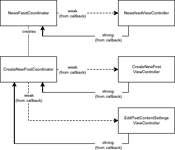

# 重新思考 iOS 协调员，构建可扩展的应用

> 原文：<https://betterprogramming.pub/re-thinking-ios-coordinators-f66d630534db>

## 如何让你的 iOS app 重用导航逻辑？重新思考通用 iOS 协调器的实现

资料来源:Undraw.co

在本文中，我们将回顾什么是协调器，实现它的最常见的方法之一，它有什么问题，以及我们可以做些什么。

# 问题定义

`Coordinator`是一个类，它定义了如何以及何时通过对不同输入(如回调、通知等)做出反应来进行屏幕转换的规则。

假设您有这些屏幕用于查看新闻提要和创建新帖子:`NewsfeedViewController`、`CreateNewPostViewController`、`EditPostContentSettings`

按照通常的 MVC 方式，您可能会将转换定义为:

让我们一步一步地浏览上面的代码。

`#1`方法是设置`CreateNewPostViewController`当用户决定增加一个新的帖子并负责呈现。

`#2`方法处理`EditPostContentSettingsViewController`的设置，当用户想要改变他们的新内容偏好时，包括何时自动销毁帖子，以及它是否对所有人公开。

在上面的方法中，每个视图控制器都知道:

*   处理请求的用户动作需要什么类
*   如何设置另一个需要显示的视图控制器
*   什么是当前的呈现上下文(当前页面以模式呈现还是在导航栈中呈现)
*   如何基于当前的呈现上下文呈现另一个视图控制器
*   如何处理其他视图控制器回调或输出数据(屏幕或用户流结果)

以上所有这些都有以下缺点:

*   视图控制器之间的紧密耦合(每个屏幕都知道它当前的视图控制器，或者在某些情况下甚至更糟——子流知道它当前的父流的相反方向)
*   视图控制器的尺寸越来越大

# 拟议解决方案

协调员旨在帮助我们做到这一点。让我们回顾一下主要优势:

*   负责转换到另一个屏幕和任何必要的设置，从而减少视图控制器的代码量
*   如果协调器流中的不同视图控制器显示相同的屏幕，导航代码可以重用
*   更容易编写单元测试。只需用所需的数据触发回调，然后检查导航栈的外观
*   有助于清楚地确定视图控制器及其输出的用途。输出可以是用户创建/编辑/删除/查看动作的意图，这导致移动到另一屏幕

让我们重构上面的代码，看看转换逻辑现在是否分离了:

在上面的代码中，我们做到了:

1.  定义协调器，该协调器呈现新闻提要并启动任何子流或呈现当前流中涉及的其他屏幕
2.  处理用户意图以打开创建新新闻订阅源帖子的屏幕
3.  定义另一个协调器，该协调器处理新的帖子创建，并以与前一个相同的方式启动任何子流或呈现当前流中涉及的其他屏幕
4.  使用附加参数处理用户操作，以显示作为创建新发布流程一部分的屏幕

好的一面是，你可以开始逐渐地在你的项目中引入协调者。

# 通用协调器与当前解决方案

与上面的示例代码和您在互联网上可以找到的更常见的实现的一个关键区别是符合如下协议:

上述解决方案的缺点是，协调器表示它们自己的层次结构，与由视图控制器和视图组成的窗口堆栈相分离。

当需要呈现子流程时，保持对子流程的引用要求我们也释放该引用，这并不总是简单的。

这些情况的一个例子是，根屏幕可以通过向下滑动半模式屏幕来消除，或者如果子协调器正在共享应用根导航控制器，并且用户决定从屏幕边缘滑动返回，或者应用的另一部分决定改变当前显示的屏幕，并且忘记取消分配属于当前上下文的所有资源，例如协调器。

这最多会导致内存泄漏，在使用服务层事件监听器的某些情况下，还会导致已经未使用的协调器所显示的屏幕发生变化。

考虑到这一点，最好让呈现的视图层次结构拥有呈现它们的协调器的所有权，方法是在回调中强烈引用它们。

视图控制者和协调者之间通过回调的弱/强关系

关于`start()`方法，它通常不提供足够的灵活性来覆盖所有可以传递到那里的属性，并且在某些情况下使用泛型会导致使用类型擦除的需要，您也必须编写类型擦除，因此除非您真的需要它，否则最好从原始的协调器类开始，不符合并基于您的项目需求构建所需的内容。

# 进一步的想法

协调员可以提供帮助的其他领域有:

*   深度链接和推送通知处理
*   基于服务层事件的屏幕转换(通知/ KVO /网络轮询 HTTP 请求结果/来自 Web 套接字的更新)
*   通过断言窗口高级视图/视图控制器在导航控制器或呈现的模式堆栈中的存在来单元测试屏幕转换

当然，有了这些好处，我们也可以列出一些缺点，包括:

*   向开发团队介绍新的模式不是一件容易的事情，需要时间
*   转换到流/事件/屏幕输出的思维模式是困难的，并且不总是明确的
*   为了进行适当的协调内存管理，我们需要在视图控制器结果回调中一致地使用弱引用。关键是使用强引用来引用协调器，而视图控制器只能是弱引用

# 结论

总之，协调器是将项目扩展到许多屏幕的一种很好的方式，并且对您支持的应用程序功能以及如何在应用程序中进行转换有更清晰的定义。

它带来了一些好处，比如更容易的测试、代码重用和更好的代码分离。它不需要您重新编写整个应用程序来使用新概念，并且可以很容易地开始新的流程。

这应该给你足够的理由考虑使用它，看看它是否更适合你已经有的屏幕管理解决方案。

你认为它会很适合你的应用吗？如果你想分享，让我知道为什么它会或不会是一个好主意，我们可以一起进一步讨论。