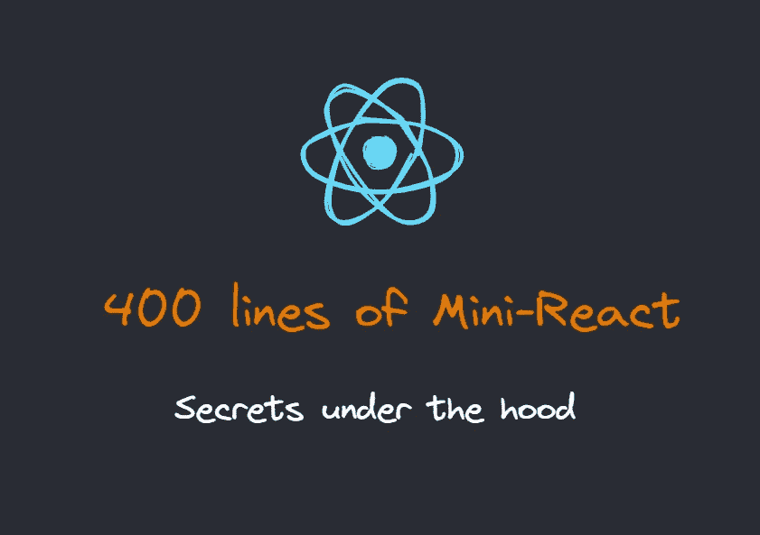
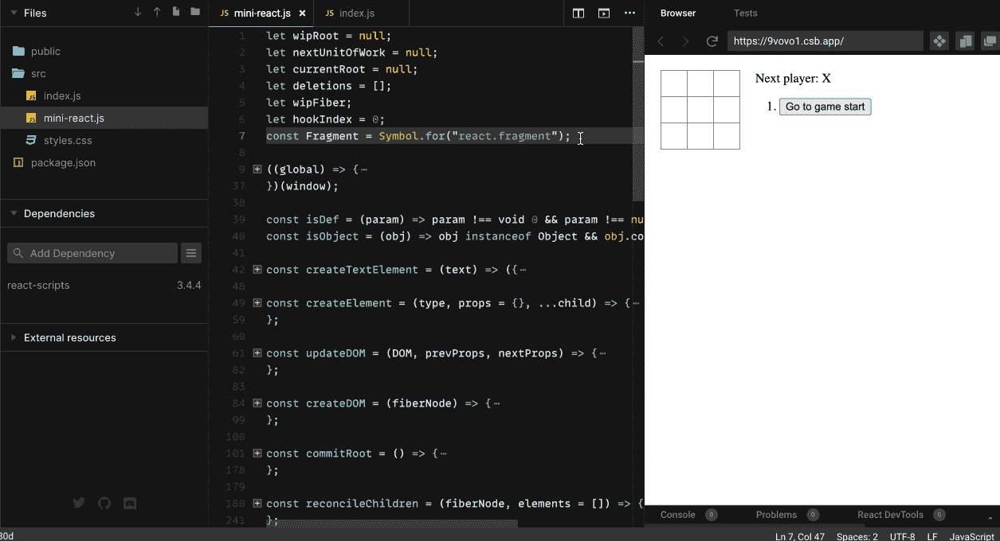
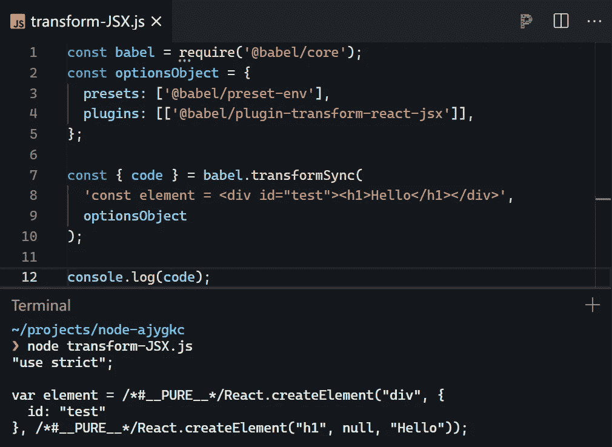
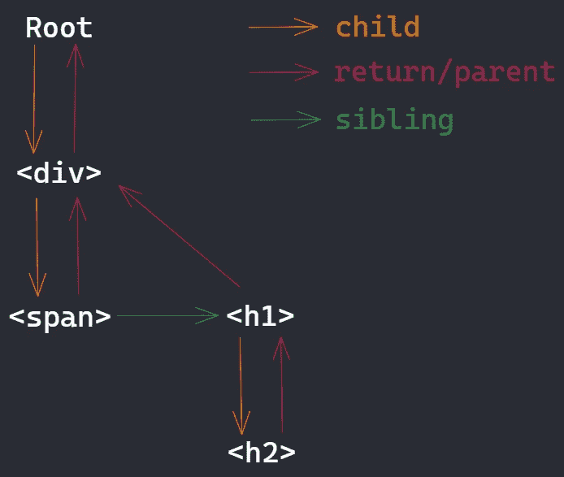

# React 18 已经发布。用 400 行代码实现迷你反应

> 原文：<https://betterprogramming.pub/react-18-has-been-released-implement-mini-react-in-400-lines-of-code-837559761758>

## React 18 中实现异步可中断更新的最小模型！

React v18 已经发布，给我们带来了很多特性，但是最重要的特性是一个异步可中断更新，很多新的上层 API 都是依靠它创建的。可以说是 React v18 的底层引擎。

本文将使用大约 400 行代码带您实现一个可以异步更新和可中断的迷你 React。一个简单的运行截图:

我用了 React 官网提供的[井字游戏教程示例](https://reactjs.org/tutorial/tutorial.html#what-are-we-building)，可以看到效果很完美。另外，目前支持函数组件和类组件，可能满足你 80%的需求！我也把它放在了 [GitHub](https://github.com/islizeqiang/mini-react) 上，你也可以在本地克隆，跟着我的文章一步一步调试。

这是我在看了很多 React 的源代码后创建的，它在整体逻辑和函数命名上与 React 基本相同，如果你对 React 的内部感兴趣，这篇文章是给你的！

# JSX 和创造元素

相信你对 JSX 的反应并不陌生。我们用 JSX 来描述 DOM，它们最终会被 babel 转换成 React 提供的 API。例如下面的代码:

您也可以在 StackBlitz 上亲自尝试(在终端中输入`node transform-JSX.js`):

你也可以在编译后的字符串中添加更多的元素来查看最终的结果，我在这里直接给出 React.createElement 提供的选项:

1.  类型:表示当前节点的类型，比如上图中的`div`。
2.  config:表示当前元素节点上的属性，比如上图中的`{id: "test"}`。
3.  children:子元素，可以是多个简单文本，也可以是 React.createElement 创建的子节点。

然后根据这个需求实现一个自己的`React.createElement`，就像下面的代码，我们定义一个自定义的数据结构。

# 提供；给予

然后，我们可以基于上面创建的数据结构实现一个简化版本的渲染函数，将 JSX 渲染到真实的 DOM。

下面的代码演示将使用 CodeSandbox，拖动左栏查看代码，点击上方菜单按钮查看目录结构。您也可以直接编辑以查看显示的结果。

所以你可以看到它的工作，但现在它只渲染一次，不能与我们互动。

另外，请注意，我们在这里使用`react-scripts@3.4.4`来帮助转换 JSX，API 在以后的版本中有所改变，但是在最后仍然调用`React.createElement`。官博这里是[这里是](https://reactjs.org/blog/2020/09/22/introducing-the-new-jsx-transform.html#whats-different-in-the-new-transform)。我提供的 [GitHub 库](https://github.com/islizeqiang/mini-react/blob/master/vite.config.ts)使用了`Vite`而不是`react-scripts`。

接下来是 React 的核心——纤程架构和并发模式，从 React 17 开始提出，主要是为了解决完整的元素树一旦递归，就无法**终止**的问题，这可能会导致主线程被长时间阻塞，那些高优先级的任务(比如用户输入或者动画的任务等等。)不能及时处理。

所以在 React 源代码中，工作被分解成小单元。**浏览器一旦空闲，就会处理这些小的工作单元，然后将结果映射到真正的 DOM，直到全部处理完毕。**

`requestIdleCallback`是一个实验性的 API，在浏览器空闲时执行回调。接下来，我们将使用这个 API 来简单地实现这个特性。我会在最后给出 React 目前使用的[调度器包](https://github.com/facebook/react/tree/main/packages/scheduler)的模拟实现。

在开始写下一段代码之前，我想再介绍一下工作单元之间的联系。

就像上图一样，我们将创建每个纤维节点之间的连接，就像一个链表，它们是

1.  child:父节点指向第一个子元素的指针。
2.  return/parent:所有子元素都有一个指向父元素的指针。
3.  sibling:从第一个子元素开始，指向下一个兄弟元素。

所以现在你可以愉快地编码了:

尽管添加了这么多代码，我们只是重构了`render`逻辑。重构后的调用顺序是`**workLoop**`**->-**-`**performUnitOfWork**`->--`**reconcileChildren**`。接下来，我来总结一下各个功能的作用:

1.  `workLoop`:连续调用`requestIdleCallback`获得空闲时间。如果它当前是空闲的，并且有单元任务要执行，那么执行每个单元任务。
2.  `performUnitOfWork`:执行的具体单位任务。这就是链表思想的体现。具体来说，一次只处理一个纤程节点，返回下一个要处理的节点。
3.  `reconcileChildren`:调和当前纤程节点，实际上是虚拟 DOM 的比较，记录要做的更改。你可以看到我们直接在每个纤程节点上修改和保存，因为现在只是对 JavaScript 对象的修改，并没有触及真正的 DOM。
4.  最后一步是`**commitRoot**`。如果当前需要更新(根据`wipRoot`)并且没有下一个单元任务要处理(根据`!nextUnitOfWork`)，这意味着虚拟变化需要被映射到真实 DOM。`commitRoot`是根据纤程节点的变化修改真实的 DOM。

到目前为止，我们已经实现了光纤架构，是时候见证它的威力了。

我们想给组件添加状态，所以让我们实现一个`useState`。

`useState`巧妙的保留了钩子在纤程节点上的状态，并通过队列修改状态。从这里我们也可以知道为什么`React-hooks`要求每次调用的顺序不能改变。

除此之外，我们还实现了一个`Component`，它在这里被简单地转换为一个 render 方法，并添加了一点它的唯一标识。

# 模拟请求回调

现在我们几乎实现了所有的功能，下面我来解释一下 React 目前采用的[调度器包](https://github.com/facebook/react/tree/main/packages/scheduler)，它其实是一个比 requestIdleCallback 更复杂的调度逻辑，包括更新任务的优先级等等。

以上是我参考的[调度器](https://github.com/facebook/react/blob/main/packages/scheduler/src/forks/Scheduler.js)实现 mock requestIdleCallback，它结合了`requestAnimationFrame`和`MessageChannel`。这里使用`MessageChannel`的目的是使用宏任务处理每一轮单位任务。

那么为什么要使用宏任务呢？

为了放弃主线程，浏览器可以在这个空闲期间更新 DOM 或者接收事件。因为浏览器更新 DOM 是一个**单独的任务**，而此时不会执行 JavaScript，因为主线程一次只能运行一个特性，要么执行 JS，要么处理 DOM 计算样式，要么接收输入事件等。

**为什么不用微任务？**

因为每一轮宏任务中都包含了微任务，所以在所有微任务执行完毕之前，也就是当前宏任务没有完成的时候，不能放弃主线程。

**那么为什么不用** `**setTimeout**` **？**

因为如果`setTimeout`被嵌套调用 5 次以上，就会认为该函数被阻塞，浏览器会将最小时间设置为 4ms，所以不够精确。

# 最终版

下面是最终版本，可以看到 React 的核心思想在去掉注释后，用不到 400 行代码实现。

我还在 Github 资源库中添加了 Mini-React 的 [TypeScript 版本](https://github.com/islizeqiang/mini-react/blob/master/src/mini-react.ts)，如果你有兴趣可以去看看，非常欢迎投稿。

*感谢阅读。如果你喜欢这样的故事，想支持我，请考虑成为* [*中会员*](https://medium.com/@islizeqiang/membership) *。每月 5 美元，你可以无限制地访问媒体内容。如果你通过* [*我的链接*](https://medium.com/@islizeqiang/membership) *报名，我会得到一点佣金。*

你的支持对我来说很重要——谢谢。