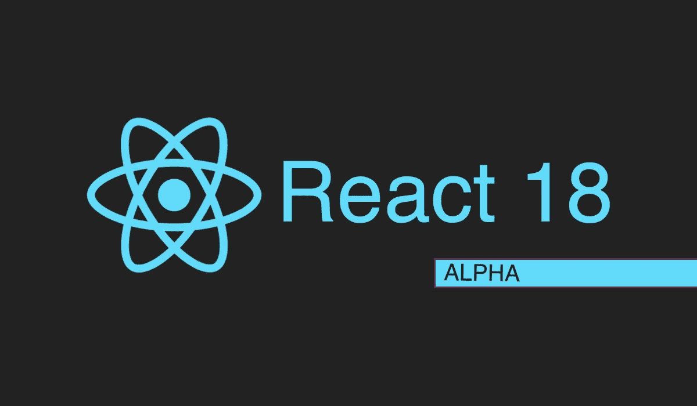

# React 18 来了！什么是新的？

> 原文：<https://betterprogramming.pub/react-18-is-here-what-is-new-e72e1efd57d6>

## 自动批处理、startTransition、SSR 改造等等



作者截图。

React 18 将会是一个激动人心的版本。首先，React 团队正在尝试一种新的方法。他们邀请了一组专家、开发人员、库作者和教育工作者加入工作组。它最初将是一个小团体。

我们其余的人能做什么？即使我们不能在这个版本中扮演积极的角色，但我们可以关注他们 GitHub 讨论组中的所有内容。看到想法和功能是如何形成的是非常令人兴奋的。

该版本将主要关注:

*   一些现成的性能改进
*   新的并发功能
*   服务器端呈现区域的改进

# 发布状态

该版本仍处于早期阶段。React 的团队旨在从图书馆作者那里收集尽可能多的反馈。这就是他们发布早期 alpha 版本的原因。

我们可以通过以下方式立即安装:

```
npm install react@alphanpm install react-dom@alpha
```

这些 alpha 版本是使用主回购中最近的提交构建的。当任何特性/bug 被合并时，它将在下一个工作日出现在 alpha 中。这绝不适合生产环境。

现在让我们来看看新特性。

# 1.创建根

React 18 将附带两个根 API:

*   `ReactDOM.render`:创建一个在“遗留”模式下运行的根目录。根节点将像在 React 17 中一样工作。
*   `ReactDOM.createRoot`:它创建了一个运行在 React 18 中的 root，带有一些新的开箱即用的好东西。

与之前的全有或全无方法不同，这给了你逐步选择 React 18 的机会。自从上一个版本发布以来，他们一直在努力使升级到新版本变得更加容易。

## **两者之间有什么变化？**

*   如果你没有使用新的`createRoot` API，你将会错过开箱即用的改进。我们将在以后看到那些是什么。
*   移除`hydrate`功能以支持配置参数。

之前怎么做补水:

下一个版本如何补水:

*   根的渲染`callback`已经被移除。

之前:

现在:推荐的方式是在根节点上使用`requestIdleCallback`、`setTimeout`或者一个`ref callback`。

使用`ref callback`方法的示例:

# 2.自动更新批处理

在这个版本之前，React 只对事件处理程序内部发生的更新进行批处理。批处理更新是什么意思？这意味着它将对一个处理函数上发生的所有状态更新进行分组。那么它将只重新呈现组件一次，而不是每次状态改变都呈现一次。

让我们看一个例子:

注意，`handleClick`正在更新`count`和`odd`状态。React 足够聪明，可以将两者组合在一起，只需重新渲染组件一次。您可以在 [CodeSandbox](https://codesandbox.io/s/spring-water-929i6) 上尝试 React 团队的原始示例。

那么这个新版本有什么变化呢？配料机制远非完美。它仅限于批处理事件回调中运行的状态更新。如果事件处理程序在异步函数中包含一些状态更新，这些更新就不会被批处理。

现在，通过使用 React 18 的`createRoot` API，这些将被自动批量处理。引擎将足够智能地对这些进行分组，即使它们是异步发生的。

如果你想退出那种行为呢？他们为此增加了一个新的 API:`flushSync`。

让我们来看看它的一个使用示例:

上面的代码现在将触发两次重新渲染。预计这不会是一个常见的场景，但是工具就在那里，以防你需要它们。

在这个版本之前，这个问题有一个解决方案。他们加了一个`unstable_batchedUpdated`功能。您可以包装状态更改来对它们进行批处理。虽然它变得多余，但在这个版本中还没有被删除。会在不久的将来。

# 3.开始过渡

对于 React 团队来说，应用程序响应一直是一个至关重要的主题。这就是他们一直在开发并发模式特性的原因。在并发模式下，渲染不会阻塞。它是可中断的。这意味着您可以确定哪些更新对您的应用程序至关重要。

用户与之交互的任何东西都应该是有响应的。不然 app 感觉很迟钝。例如，如果用户在输入搜索中键入一些内容，显示用户键入的内容比显示结果更重要。

`startTransition` API 将允许您将状态更新标记为不太紧急。这将让渲染引擎优先处理更重要的问题。

我们来看一个小例子:

如果您想通知某人更新正在进行，该怎么办？这里有一个钩子:

这个新的 API 是另一个工具，可以让您根据自己的特定需求调整应用程序的性能。

# 4.SSR 改进

安全部门改革经历了重大改革。为了提供更好的用户体验，内部的很多东西都被改变了。这些改进大部分是自动的，尽管也有一些是选择加入的。

## **流 HTML**

以前，SSR 的一个警告是，在流传输 HTML 之前，您必须等待整个树被加载。现在，您可以流式传输 HTML 页面的各个部分。

它是如何工作的？通过将任何组件封装到`<Suspense>`中，React 不会等待这些组件开始传输 HTML。它将显示`fallback`,稍后用该成分替换它并水合它。它将如何做到这一点？通过一个`<script>`标签发送剩余的 HTML 代码。

通过将`<Comments/>`组件包装到`<Suspense/>`中，我们告诉 React 它不需要等待注释就可以开始为页面的其余部分传输 HTML。

让我们看一个 React 团队的例子:


由这个 [CodeSandbox app](https://codesandbox.io/s/festive-star-9hfqt?file=/src/App.js) 的作者捕获。

请注意，即使`Comments`尚未在服务器中获取，内容也是如何流动和水合的。在`<Comments/>`组件被传输到客户端之前，会呈现`<Suspense>`回退。当它被流化时，它将替换`<Suspense>`占位符。

要选择这种行为，您需要使用`pipeToNodeWritable` API:

```
// will be moved to react-dom/server
import { pipeToNodeWritable } from 'react-dom/unstable-fizz';
```

您必须将 SSR 呈现代码包装在`pipeToNodeWritable`函数中。

## **选择性水合**

在以前的版本中，`hydration`进程可能会损害用户的页面交互性。在与页面交互之前，您必须等待它完成。

通过在`Suspense`中包装组件，不再是这种情况。水合作用发生在浏览器可以处理事件的小间隙中。

另一种情况是用户可以影响水合作用。假设一个组件已经加载，但是还没有水合，用户点击它。React 现在可以优先考虑该组件的水合作用。它将记录这种相互作用，并在组件完成水合作用后重放。当不需要紧急任务时，它将继续与组分的其余部分水合。

水合过程大大改善了。它将帮助我们提供更加无缝和互动的体验，同时提高我们应用程序的性能。

# 最后的想法

React 17 是一个“无聊”的版本。它主要致力于使 React 本身的升级变得更加容易。这个版本将是相反的。它包含了许多功能。请记住，因为是测试版，所以最终版本会有变化。

在这个版本中，大多数特性似乎都围绕并发运行。这是个好消息，因为这将帮助我们提高应用程序的速度和效率。有了这些新工具，我们将能够更好地调整它们的性能。

升级策略很简单:您可以逐步选择加入新功能。React 中全有或全无升级的日子已经一去不复返了。这对大型代码库尤其有用。

# 相关文章

[](/javascript-es2021-a-look-at-the-new-features-7d5770288648) [## JavaScript ES2021:看看新特性

### 新 ES12 规格概述

better 编程. pub](/javascript-es2021-a-look-at-the-new-features-7d5770288648) [](/7-tips-to-write-efficient-and-performant-javascript-code-bccbdb9662ae) [## 编写高效高性能 JavaScript 代码的 7 个技巧

### 提升您的 JavaScript 应用程序的性能

better 编程. pub](/7-tips-to-write-efficient-and-performant-javascript-code-bccbdb9662ae)