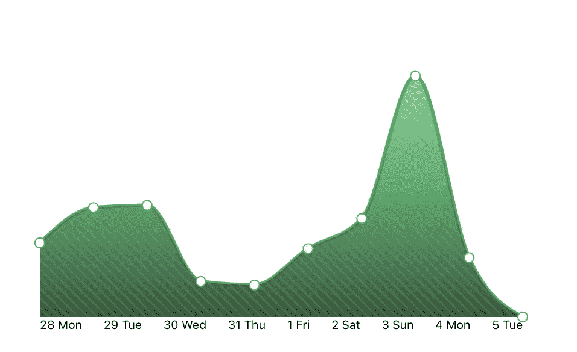
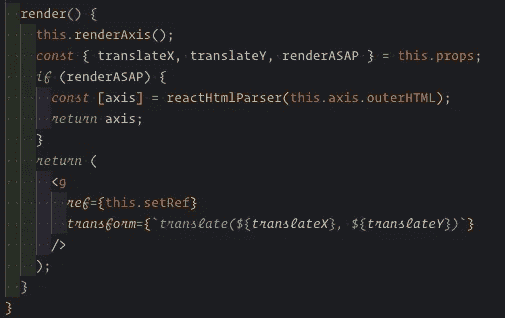
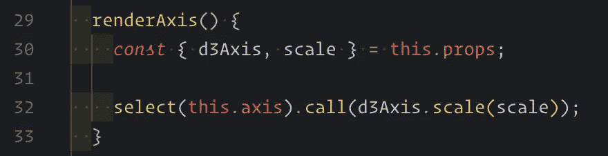
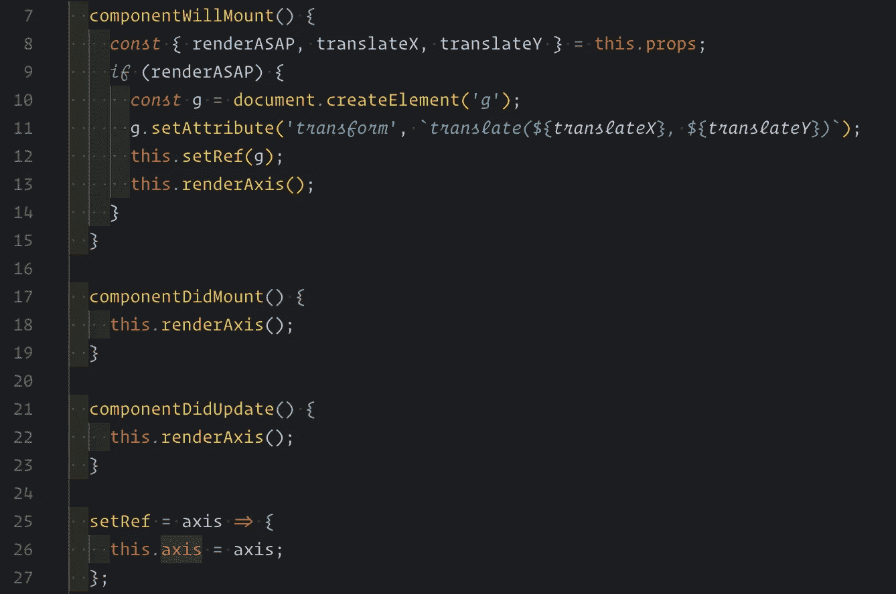
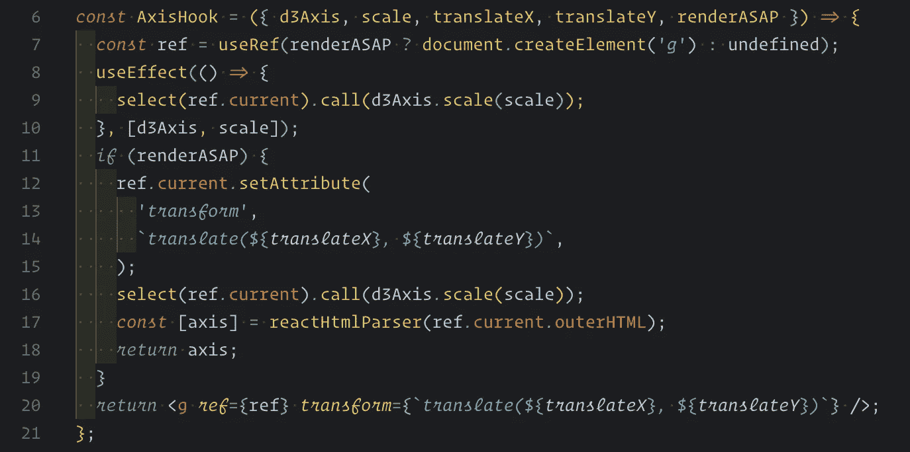
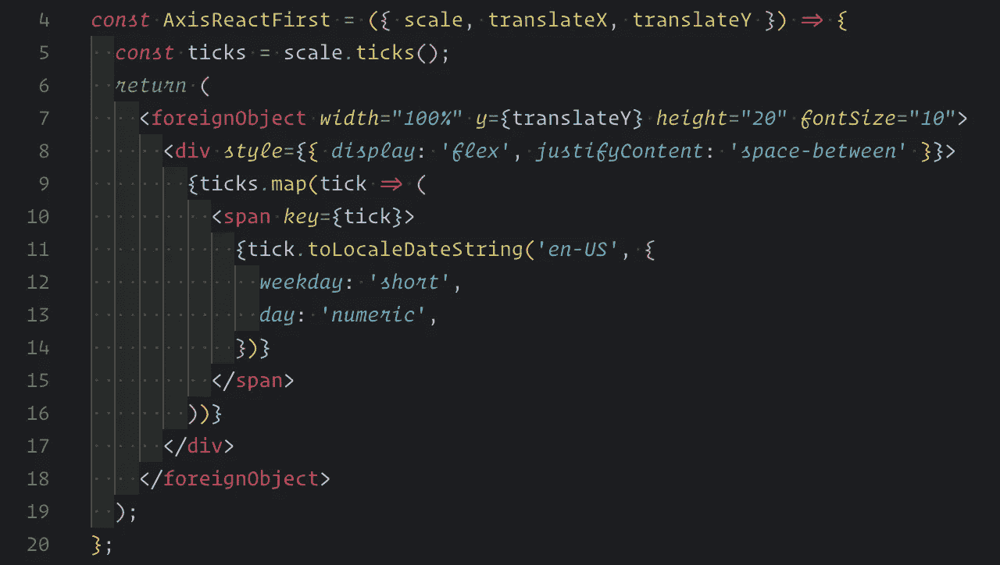

# React 和 D3 —轴

> 原文：<https://betterprogramming.pub/react-and-d3-axis-e8952d8d31e6>

## 第二章 React 和 D3 系列的结合

约翰·施诺布里希在 [Unsplash](https://unsplash.com/s/photos/computer?utm_source=unsplash&utm_medium=referral&utm_content=creditCopyText) 上的照片

# 介绍

这是 React 和 D3 系列的第二部分。你可以在这里找到[第一章](https://medium.com/@icrosil/combination-of-react-and-d3-1fb07b00fb55)。以及源代码[代码](https://github.com/icrosil/react-d3)。

在这一章中，我们将研究如何给 React 组件添加轴。通常，任何令人惊叹的图表都需要一些东西来描述你是如何测量数据的。这就是轴有用的地方。

[https://react-d3.icrosil.now.sh/](https://react-d3.icrosil.now.sh/)

添加了轴📊

# **问题**

当你用 D3 创建一个轴时，它为你做了很多好事。
它为标签做填充，它计算你想要显示的刻度数所需的标签，它将结果*呈现在一个节点中。*

不幸的是，渲染到一个节点中并不能很好地配合我们结合 React 和 D3 的方法。当你想从轴上得到比标准函数所能给你的更多的东西时，问题就出现了。

让我们提一下您的产品可能会有的常见要求:

*   定义动态数据的精确刻度数。形式上，您可以指定精确的刻度值，但这将约束您在相同的范围内拥有数据。通常，这对于动态数据不起作用。
*   在轴旁边添加标签。例如，您的设计师可能会要求您在轴旁边添加一个小文本。或者添加文本而不是最后一个元素。
*   应该以不同方式显示在轴中的样式值。如果分笔成交点的每一种风格都不一样呢？
*   使用 React 渲染轴。如果我们想控制每个元素呢？
*   为 SSR 或转换为字符串时呈现轴。水合作用在生命周期或挂钩中可以正常工作，但在有些情况下这不是一个选项。例如，当您在浏览器中从 SVG 制作 PNG 时。

# 用 D3 渲染

让我们从默认解决方案开始，这在 D3 和 React 文章中都有很好的描述。这可能并不理想，也不能解决我们所有的要求，但这是一个很好的起点。

为此，我们需要为`ref`定义一个节点，并将其与 D3 链接起来。为了执行操作，我们将使用生命周期。

提供；给予

这是一个渲染方法。虽然它总是渲染一个 React 组件，但是它并没有做太多的事情。

*   `this.renderAxis()`要求 D3 将轴渲染成元素。
*   SSR 需要`renderASAP`分支中的`parser`。我们将轴呈现为虚拟元素，然后将其 HTML 解析为 React 组件。在这之后，我们的组件将是一个 React 实例。所有的解析动作都是用 D3 渲染一个轴并告诉 React 如何在渲染时处理它的唯一方法。为此，我们必须添加`react-html-parser`库或任何其他`html-to-react`库。这个技巧给你的项目增加了另外 40 GZIP kb。
*   返回设置了`ref`的默认情况下的组件。

渲染轴

这将选择现有元素并在内部绘制轴。

生活过程

*   `componentWillMount`在将要创建组件时创建一个元素，并为 D3 设置虚拟元素。
*   `componentDidMount`触发渲染。
*   `componentDidUpdate`触发渲染。
*   `setRef`是`ref`的设定者。

这个解决方案对 React 16 有效，即使它看起来很丑。显然，React 17 发布后，生命周期将被否决，这种变通办法将不再适用于我们。

让我们试着用钩子做一些类似的东西，这样我们的轴就可以迎接 React 17 了。

阿西肖克

基本上，它是与生命周期相同的组件，但是使用钩子编写。`renderASAP`块与前面的实现非常相似，因为我们不能创建它，所以在 render 中直接调用`useEffect`。

这两个例子都依赖于轴的内部 D3 实现。它有如下警告:

*   您可以定义精确的节拍数，但是 D3 可以根据`closest guess`的内部实现相应地改变它。如果您想显示四个刻度，根据数据和视图，可以很容易地显示三个或五个刻度。
*   除了 D3 轴中预定义的记号和直线之外，不能添加任何东西。
*   您需要像`react-html-parser`一样添加一个`htmlToReact`解决方案。
*   要设计记号的样式，必须使用直接的 DOM 操作。
*   要在轴旁边添加额外的文本，您需要绝对定位它。
*   为了允许 SSR，代码中应该有一个逻辑副本来处理不同的方法。

两个例子都解决了五个标准中的三个。我们能做得更好吗？

# 用 D3 准备，用 React 渲染

完成这项工作的另一种方法是获取 ticks——将数据分割成 axis 就绪数组——并将它们作为普通组件呈现。

AxisReactFirst

就像 React 组件一样简单。我们只需要从天平上取下刻度。我们不需要额外的 D3 方法或者解析 React 到某个地方。我们可以控制任何风格和格式。

虽然，这里我们有一些额外的事情需要考虑:

*   手动格式化记号。
*   在容器上设置伸缩样式以传播刻度。
*   添加平移、高度、宽度和`fontSize`。

上面列表中的所有东西通常都是由 D3 制作的，你不需要为这些细节而烦恼。

当然，也有好处:

*   不需要钩子来渲染。
*   不需要考虑 SSR render 作为组件是纯粹的。

这个解决方案反映了我们所有的任务。样式，用 React 渲染，控制元素。五分之五。

尽管并不总是需要这种粒度的控制，因为它会增加更多的开销。需要考虑的一件事是，您真的需要这种粒度吗？如果第一个 D3 解决方案符合你的标准，你可以停下来。

# 外卖食品

我们比较了三种渲染轴的方法。根据你的需求，选择符合你标准的，不要过于复杂。

*   避免使用生命周期方法，因为方法会被废弃。
*   如果你不介意效果的话，钩子解决方案是可以的。
*   如果缺省的 axis 组件需要大量的重新造型，则使用纯 SVG 解决方案。

快乐编码。