# 用 LinguiJS 实现应用国际化

> 原文：<https://betterprogramming.pub/react-app-internationalization-with-linguijs-9486ccd80e07>

## LinguiJS 库的分步指南，它是 React 的强大国际化框架


# 将涵盖哪些内容

*   [先决条件](#b1a7)；
*   [安装](#0b33)；
*   [配置](#104f)；
*   [优化](#ce55)；
*   [JSX 宏](#6ba9)；
*   [JS 宏](#53ec)；
*   [复数](#bc8b)；
*   [现场检测](#54ea)；

# 先决条件

我们将使用一个简单的 TypeScript CRA 应用程序，没有任何额外的依赖和自定义配置:

```
yarn create react-app my-app --template typescript
```

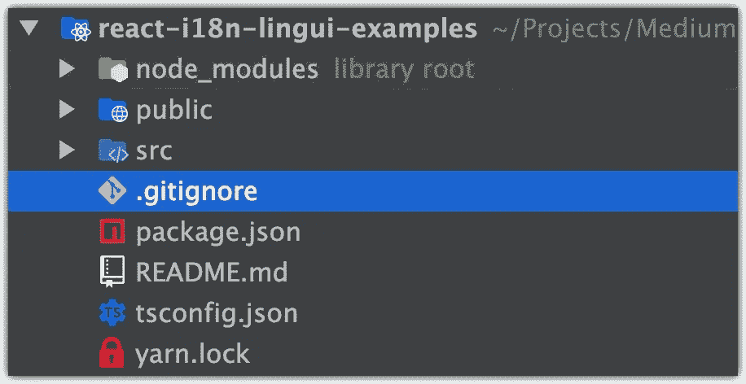

# 装置

向您的项目添加`[@lingui/cli](https://www.npmjs.com/package/@lingui/cli)`、`[@lingui/macro](https://www.npmjs.com/package/@lingui/macro)`和`[@lingui/react](https://www.npmjs.com/package/@lingui/react)`包:

```
yarn add @lingui/cli @lingui/macro -D
yarn add @lingui/react
```

此时，我将在我的`package.json`文件中有这些版本:

```
"dependencies": *{* "@lingui/react": "^3.13.2",
    ...
*}*,
"devDependencies": *{* "@lingui/cli": "^3.13.2",
    "@lingui/macro": "^3.13.2",
}
```

`yarn.lock`文件依赖关系:

```
"@lingui/react@^3.13.2":
  version "3.13.2"
  ..."@lingui/cli@^3.13.2":
  version "3.13.2"
  ..."@lingui/macro@^3.13.2":
  version "3.13.2"
```

# 配置

## 第一步。Lingui 配置文件

创建包含以下内容的`lingui.config.js`文件:

**⚠️注**:每个区域设置都应该是一个有效的 [**BCP-47**](http://www.unicode.org/cldr/charts/latest/supplemental/language_plural_rules.html) 代码，就像英语的 [**en**](https://unicode-org.github.io/cldr-staging/charts/latest/supplemental/language_plural_rules.html#en) 和法语的 [**fr**](https://unicode-org.github.io/cldr-staging/charts/latest/supplemental/language_plural_rules.html#fr) 一样。

从 3 个不同的来源读取配置(首先找到的获胜):

*   来自`package.json`中的`lingui`部分
*   来自`.linguirc`
*   来自`lingui.config.js`
*   从`**lingui.config.ts**` _(从 3.4.0 开始)

在基于 TypeScript 的配置中，您可以使用 ESM 格式并导出`default`:

您可以通过此链接查看有关配置的更多信息:

 [## Lingui 配置- LinguiJS 文档

### 从 3 个不同的来源读取配置(首先找到的获胜):您也可以定义环境变量…

lingui.js.org](https://lingui.js.org/ref/conf.html) 

该配置将从`src`目录下的源文件中提取消息，并将其写入`src/locales`中的消息目录中(例如，*英文*目录将位于`src/locales/en/messages.po`)。最后推荐 PO 格式。其他可用格式见`[format](https://lingui.js.org/ref/conf.html#std-config-format)`文档。

## 步骤 2:提取并编译

将提取和编译脚本添加到您的`package.json`文件:

```
"scripts": *{* "extract": "lingui extract",
    "compile": "lingui compile"
*}*,
```

注意:`extract`将解析应用程序中的消息并创建/更新`.po`文件，而`compile`将 PO 消息转换为 JS 对象:

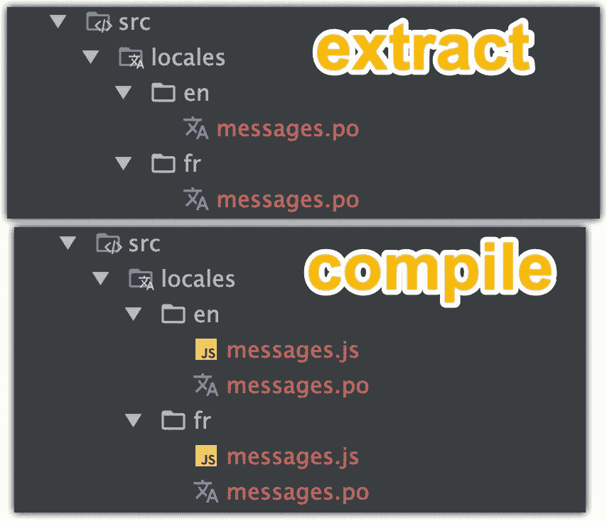

我们将在后面详细介绍。

您可以通过以下方式查看有关提取和编译脚本的更多信息:

 [## API 参考— CLI (@lingui/cli) — LinguiJS 文档

### lingui 提取[文件…] [ —清除] [ —覆盖] [ —格式] [ —区域设置] [ —转换自] [ —详细] [ —观察…

lingui.js.org](https://lingui.js.org/ref/cli.html?highlight=extract#global-options) 

## 步骤 3:代码更新

让我们添加一个上下文，它将从`[@lingui/react](https://www.npmjs.com/package/@lingui/react)`包中添加`I18nProvider`，并将处理我们的应用程序中的区域设置状态更改:

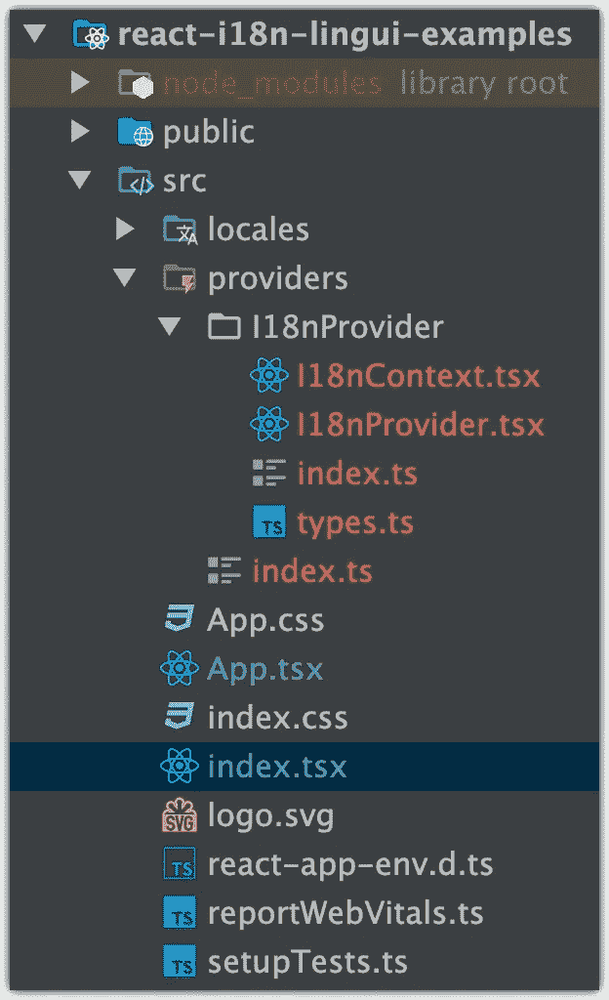

内容:

注意:我们也添加了复数，我们将在[复数](#bc8b)部分介绍。

之后，用我们创建的`<I18nProvider/>`包装`index.tsx`文件:

用`<Trans/>`组件、`useI18nContext`挂钩和`<select>`标签更新`App.tsx`文件，这将帮助我们更改语言环境:

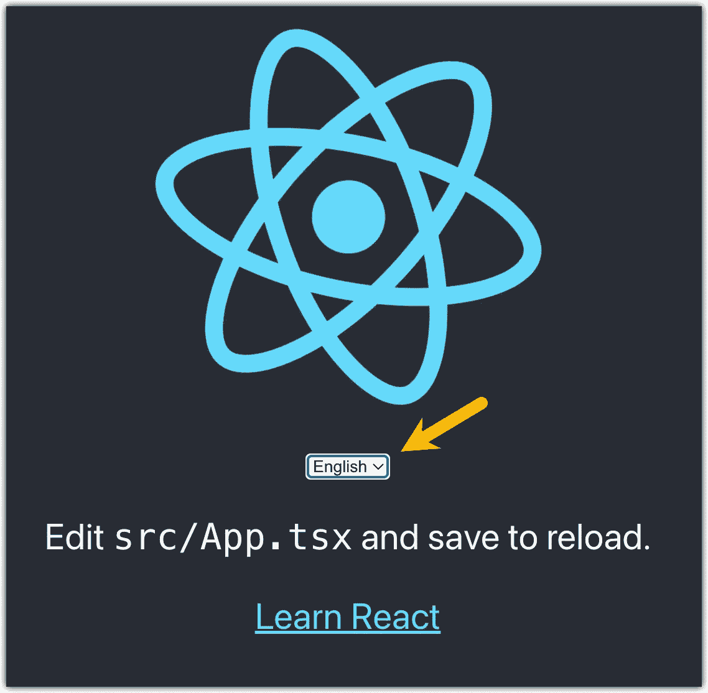

更新的`src/App.tsx`组件:

🟢运行“摘录”:

```
yarn extract
```

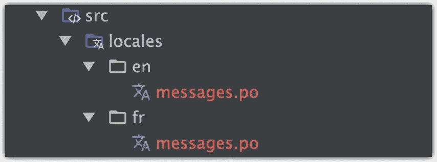

“提取”脚本和那些 PO 文件内容的结果:

更新法语`/locales/fr/messages.po`文件翻译:

```
msgid "Edit <0>src/App.tsx</0> and save to reload."
msgstr "**Modifiez <0>src/App.tsx</0> et enregistrez pour recharger.**"

msgid "Learn React"
msgstr "**Apprendre React**"
```

更新`package.json`文件，现在该命令每次启动时编译你的翻译:

```
"scripts": *{* "start": "**yarn compile &&** react-scripts start",
    "extract": "lingui extract",
    "compile": "lingui compile"
*}*,
```

🟢让我们测试我们的更新:

```
yarn start
```

结果

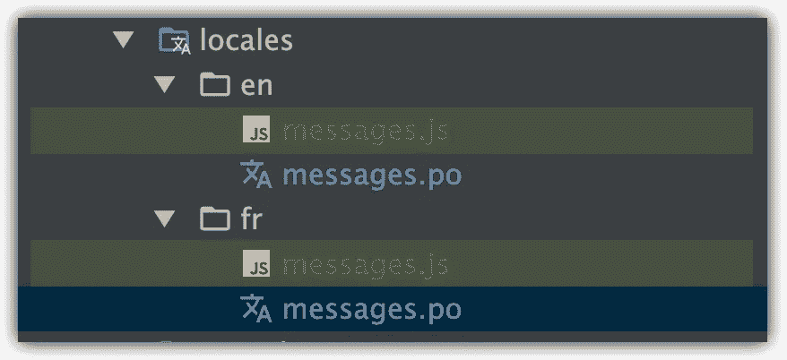

打开浏览器并检查结果:


# 最佳化

那么，如果我们有一个巨大的文本组件，会是什么情况呢？

运行提取和编译:

`message.js`编译后:

如您所见，LoremIpsum 文本的对象键非常大(复制全文内容)。为了避免这种情况，您可以将一个`id`值传递给`<Trans/>`组件:

添加`lorem-ipsum`值的`id`道具:

运行“提取”:

如您所见，旧值仍然存在，我们可以通过向“提取”脚本添加`[**--clean**](https://lingui.js.org/ref/cli.html?highlight=extract#cmdoption-extract-clean)`标志来修复它，该标志将:

> 从目录中删除过时的邮件。当消息在源代码中丢失时，它就过时了。

```
"scripts": {
    "extract": "lingui extract **--clean**",
    ...
*}*,
```

🟢再次运行“摘录”脚本:

```
yarn extract
```

太好了，现在我们谈好了。现在我们的 JS 对象键值在`yarn compile`命令后会变小并且可读。

注意:[如果你不提供翻译，LinguiJS](https://github.com/lingui/js-lingui) 将使用 msgid 值，所以要小心使用`--clean`标志。我们将在下一节介绍如何管理它。

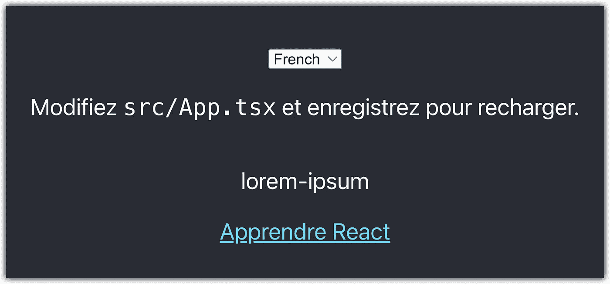

# JSX 宏

让我们深入了解一下宏的世界。

使用宏的优点是:

*   不需要学习 [ICU MessageFormat](https://lingui.js.org/ref/message-format.html?highlight=icu%20messageformat) 语法。你总是使用熟悉的 JS 和 JSX 代码；
*   对组件和功能进行类型检查；
*   在转换期间执行多个规则的附加验证；
*   从生产版本中删除非必要数据(如注释和默认消息)以节省几个字节；

👉这里是其他`<Trans/>`道具及其有用的特性，而不是已经提到的`id`:

*   `**comment**`:对译者非常有用，提供意义或文本上下文；
*   `**render**`:使用[渲染道具](https://artem-diashkin.medium.com/hoc-higher-order-components-component-wrapping-render-props-with-examples-dc1433a61be9#fb58)模式，用它你可以为你的翻译添加一个包装器——对于添加额外的逻辑或分析事件非常有用；
*   `**component**`:与渲染道具相同，但不会通过`id`、`message`或`transation`道具(`@lingui/react`库中的`TransRenderProps`类型)；

我们来看上面的一个例子:

`.po`文件结果:

```
#. This message in an example without any context
#: src/components/TransPropsExample.tsx:35
msgid "no-sense-message"
msgstr "A message that makes no sense. Value: {priceForProduct}"
```

更新`App.tsx`文件:

🟢运行提取脚本并重启应用程序:

```
yarn extract && yarn start
```

结果(英语区域设置):

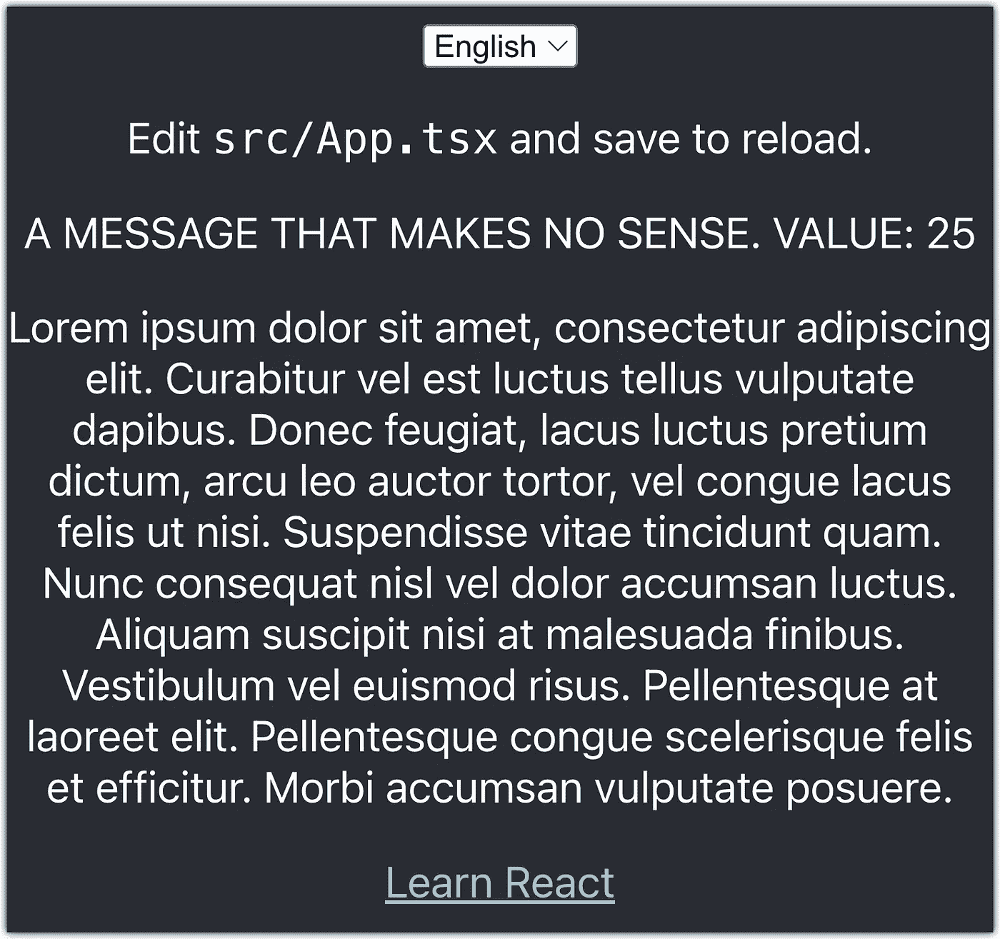

结果(法语区域设置):

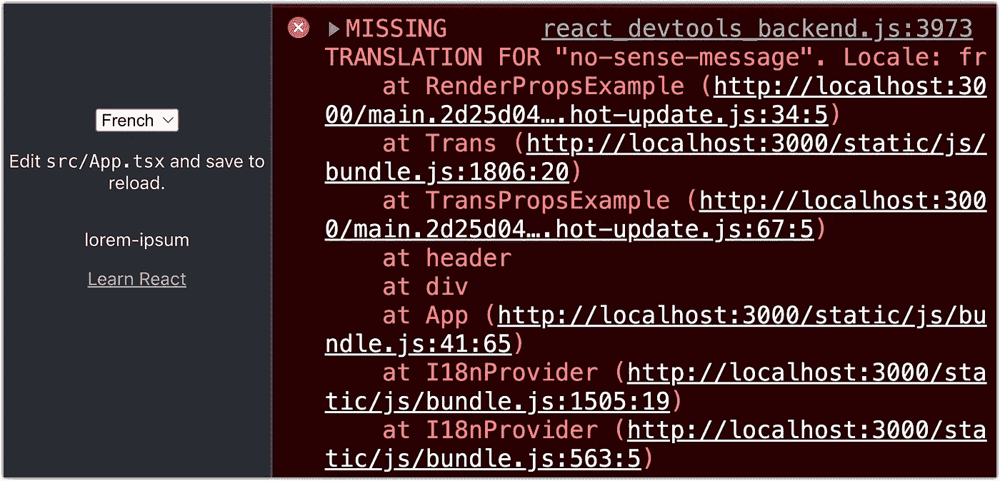

**⚠️注意**:尽量不要在 Trans 中使用匿名值:

```
*<Trans>* A message that makes no sense. Value: *{*getSomeValue*()}
</*Trans>**// .po file result**
msgid "A message that makes no sense. Value: {0}"
```

尝试声明一个具有翻译人员能够理解的含义的变量:

```
const ***priceForProduct*** = getSomeValue*()*;*<Trans>* A message that makes no sense. Value: *{*priceForProduct*}
</*Trans>**// .po file result**
msgid "A message that makes no sense. Value: {***priceForProduct***}"
```

# JS 宏

这些宏可以在任何环境下使用(如 JSX 以外)。所有 JS 宏都被转换成一个包装在`i18n._`调用中的*消息描述符*。

```
**import** { **t** } from "@lingui/macro"
**const** message = **t**({
   id: 'msg.hello',
   commen**t**: 'Gree**t**ings at the homepage',
   message: `Hello *${*name*}*`
})

*// ↓ ↓ ↓ ↓ ↓ ↓*

**import** { i18n } from "@lingui/core"
**const** message = i18n._(*/*i18n*/*{
   id: 'msg.hello',
   commen**t**: 'Gree**t**ings at the homepage',
   message: 'Hello {name}',
   values: { name }
})
```

示例:

这将导致与之前完全相同的结果，但是没有包装器、检查器和额外的 JSX 特性，但是 JS 宏对于像字符串数组这样的简单情况非常有用。

# 复数

在处理国际化时，复数是必不可少的。 [LinguiJS](https://github.com/lingui/js-lingui) 使用 [CLDR 复数规则](http://www.unicode.org/cldr/charts/latest/supplemental/language_plural_rules.html)。一般来说，有 6 种复数形式(摘自 [CLDR 复数](http://cldr.unicode.org/index/cldr-spec/plural-rules)页):

*   零；
*   一(单数)；
*   二(双)；
*   很少(pau cal)；
*   many(如果它们有单独的类，也用于分数)；
*   其他(必需—一般**复数**形式—如果语言只有一种形式，也可以使用)。

只有最后一个，即 *other* ，是必需的，因为它是所有语言中唯一通用的**复数形式。**

JSX 的例子:

运行提取并运行应用程序。不同地区的结果:

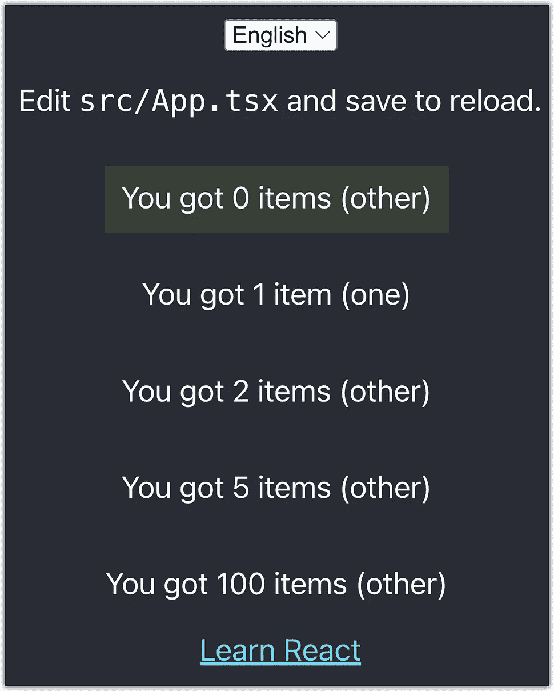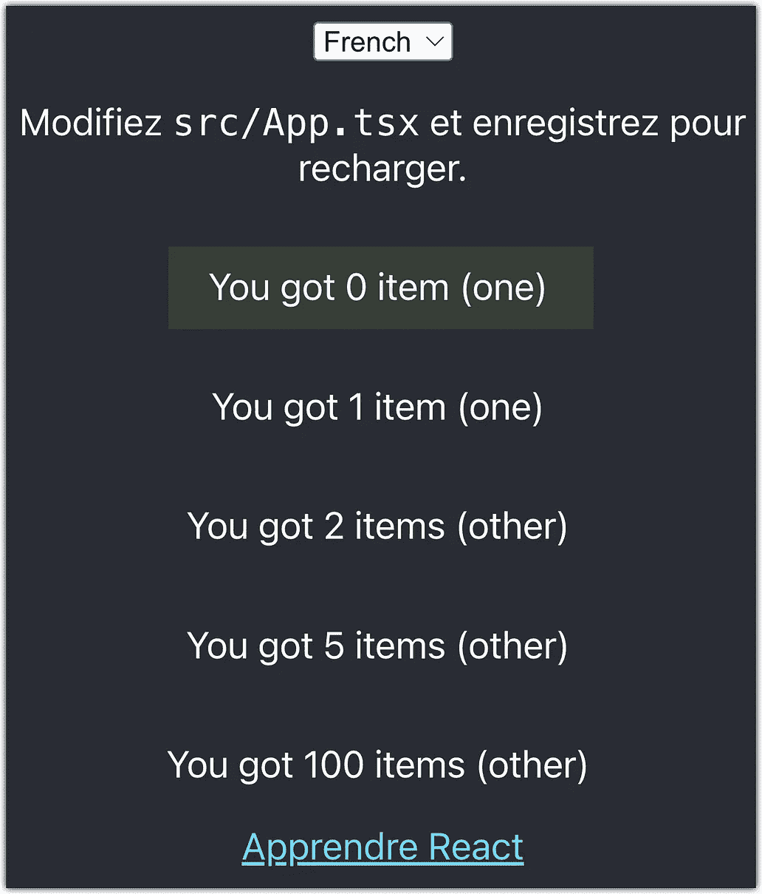

注意:大多数情况下`one`和`other`的值就足够了，但是要小心，您需要检查您的语言环境使用了什么样的[语言复数规则](https://unicode-org.github.io/cldr-staging/charts/latest/supplemental/language_plural_rules.html)(在我们的例子中是 [**en**](https://unicode-org.github.io/cldr-staging/charts/latest/supplemental/language_plural_rules.html#en) 和 [**fr**](https://unicode-org.github.io/cldr-staging/charts/latest/supplemental/language_plural_rules.html#fr) ，所以我们可以很容易地将`zero`和`few`从我们的例子中排除，因为它们是多余的)。

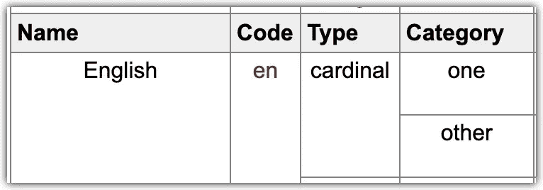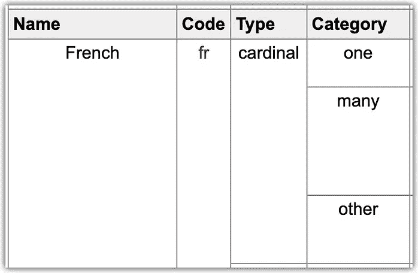

具有相同结果的 JS 宏示例:

# 现场检测

我们将使用带有一些帮助函数的`[@lingui/detect-locale](https://www.npmjs.com/package/@lingui/detect-locale)`包，帮助您检测用户的语言环境:

*   `fromCookie(key: string)` -接受一个关键字，因为 param 将从 navigator cookies 中恢复该值
*   `fromHtmlTag(tag: string)` -将在 HtmlDocument 中找到参数中传递的属性(通常使用 lang 或 xml:lang)
*   `fromNavigator()` -恢复导航语言，也兼容 IE11 等老浏览器
*   `fromPath(localePathIndex: number)` -在一个数组中分割 **location.pathname** ,因此你必须指定数组的索引，其中设置了的区域设置
*   `fromStorage(key: string, { useSessionStorage: boolean }` -默认情况下将在本地存储上搜索具有该键的项目，如果**useSessionStorage**通过，将在 SessionStorage 上搜索
*   `fromSubdomain(localeSubdomainIndex: number)` -像 fromPath 一样，分割段上的`location.href`，您必须指定该段的索引
*   `fromUrl(parameter: string)` -使用查询字符串解析器来恢复正确的参数

`@lingui/detect-locale`导出方法:

*   `detect` -将返回第一次出现的探测器；
*   `multipleDetect` -将返回每个检测器检测到的所有区域的数组

🟢添加包:

```
yarn add @lingui/detect-locale
```

我们将用`detect`函数更新我们的`<I18nProvider/>`组件。这样我们会得到一个有意义的结果:

```
const result = *{* url,
    storage,navigator,
    cookie,
    tag,
    fromPath,
    fromSubdomain,
*}*
```

另外，我们将简单的`setLocale`更改为`handleChangeLocale` →现在区域设置将在区域设置更改时保存到 localStorage 和 cookies 中，并将在应用程序刷新时检索。

结果:`[http://localhost:3000/fr/?lang=jp](http://localhost:3000/fr/?lang=jp)`

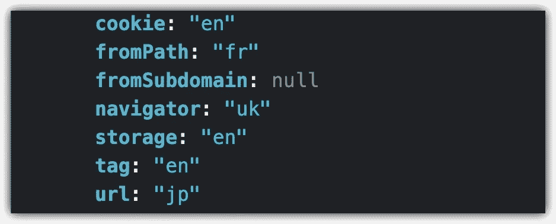

快乐的编码！不要犹豫问问题！

GitHub 资源库的链接:

[](https://github.com/nemrosim/react-i18n-lingui-examples) [## GitHub-nemrosim/react-i18n-Lingui-示例

### 此时您不能执行该操作。您已使用另一个标签页或窗口登录。您已在另一个选项卡中注销，或者…

github.com](https://github.com/nemrosim/react-i18n-lingui-examples)