# 在 React 中导入 SVG 的最佳方式

> 原文：<https://betterprogramming.pub/react-best-way-of-importing-svg-the-how-and-why-f7c968272dd9>

## 方法和原因

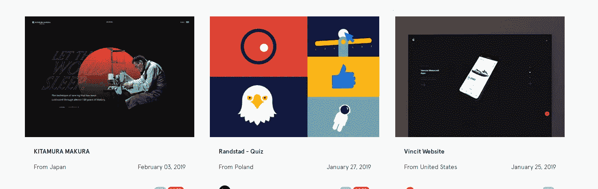

作者截图

谁不欣赏 [SVG](https://en.wikipedia.org/wiki/Scalable_Vector_Graphics) 带来的炫酷？HTML 5 中的 SVG 支持无疑是一项伟大的技术，提供了很多。在所有最简单的形式中，我们欣赏我们的图标或图形如何缩放而不失去它们的锐度。此外，我们希望能够控制和处理构成图形的细节，对它们进行样式化、动画化等等。

在本文中，我将展示将 SVG 资产导入 React 组件的两种方法。我喜欢称它们为*源代码内资产*，因为它们将位于我们的源代码中(默认情况下，create-react-app 不允许从外部导入`src`)。这是受限制的，除非你退出并改变配置。(这是有充分理由的，我将在另一篇文章中讨论。)

我将展示两种方法，一种是老方法，另一种是创建-反应-应用 V2 带来的新方法。我会解释动机和原因。

注意:如果你很急，向下滚动到下一个标题。

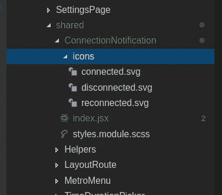

图片来源:作者

首先，由于 webpack 和加载器`url-loader`和`file-loader`T12，导入图像和 SVG 是可能的。这从一开始就被默认为杠杆。

注意:`url-loader`从图像中创建一个数据 URL**(base-64 数据 URL，直接嵌入 HTML 中，用于快速加载，页面加载后不提取)。除非它们大于某个限制(在 create-react-app 中，是 10，000)，在这种情况下，它会退回到`**file-loader**`，，将导入的文件输出到配置的输出中。(如果没有定义回退，这是默认行为，create-react-app 也是如此)。create-react-app 中的输出是生产中的构建文件夹和开发中的开发服务器。**

**下面的代码摘自 [create-react-app](https://github.com/facebook/create-react-app/blob/master/packages/react-scripts/config/webpack.config.js) `[webpack.config.js](https://github.com/facebook/create-react-app/blob/master/packages/react-scripts/config/webpack.config.js)`:**

**`**url-loader**`**

**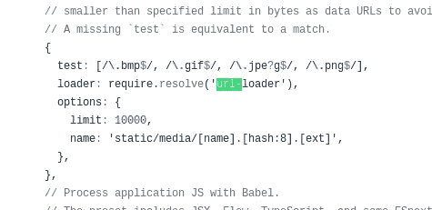**

**`**file-loader**`**

**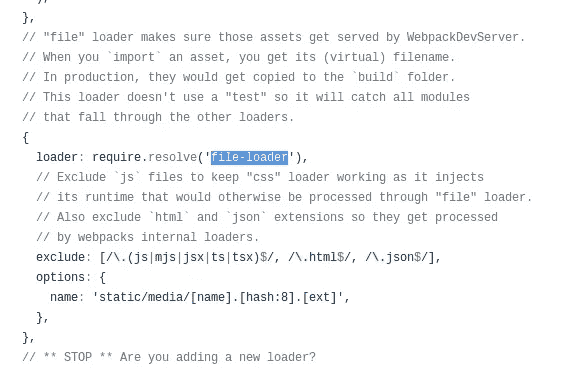**

****输出****

**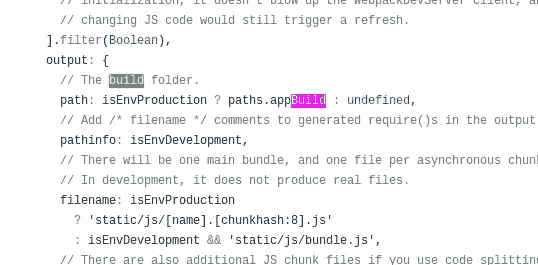**

**这很好地说明了它是如何发生的。(如果您想了解更多，请阅读 webpack 加载器和系统)。**

**现在回到我们如何导入。让我们从老方法开始。(一定要看完。如果你很着急，跳到下一个标题。)**

# **将图像或 SVG 直接作为 URL 导入**

**我举一个实际项目的例子。我需要构建一个组件来突出显示或通知实时应用程序中的连接和断开。**

**回到线上。为了导入，我们进行如下操作:**

**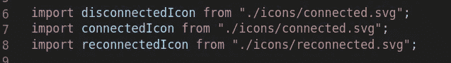**

```
import myIcon from './relative/path/to/icon.svg'
```

**我们使用普通的导入语法，并导入我们的 SVG 资产，这要感谢 webpack 的`url-loader`。我们的变量将保存一个 SVG 图标的 URL。**

**我们这样使用它:**

**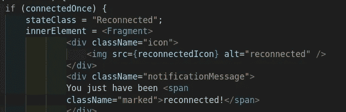**

```

```

**我们带着问题来到这条线上，为什么这可能不好，或者为什么我们可能需要其他东西:**

**SVG 作为图像不提供任何控制。我们将不能按照我们想要的样式来设计它，也不能控制内部的 SVG 组件。**

**下面的图片展示了在 HTML 中使用 SVG 的不同方式，以及它们在特性方面的比较。**

**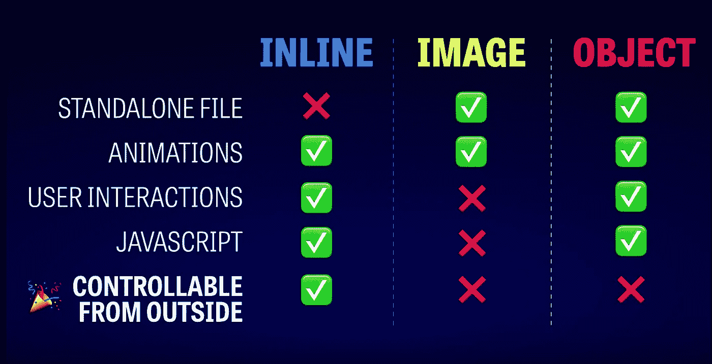**

**图片来源:作者**

**我们可以看到内联方法是最合适的。因此，您可能会认为应该制作组件来呈现我们的内联 SVG。这就是第二种方法。**

# **将 SVG 作为 React 组件导入(内嵌 SVG)**

**由于图像方法的缺陷，出现了一个问题。create-react-app v2 最终包含了一个解决方案，就像它包含了一系列其他功能一样。我们的生活变得更加轻松。我们需要感谢所有伟大的人(谢谢大家)。你可以看看这个帖子，看看这个问题是什么时候被填满的[https://github.com/facebook/create-react-app/issues/1388](https://github.com/facebook/create-react-app/issues/1388)。**

**这次我们利用了一个 webpack 配置，使用了 webpack 的 svgr 加载器，你可以在这里查看[https://www.npmjs.com/package/@svgr/webpack](https://www.npmjs.com/package/@svgr/webpack)。**

**此外，您可以查看 svgr 回购**[https://github.com/smooth-code/svgr](https://github.com/smooth-code/svgr)以了解更多关于 svgr 的信息。****

****你也可以去一个游乐场看看。****

****svgr 获取一个 SVG 文件，并将其转换成一个 React 组件，该组件呈现一个内联 SVG。****

****以下是 create-react-app webpack 配置:****

****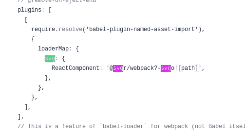****

****就是这个故事。让我们看看如何进行导入。****

****回到我们的例子——让我们做一些修改。****

****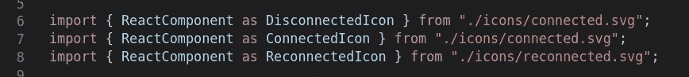****

```
**import { ReactComponent as MyIcon } from "./icon.svg"**
```

****我们可以两个版本都导入，这其实没什么意义，但不管怎样，还是来看看吧。****

```
**import myIconUrl, { ReactComponent as MyIcon } from "./icon.svg"**
```

****确保从模型中导入`ReactComponent`作为一个特定的组件名，这样才有意义。确保你尊重它以大写字母开头。否则 JSX 将被转换成一个字符串，而不是一个变量。****

****此处组件就位:****

****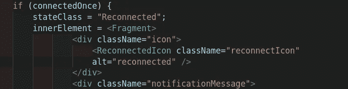****

```
**<MyIcon />
<MyIcon className="someClassThatWillBeUsedInCSS" alt="icon" />**
```

****现在我们需要看看这两种方法是如何渲染的。****

****我对我的`ConnectionNotification`组件进行了重构，顺便说一句，一旦一切就绪，我将分享并发布它。(它处理断开连接时的显示。开始时，它会显示是否连接，如果没有，它会显示“断开”，但只有在等待时间过去后。此外，“连接”将立即显示，并在超时后隐藏。简而言之，它很好地处理了通知功能。它可以用样式、图标、文本等来装饰。)****

****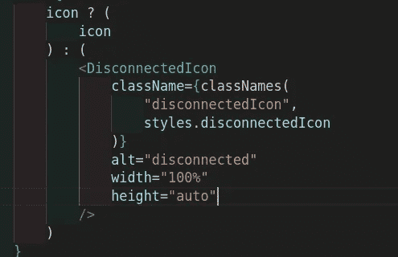****

****如您所见，上面的组件呈现为下面的内联 SVG:****

****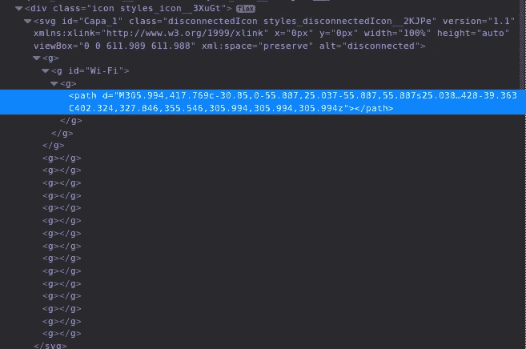************

****而图像版本:****

****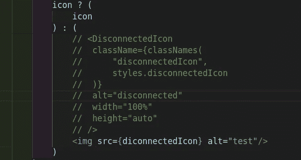****

****将呈现:****

****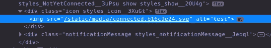****

****注意，从风格的角度来看，这在我的用例中没有区别。但是，要知道内联 SVG 会加载得更快，这本身就是一个很好的理由。如果我愿意，我可以在内部 SVG 组件上制作一些动画。****

****现在您有了一个内联 SVG，您可以像往常一样工作，并拥有您需要的所有控制。到目前为止，这是最好的方法。****

****注意:这里有一个链接，展示了我使用的一个 SVG 精灵文件。****

****[https://gist . github . com/Mohamed laminealal/a1 bcca 5 C4 e 7d 12 defddfceabc 2a 2734d？short_path=7802baa](https://gist.github.com/MohamedLamineAllal/a1bcca5c4e7d12defddfceabc2a2734d?short_path=7802baa)****

****为了展示它，下面是我最终呈现的连接组件:****

****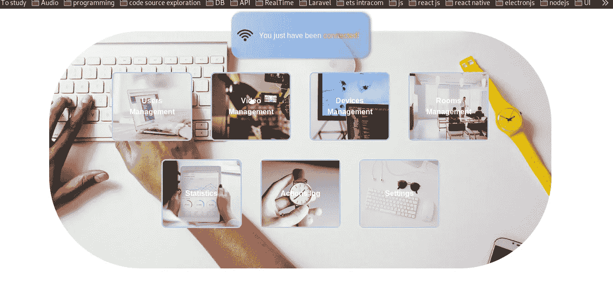****************************

****我希望你喜欢它。****