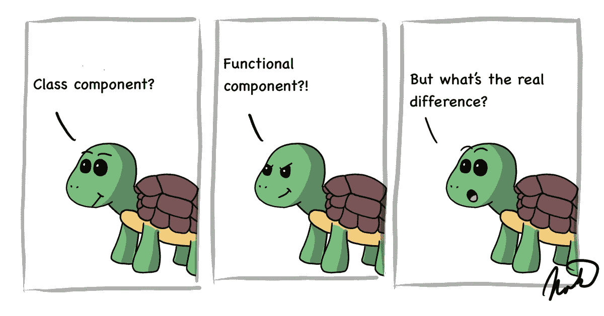
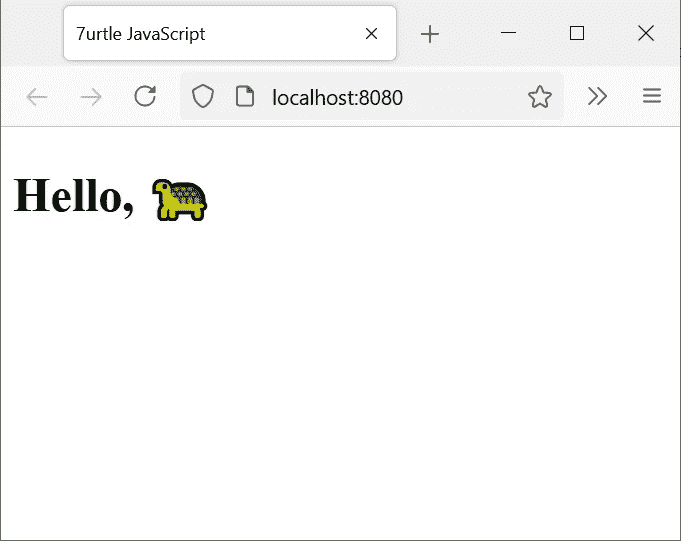
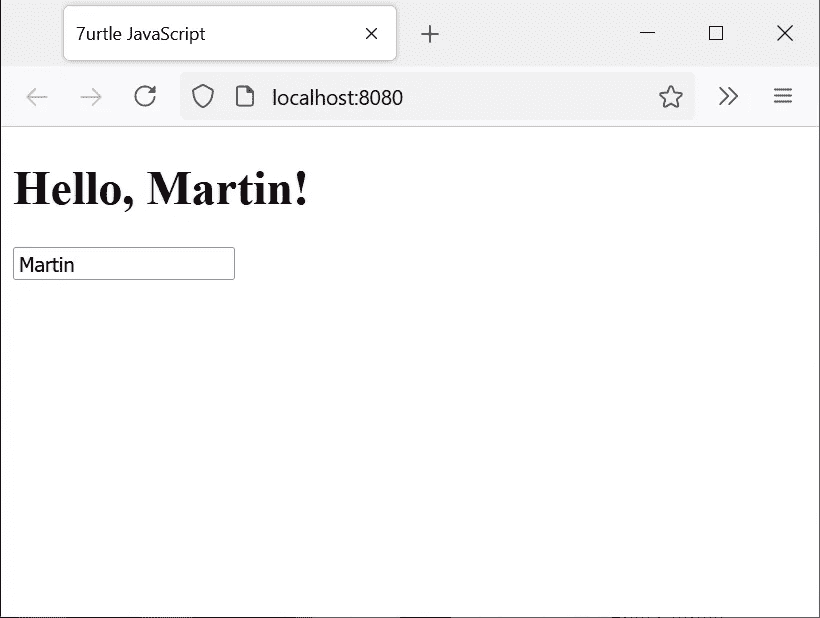
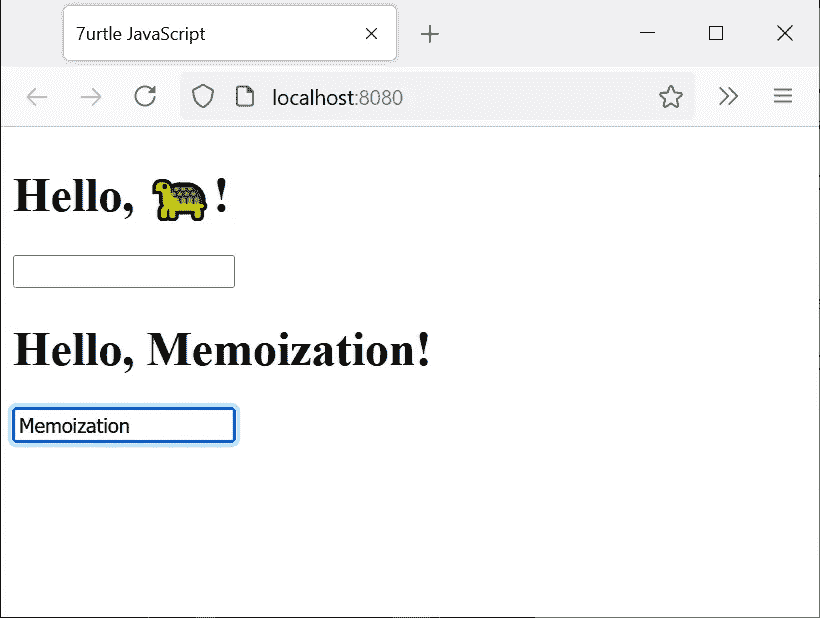
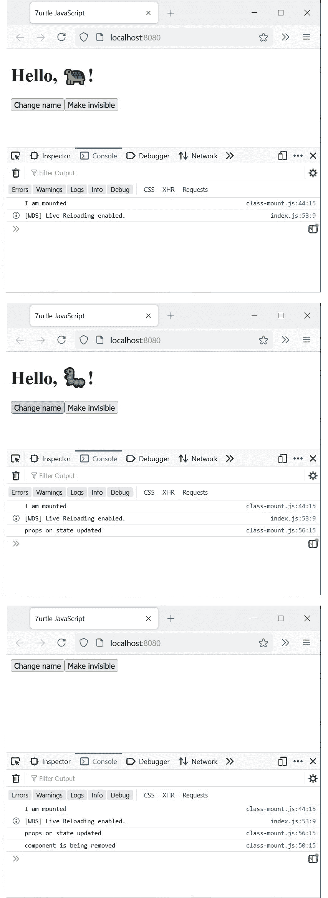

# 反应类别与功能组件

> 原文：<https://betterprogramming.pub/react-class-vs-functional-components-2327c7324bdd>

## 类和功能组件的定义、道具、纯组件、内部状态、生命周期和性能

作者原图

[React](https://reactjs.org/) 让您选择是对类组件使用更命令式的代码风格，还是对功能组件使用更声明式的函数方法。

React 允许您将组件创建为纯函数，这是我喜欢该框架的主要原因之一。

# 定义反应组件

这是一个在 React 中以三种不同风格定义组件的例子。

如你所见，第一个，`ClassHelloWorld`，是一个类组件。`FunctionHelloWorld`是使用经典函数的功能组件，`ArrowHelloWorld`是使用箭头函数的功能组件。

这三个函数的输出是相等的。

# 在组件中使用 React 道具

Props 在 React 中用于将变量传递给组件。这是在两种类型的组件中使用它们的方式:

主要的区别在于，在函数组件中，您需要将 props 定义为函数的一个参数，并且您没有使用`this`。

无论您使用哪种类型的组件，道具的使用方式都是一样的:

你可以在脚本中看到，我只是在定义`name`的值，这会显示:

# 创建纯组件

在 React 中使用纯函数组件与在 JavaScript 的函数式编程中使用纯函数是一样的。

这就是你如何用每种方法定义一个纯组件:

在类组件中，你扩展了`React.PureComponent`而不是`React.Component`，在功能组件中，你将你的函数包装在高阶函数`React.memo`中。

在 React 中以这种方式创建的纯组件基于它们的属性和内部状态值进行缓存。这意味着 React 不会每次都初始化整个组件，而是在提高性能的情况下重用它。

函数名`memo`是 *memoization* 的缩写，是一种针对缓存计算的函数式编程优化技术。

请注意，如果您在纯组件中使用其他组件，它们的渲染也会被缓存。这样，您可以创建一个需要几个其他组件来渲染的组件，但通过这种方法，所有内容都只渲染一次，并且在重用一个纯组件时，您可以获得性能提升。

# 管理 React 组件状态

管理组件的内部状态在类组件和功能组件之间会有很大的不同。

这是在类组件中使用状态的一个示例:

注意状态被定义为你的类的`constructor`中的一个对象。只需访问`this.state.name`即可读取当前值。

我们正在使用`this.setState`函数基于输入元素的`onChange`事件编辑状态。通过`this.state.name = 'value'`直接编辑状态是不行的。

结果是这样的:

在功能组件中，通过使用以下代码可以获得相同的结果:

您可以看到功能组件仍然遵循更短的趋势，仅使用了 14 行代码，而我们对类组件使用了 22 行代码。

功能组件使用`useState` React 钩子定义变量`name`和函数`setName`。如果您的组件需要跟踪多个变量，您需要为每个变量调用`useState`。

传递给`useState`的参数是你的默认值。

该状态不能在组件外部共享或访问，但可以作为一个属性传递给另一个组件。

上面的类组件和功能组件仍然可以被定义为纯组件，它们的任何行为都没有任何问题，并且内部状态被绑定到组件的每个实例。如果您的组件在应用程序生命周期中的状态数量有限，那么使用`React.PureComponent`定义类组件或者使用`React.memo`定义功能组件，将它定义为一个纯组件会很有好处。

如果您需要您的应用程序来管理全局状态，您应该使用诸如 Redux 或 React hooks 之类的库来为分离关注点的全局状态构建中间件。

# 管理组件安装

您可能希望管理组件的安装、卸载和更新。所有这些同样适用于纯组件。

在类组件中，您可以通过以下函数管理安装:

三个主要状态由功能`componentDidMount`、`componentWillUnmout`和`componentDidUpdate`管理。

为了在实践中进行测试，我们还将在这个脚本中演示可视化管理和状态传递:

以下是控制台视图的结果:

现在，我们将通过一个功能组件实现同样的目标:

这次，功能组件使用了 16 行代码，而类组件使用了 26 行代码。

我们利用 React 钩子`useEffect`，它旨在观察变量数组的变化。当我们像第一种情况一样传递一个空数组`[]`时，这个函数只在组件被挂载时被调用，然后当组件被卸载时，返回的函数被调用。

当我们通过带有道具`[props]`的数组时，React 会在每次`props`变化时调用函数，包括第一次在挂载组件时使用。

# 性能差异

人们普遍认为功能组件比类组件更快，React 团队一直承诺对功能组件进行优化。

然而，我还没有找到任何证据证明这两种方法的直接性能差异。在这个渲染测试中，两种方法产生了相同的结果:【https://jsfiddle.net/69z2wepo/136096/】T4。

# 结论

React 中的函数组件和类组件提供相同的功能。在使用这两种方法中的任何一种时，您都不应该错过任何东西，并且它们在渲染性能上没有区别。

在本文的代码示例中，功能组件平均只使用了一半的代码行数。写更少的代码意味着你的同事在试图理解它的时候也需要读得更少。

最后，这在很大程度上取决于您是更喜欢命令式面向对象的类方法，还是更喜欢声明式函数式编程。对我来说，功能组件是最受欢迎的。

请在评论中告诉我你是否在自己的代码中使用了类或函数组件。