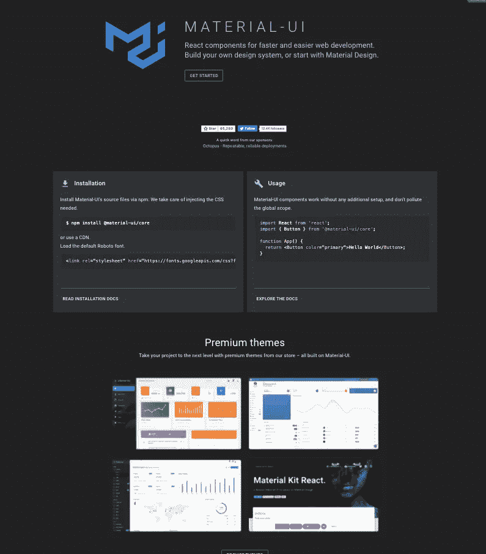
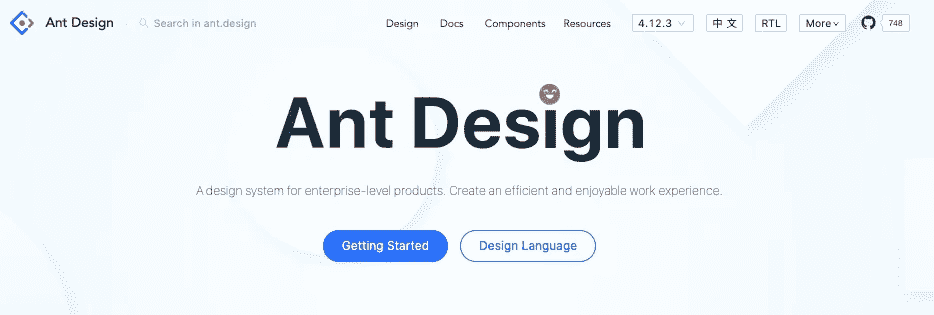
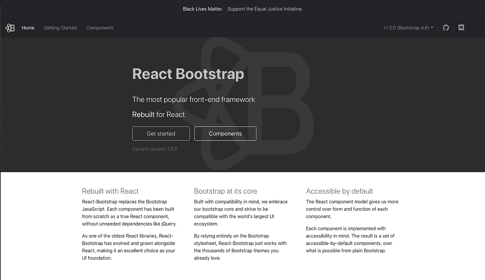
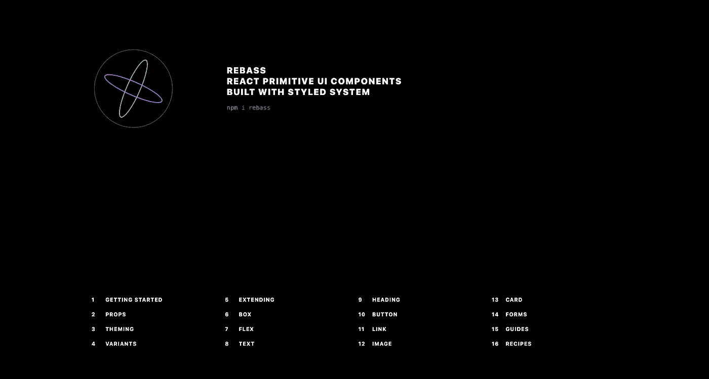
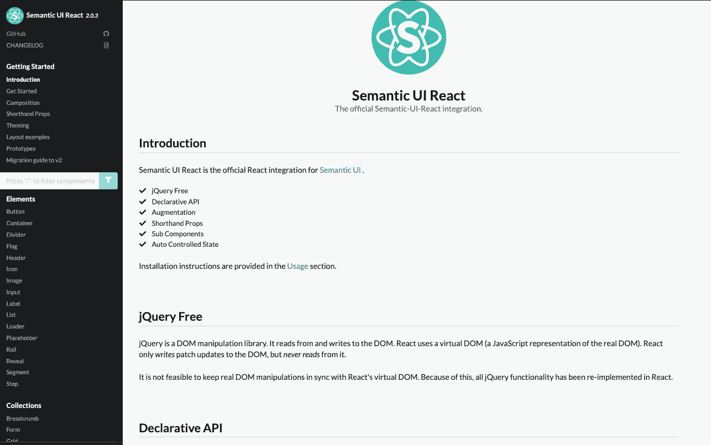

# 前 5 名 React 组件 UI 库

> 原文：<https://betterprogramming.pub/react-component-libraries-for-ui-1d3f3c8ed654>

## 有了这些开源库，你的项目会看起来更加专业和漂亮

通过 [XPGraph](https://xpgraph.com/) 拍照。

React 已经成为最受开发人员欢迎的前端框架之一，社区在过去几年里发展迅速。React 包正在被开发和共享，以使构建应用程序更简单，这有助于加速开发。

本文将向您展示一些最好的、发展最快的 React 组件库。

# 1.材料-用户界面

[Material-UI](https://material-ui.com/) 是最流行的组件库之一。它受谷歌材料设计系统的启发，围绕谷歌材料规范创建。

它为用户提供了大量可访问的 UI 小部件和现成的站点模板。该库定期更新，并有强大的社区支持它。

[文档](https://material-ui.com/getting-started/installation/)内容广泛但质量很高。添加的功能越多，阅读和理解文档就越重要。花点时间去学习所有东西是如何工作的，通过练习，你将成为使用这个组件库的专家。

# 2.蚂蚁设计

[蚂蚁设计](https://ant.design/)是针对企业级产品的设计系统。它包含一组 50 多个高质量的组件和演示，用于构建丰富的交互式 ui。这些组件包括对几十种语言的国际化支持。请务必查看[文档](https://ant.design/docs/react/introduce)。

Ant 设计的每一个方面都是经过深思熟虑的，甚至是最小的细节。您还可以定制组件，以满足您自己的设计规范。Ant 设计组件包括按钮、图标、网格、面包屑、下拉菜单、分页等等。

Ant Design 是专门为内部桌面应用程序创建的，它基于几个原则和统一的规范。它使设计和原型制作变得更简单，更容易为所有项目成员所用。如果能更好地满足你的需求，还有一个移动版的 Ant Design。

# 3.反应引导

[React-Bootstrap](https://react-bootstrap.github.io/) 是一个 UI 套件——基于 [Bootstrap 库](https://getbootstrap.com/)。它用 React 代码替换了常规引导组件中的 JavaScript。这被认为是开始使用 React 和 Bootstrap 构建接口的最快方法之一。如果你想快速构建 React 应用，React-Bootstrap 会非常有用。

这是世界上最流行的前端组件库，它有很多初学者工具包资源和主题。开发者可以从成千上万个现成的可定制的引导主题中进行选择。请务必查看[文档](https://react-bootstrap.github.io/getting-started/introduction/)并享受下载最多的前端框架。

# 4.雷巴斯

Rebass 是一个很小的 UI 组件库，能够基于[风格的系统](https://styled-system.com/)库创建一组非常强大的支持主题的 UI 元素。Rebass 只包含八个组件，重量只有 4kb，但是可以用来创建一组健壮的 UI 元素。

它侧重于为您的开发过程提供一个快速的开始，如果您不想太依赖社区组件库或者您打算创建自己的自定义 UI，它确实非常方便。

Rebass 的设计秉承了移动优先的理念，并提供了非常先进的设计理念。它有一个 Flexbox 布局，其中的`Box`和`Flex`组件是您可以扩展的基本组件。简单的网站设计使得查找和添加您想要添加到项目中的功能变得容易。

# 5.语义 UI 反应

[语义 UI React](https://react.semantic-ui.com/) 是语义 UI 的官方 React 集成。它不含 jQuery，并使用声明式 API 方法，这使得它更简洁易用。所有额外的功能都被重写以反应代码。

您将使用 JSX 代码直接定义组件，并将其与其 React 组件代码绑定。它附带了预构建的组件，这些组件是专门为更容易使用和生成语义友好的代码而设计的。

[入门](https://react.semantic-ui.com/usage)很容易。语义 UI 使得合并和定制他们的设计来满足你的项目需求变得简单。如果你想用 React 构建应用，并想确保 100%语义友好的代码，你绝对应该去看看。

# 结论

每个项目都不一样，需求也不一样。在开始之前，请务必查看这些 React 组件库和其他许多组件库。以下是更多顶级 React 组件库的列表:

*   [流畅的用户界面](https://developer.microsoft.com/en-us/fluentui#/)
*   [蓝图 UI](https://blueprintjs.com/)
*   [常青 UI](https://evergreen.segment.com/)
*   [索环](https://v2.grommet.io/)
*   [查克拉 UI](https://chakra-ui.com/)

最后，没有一个放之四海而皆准的解决方案。在开始你的项目之前，要有一个清晰的方向，你想要创造什么，你想要它看起来像什么，你想要它如何工作。这将帮助您选择正确的 React 组件库。最好的框架是适合你和你的项目的框架。