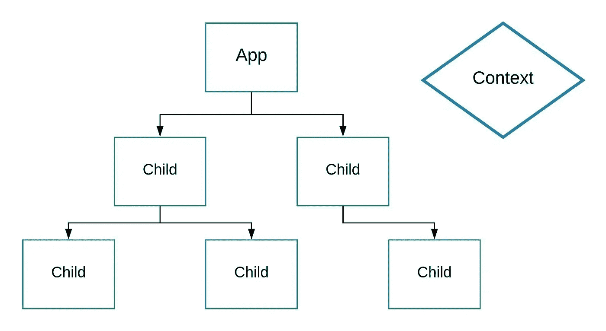

# 反应上下文 API。第 1 部分—黑暗主题

> 原文：<https://betterprogramming.pub/react-context-api-part-1-dark-theme-3f00666cbacb>


照片由 [Pathum Danthanarayana](https://unsplash.com/@pathum_danthanarayana?utm_source=unsplash&utm_medium=referral&utm_content=creditCopyText) 在 [Unsplash](https://unsplash.com/search/photos/dark-theme?utm_source=unsplash&utm_medium=referral&utm_content=creditCopyText) 拍摄

在这个系列中，我们将探索一些 [React](https://reactjs.org) 上下文 API 的潜在用例。我还将分享我实现一些有用特性的方法。在第 1 部分中，我们将回顾 UI 主题，或者黑暗主题切换器。

Context 是 React 解决道具钻孔问题的开箱即用的解决方案。与 [Redux](https://redux.js.org/) 一样，它允许我们创建一种全局状态(组件),可以从组件树的任何地方访问它。



带上下文的基本应用程序结构。

当可能需要在整个应用程序的许多组件上访问数据时，上下文是最佳选择。

这种数据的一些例子:

*   当前的 UI 主题。
*   当前用户界面语言。
*   用户的个人资料信息(头像、姓名等。).

在这篇文章中，我们将专注于实现一个 UI 主题特性，以及我是如何实现的。

我们将使用 React 钩子和 CSS 变量来实现这个效果。这是我们将要使用的简单应用程序:

应用程序组件

卡片组件

开关组件。我使用了 [*react-icons 库*](https://www.npmjs.com/package/react-icons) 来设计切换按钮的样式。

让我们给组件添加一些样式。

一般来说，我更喜欢使用 CSS 模块，并且每个组件都有单独的样式文件，但是在这个例子中，我们将把它们都写在一个`index.css`中。

为了专注于改变 UI 主题特性，我没有在这里包括 CSS 属性的其余部分。您可以在完整的 index.css. [链接](https://github.com/aleckan53/react-context-playground/blob/master/src/index.css)中找到它们

我们使用 CSS 变量，而不是显式的颜色分配。这样以后更容易覆盖。

接下来，我们需要在应用程序的`/src`目录下创建一个新文件，并将其命名为`ThemeContext.js`。

React 提供了一个名为`createContext`的函数。我们将使用它来创建我们的上下文。我们可以提供一个默认值作为参数。这对测试很有帮助，但是在我们的例子中，这只是为了自动完成的目的。

# 语境。供应者

每个上下文对象都带有一个提供者 React 组件，该组件允许组件的消费来订阅上下文更改。

换句话说，我们需要将所有的全局数据和功能放在提供者中，以便以后能够从树中的任何组件(消费者)访问它。

让我们创建`ThemeProvider`组件，就在`ThemeContext`的下面。

`ThemeProvider`将返回带有 value 属性的`ThemeContext.Provider`，该属性将具有当前的 UI 主题状态和一个切换它的功能。

因为`ThemeProvider`包装了我们的应用程序，我们需要在里面传递子组件。

在`index.js`中，我们导入`ThemeProvider`并将其包装在 app 组件周围:

```
...import { ThemeProvider } from './context/ThemeContext';ReactDOM.render(<ThemeProvider><App /></ThemeProvider>, document.getElementById('root'));
```

在`ThemeProvider`中，我们需要一种跟踪当前应用主题的方法。

让我们使用`useState`钩子将它存储在提供者的状态中。

```
const [dark, setDark] = useState(false);
```

然后，我们可以切换状态来改变应用程序的主题。

为了记住用户最后的选择，我们将最后选择的主题保存到浏览器的`localStorage`中。

```
const toggle = () => {
  setDark(!dark);
  window.localStorage.setItem('darkTheme', !dark);
};
```

现在我们需要为新的颜色主题创建另一组颜色。我们还需要保存默认值，以便能够切换回来。

让我们将颜色集存储在数组中。

然后，我们将这些数组作为参数传递给`applyTheme()`。它将数组转换成有效的 CSS 文本，并将其写入我们的根元素(< html >)。

```
const applyTheme = theme => {
  const root = document.getElementsByTagName('html')[0];
  root.style.cssText = theme.join(';');
}
```

最后，我们将添加逻辑来决定应用哪个主题。

`useLayoutEffect`钩子会处理好的。与`useEffect`的主要区别在于`useLayoutEffect`在元素呈现在页面上之前触发，这使得它适合于做布局工作。

这是它看起来的样子。

现在我们需要将我们的`Switch`组件连接到上下文。

我们导入`ThemeContext`并将其作为参数传递给`React.useContext`函数。然后，在变量中保存对其`dark`和`toggle`属性的引用。

```
...import ThemeContext from '../context/ThemeContext';const { dark, toggle } = React.useContext(ThemeContext);...
```

现在我们可以完全访问上下文值，并且我们可以在单击按钮时调用`toggle()`函数来触发主题更改。

我们还将有条件地呈现图标的类，以根据当前活动的主题改变它的颜色。

就是这样！主题切换功能现在完全正常了。

作为一种改进，我们可以添加 CSS 过渡，使颜色变化平滑。

```
/* index.css */*:not(body) { transition: all .5s ease; }// typically I avoid using * selector
```

为了避免第一次加载时身体无意中出现背景色动画，我们将在`toggle()`函数中添加一个动画属性。

# 证明文件

[现场演示](https://dark-theme.olegakan5326.now.sh) | [回购](https://github.com/aleckan53/react-context-playground)

我希望你喜欢这篇文章！

在下一篇文章中，我们将探索[如何使用上下文 API](https://medium.com/better-programming/react-context-hooks-part-2-ui-language-switch-f4610a21379b) 实现应用程序的 UI 语言改变特性。

感谢您的阅读和快乐编码。