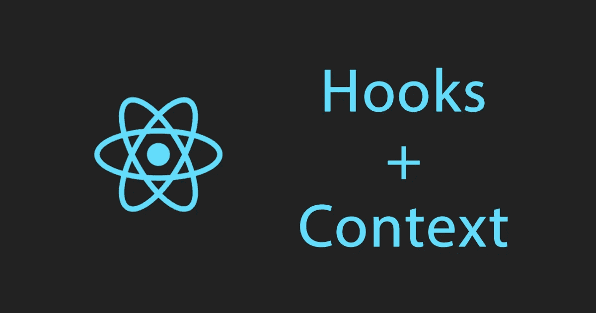

# React 上下文 API +钩子。第 2 部分—用户界面语言切换

> 原文：<https://betterprogramming.pub/react-context-hooks-part-2-ui-language-switch-f4610a21379b>

## 用钩子和上下文改变用户界面语言



钩子+上下文

在这篇文章中，我们将继续探索 [React](http://reactjs.org) 上下文 API 的用法，以及如何向 React 应用程序添加多种 UI 语言。

如果你读过我以前的文章，你就会熟悉上下文是如何工作的，以及我们为什么需要它。如果没有，读: [React 上下文 API。第 1 部分—黑暗主题](https://medium.com/better-programming/react-context-api-part-1-dark-theme-3f00666cbacb)。

# 1.创建简单的应用程序

首先创建一个简单的应用程序。这个应用程序将显示关于电影的信息。

我们将模拟一个 API 获取请求，以保持应用程序的简单，并专注于功能实现。这一次，我们不关心 CSS。

fetchMock.js

App.js

LangSwitch.js

Card.js

# 2.创建上下文文件

和上一篇文章一样，我们通过调用一个将对象作为参数的`React.createContext`函数来初始化一个新上下文。

该对象存储将由提供程序稍后更新的值。它可以是空的，但是出于测试和自动完成的目的，让键的值为空是一个好习惯。

```
const LangContext = React.createContext({
  lang: '', // for currently used language
  currentLangData: '', // lang data (names, titles)
  switchLang: () => {}, 
)};
```

在`LangProvider`中，我们需要获取用户浏览器的当前语言，并将其保存在提供者的状态中。

如果浏览器的语言与用户的偏好不同，我们会将最后选择的语言保存到本地存储中。我们将使用`||`操作符使其优先于默认的浏览器语言，这样，在下一次页面加载时，应用程序将呈现正确的语言。

我们使用`useLayoutEffect`钩子，因为应用程序需要知道在初始渲染之前显示哪种语言。`useLayoutEffect`的第二个参数接受效果的一组依赖项。

稍后，单击一个按钮，我们将调用`switchLang()`来更新状态(lang)。这给了`useLayoutEffect`一个重新呈现应用程序的信号，将新的`currentLang`数据传递给使用该数据的组件，并以当前语言呈现标题。

为了检索当前选择的语言的数据，我们在提供者的值对象中动态地设置它。我们还需要一个对象来存储不同语言的标题。

这就是它看起来的样子:

让我们重构`Card.js`，通过订阅上下文变化并替换动态值的硬编码标题。

在`LangSwitch`中，我们将`switchLang`函数从上下文传递给`onClick`按钮处理程序。

我们还可以有条件地呈现按钮`className`，这样我们就知道哪种语言当前是活动的。

当用户更改 UI 语言时，我们希望根据选择的语言从 API 获取新数据。为此，我们将当前的`lang`从上下文的状态传递给`fetchMock`，作为`App.js`中的一个属性。

在实际的 API 请求中，我们会将它作为查询参数传递，或者向不同的端点发出请求，这取决于 API 架构。

此外，我们将`lang`作为第二个属性传递给`useEffect()`，因此它知道何时重新获取。然后，我们将`h1`改为一个动态值。

就是这样！我希望你喜欢它。

# 证明文件

[直播](https://uilangswitch.olegakan5326.now.sh) | [回购](https://github.com/aleckan53/react-context-part2)