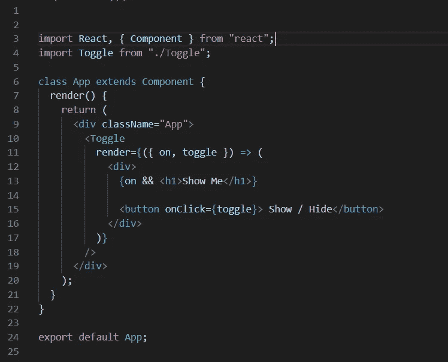
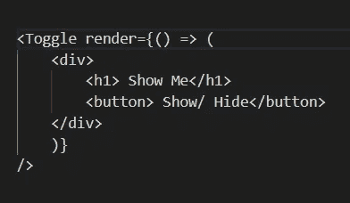
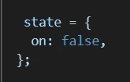
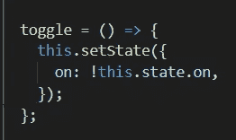
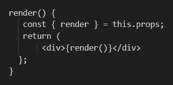
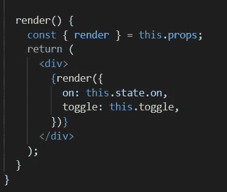
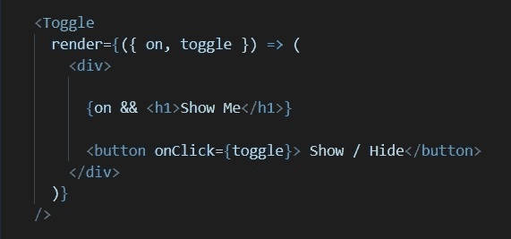
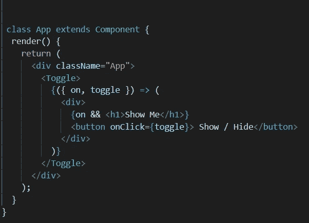
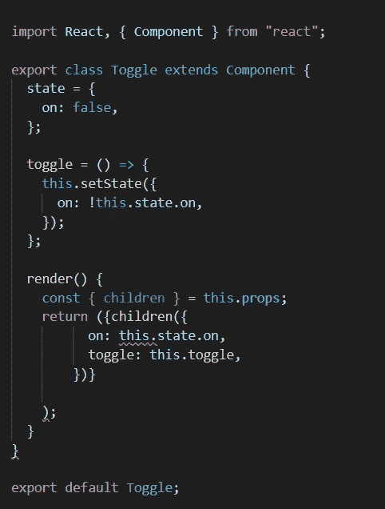

# 在 React 中创建可重用的切换组件

> 原文：<https://betterprogramming.pub/react-creating-a-reusable-toggle-component-10fc485ca9e6>

## 构建您自己的自定义开关


[奥克萨洛克萨](https://unsplash.com/@oxaroxa?utm_source=medium&utm_medium=referral)在 [Unsplash](https://unsplash.com?utm_source=medium&utm_medium=referral) 上拍照。

*注意:在我开始这篇文章之前，我想充分肯定升级教程及其关于* `*render*` *道具的三部分视频系列。查看 YouTube 上的视频*[](https://www.youtube.com/watch?v=5rAFpwfu5C4&feature=youtu.be)**。**

*下面，我们有两个文件:我们的父组件(`App`)和它的子组件(`Toggle`)。在`App`内部，我们正在导入`Toggle`文件，并使用 JSX 组件标签将`Toggle`元素渲染到`App`(或屏幕)。元素标签将让任何写在里面的 JSX 代码访问我们的逻辑。*

****

*首先，我们将声明`<Toggle />`的一个属性或道具。我们可以随意命名这个属性，但是在这个例子中，我们将命名这个道具`render`，因为它将呈现 JSX 元素:*

```
*<Toggle render={JSX} />*
```

*为了渲染出`<Toggle />`中的 JSX 元素，我们首先需要创建一个函数:*

```
*<Toggle render={() => ()} />*
```

*在这个匿名函数中，我们现在可以隐式地返回一个 HTML 元素——在本例中是一个`div`——以及`div`的子元素:*

**

*我们现在可以析构从`Toggle`组件发送的道具对象:*

```
*render={({ on, toggle }) => (*
```

*通过这样做，我们能够在我们的`<Toggle />`元素中调用由`on:`和`toggle:`的键表示的逻辑。*

# ***看看切换文件**里面的逻辑*

*首先，我们来看看我们的状态。我们将布尔值`false`设置为关键字`on`:*

**

*接下来，我们有一个名为`toggle`的函数。在该函数中，我们使用`setState()`函数，通过 bang 运算符将`this.state.on`的值改为其相反的值:*

**

*然后我们将属性`render`析构并设置为一个变量:*

```
*const { render } = this.props;*
```

*这使得关键字`render`可以在`Toggle`文件中使用，并且是声明`this.props.render`的另一种方式:*

**

*因为属性`render`是一个函数，为了正确输出，需要用括号来调用它:*

```
*<div>{render()}</div>*
```

*接下来，我们要将`Toggle`的状态和`toggle`函数发送到`App`文件。我们通过将这些设置为`render`函数中的道具来实现这一点:*

**

# ***返回 app . jsx……***

*所以现在我们明白了在`Toggle`文件中到底发生了什么，我们可以在`Toggle`元素中使用这个逻辑。*

*在`render`道具中，我们在`Toggle`文件中析构了从`render`函数发送来的道具对象:*

```
*render={({ on, toggle }) => (*
```

*我们现在能够在 JSX 元素上使用`on`和`toggle`的道具以及附加到这些关键字的逻辑:*

**

*首先，让我们看看`button`元素。我们有一个调用我们的`toggle`函数的`onClick`函数。记住，我们的`toggle`功能将状态从`true`变为`false`，从`false`变为`true`。*

*然后我们有了我们的`on`关键字，它声明了`Toggle`的状态。*

*在代码片段中:*

```
*{ on && <h1>Show Me </h1> }*
```

*逻辑是声明如果`on`和`<h1>Show Me </h1>`都是`true`，那么渲染`<h1>`元素。*

*所以当点击按钮时，`on`的布尔逻辑变为`true`或`false`。通过这样做，它创造了我们想要的切换效果。*

*在这个阶段，我们现在有了一个完全可重用的`Toggle`组件。在`App`内部，我们现在可以渲染多个`<Toggle />`元素，每个元素都有自己的 JSX 代码。*

*这很好，但是我们可以通过一些调整来清理和减少代码中的一些噪音。*

# *使用 this.props.children 清理代码*

*需要注意的是，`this.props.children`是一个特殊的道具 React 语言给我们的道具。它让我们可以访问在`App`中呈现的`Toggle`元素中的 JSX 子元素。然而，不需要像在`render={() => ()}`中那样在`Toggle`元素中声明它。*

*另外，请注意我们之前是如何在`Toggle`标签中声明我们的 JSX 的:*

```
*<Toggle prop={JSX} />*
```

*在我们清理过的代码中，我们改为在开始和结束的`Toggle`标签之间写 JSX:*

```
*<Toggle>{JSX}</Toggle>*
```

**

*通过这样做，我们在`Toggle`中创建了一个子元素。现在我们可以访问`Toggle`文件中的`this.props.children`:*

**

*我们析构`children`关键字，并为其设置属性，就像我们对`render` prop 函数所做的那样。*

*同样，我们有一个完全可重用的`Toggle`组件。*

*感谢阅读！*