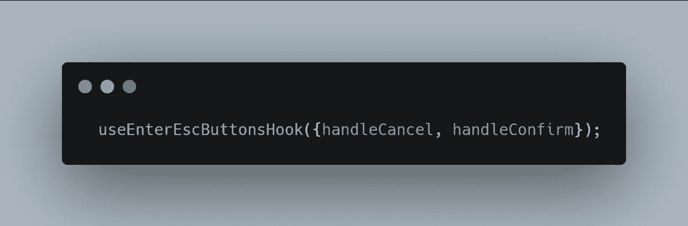
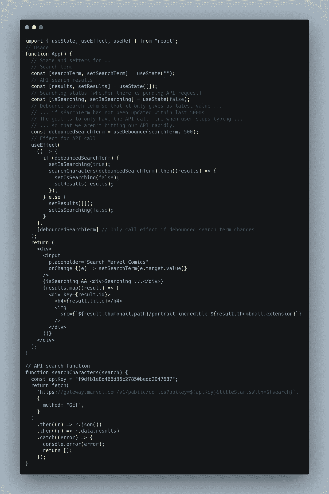
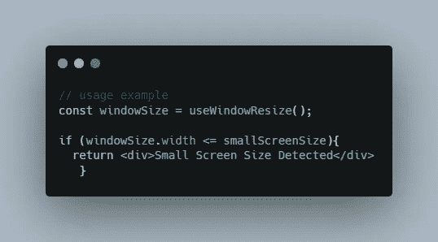

# 用现实生活中的例子来反应定制钩子

> 原文：<https://betterprogramming.pub/react-custom-hooks-with-real-life-examples-c259139c3d71>

## 用现实生活中的例子来反应定制钩子

照片由[斯科特·韦伯](https://unsplash.com/@scottwebb?utm_source=unsplash&utm_medium=referral&utm_content=creditCopyText)在 [Unsplash](https://unsplash.com/s/photos/custom-hook?utm_source=unsplash&utm_medium=referral&utm_content=creditCopyText) 拍摄

React 无处不在，钩子的使用已经成为新的“标准”。
然而，不知何故,“定制挂钩”对 React 开发人员来说听起来仍然很吓人。
所以这篇文章会帮助你认识到这一点都不可怕。相反，这很简单，它让我们的生活变得更容易，几分钟后你就可以在你的项目中构建一个有用的定制钩子。

解释什么是自定义钩子的文章不在少数，但是行动胜于雄辩。
在本文中，我将展示真实项目中的例子，并解释——我们客户的需求是什么，为什么我们认为使用定制挂钩是合适的，以及最重要的——我们做了什么**？**

***本文假设您已经了解 React 中的钩子。
如果你还没有时间学习—*[*React*](https://reactjs.org/docs/hooks-intro.html)*中的文档非常优秀。***

# **什么是定制挂钩？**

**自定义钩子是函数。通常，它们以“使用”一词开始(重要的约定)。**

> **与 React 组件不同，自定义挂钩不需要有特定的签名。我们可以决定它接受什么作为参数，以及它应该返回什么(如果有的话)。换句话说，它就像一个普通的函数**

**自定义钩子允许我们以钩子的形式访问 React 生态系统，这意味着我们可以访问所有已知的钩子，如 useState、useMemo、useEffect 等。这个机制支持逻辑和视图的分离。**

# **你为什么要用它？**

> **当我们想要在两个 JavaScript 函数之间共享逻辑时，我们将它提取到第三个函数中。组件和钩子都是函数，所以这对它们也适用！—反应文档。**

**假设在开发过程中，您遇到了不得不使用`useEffect`和`useState`的情况。**

**过了一段时间，您意识到您需要在另一个组件中使用相同的逻辑`useEffect`和`useState`。
你可以复制代码，但是大概告诉自己一定有更好的方法，那么你会怎么做？定制吊钩进行救援**😎**。**

**使用定制挂钩有几个优点:**

*   ****可重用性** —我们可以一次又一次的使用同一个钩子，不需要写两遍。**
*   ****干净的代码** —将所有的组件逻辑提取到一个钩子中会提供一个更干净的代码库。**
*   ****可维护性** —更容易维护。如果我们需要改变钩子的逻辑，我们只需要改变一次。**
*   **伟大的社区——很有可能有人已经创造出了你所想的那个钩子。网络上充斥着大量的定制钩子！你可以根据自己的需要找到一个挂钩，照原样使用它，甚至更好——你可以把它作为一个起点，让它变得棒极了！**

# **让我们言归正传**

**好吧，本，你说服我了。我知道定制钩子很酷也很有用，但是我在哪里可以使用它们，为什么？**

**所以下面的例子来自真实的项目(在 [Webiks](https://webiks.com/) 我们高度拥护和热爱 React)。在每个例子中，我将描述需求，为什么我们决定将它实现为一个定制的钩子，以及代码本身。**

## **示例#1 — Enter/Esc 按钮挂钩**

**在这个例子中，我们开发的 app 包含了很多[**’**模态**’**](https://uxframework.pearson.com/c/modal)交互。大多数情态动词包含“同意”和“取消”按钮。要求是使用“Enter”键提交更改并关闭模式，类似于“同意”按钮的行为，使用“Esc”键放弃更改并关闭模式，类似于“取消”按钮的行为。**

**我们知道我们需要为按键添加事件监听器，并在按键时调用一个函数。我们也知道我们将在这个任务中使用`useEffect`(因为我们需要注册一个监听器到组件挂载上的“DOM”又名“side **effect** ”,并在组件卸载时进行清理)，但是在 20 个不同的模态中添加 2 个 useEffects 并不是处理这个问题的正确方法。**

**我们决定创建一个自定义挂钩— `useEnterEscButtonsHook`**

**在这个钩子中，我们传递确认和取消功能作为按下 Esc 和 Enter 按钮时使用的道具(注意`handleCancel`和`handleConfirm`与实际按钮(视图)无关，以确保[关注点分离](https://en.wikipedia.org/wiki/Separation_of_concerns))。**

**然后我们用这个线性代码在每个模态中使用它。**

****

## ****示例# 2——使用了反钩****

**我们的项目中有一个搜索输入组件，它在许多组件中被多次重用。每当用户键入一个字符时，它会显示一个建议列表来完成用户正在键入的单词(自动完成功能)。**

**Gif 由 [**cali7**](https://tenor.com/users/cali7) 上**的男高音****

**为了显示这些建议，每当用户输入从服务器获取结果时，就会触发一个 API 调用。这可能会导致对服务器的许多不必要的调用，因为没有必要在每次按键时都触发 API 调用，我们可以在触发新的 API 调用之前使用超时。**

**我们需要一种在调用 API 之前等待几毫秒的方法——我们知道需要像[去抖](https://rxjs.dev/api/operators/debounce)这样的东西。我们没有自己开发，而是在网上搜索并找到了`[useDebounce](https://usehooks.com/useDebounce/)`。**

**使用反钩**

**API 调用的用法示例:**

****

**在实践中使用**

## ****示例#3 —使用 WindowResize 挂钩****

**开发过程中很多时候需要根据浏览器的屏幕大小来改变显示。**

**要做到这一点，有必要倾听屏幕尺寸的变化，并做出相应的改变。**

**这种情况的例子是根据平板电脑或移动电话的尺寸改变显示器、改变显示器的结构以及隐藏某些屏幕尺寸中的元素等。**

**因为这个操作是重复的，我们想要一个方便和干净的方法来监听屏幕尺寸的变化。**

**这就是我们创造`useWindowResize`的原因。**

**使用 WindowResize**

**有了这个钩子，我们可以监听浏览器窗口大小的任何变化。
并据此得到准确的尺寸(`height`和`width`)。**

****

**useWindowResize 用法**

# **结论**

**我们解释了定制钩子，理解了使用定制钩子的好处，并展示了项目中的真实例子，解释了我们何时使用某些钩子。**

**我们已经看到，创建定制钩子非常简单，有很多(开放的)来源，你可以从中获得灵感并使用已经存在的定制钩子(我在下面附上了更多的来源)。我真的希望你喜欢这篇文章，并从中吸取教训。感谢阅读。**

**现在是时候去创建你自己的定制钩子了**🚀**！**

# **有用的链接**

*   **[React 文档—](https://reactjs.org/docs/hooks-custom.html) 自定义挂钩**
*   **use Hooks——ui . dev 定制钩子的好网站**
*   **多棒的 React 挂钩 —惊人的资源库，包括文档、视频、教程和多棒的自定义 React 挂钩。**
*   **[Rooks](https://react-hooks.org/) — NPM 套装，带有许多常见和特殊的定制挂钩。**