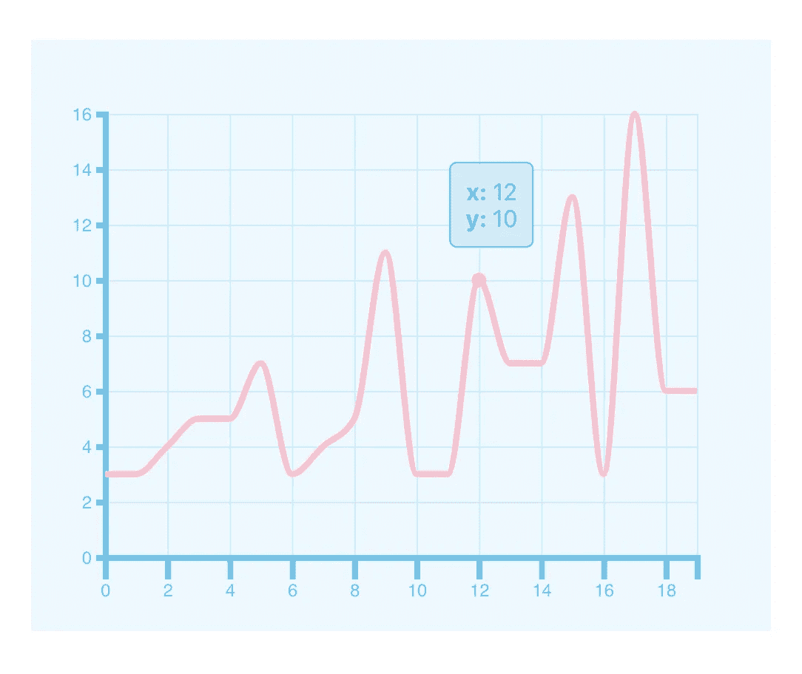

# 使用 React 和 D3.js 绘制带有工具提示的折线图

> 原文：<https://betterprogramming.pub/react-d3-plotting-a-line-chart-with-tooltips-ed41a4c31f4f>

## 立即在您的应用中创建令人惊叹的数据可视化



图片来源:作者

[D3.js](https://d3js.org) 是一个数据可视化库，用于使用 HTML、CSS 和 SVG 从数据中创建漂亮的图表和可视化表示。您可以绘制各种图表并从中进行选择，如树状图、饼图、旭日图、堆积面积图、条形图、箱线图、折线图、多折线图等等。你可以[看看这里的画廊。](https://observablehq.com/@d3/gallery)

今天，我们将使用 D3 在 React 中创建一个简单(但是可爱)的带有工具提示的折线图。

## 先决条件

1.  如果您还没有 React 应用程序，请创建一个新的应用程序。
2.  添加 D3 v5.16.0 作为依赖项。

# 我们开始吧

首先，我们创建一个新的组件，我们把它放在一个名为`LineChart.js`的文件中。

`<LineChart />`将接受图表的三个道具——`data`(图表上要绘图的数据)`width`**`height`**。我们添加了一个`useEffect`钩子来调用我们的`drawChart()`函数。这个钩子将依赖于数据属性，因为我们希望每次数据改变时都重新绘制图表。****

****我们已经呈现了一个 id 设置为`container`的`<div>`元素，它将包含我们的 SVG 元素。****

****接下来，让我们看看将要呈现这个折线图的组件。****

****`regenerateData()`生成随机数据，并在首次安装时以及每次点击`Change Data`按钮时设置组件数据状态。我们将`height`、`width`和`data`作为道具传递给`<LineChart />`。****

****数据对象包含一个`label` (X 轴)和一个`value` (Y 轴)以及一个我们想在图表上显示的`tooltipContent`。****

# ****绘制图表****

****我们现在将添加绘制图表的逻辑。让我们先在`drawChart()`函数中定义一些常数。****

```
**const margin = { top: 50, right: 50, bottom: 50, left: 50 };const yMinValue = d3.min(data, d => d.value);
const yMaxValue = d3.max(data, d => d.value);const xMinValue = d3.min(data, d => d.label);
const xMaxValue = d3.max(data, d => d.label);**
```

****这里我们添加了 SVG 元素和 tooltip 元素:****

```
**const svg = d3
    .select('#container')
    .append('svg')
    .attr('width', width + margin.left + margin.right)
    .attr('height', height + margin.top + margin.bottom)
    .append('g')
    .attr('transform', `translate(${margin.left},${margin.top})`);const tooltip = d3
    .select('#container')
    .append('div')
    .attr('class', 'tooltip');**
```

****我们选择`#container`元素，并在其中添加一个 SVG 元素和一个`g`元素来分组其他 SVG 元素，然后平移它，留下左边距和上边距。我们还添加了一个包含我们的`tooltipContent`的`div`元素。****

****接下来让我们定义轴比例和线/路径生成器:****

```
**const xScale = d3
    .scaleLinear()
    .domain([xMinValue, xMaxValue])
    .range([0, width]);const yScale = d3
    .scaleLinear()
    .range([height, 0])
    .domain([0, yMaxValue]);const line = d3
    .line()
    .x(d => xScale(d.label))
    .y(d => yScale(d.value))    
    .curve(d3.curveMonotoneX);**
```

****`d3.scaleLinear()`将给定域内的任意给定数映射到给定范围。这些刻度将帮助我们找到每个数据项在图上的位置/坐标。****

****现在让我们画出网格线(如果你愿意，可以跳过这一步)、X 轴、Y 轴以及数据线:****

```
**svg
    .append('g')
    .attr('class', 'grid')
    .attr('transform', `translate(0,${height})`)
    .call(
    d3.axisBottom(xScale)
        .tickSize(-height)
        .tickFormat(''),
    );svg
    .append('g')
    .attr('class', 'grid')
    .call(
        d3.axisLeft(yScale)
        .tickSize(-width)
        .tickFormat(''),
    );svg
    .append('g')
    .attr('class', 'x-axis')
    .attr('transform', `translate(0,${height})`)
    .call(d3.axisBottom().scale(xScale).tickSize(15));svg
    .append('g')
    .attr('class', 'y-axis')
    .call(d3.axisLeft(yScale));svg
    .append('path')
    .datum(data)
    .attr('fill', 'none')
    .attr('stroke', '#f6c3d0')
    .attr('stroke-width', 4)
    .attr('class', 'line') 
    .attr('d', line);**
```

****首先，我们添加另一组 SVG 元素，它们将包含 Y 轴上的网格线。我们将`tickFormat`设置为空字符串，因为我们不想用它们绘制任何标签。这些网格线的高度被设置为等于图表的高度，但是我们添加了`—`，以便它们被绘制在`axisBottom`的上方，而不是下方。类似地，我们沿着 X 轴画网格线。****

****接下来，我们绘制实际的轴以及附加的线路径。此时，您已经创建了折线图！****

# ****添加工具提示****

****我们将为我们悬停的点添加一个圆形标记和一个工具提示框。最初，工具提示的不透明度将被设置为 0，并且圆圈标记也不会显示，除非发生了一些鼠标事件。****

```
**const focus = svg
    .append('g')
    .attr('class', 'focus')
    .style('display', 'none');focus.append('circle').attr('r', 5).attr('class', 'circle');const tooltip = d3
    .select('#container')
    .append('div')
    .attr('class', 'tooltip')
    .style('opacity', 0);**
```

****接下来，我们将在图表上追加一个`rect`(它将不可见，所以我们将不透明度设置为 0)来捕获鼠标事件:****

```
**svg
    .append('rect')
    .attr('class', 'overlay')
    .attr('width', width)
    .attr('height', height)
    .style('opacity', 0)
    .on('mouseover', () => {
        focus.style('display', null);
    })
    .on('mouseout', () => {
        tooltip
            .transition()
            .duration(300)
            .style('opacity', 0);
    })
   .on('mousemove', mousemove);function mousemove(event) {
    const bisect = d3.bisector(d => d.label).left;
    const xPos = d3.mouse(this)[0]; 
    const x0 = bisect(data, xScale.invert(xPos));
    const d0 = data[x0];
    focus.attr(
        'transform',
        `translate(${xScale(d0.label)},${yScale(d0.value)})`,
    );
    tooltip
        .transition()
        .duration(300)
        .style('opacity', 0.9);
    tooltip
        .html(d0.tooltipContent || d0.label)
        .style(
            'transform',
            `translate(${xScale(d0.label) + 30}px,${yScale(d0.value) - 30}px)`,
    );
}**
```

****当我们将鼠标移动到图表上时，`mousemove()`函数将负责找出光标的位置，计算出最近的绘图点，并将工具提示和圆圈标记翻译到最近的点。****

****`xScale.invert`从刻度范围(即图表的宽度)中获取一个数字，并将其映射到刻度的域(即 X 轴上值之间的数字)。记住上面的`scaleLinear()`反转是它的反转。`bisect`帮助我们找到该反转点左侧最近的点。****

****最后，我们希望确保在用新数据绘制新图表之前清除旧图表。因此，将此添加到您的`drawChart()`函数的顶部:****

```
**d3.select('#container')
      .select('svg')
      .remove();d3.select('#container')
      .select('.tooltip')
      .remove();**
```

****就是这样！我们的线图准备好了。显然，你会想给你的图表添加更多的样式，但是我会让你来决定。****

****你可以在 GitHub 上找到上面的[代码。感谢阅读！](https://github.com/ihsavru/d3-examples)****