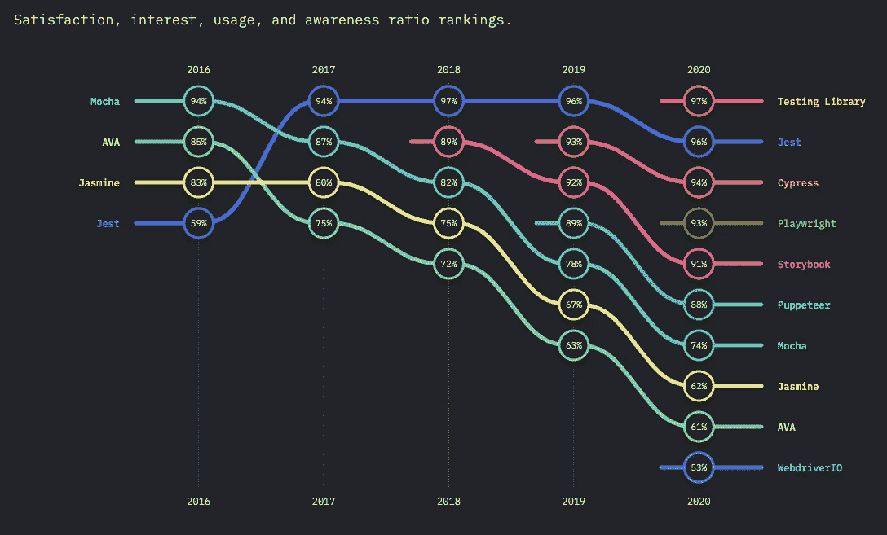

# 反应酶与反应测试库

> 原文：<https://betterprogramming.pub/react-enzyme-vs-react-testing-library-2cac3ad20c52>

## 比较用于测试 React 组件的两个对比库


凯莉·西克玛在 [Unsplash](https://unsplash.com?utm_source=medium&utm_medium=referral) 拍摄的照片。

很长一段时间，当测试 React 组件时，我们被[酶](https://enzymejs.github.io/enzyme/)卡住了。没有其他选择。最近，一个名为 [React 测试库](https://testing-library.com/docs/react-testing-library/intro/)的新玩家加入了前端测试领域。我们已经看到它开始获得一些真正的牵引力。

那么什么时候应该使用其中一个而不是另一个呢？每一个都有什么作用？让我们比较一下 Enzyme 和 React 测试库，看看它们都是关于什么的。我们将通过涵盖以下内容进行适当的比较:

*   基础知识:热身并了解一些关于每个库的知识。
*   安装:安装每一个有多容易？
*   不同的心态:他们对测试有什么看法？
*   快照测试:它是什么，为什么要关注它？
*   示例:一些反映两个库之间差异的实际代码。
*   总结:最后的想法。

# 酶的基础

Enzyme 是一个专用的 React 测试工具，用于查看 React 组件的输出。在某些方面，它可以模拟 React 应用程序的运行时。它是由 Airbnb 团队建造的，在一段时间内一直是唯一的解决方案。

> " Enzyme 的 API 旨在通过模仿 jQuery 的 DOM 操作和遍历 API 来实现直观和灵活."— [酶的文档](https://enzymejs.github.io/enzyme/)

# React 测试库基础

React 测试库构建在 Dom 测试库之上。它只是添加了 API 来处理 React 组件。它在几年前发布，但直到 2020 年才开始获得真正的关注。

> “`DOM Testing Library`是一个非常轻量级的测试 DOM 节点的解决方案(无论是用 [Jest](https://jestjs.io/) 默认提供的`[JSDOM](https://github.com/jsdom/jsdom)`模拟还是在浏览器中模拟)。它提供的主要实用工具包括查询 DOM 中的节点，这种方式类似于用户在页面上查找元素的方式。通过这种方式，库有助于确保您的测试让您对 UI 代码充满信心。`DOM Testing Library`的首要指导原则是:
> 
> 你的测试越像你的软件被使用的方式，它们就越能给你信心。”— [DOM 测试库的文档](https://testing-library.com/docs/dom-testing-library/intro/)

React 测试库的一个了不起的地方是它是框架无关的。您可以将它与 Vue、Preact、Angular 和 React Native 一起使用。除了 React Native，它们都是同一个 Dom 测试库的包装器。学一次，到处用。

# 酶的设置

酶的设置相对容易。为您想要使用的 React 版本选择正确的适配器:

```
npm i --save-dev enzyme enzyme-adapter-react-16
```

为库配置创建一个`setup.js`文件。将`Enzyme`与先前安装的适配器绑定。

在我们的例子中，它将是`react-16`:

```
import { configure } from 'enzyme';import Adapter from 'enzyme-adapter-react-16';configure({ adapter: new Adapter() });
```

这样，你就完成了。适配器包含所有特定于 React 的实现，而`'enzyme'`包包含核心。

要执行完整的 DOM 渲染，你需要确保你设置了一个像`Jsdom`这样的无头浏览器。默认情况下，这是 Jest 附带的，我推荐使用 Jest，因为它很棒。

# React 测试库的设置

这种设置更容易。您只需要安装库，就可以开始了:

```
npm install --save-dev @testing-library/react
```

React 测试库也使用`Jsdom`来呈现它的组件。如前所述，`Jsdom`是为测试目的而设计的网络浏览器的一个子集。

通过使用 Jest，你已经设置好了。你可以在文档中查看更多关于 Jest 环境配置[的信息。](https://jestjs.io/docs/en/configuration.html#testenvironment-string)

其他测试提供者可能需要一些进一步的安装，比如`jasmine`:

```
npm install --save-dev @testing-library/jasmine-dom
```

如果你正在使用 Jest，你会发现`testing-library/jest-dom`相当有用。它有一大群观察者，会让你的生活更轻松。安装好之后，只需要导入即可。您可以像前面一样创建一个安装文件，并将导入文件放在那里:

```
import ‘@testing-library/jest-dom’;
```

# 不同的心态

这两个库可能看起来很相似，但是它们对如何测试组件的理解是不同的。这意味着当使用它们时，你必须接受它们的提议。

## 1.适配器与 DOM

马上，我们注意到一个关键的区别:酶需要一个适配器来连接特定的反应库。这意味着当我们试图升级到一些 React 版本时，这个库会阻碍我们。React 中的突破性变化将反映在适配器中。那些突破性的变化大多会传播到您的测试中。

另一方面，React 测试库不知道所使用的 React 版本，甚至不知道 React 本身。它只是提供了一些薄薄的 React 包装器来呈现组件。这使得设置和使用更加容易。这使它成为一个轻量级的库。

## 2.翻译

Enzyme 和 React 测试库都使用无头浏览器来呈现 DOM(例如`Jsdom`)。然而，他们的方法不同:

Enzyme 允许您在浅 DOM 渲染和全 DOM 渲染之间进行选择。

*   浅层:这有助于约束自己将组件作为一个单元来测试，并确保您的测试不会间接断言子组件的行为。
*   完整的 DOM 呈现:这非常适合于这样的用例:您的组件可能会与 DOM APIs 交互，或者需要测试包装在更高阶组件中的组件。

```
// using shallow or full DOM renderimport { shallow, mount } from 'enzyme';
```

两者都返回一个附加了组件实例的 [Cheerio](https://github.com/cheeriojs/cheerio) 包装器。它基本上是一个类似 jQuery 的工具，用来遍历 DOM 节点。

React 测试库将只在`Jsdom`上呈现组件，并为您提供遍历它所需的查询工具。

```
// more similar react apiimport { render } from '@testing-library/react'
```

## 3.模仿与真正的 DOM 测试

在浅 DOM 和全 DOM 之间进行选择，就像在对组件进行单元测试或集成测试之间做出决定一样。

当试图对 React 组件中的方法进行单元测试时，Enzyme 大放异彩。浅层渲染对此非常有用。它允许您以隔离的方式测试该组件。浅层渲染不会渲染目标的任何子组件。如果这是您所追求的，那么这就是您的完美用例。

注意:浅渲染不会渲染组件的钩子，因为它们本质上是另一个组件。

React 测试库不相信为单元测试确定组件的范围。恰恰相反。它只关心测试用户和浏览器之间的交互。它不鼓励编写脆弱的单元测试。

任何复杂的逻辑都不应该存在于组件中，这就是为什么 React 测试库不关注那个层次的测试。业务逻辑应该从组件中分离出来。通过这样做，您可以仅使用 Jest 对其进行单元测试。

## 4.组件的状态

```
const component = mount(<LoginForm />); // LoginForm is a class Componentexpect(wrapper.instance().state.showButton).toBe(true);
```

React 测试库的目的不是基于状态进行检查。当用它测试某个东西时，你应该想，“用户关心这个吗？”如果不是，那你也不应该。

```
For example: does the user care about the component's internal state? No. Then you shouldn’t care either when testing.
```

React 测试库只关心用户将会体验到什么。它不关心如何做到这一点。

## 5.钩住

有了钩子，你就不能再用酶来断言对抗`state`了。功能组件的`state`道具将始终是`null`。你可以通过嘲讽`useState`来绕过它，但你不想走上那条路。

这证明了将您的测试与库耦合可能会导致灾难。当您将旧的状态组件迁移到钩子时，您将不得不重写您的测试。如果这些是与供应商无关的，那就不会发生了。

那么我们如何测试钩子呢？推荐的方法是在组件内部呈现这些挂钩，并通过查看 DOM 来观察它们产生的副作用。Enzyme 和 React 测试库都有一些专用于钩子的库，但是如果可能的话应该避免使用它们。

两个库的钩子测试方法是相似的:观察副作用。

## 6.传统选择器与可访问性

React 测试库确实鼓励您像实际用户一样访问元素:通过文本、类型，甚至通过 ARIA 可访问性。它确实为那些极端情况提供了一个`data-testId`，但这不是推荐的方式。如前所述，这个想法是为了更贴近用户的体验和交互。

通过添加更多的 ARIA 元素来查找您的评论，您增加了应用程序的可访问性。因此，您同时使您的代码更加可靠和易于访问。

# 快照测试

让我们回顾一下什么是快照测试:

> “当您想要确保您的 UI 不会发生意外变化时，快照测试是一个非常有用的工具。
> 
> 一个典型的快照测试用例呈现一个 UI 组件，获取一个快照，然后将它与测试旁边存储的一个参考快照文件进行比较。”— [笑话文档](https://jestjs.io/docs/en/snapshot-testing)

这就像在一个测试上拍一张组件树的照片，并将其与未来的测试进行比较，以确保没有任何意外的变化。

两个库都通过以下方式支持快照测试:

```
const { asFragment } = render(<Login />);const html = asFragment();expect(html).toMatchSnapshot();
```

或者:

```
*const* component = shallow(<Login debug />);

expect(component).toMatchSnapshot();
```

然而，我不推荐使用快照测试。快照测试背后的意图是好的。然而…

即使人们同意快照测试，他们也同意它是一个例外——不应该被滥用。当进行快照测试时，开发人员经常无法仔细检查更改，只是简单地更新快照，这样测试就能通过。在代码评审过程中，很难验证这些更改。

总之，即使它看起来很棒，也要谨慎使用。否则，这将是一个需要更新的无用测试。

# 样本测试代码

让我们创建一个简单的`LoginForm`来比较这两种测试方法:

## 酶样品测试

我们将看到一个用于遍历 DOM 的 Enzyme 工具的例子。它确实把你带回了那些 jQuery 时代。

```
// Traversing the DOM with Enzymewrapper.find('button')
wrapper.find('input[name="password"]')
```

您可以看到一切都依赖于从`mount`方法返回的`wrapper`。

## 反应测试库样本测试

在这个例子中，我们看到了轻量级查询访问器是如何返回的。我们得到类似`getByLabelText`的查询方法。所有这些访问器都专注于 ARIA 可访问性。在这个例子中，通过添加`role`属性，我们将使我们的代码更易于访问。

```
// Traversing the DOM with React Testing Library// will throw an error if it can't resolve to a node or finds more than one match
getByRole('button');
getByLabelText('password');// will not throw an error
findByRole('button');
findByLabelText('password');
```

助手方法有一个更加函数化的方法。像`fireEvent`这样的工具是独立的，这使得它们更直观，更容易使用。这就是为什么使用一些很酷的工具如`user-event`是可能的。

```
[https://github.com/testing-library/user-event](https://github.com/testing-library/user-event)
```

请注意，这种方法看起来比前一种更干净。它看起来更具有声明性和直观性。自定义匹配器(例如`toHaveFormValues`)帮助测试使用更具声明性的方法。它们也减少了测试中的样板文件。

# 包扎



来自 JS 2020 的[状态的照片。](https://2020.stateofjs.com/en-US/technologies/testing/)

一幅图像有时胜过千言万语。React 测试库很快就成功了。它有很多优点。它只要求新用户做一件事:改变心态。

让我们的组件尽可能的简单，没有业务逻辑，只关心用户如何与它们交互。让我们忘记单元测试组件的方法，开始关注用户将会体验到什么。

如果你真的致力于它，并努力尝试，你可以用这种心态酶。问题是，它不是为使用而建造的。只是碰巧有可能。

值得注意的是，您可以在项目中同时使用这两种方法。它们可以共存。但是，你需要了解他们的动机，才能明白他们的闪光点在哪里。

如果你喜欢测试，并且对嘲讽工具如何工作很好奇，可以看看我关于代理的文章。我使用 ES6 代理特性用普通 JavaScript 复制了一些 Jest API:

[](https://medium.com/better-programming/mastering-es6-proxies-ced4253bc661) [## 掌握 ES6 代理

### 用真实的例子实现代理

medium.com](https://medium.com/better-programming/mastering-es6-proxies-ced4253bc661) 

将来会有更多的测试内容。干杯！