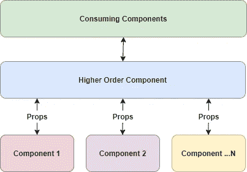

# React 的高阶组件解释

> 原文：<https://betterprogramming.pub/react-higher-order-components-explained-c0f9be638>

## 通用的、可重用的组件



在探索高阶组件时要记住的关键思想是，它们旨在支持组件之间的代码重用。就是这样。这就是它们存在的原因。

现在，还有一些想法需要记住:

*   高阶组件之所以如此称呼，是因为它们是消耗并返回另一个组件的组件
*   名称*高阶组件*是对高阶函数的引用；然而，它们与类和功能组件一起工作
*   它们可能有点笨拙，并因此受到批评(子弹在这里，所以如果你第一次遇到这些事情，你会发现自己在想见鬼，你会知道你并不孤单)
*   它们在框架中使用得相当多，所以它们会在这里存在一段时间
*   HOC =高阶分量

# 真实世界的例子:带路由器

让我们看一个真实世界的例子。

大多数重要的 [React](https://reactjs.org/) 应用使用[路由器](https://www.npmjs.com/package/react-router)库。当您将一个组件传递到一个路由中时，例如…

`<Route path="/foobar" component={FooComponent} />`

……`FooComponent`将可以访问`props`对象上的`history`、`location`和`match`成员(因此，可以访问路由器特性，如编程导航)。

但是有时候你有一个组件不像这样通过路由直接处理，但是你仍然需要访问`props.history`功能——比如说在`NavBar`中。

您如何访问路由器的基础设施？

使用`withRouter` HOC:

```
import { withRouter } from 'react-router-dom';function NavBar (){ 
  // ...DO STUFF...
  // including access props.history, props.location and props.match
  return (/*...*/)
}export default withRouter(NavBar)
```

所以你可以看到我们的`NavBar`功能组件，不是作为导出返回自己，而是返回被`withRouter` HOC 包装的。

这是一个基本的想法:获取共享的功能，然后将它放在一个组件中，该组件包装了其他组件，这些组件可以利用通用的特性。

如果我们需要多个 hoc，我们该怎么办？

你可以把它们包起来:`withState(withRouter(navBar))`。

(另一个选项是[Redux](https://redux.js.org/api/compose/)功能。)

# 创建 hoc

当应用程序需要跨组件共享功能时，使用 HOCs 是一种选择(本文结尾提到了其他一些可能会考虑的方法)。

您想要做的是识别共享的位，并将其提取到一个组件中，该组件将与包装的组件进行通信，其方式是使特设组件和客户端组件尽可能少地了解彼此(这就是松耦合——良好的老式软件设计)。

实际上，这种工作方式是 HOC 通过 props 与客户端组件进行交互。Props 是向组件提供所需信息的标准方式，通过它们进行交互，组件可以以完全相同的方式存在，不管它是否被 HOC 封装。

所有被包装的组件需要知道的是道具在运行时是可用的。

因此，我们可以将 HOCs 视为框架和组件之间的抽象层，这正是它们的本质。


您的 HOC 可以是一个简单的功能组件，其一般形式如下所示(`with*`是常规的命名模式):

```
const withSomething = WrappedComponent => { 
  const something = // do something generically useful with something
  return props => <WrappedComponent something={something} 
    {…props}/>; 
};
```

因此，基本的想法是在您的 HOC 中执行一些有用的服务，然后通过 spread 操作符将结果传递给`WrappedComponent`以及其余的道具。

这最后一点很重要，因为它使得消费代码所传递的任何其他道具都可用。这使得它对包装的组件是透明的。

随着钩子的出现，你的函数式 HOC 可以做类组件所能做的一切，包括进入生命周期点和处理状态。

大型应用程序中出现的一个常见模式是将状态提取到 HOC 中，然后努力获得一个纯粹的表示组件，以响应由 HOC 管理的状态。

# 或者也许你应该使用…

除了代码共享的 HOC 之外，您还应该知道其他选择。

## 混合(坏)

首先是旧的选择:mixins。Mixins 是一种众所周知的 JavaScript 技术。它们在 React 中已经失宠，因为它们遇到了一些问题，比如名称空间冲突，以及在复杂场景中它们的功能变得模糊。

从 HOC 的角度来看，后面的批评很有趣:我想知道，HOC 不也有同样的问题吗？

## 继承(不赞成)

继承是代码重用的标准 OOP 风格。对于组件的紧密耦合来说，这被认为是不好的做法。它也不适用于功能组件。

在现代，即使是 OOP 专家也倾向于强调组合而不是继承。

## 渲染道具

另一个选择是渲染道具。有时渲染道具可以提供更干净的体验。你必须看一看你正在做的事情的细节，以确定更好的选择。

## 钩住

另一个选择是定义自定义挂钩，如这里的[所述](https://blog.bitsrc.io/simple-code-reuse-with-react-hooks-432f390696bf)。