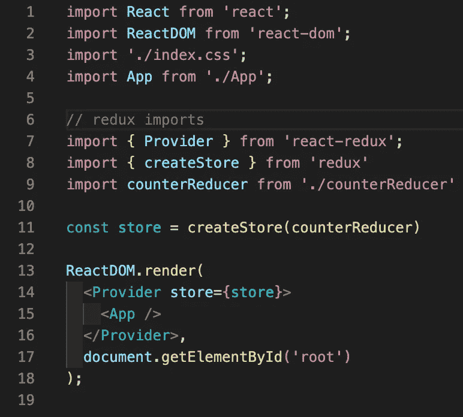
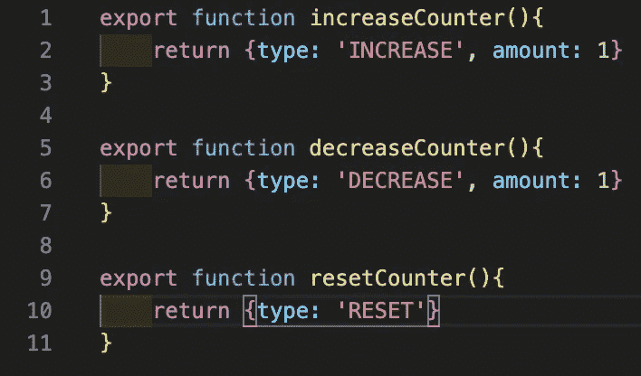
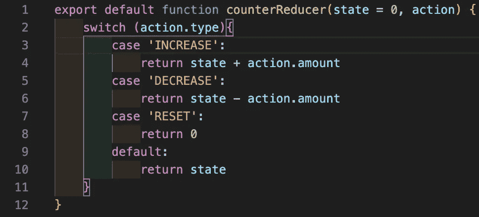
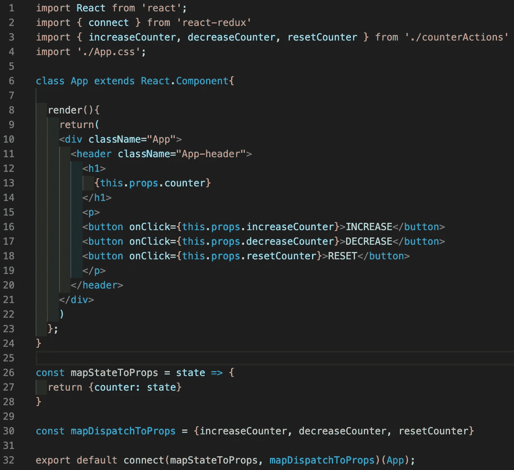
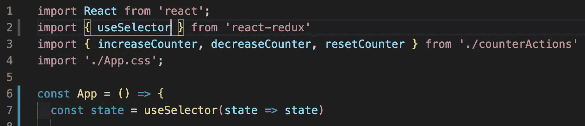
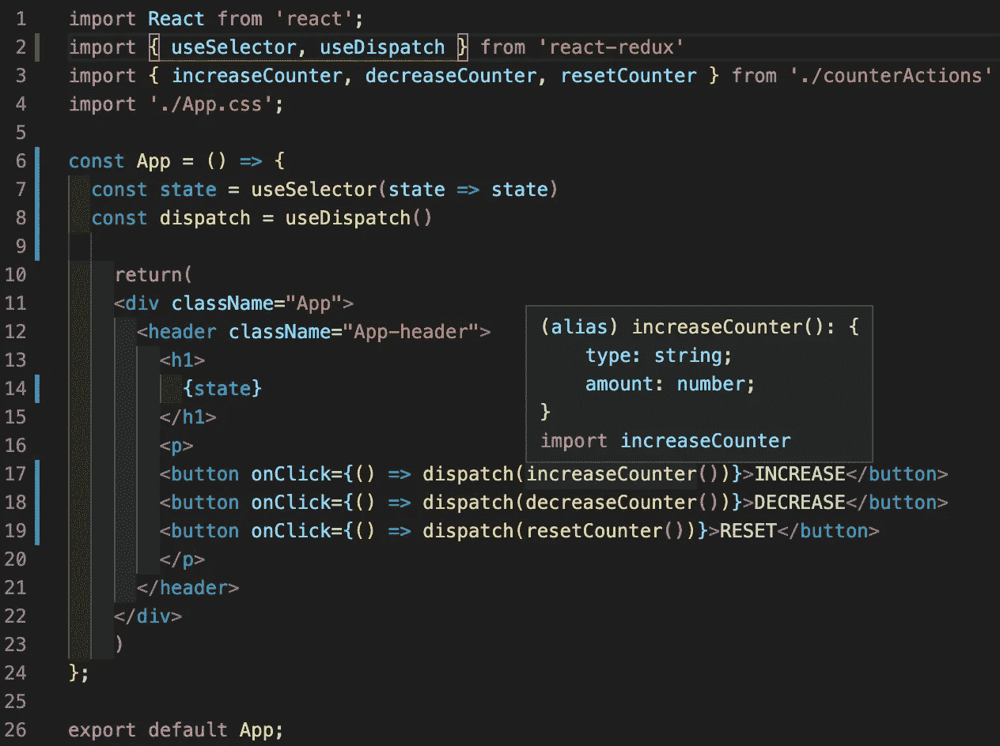

# 反应钩子:Redux 基础版

> 原文：<https://betterprogramming.pub/react-hooks-redux-basics-edition-6f95411a7754>

## 学习与 React 挂钩一起使用的 Redux 的基础知识


Redux:状态管理系统

React 挂钩是在 2019 年 2 月的 v16.8 版本中引入的。在发布之前，有一些特性是类组件独有的。通过钩子，功能组件现在允许在其中使用状态和其他 React 特性。钩子的引入也是为了能够重用组件之间的有状态逻辑，简化难以理解的复杂组件，以及扩展功能组件中的特性，因为类会使人和机器感到困惑。2019 年 6 月，React Redux v7.1 发布，目的是为了加入钩子。

# 设置 Redux

无论你是否使用钩子，Redux 的设置都是一样的。对于本文中的示例，我们将制作一个简单的计数器应用程序(这对 Redux 没有太大意义，但我们只是出于示例目的使用它)。首先，你需要几个包:

```
npm install redux
npm install react-redux
```

前两个步骤是设置存储、缩减器和操作，如下所示:



index.js 文件



反作用. js 文件



counterReducer.js 文件

# 无挂钩 Redux

为了在没有钩子的情况下使用 redux，从 [react-redux](https://github.com/reduxjs/react-redux) 导入的`connect()`函数将把 react 组件与 Redux 存储连接起来，Redux 存储提供了对状态的访问以及改变状态的调度函数。为了获得对它们的访问，`mapStateToProps`和`mapDispatchToProps`的参数通过函数传递，该函数提供状态和导入的分派函数作为组件内的道具。顺序很重要，因为`mapStateToProps`总是需要放在第一位，而`mapDispatchToProps`需要放在第二位。这两者都将被设置为变量，如下所示:



App.js —使用 Redux w/o 挂钩的计数器应用程序

如果我们想使用钩子来获得与上面的应用程序相同的功能，我们将不再需要使用`connect()`函数，也不需要为`mapStateToProps`和`mapDispatchToProps`设置变量。相反，我们可以使用 react-redux、`useSelector()`和`useDispatch()`中可用的钩子。

# 使用选择器()

`useSelector()`相当于`mapStateToProps`，因为它提供了对商店的访问。这个函数通常应该是一个纯函数，因为它可能会被多次调用。整个存储将是参数，因此可以操作从中提取的内容，因为存储是一个完整的对象。当功能被分配给功能组件中的变量时，状态将通过变量而不是通过 props 来访问。在计数器应用程序中，状态仅由变化的计数器组成，可按如下方式设置:



app . js-use selector()设置

# 使用 Dispatch()

要访问调度功能，我们将能够使用`useDispatch()`功能。这个钩子使用对分派函数的引用，以便根据需要使用分派函数。这也是通过将函数设置为一个变量来实现的，让它能够被用作回调，这是我们的计数器应用程序所需要的。然后，调度函数将作为参数传递，如下所示:



App.js —使用 Redux w/o 挂钩的计数器应用程序

# 结论

我确实发现 React Hooks 是一个更简洁的代码，所以我更喜欢在未来的代码中使用 React Redux Hooks。对于这个计数器应用程序来说，这不是最有意义的，但是在一个更大的应用程序中会有用得多。关于这些挂钩的更多信息，因为我只研究了简单的领域来制作一个简单的功能应用程序，所以请参见下面的参考资料。继续钩住！


柜台申请

# 资源:

1.  “React”，脸书开源，2020 年 11 月 7 日访问，[https://reactjs.org/](https://reactjs.org/)

2.《Redux》，丹·阿布拉莫夫，2020 年 11 月 7 日，[https://redux.js.org/](https://redux.js.org/)

3.“反应-还原”，丹·阿布拉莫夫，2020 年 11 月 7 日，[https://react-redux.js.org/](https://react-redux.js.org/)