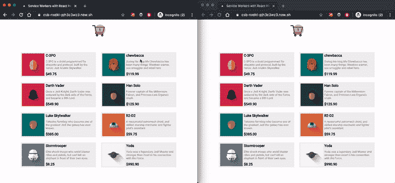
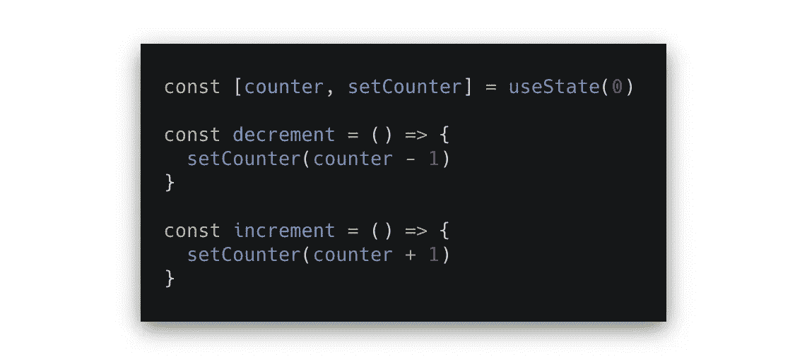
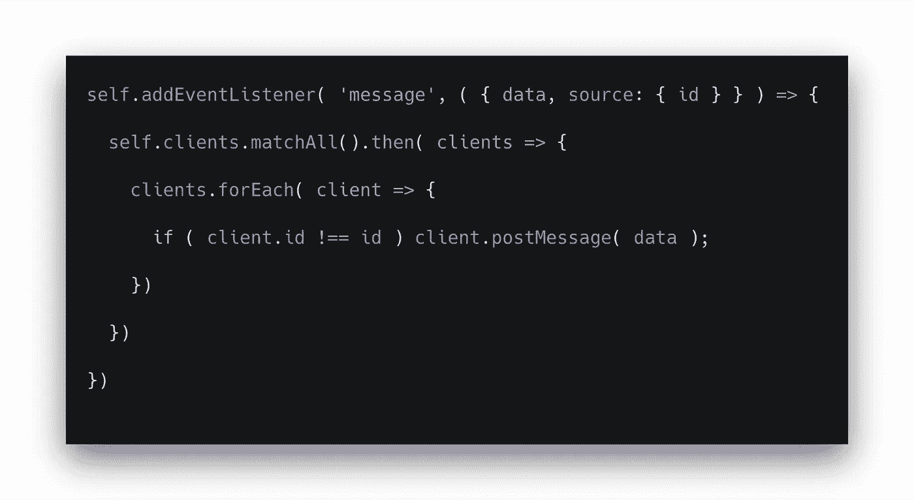
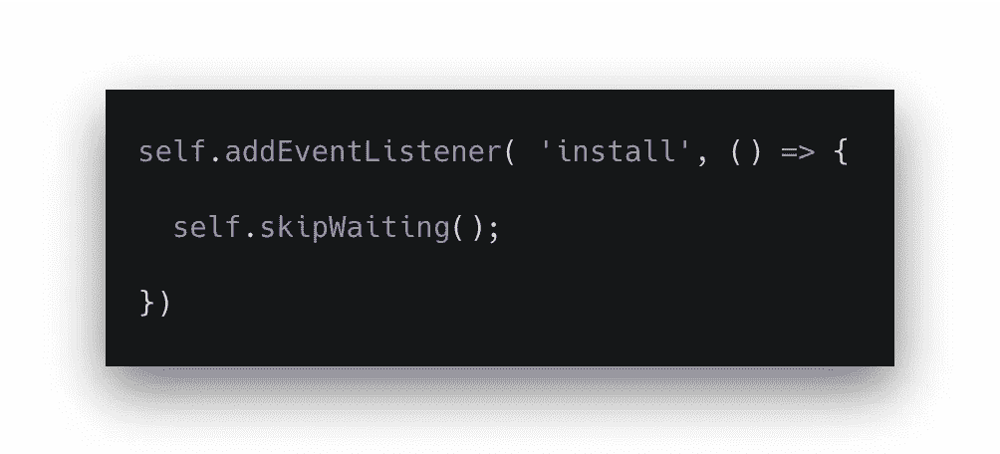
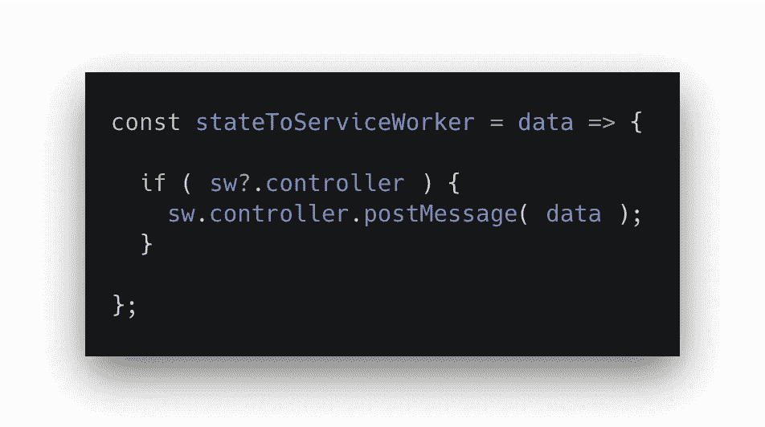
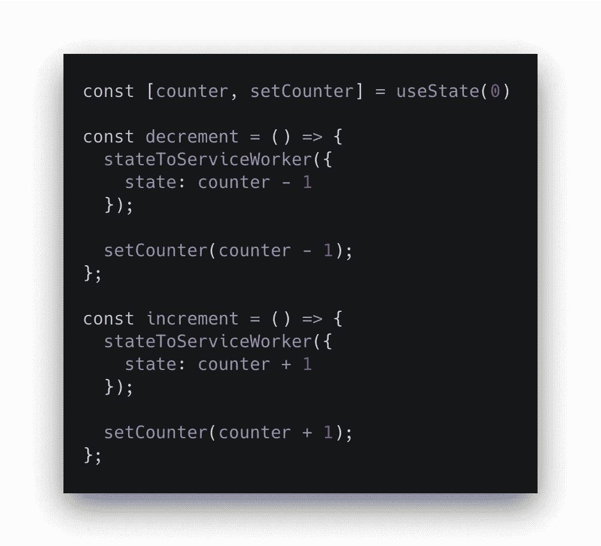
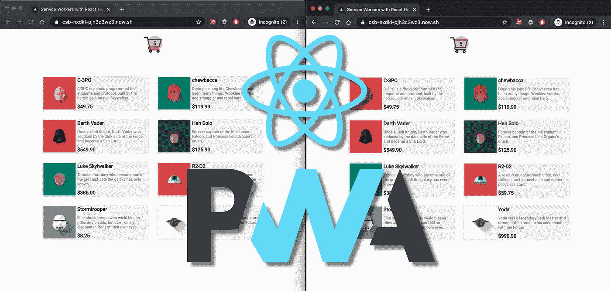

# 使用 React 挂钩在服务人员之间共享状态

> 原文：<https://betterprogramming.pub/react-hooks-state-share-with-service-workers-9fa7fa7ab7b1>

## 跨选项卡和窗口通信

构建渐进式 web 应用程序(PWA)通常代表即时访问，无论网络状态如何，但 PWA 可以通过使用服务人员提供更多功能，包括跨多个浏览器选项卡和窗口的状态共享。

跨选项卡共享状态可以有多种用途——对于这个特定的示例，让我们考虑一个每次添加或删除产品时都会更新的电子商务购物车。通过将服务工作者与 React 挂钩结合起来，我们可以有效地实现跨选项卡和窗口的状态共享。让我们来探索一下。

# 动手反应

我们将开始在我们的状态中声明购物车计数器，并创建负责增加和减少袋子上产品计数器的函数。例如，您可以在产品组件内部的行动按钮上调用这些函数。

第一步:[使用状态和辅助功能](https://gist.github.com/lucasestevao/39151511f03878fc24b863dcfba7344c#file-step01-js)

在与服务人员合作之前，我们必须确保该功能在浏览器中可用，只有这样我们才能安全地注册我们的`serviceWorker.js`。按照惯例，服务人员的可用性用`'serviceWorker' in navigator`来验证，但是编码无论如何都不会影响结果。

考虑到在加载页面的转换过程中我们不需要任何动作，我们将在页面加载后应用[最佳实践](https://developers.google.com/web/fundamentals/primers/service-workers/registration)来注册服务工作者，从而避免任何性能差距。

我们在这里的目标是一旦服务人员[准备好](https://developer.mozilla.org/en-US/docs/Web/API/ServiceWorkerContainer/ready)向[消息事件](https://developer.mozilla.org/en-US/docs/Web/API/ServiceWorkerGlobalScope/message_event)添加监听器。通过这种方式，当事件被触发并且有数据可用时，我们可以用通过服务工作者发送的值来更新购物车的状态。

步骤 2: [useEffect，serviceWorker 寄存器，ready 和 addEventListener](https://gist.github.com/lucasestevao/39151511f03878fc24b863dcfba7344c#file-step02-js)

注意，我们需要从我们的状态中注入`setCounter`函数和我们声明的`sw`变量，以使用`useEffect`钩子，并在每次从袋子中添加或取出产品时更新计数器。另一方面，我使用了[可选的链接操作符](https://developer.mozilla.org/en-US/docs/Web/JavaScript/Reference/Operators/Optional_chaining)，据称是为了提高可读性，让代码更整洁。

# 设置服务人员

在`serviceWorker.js`中，我们将把一个函数绑定到消息事件，从中我们将检索伴随事件而来的数据和客户端的 ID(浏览器标签或窗口)。我使用析构赋值语法只解包我需要的值。

第三步: [serviceworker.js，clients，matchAll 和 client postMessage](https://gist.github.com/lucasestevao/39151511f03878fc24b863dcfba7344c#file-step03-js)

当`message`事件被触发时，我们将调用`[Clients](https://developer.mozilla.org/en-US/docs/Web/API/Clients)`接口的`[matchAll](https://developer.mozilla.org/en-US/docs/Web/API/Clients/matchAll)`方法。这将为服务工作器`[Client](https://developer.mozilla.org/en-US/docs/Web/API/Client)`对象列表返回一个`Promise`，它可能代表一个浏览器选项卡或窗口。这将有助于我们获得所有且仅由我们在应用程序中注册的服务人员控制的服务人员客户端。

一旦我们有了我们的选项卡和窗口列表(`clients`)，我们就仔细检查每一个并验证它是否是当前的客户端。在这种情况下，我们使用`[postMessage](https://developer.mozilla.org/en-US/docs/Web/API/Client/postMessage)`方法发送一条消息，其中包含我们在事件中收到的数据。这个方法允许我们的服务人员向客户端发送消息。该消息依次在`navigator.serviceWorker`的`message`事件中被接收。

此时，我们能够将服务工作者文件中的操作(postMessage)与我们在 React 应用程序中声明的侦听器连接起来。下一步是从我们的 React 应用程序触发对我们的服务人员的操作。

在我们进入下一步之前，我建议将`[skipWaiting](https://developer.mozilla.org/en-US/docs/Web/API/ServiceWorkerGlobalScope/skipWaiting)`添加到我们服务人员的 install 事件中。该方法强制等待的服务工作者成为活动的服务工作者。它还确保对底层服务工作者的任何更新将立即对当前客户端和所有其他活动客户端生效，从而为我们的用例提供更好的用户体验。

步骤 3.1: [serviceworker.js，安装并跳过等待](https://gist.github.com/lucasestevao/39151511f03878fc24b863dcfba7344c#file-step03-js)

# 总结解决方案

当用户从一个窗口添加或移除产品时，他们会在屏幕上立即看到状态更新。现在我们需要一个函数来告诉我们的服务人员更新所有其他的选项卡和窗口。

我们将使用服务工作者`[controller](https://developer.mozilla.org/en-US/docs/Web/API/ServiceWorkerContainer/controller)`上可用的`[postMessage](https://developer.mozilla.org/en-US/docs/Web/API/Worker/postMessage)`，将状态值作为参数传递。

控制器是`ServiceWorkerContainer`接口的只读属性，并返回一个`ServiceWorker`对象，该对象从其父对象`Worker`继承方法，其中`postMessage`方法可用。

第四步。[控制器和工人后消息](https://gist.github.com/lucasestevao/39151511f03878fc24b863dcfba7344c#file-step04-js)

最后，我们在自己的辅助函数中调用`stateToServiceWorker`函数来减少和增加状态。这个循环是完整的——我们可以向服务人员发送更新并从其接收更新，同时保持多个选项卡和窗口的简洁状态。

第五步: [serviceworker.js，安装并跳过等待](https://gist.github.com/lucasestevao/39151511f03878fc24b863dcfba7344c#file-step05-js)

# 资源

下面你可以找到这个用例的完整代码。

**GitHub:**[https://GitHub . com/lucasestevao/react-service worker-state-share/tree/master/](https://github.com/lucasestevao/react-serviceworker-state-share/tree/master/)

**code sandbox:**[https://code sandbox . io/s/github/lucasestevao/react-service worker-state-share/tree/master/](https://codesandbox.io/s/github/lucasestevao/react-serviceworker-state-share/tree/master/)

【https://csb-nxdkl-pjh3c3wz3.now.sh/】直播项目:

感谢您的阅读！