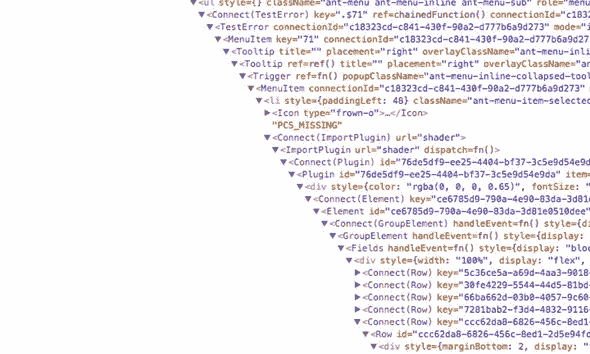

# 反应钩子和类

> 原文：<https://betterprogramming.pub/react-hooks-vs-classes-add2676a32f2>

有什么区别，你应该在你的应用程序中使用哪个，为什么？

由于 React 如今在开发人员中如此受欢迎，这篇博客旨在通过 React 16.8 发布的`useState()`和`useEffect()`的钩子 API 向您展示 React 钩子与类的优缺点。

**问题** : React 没有提供比类组件更简单的有状态原语——Dan abra mov

*首先，我们将简要讨论状态，然后我们将检查 React 中的*钩子*和*类*。最后，我们将看到 **React 16.8** 中钩子的释放是如何解决以下痛点的:*

***1** 。**管理状态:**重用多个组件之间的逻辑会导致*包装器地狱*或深度嵌套的组件。*

**

***2** 。**副作用:**生命周期方法中逻辑上不相关的混合会得到重复，并引起不必要的副作用。*

***3** 。**优化:**钩子可能会减少你的包的大小。*

# *管理本地状态*

## ***React 中的状态是什么？***

*简单地说，状态就是一个包含所有键值对的对象。状态决定了组件的呈现和行为方式。*

*状态允许您的组件是动态的和交互式的。*

*不要把国家与`props`混淆。状态是组件内部管理的内容，而`props`是传递给组件的内容。*

## *React 中的类如何管理本地状态*

*类组件来自 ES6 类，是管理本地状态的默认方法。它们还允许副作用通过生命周期方法发生。*

*要访问和管理类中的状态，必须将`this.state`初始化为`constructor()`中的一个对象，将本地状态命名为一个键，并将其初始值设置为键值。*

*`setState()`是更新类中状态的默认方法，这是导致组件重新呈现的原因。*

*此外，建议每次想在钩子之前正确修改状态时调用`setState()`。*

*下面是一个用类编写的带有递增按钮的计数器的简单示例:*

*本地状态设置为 counter = 0，handleIncrement()作为回调传递给 button*

*要设置一个类组件，你需要一些样板代码，不仅限于你的类中的常规`constructor()`和扩展组件的`super()`。*

*例如，有必要在类组件中添加`this`上下文，并将其绑定到第 9 行的`constructor()`中。*

*由于普通 JavaScript 中的隐式绑定，我们需要绑定`this`。*

*当我们像这样(`<button type=”button” onClick={this.handleIncrement}>+</button>`)传递事件处理函数引用时，我们失去了`this`的上下文，因为`handleIncrement()`变成了没有所有者对象的普通函数调用。*

*在这种情况下，`this`的值回到默认绑定，并指向全局对象，或者如果被调用的函数使用严格模式，则指向`undefined`。*

*最后，我们需要将 return 语句包装在`render()`函数中。*

# *React 钩子如何管理本地状态*

**

*注意:钩子完全基于选择加入，并且 100%向后兼容。这意味着您不必马上学习或使用钩子，并且在添加或重构您的类时不会有突破性的变化。*

*钩子允许你在不写类的情况下使用本地状态和其他 React 特性。*

*钩子是特殊的函数，它可以让你“钩住”功能组件内部的反应状态和生命周期特性。*

***重要**:内部反应无法跟踪乱序运行的钩子。因为钩子返回一个数组，所以它们被调用的顺序很重要。*

*挂钩有两个规则:*

1.  *只在顶层调用钩子——不要在任何逻辑中嵌套钩子。*

*不要这样做！*

*`if (bool) { const [counter, incrementCounter] = useState(0) }`*

*2.仅从 React 函数或自定义挂钩中调用挂钩。*

*由于 React 组件在每次数据改变时都会被重新渲染，这意味着在每次渲染时必须以完全相同的顺序调用完全相同的钩子。如果我们把钩子放在条件 or 函数中，状态有时会被创建，而其他时候不会。*

*`useState()`是一个钩子，让你给函数组件添加一个反应状态。*

*这是同一个例子，但是没有使用类，而是使用了钩子:*

*本地状态是常量计数器= 0，*

*通过导入和调用`useState()`，它声明了一个“状态变量”`counter`，其值是传递给`useState()`的任何参数。在这种情况下，我们的状态变量`counter`的值为零，如第 4 行中设置的。*

*注意:`useState()`的参数不限于对象，可以是原语，如数字、字符串、布尔值等。*

*`useState()`只取一个自变量，初始状态。*

*`useState()`返回数组中的一对值，当前状态和更新它的函数。*

*然而，与类中的`this.setState()`不同，更新当前状态总是**替换**而不是合并它。*

*通过将数组分解成两个变量，我们可以使用更具声明性的方法，因为我们知道数组中返回的第一个值是当前状态，第二个值是更新状态的函数。(第 4 行)*

*这是编程中的一个概念，叫做 [*耦合*](https://en.wikipedia.org/wiki/Coupling_(computer_programming)) 、，通过将这两个值紧密分组，我们知道它们彼此紧密依赖。*

*所以我们当前的状态是`count`的值，为 0，我们的`incrementCounter`是更新`count`的函数。*

*注意:`incrementCounter()`需要包装在一个函数中，并作为回调传递到我们的按钮中。*

*注意每个变量是如何与其各自的值相关联的，我们的函数保持干燥和可重用。*

*此外，不再需要`this`上下文，为我们节省了一些手指力量和时间。*

# *什么是副作用？*

**

*副作用通常是影响正在执行的函数范围之外的任何东西，或者在 React 的上下文中，是修改其本地环境之外的状态的任何东西。*

*常见的副作用包括获取数据、设置订阅以及手动更改 React 组件中的 DOM。*

*在 React 的例子中，有两种常见的副作用:不需要清理的和需要清理的。*

*不需要清理的例子有网络请求、手动 DOM 突变和日志记录。这是因为我们运行它们，并立即忘记它们。*

*如果我们想清理副作用，我们需要返回一个包含卸载逻辑的函数。*

## ***在 React 中使用类的副作用***

*手动 DOM 变异的类示例:*

*componentDidMount()在初始挂载时设置文档标题=计数器；componentDidUpdate()在初次装载后，每次更改计数器后更新文档标题。*

*这是 React 的生命周期方法在类中引入副作用的一个例子。如`componentDidMount()`、`componentDidUpdate()`、`componentWillUnMount()`。*

*在本例中，`componentDidMount()`将文档的标题“装载”或设置为本地状态的当前计数。*

*更新一发生就调用`componentDidUpdate()`。`componentDidUpdate()`最常见的用例是更新 DOM 以响应属性或状态的变化。*

*如果我们想重置计数，我们还需要一个`componentWillUnMount()`。*

*这里有一个关于生命周期方法的更好的阅读:[React life cycle Methods——Mosh hame dani 的深入探讨](https://programmingwithmosh.com/javascript/react-lifecycle-methods/)。*

## ***使用 React 挂钩的副作用***

*带`useEffect()`钩子的函数示例:*

*useEffect()接受回调*

*`useEffect()`允许您在函数组件中使用副作用。*

*告诉你的组件在每次渲染后做一些事情。*

*React 将记住传入的回调，并在 DOM 更新后调用它。*

*`useEffect()`被放在我们的函数组件中，因为我们想要访问我们的本地状态计数。*

*此外，`useEffect()`在每次渲染后运行。所以就像是一个`componentDidMount()`、`componentDidUpdate()`、`componentWillUnMount()`三位一体。*

*在 Fullstack 代码学院为期三周的课程中，我们使用带有钩子的功能组件，通过`useEffect()`在 arcGIS 中获取纽约开放数据和远程自定义数据库。*

# ***通过跳过效果优化性能***

## ***类例子***

*每次渲染后清理和应用效果是一项繁重的任务，我们可能会遇到问题或错误。*

*例如，如果我们想将`document.title`限制为最大计数 10:*

*在**类**组件中，我们可以通过在我们的`componentDidUpdate()`函数中添加一个额外的条件并传入`prevProps`和`prevState`作为参数来解决这个问题。(第 16–17 行)*

## ***挂钩示例***

*使用**钩子**，我们可以简单地将第二个参数作为一个带有计数器的数组传递给`useEffect()`，并在我们的`useEffect()`中添加条件。*

*传递到数组中的任何内容都可以用来定义钩子所依赖的所有变量。如果其中一个变量更新，钩子将再次运行。*

*请记住，如果您传递一个空数组，钩子在更新组件时根本不会运行，因为没有什么需要关注的。当您在循环中获取数据，并且只想在`componentDidMount()`获取数据，从而停止循环时，这很有用。*

*将[counter]传递给 useEffect()的第二个参数—第 10 行*

# *结论*

*虽然 hooks 解决了我们在 React 中使用类时遇到的许多棘手问题，但是对于类来说还有其他的用例，比如如果您想要访问特定的生命周期方法。*

*同样，本指南不是**也不是**要说服你使用钩子或者完全重构你的类到钩子。*

*只是一个友好的提醒，还有其他的选择可以尝试！*

*如果你真的有兴趣学习更多关于钩子的知识，试着将这些概念应用到你将来开始的新项目中。*

*下次见。编码快乐！— *RL**

*如果你有兴趣学习更多关于钩子的知识，比如访问上下文 API 等等。，参见[上下文 API](https://reactjs.org/docs/hooks-reference.html#usecontext) 。*