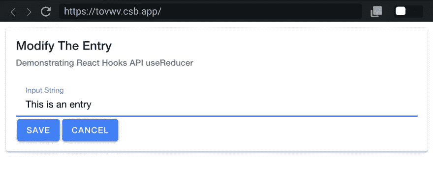
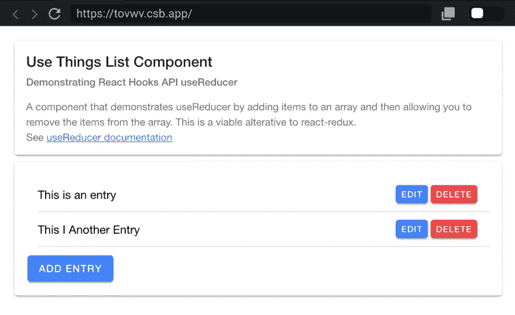

# 反应离子框架和钩子

> 原文：<https://betterprogramming.pub/react-ionic-framework-and-hooks-5947e5e5745a>

## 一个简单的应用程序，有一个事物列表，能够用 React Hooks API 添加、编辑和删除


作为[包容性创新孵化器的](http://www.in3dc.com) #FutureIsWrittenInCode 计划的一部分，我们正在举办免费的 JavaScript 培训研讨会。创建这个内容是为了支持 React Hooks API 上的会话。

一个简单的应用程序，有一个列表，可以添加、编辑和删除内容。我们将使用`useReducer`钩子来管理数组的状态。

我们将使用`useState`钩子来管理模式对话框的状态，我们使用它来输入我们正在编辑或更新的信息，我们使用`useState`钩子来管理模式对话框中输入字段的状态。

# 从 useReducer API 开始

```
// useThings.js
// --
import React from "react";

const useThings = () => {
  // handle the specific action dispatched
  const reducer = (state, action) => {
    switch (action.type) {
      case "ADD_THING": { }
      case "DELETE_THING": { }
      case "EDIT_THING": { };
      default: {
        return state;
      }
    }
  };

  // here we set things up to use the reducer
  const [state, dispatch] = React.useReducer(reducer, {
    things: []
  });

  // the function returns everything needed to the caller to
  // dispatch specific action and get the updated state changes
  return {
    state,
    dispatch
  };
};

export default useThings;
```

# 使用 useState 修改 State 中的值

*   添加一个项目:将`action.data`添加到数组的末尾，设置状态属性。

```
case "ADD_THING": {
  return { ...state, things: [...state.things, action.data] };
}
```

*   删除一个项目:将`action.index`切片添加到数组中，得到索引指定的项目之前的内容和索引指定的项目之后的所有内容。这又被用来创建一个新的数组，我们用它来设置`state.things`。

```
case "DELETE_THING": {
  return {
    ...state,
    things: [
      ...state.things.slice(0, action.index),
      ...state.things.slice(action.index + 1)
    ]
  };
}
```

*   编辑一个项目:将`action.index`切片添加到数组中，以获取索引指定的项目之前的内容和索引指定的项目之后的所有内容。接下来，我们使用`action.data`作为新元素来替换之前的元素。这又被用来创建一个新的数组，我们用它来设置`state.things`。

```
case "EDIT_THING": {
  return {
    ...state,
    things: [
      ...state.things.slice(0, action.index),
      action.data,
      ...state.things.slice(action.index + 1)
    ]
  };
}
```

# 显示用户输入的模式



使用`useState`功能管理模式对话框的显示，用于输入新数据或编辑内容。

状态有两个键，`isVisible`和`value`。`isVisible`将设置为 true 显示对话框，设置为 false 隐藏对话框。

当我们实际编辑一个对象时，`value`属性将被设置。我们还将在编辑一个东西时添加一个名为`index`的附加属性，这样我们就可以在状态数组中找到它来更新它。

```
// ThingsList.js
// --
// using the useState functionality to manage displaying the modal
// dialog for inputting data for new things or editing things
const [
  modalInfo, 
  setModalInfo
] = useState({ isVisible: false, value: "" });
```

# 使用 useState 管理输入值

```
// ThingEdit.js
// --
const [inputValue, setInputValue] = useState();
```

当 input 元素中有 input 事件时，我们如何在组件的`render`方法中使用它？我们用用户输入的值更新状态。

```
<IonInput
  value={inputValue}
  onInput={e => setInputValue(e.target.value)} />
```

所以，当用户完成时，在模态中，他们将点击两个按钮中的一个来调用`handleClick`方法。

```
<IonButton onClick={() => handleClick(true)}>Save</IonButton>
<IonButton onClick={() => handleClick(null)}>Cancel</IonButton>
```

如果用一个`true`值调用`handleClick`，那么我们需要从保存在我们状态中的输入表单返回这个值。如果传递给`handleClick`的值为 null，那么我们只需要退出函数，不返回任何数据。

```
// ThingEdit.js
// --
const handleClick = _save => {
  handleFormSubmit({ isVisible: false, value: _save && inputValue });
};
```

回到`ThingsList`组件，我们需要处理来自`ThingEdit`组件的调用，以处理从模态接收的数据。

从 modal/form 获取响应，以便我们可以更新或创建新项目。如果`_formResponse.value`为空，忽略它，因为用户选择了取消按钮。

如果有一个`_formResponse.value`并且`modalInfo.index`有一个值，那么编辑该项。变量`modalInfo.index`告诉我们要更新数组中的哪一项；如果没有`modalInfo.index`，用`_formResponse.value`创建一个新东西。

```
// ThingsList.js
// --
const handleFormSubmit = _formResponse => {
  if (_formResponse.value) {
    modalInfo.index != null
      ? editEntry(modalInfo.index, _formResponse.value)
      : addNewEntry(_formResponse.value);
  }
  // reset the modalInfo state
  setModalInfo({ ...modalInfo, isVisible: false, value: "" });
};
```

# 显示物品清单



从组件的定制钩子`useThings`呈现事物列表，我们在本文开始时提到过。

```
// get the function from my custom hook to manage the list
// of things
let { state, dispatch } = useThings();
```

这使我们能够访问状态对象，并且状态对象包含`state.things`。我们使用`Array.map()`函数遍历值数组。

```
<IonList>
  {state.things.map((_thing, _index) => (
    <IonItem key={_index}>
      <IonLabel className="ion-text-wrap">{_thing}</IonLabel>
      <IonButton onClick={() => modalInfoWithEntry(_thing, _index)}>
        Edit
      </IonButton>
      <IonButton color="danger" onClick={() => deleteEntry(_index)}>
        Delete
      </IonButton>
    </IonItem>
  ))}
</IonList>
```

我们有所有的基本函数，它们是用`dispatch`调用 reducer 方法的包装器。

```
// ThingsList.js
//- 

/**
 * add entry to the list using `dispatch` from custom hook
 */
const addNewEntry = _data => {
  dispatch({ type: "ADD_THING", data: _data });
};

/**
 * remove entry from the list using `dispatch` and index in the array
 * to call custom hook
 * @param {*} _index
 */
const deleteEntry = _index => {
  dispatch({ type: "DELETE_THING", index: _index });
};

/**
 * update an existing entry in the list based on data
 * and the index of the entry
 * @param {*} _index
 * @param {*} _data
 */
const editEntry = (_index, _data) => {
  let payload = { index: _index, data: _data };
  dispatch({ type: "EDIT_THING", ...payload });
};
```

# 包扎

TK 这个项目的所有代码都可以在下面列出的 CodeSandbox 中找到。[https://codesandbox.io/s/determined-ardinghelli-tovwv](https://codesandbox.io/s/determined-ardinghelli-tovwv)

React 钩子，通过`useState`和`useReducer`，允许你的整个应用成为功能组件，它们的状态可以通过钩子 API 来管理。

这里有一个很棒的视频链接，它给了你一些为什么你可能想在你的应用中尝试钩子的理由。