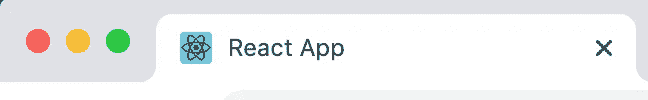
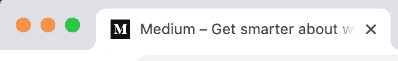
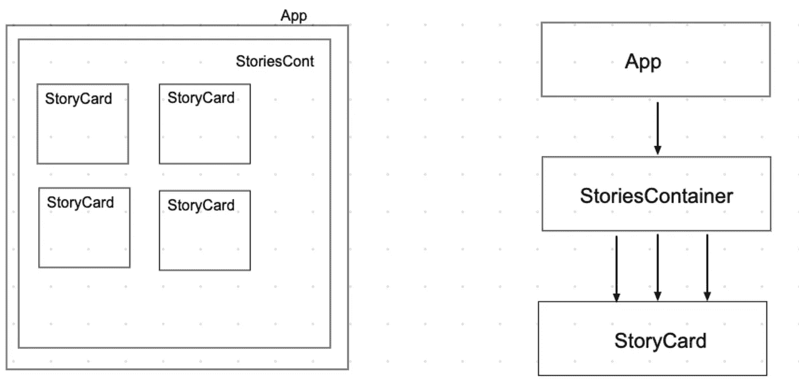

# React 生命周期方法 101:给页面添加标题

> 原文：<https://betterprogramming.pub/react-lifecycle-methods-101-adding-a-title-to-your-page-8781eba042cd>

## 用一个快速的技巧增加你的页面的搜索引擎优化和可访问性


来源:[pexels.com](http://pexels.com)

大家有没有注意到，很多用 [create-react-app](https://github.com/facebook/create-react-app) 创建的初学者项目，永远有了 *React App* 的称号？比如说，这里:



那是因为标题最初是在`index.html`中声明的，后来再也没有更新过。

此外，即使您更改了文件中的标题，也可能会永远使用相同的页面标题，因为更新页面标题以匹配内容很少是开发人员的主要关注点。然而…

# 如果您可以在任何给定的时间看到子页面标题，那不是很好吗？

在完美世界的场景中，不同的子页面有不同的标题。例如，这里有一个“新故事”的标题:


这是通用媒体主页的标题:



# 这有什么关系？

一个好的标题和副标题可以提升你的 SEO(搜索引擎优化),让你的页面更容易被浏览器看到。此外，这也是一个增加页面可访问性的问题——屏幕阅读器用户通过页面的标题知道他们当前在哪个页面。

# 第一步。设置

假设我们有一个这样结构的应用程序:



如您所见，`App`是最顶层的组件，`StoriesContainer`是它的子组件，`StoryCard`是`StoriesContainer`的子组件。如果你想添加标题和副标题，下面是你想做的伪代码版本:

*   清除`index.html`。
*   使用`componentDidMount`生命周期方法，从底部组件开始覆盖标题。
*   通过将主标题追加到现有标题来添加主标题。
*   如果你需要生命周期方法的复习，查看这篇博文。

# 第二步。' Clean index.js '标题

因为我们将在`componentDidMount,`中添加标题，所以请记住应用程序是从孙级挂载到最顶层的父级。出于这个例子的目的，我们将把`StoriesContainer`作为一个子页面，把`App`作为一个主页面。

首先，如果你用`create-react-app`创建了你的 React 应用，转到`public/index.html`，把初始标题改成一个空的:

```
<title> </title>
```

如果没有这个，你可能会遇到有趣的冲突情况(自己试试吧！).

# 第三步。覆盖标题

现在，在`StoriesContainer`中，覆盖页面标题:

```
componentDidMount() {
   document.title = " 🔥 Stories "
}
```

您希望覆盖组件层次结构底部的标题，因为那是应用程序装载的开始。

# 第四步。添加新标题

现在，在`App`中，通过将主标题追加到现有标题来添加主标题:

```
componentDidMount() {
   document.title = " My Blog " + document.title
}
```

# 结果

现在我们的页面有了一个独特的标题:


附:页面图标可以通过替换`index.html`中的 URL 地址来改变:

```
<link rel="icon" href="HERE PUT THE URL" />
```