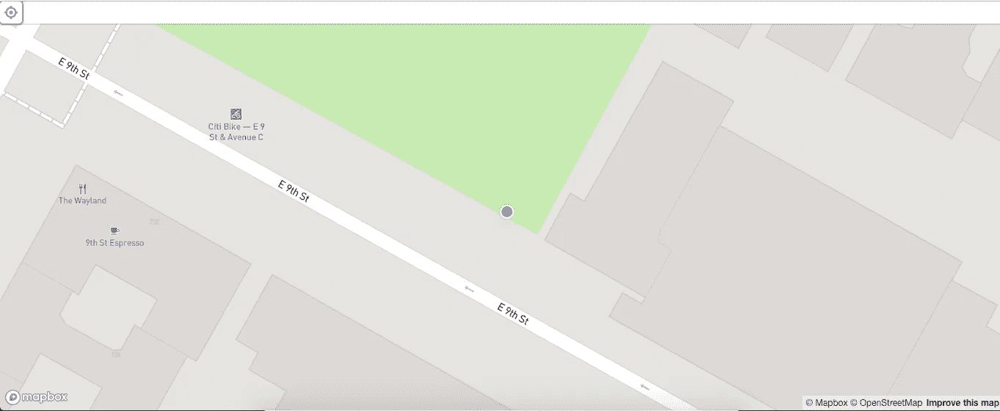
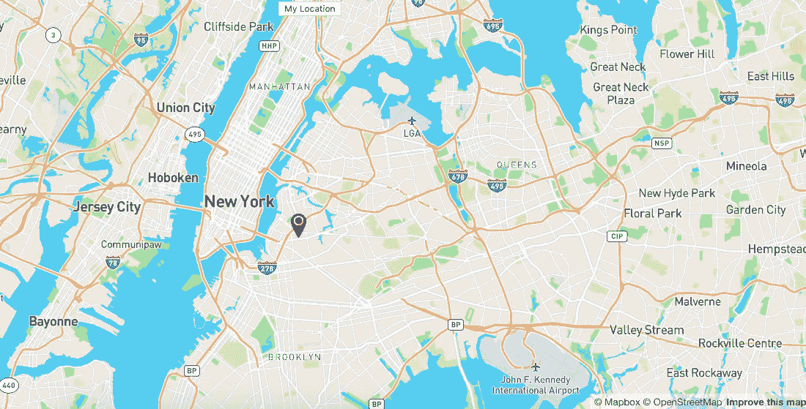
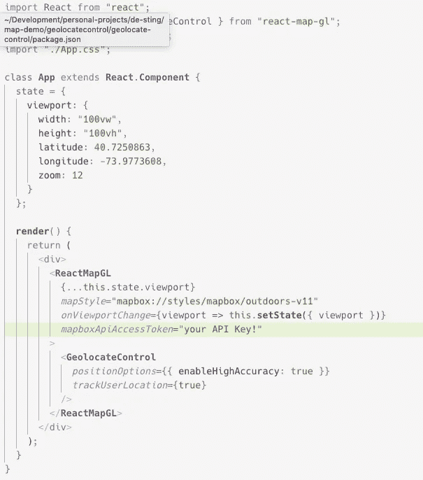
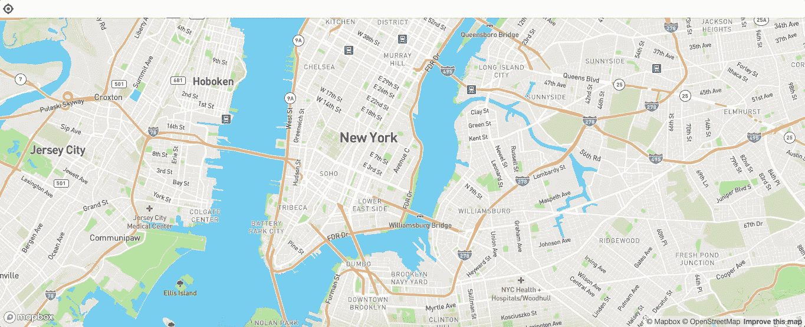

# React 地图框 GL JS 简介

> 原文：<https://betterprogramming.pub/react-mapbox-gl-js-getting-started-with-geolocatecontrol-18c08a5410d>

## 地理控制入门

# 第一

如果你对任何其他关于 React [地图框](https://docs.mapbox.com/mapbox-gl-js/api/)和如何做事的文章感兴趣，你可以按顺序阅读这些文章。

1.  【React 和 MapBox GL JS 入门
2.  [MapBox GL JS 入门:地理定位用户位置](https://medium.com/better-programming/getting-started-with-mapbox-gl-js-user-location-with-geolocation-f32c3e323526)
3.  【React 和 MapBox GL JS 入门:带有标记组件的用户位置标记
4.  【React 和 MapBox GL JS 入门:从 API 设置地图标记。
5.  【React 和 MapBox GL JS 入门

我坚持使用 MapBox 的文章。我有没有告诉过你，最近，我在一家使用位置数据的科技公司开始了一份工作？你猜怎么着？他们也使用 MapBox。

我个人还没有参与它的工程设计(希望我会朝着那个方向努力)，但是我使用它的接口，这意味着它被公司使用。如果你在这个行业中追随你的兴趣，你可以去哪里的一个例子。

# 地理控制

所以，我已经有一篇关于地理定位用户位置的文章，你可能想看，也可能不想看。它使用普通的 Javascript 地理定位来获取用户的坐标，并设置一个标记。

它看起来像这样。

但是，React MapBox GL 已经为此提供了一个内置组件。它看起来比我的版本好得多，而且它也是抽象的，所以你不必像在我的另一个演示中那样有一个巨大的函数来定位用户。

你可以在五分钟内设置好。所以，这就是我们要做的。

# 去做

我们将使用`GeolocateControl`组件创建一个地图。先决条件是基本的 React 知识、一个 MapBox 帐户和一个 API 密钥。

所以，如果你是 MapBox 的新手，注册并获得你的 API 密匙，然后回来这里见我。

# 步伐

1.  `create-react-app geolocate-control`
2.  `cd geolocate control`
3.  `npm install react-map-gl`

然后，我们把`App.js`转换成一个类组件，设置一些初始坐标，使用`GeolocateControl`。

我们的`App.js`应该是这样的:

这就是全部的代价。如果您`npm start`，您会注意到组件附带了一个栏和一个按钮。

按下按钮，它就会放大。

# **关于地理控制**

请随意查看关于 geolocatcontrol 的[文档，它非常简单明了。我们刚刚使用了准确性和跟踪选项。但是您也可以自定义样式和自定义缩放选项。](https://uber.github.io/react-map-gl/#/Documentation/api-reference/geolocate-control?section=properties)

# 结论

像往常一样，一些编程天才创造了一个漂亮的工具供我们免费使用。除非你想了解 JS 中地理位置的本质，否则你应该只使用`ReactMapBoxGL` `GeolocateControl`组件。