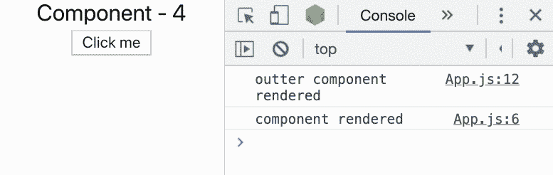

# 做出反应。备忘录 vs 记忆

> 原文：<https://betterprogramming.pub/react-memo-vs-memoize-71f85eb4e1a>

## 有什么区别，什么时候使用它们


由[凯利·西克玛](https://unsplash.com/@kellysikkema?utm_source=unsplash&utm_medium=referral&utm_content=creditCopyText)在 [Unsplash](https://unsplash.com/search/photos/memo?utm_source=unsplash&utm_medium=referral&utm_content=creditCopyText) 上拍摄的照片

是时候快速探究一下记忆库(在我们的例子中是 [memoize-one](https://github.com/alexreardon/memoize-one) )和 [React](https://reactjs.org/) 提供的`[memo](https://reactjs.org/docs/react-api.html#reactmemo)`函数之间的区别了。

首先，memoize-one 在这个例子中是一个任意的库。我们可以选择任何记忆库，比如[重新选择](https://github.com/reduxjs/reselect)、 [lodash](https://lodash.com/docs/4.17.11#memoize) 或 [ramda](https://ramdajs.com/docs/#memoizeWith) 。Memoize-one 是一个很小的库，只存储最新的论点和结果。为了理解这一点，让我们跳到记忆是什么意思。

在[计算](https://en.wikipedia.org/wiki/Computing)中，*记忆*或*记忆*是一种[优化](https://en.wikipedia.org/wiki/Optimization_(computer_science))技术，主要用于通过存储昂贵的[函数调用](https://en.wikipedia.org/wiki/Subroutine)的结果并在相同的输入再次出现时返回缓存的结果来加速[计算机程序](https://en.wikipedia.org/wiki/Computer_programs)。

让我们将其分解为一个代码示例:

像往常一样，这是一个有点武断的例子，因为这种计算非常便宜。但是想象一下，如果执行更加频繁，包括清理数据或映射属性——这个计算可能需要一些时间。如果我们的函数被记忆，我们可以识别出这些参数之前已经被传入，因此返回结果。

我们当前的示例重新运行该函数，让我们用 memoize-one 来尝试一下:

如果您运行这段代码，它会打印出如下内容:

```
add
3
3
```

这应该是意料之中的。第一次调用 add 函数时，我们以前从未运行过它。所以我们像往常一样遍历函数，我们打印出字符串`add`,然后打印结果。但是第二次，我们已经运行了函数，所以我们从来没有真正进入函数，也从来没有再次打印出`add`字符串。

这指出了使用记忆功能时的一个基本规则。你应该只对纯函数使用记忆化。就我们的目的而言，我们的函数中不应该有副作用。给定一个函数的一组参数，我们应该总是期待相同的结果。

让我们举一个不成立的例子:

我们的结果看起来像:

```
seAdd
4
4
4
```

注意，我们在作用域函数之外使用了一个变量。这意味着这个函数不纯。最终的数字应该是 5，但是由于输入是相同的，并且库假设这个函数是纯函数，所以它从不运行内部代码，并将原始的、*不正确的*结果返回给我们。

对于纯函数的更深入的描述，[查看这篇伟大的文章](https://www.freecodecamp.org/news/what-is-a-pure-function-in-javascript-acb887375dfe/)。

# 备忘录呢？

什么是反应备忘录？我们将特别关注`memo` 函数，它旨在包装一个功能组件。

让我们创建一个类似于前面函数的 Add 组件:

现在，您希望在控制台中打印什么？我们提供了相同的道具，做了与 memoize-one add 函数相似的数学运算。嗯，结果是这样的:

```
component rendered
component rendered
component rendered
```

**注:**您的可能有一个带圆圈的三，而不是单独的打印。

为什么它三次都运行组件，而每次的输入都是一样的？嗯，`React.memo`确实试图做记忆化，但不是对组件生成，而是对组件实例。也就是说，对于一个给定的组件，如果有试图渲染同一个组件，但道具没有改变，我们反而会渲染出和上次一样的结果。

让我们看一个例子:



每次单击都会触发父对象中的渲染

如您所见，尽管父组件被重新渲染，内部组件实际上从未重新渲染。这是因为它有相同的道具，所以它只是返回前面的结果。

# 结束语

因此，memoize-one(与大多数 memoization 库一样)用一组参数记住给定函数的结果，不管最后一次执行发生在哪里。另一方面，React.memo 用于在试图重新渲染时记忆组件的单个事件，并且它将不能在它的实例之外工作。

在我们结束快速浏览之前，我想指出有一个新的`[useMemo](https://reactjs.org/docs/hooks-reference.html#usememo)`钩子，它的工作方式类似于 memoize-one，目的是在功能组件的上下文中记忆给定的函数。事实上，它可以与 React.memo 结合使用，以记忆组件和任何内部函数。我们可以改天再深入探讨，但我希望这能消除一点困惑。

今天这里使用的所有代码都可以在 Github 上获得。

# 参考资料和进一步阅读

[https://reactjs.org/docs/hooks-reference.html#usememo](https://reactjs.org/docs/hooks-reference.html#usememo)

[https://github.com/DennyScott/memo-vs-memoize](https://github.com/DennyScott/memo-vs-memoize)

[https://www . freecodecamp . org/news/what-is-a-pure-function-in-JavaScript-ACB 887375 dfe/](https://www.freecodecamp.org/news/what-is-a-pure-function-in-javascript-acb887375dfe/)

[https://github.com/reduxjs/reselect](https://github.com/reduxjs/reselect)

[https://lodash.com/docs/4.17.11#memoize](https://lodash.com/docs/4.17.11#memoize)

[https://ramdajs.com/docs/#memoizeWith](https://ramdajs.com/docs/#memoizeWith)

[https://reactjs.org/docs/react-api.html#reactmemo](https://reactjs.org/docs/react-api.html#reactmemo)

[https://github.com/alexreardon/memoize-one](https://github.com/alexreardon/memoize-one)