# 添加应用程序图标和启动屏幕来反应本地应用程序(iOS 和 Android)

> 原文：<https://betterprogramming.pub/react-native-add-app-icons-and-launch-screens-onto-ios-and-android-apps-3bfbc20b7d4c>

## 我最近接到一个任务，给我们正在构建的 React 原生应用添加应用图标。我发现自己在不同的地方跳来跳去，试图找到我需要的所有信息，所以我决定把它们都放在一个地方

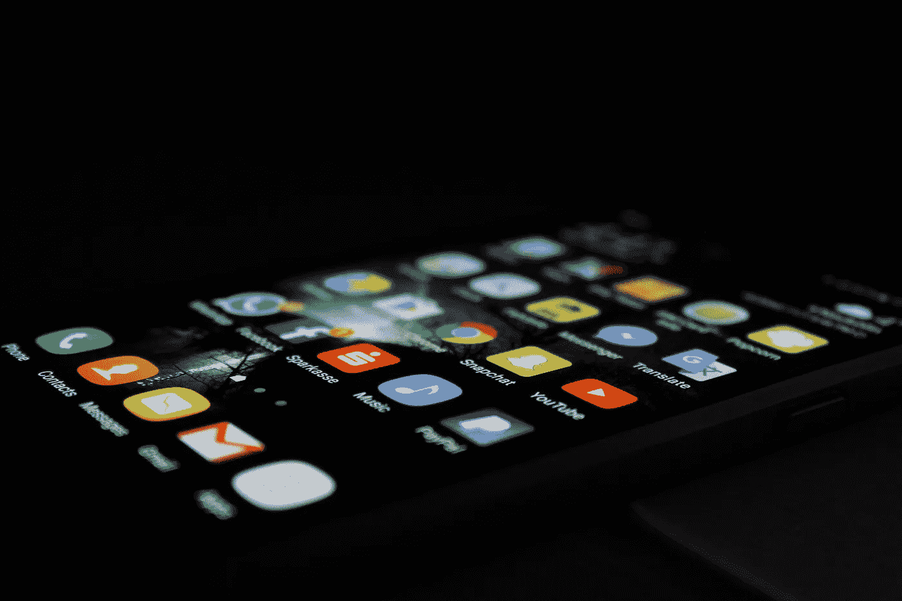

Rami Al-zayat 在 [Unsplash](https://unsplash.com/photos/w33-zg-dNL4) 上拍摄的照片。

# 第一步:iOS 图标

我们不会浪费时间自己制作一百万个不同的图标图像，所以继续下载[图标集创建器](https://itunes.apple.com/us/app/icon-set-creator/id939343785?mt=12)。

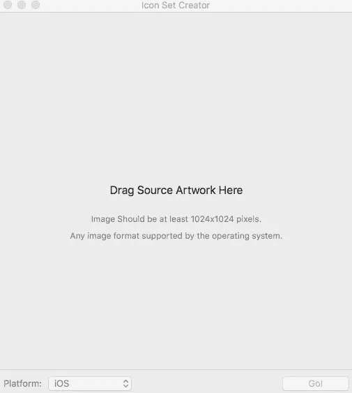

将一个 1024x1024 版本的图标拖到应用程序上，然后点击 **Go** (默认平台是 iOS，所以你应该可以开始了)。

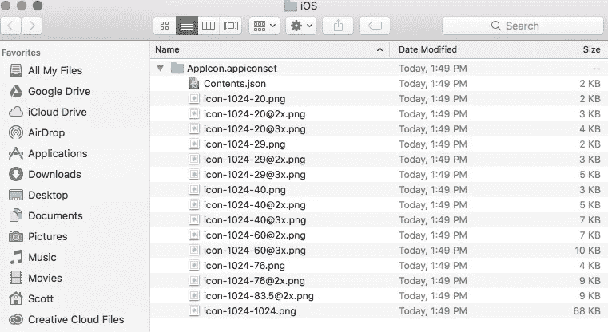

图标集创建器将为您提供一个包含所有必要图标大小的文件夹。

现在你已经有了所有的图标，在 [Xcode](https://developer.apple.com/xcode/ide/) 中打开你的项目。在主项目文件夹中，您会发现一个名为 **Images.xcassets** 的文件夹和一个名为 **AppIcon** 的文件。

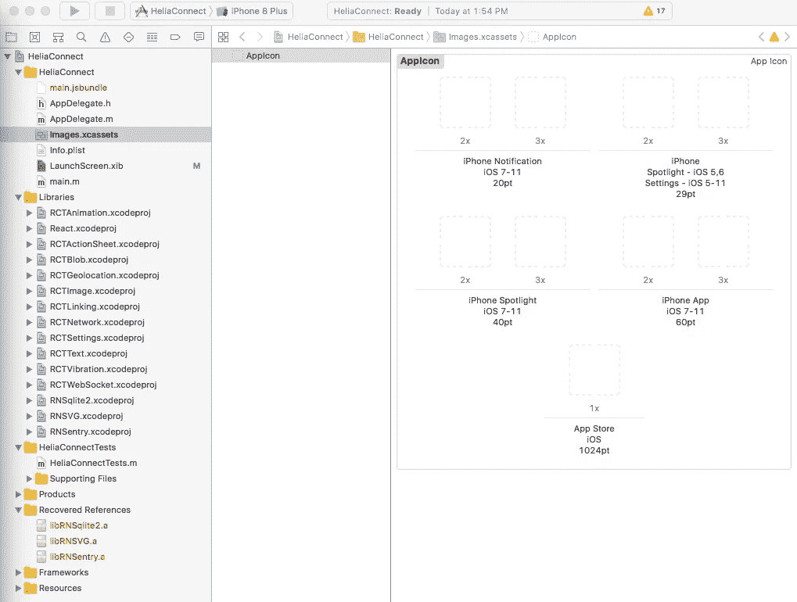

***主项目文件夹*>images . xcassets>app icon**

在这里，您将看到应用程序中图标的占位符。如果你想添加 iPad 或 CarPlay 图标，你可以点击右上角的按钮**显示属性检查器**，以显示更多选项。

iPhone 和 iPad 的例子

打开您新生成的图标文件夹，并开始拖放适当的瓷砖。如果牌下有 2x 或 3x，请使用该版本。比如左上角的磁贴( **iPhone 通知 iOS 7–11 20pt 2x**)会使用名为**icon-20@2x.png**的文件。只需将 pt 值与适当的刻度匹配，就可以了。注意 iPads 用的是 1x 和 2x 版本，iPhone 用的是 2x 和 3x 版本。

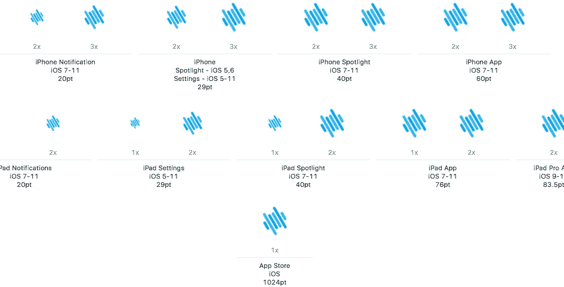

你完成后会是什么样子

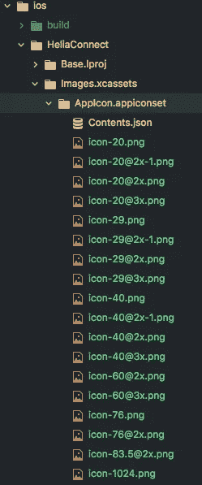

所有这些新文件

在您的文本编辑器中，您应该注意到在**IOs>* Project Name *>images . xcassets>appicon . appiconset**中的一些新文件。应该能够重建你的应用程序，并看到你的图标(仅在 iOs)

# **第二步:安卓图标**

跳到 [Android Asset Studio](http://romannurik.github.io/AndroidAssetStudio/icons-launcher.html#foreground.type=image&foreground.space.trim=1&foreground.space.pad=0.25&foreColor=rgba(96%2C%20125%2C%20139%2C%200)&backColor=rgb(255%2C%20255%2C%20255)&crop=0&backgroundShape=square&effects=none&name=ic_launcher) 来制作你所有的 Android 图标

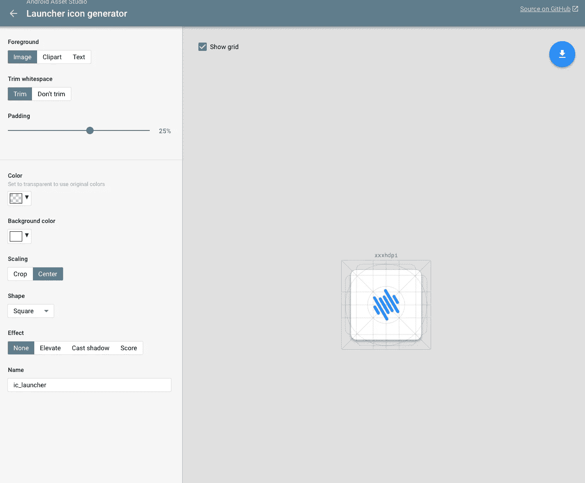

Android 资产工作室

拖动用于 iOS 图标的相同图标文件(1024x1024)并编辑。这里有一些很酷的工具，继续编辑你的图标，让它在所有 Android 图标版本中都很好看，然后点击右上角的**下载**按钮。

一旦你有了你的图标文件夹，打开**Android>app>src>main>RES**。你应该在这里看到一堆文件夹，叫做 **mipmap-hdpi，mipmap-mdpi** 等等。

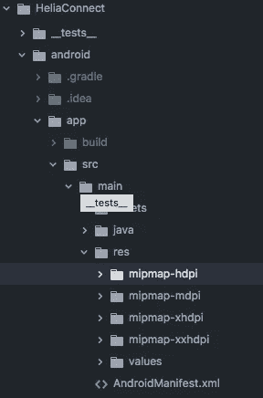

您从 Android Asset Studio 下载的文件夹将具有相同的文件夹。只需替换这些文件，你就可以使用 Android 图标了。

# 第三步:iOS 启动屏幕

启动屏幕很有趣。基本上有两种方法可供应用选择。第一个是下图，基本上只是一个空白的屏幕，中间有标志。

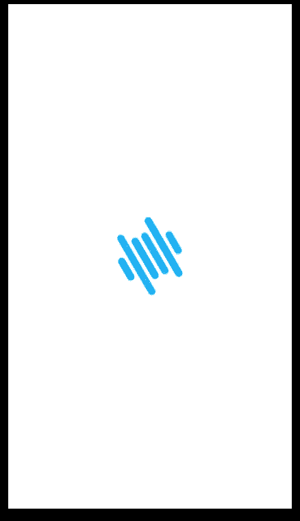

方法 1(我们将生产什么)

第二种方法基本上是你的第一个屏幕的图像，减去所有的内容。

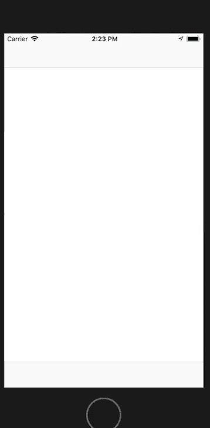

苹果照片应用程序启动屏幕

我们将走全屏居中的标志路线

再次打开 Xcode，在主项目文件夹中，你还会看到一个名为 **LaunchScreen.xib** 的文件。

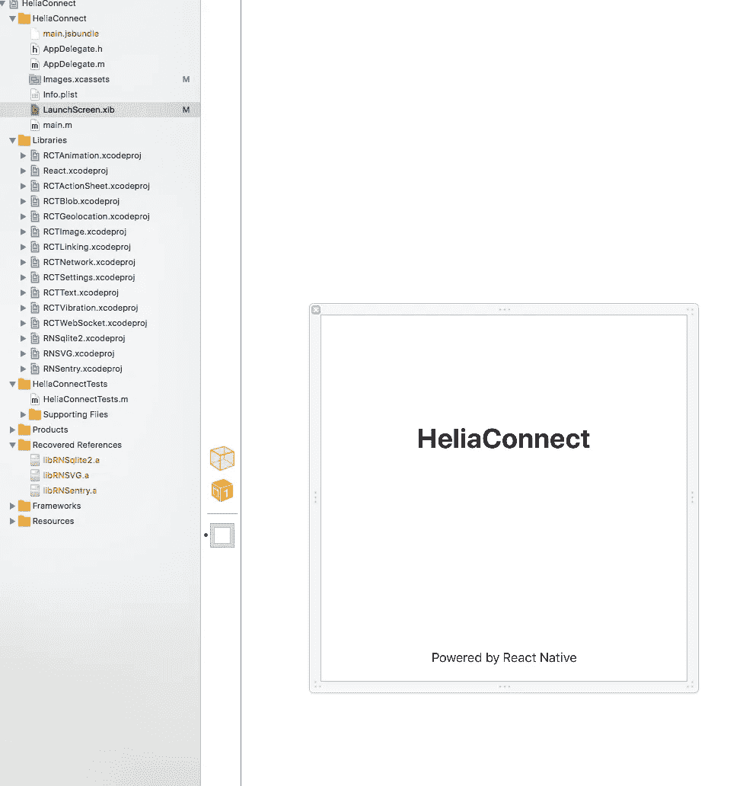

默认启动屏幕

点击该文件，您将看到默认的启动屏幕(如果您一直在使用该应用程序，您可能会看到这一点)。这是一个完全可编辑的艺术板，我们将在这里创建我们的启动屏幕。

默认情况下，它是一个正方形，这很奇怪。如果您想让它看起来像某个设备(这是不必要的，因为我们最终的启动屏幕只是一个居中的徽标)，请单击**显示属性检查器**按钮(右上角第二行左起第四个)，并将大小下拉列表从**自由格式**更改为**页面。**

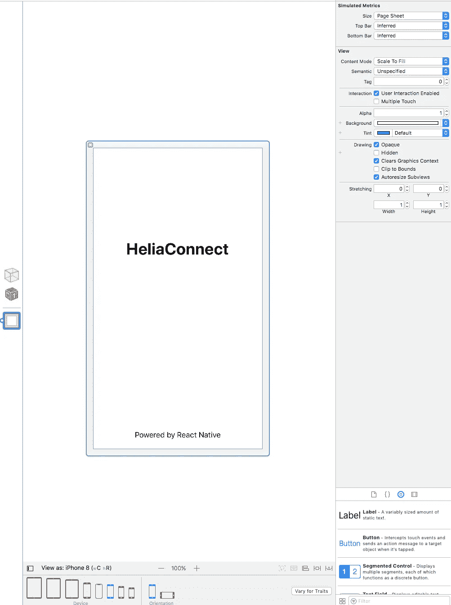

选择“页面”并打开底部的设备窗口

现在，您可以在各种设备上查看您的启动屏幕。

**删除默认文本:**只需点击它们并按 delete 键即可。

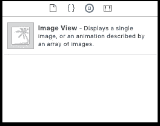

图像视图

**Add Logo:** 在右下角你会看到一个你可以添加到这个文件的组件列表。向下滚动(或在搜索过滤器中键入“图像”)并找到**图像视图**。将它拖到画板的中央。

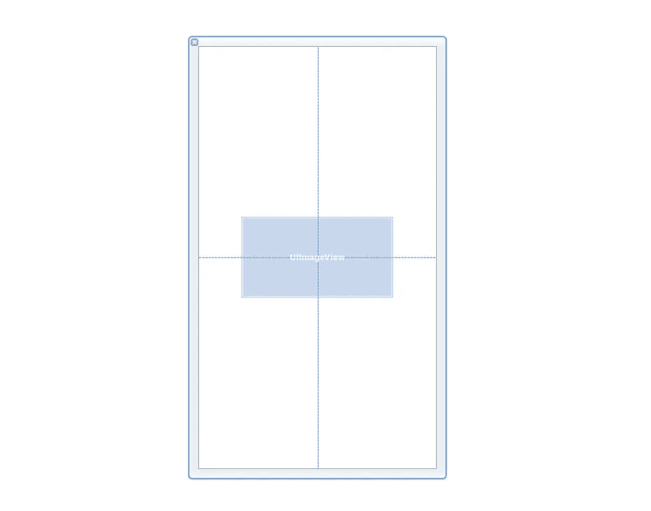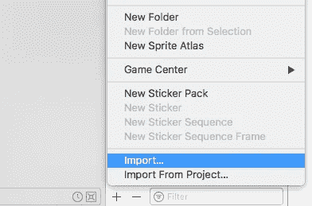

在 Images.xcassets 中导入

**给项目添加 Logo:**回到 **Images.xcassets** 点击左下角的小 **+** ，选择**导入**。不要导入与图标相同的图像，而是导入一个更受限制的徽标版本

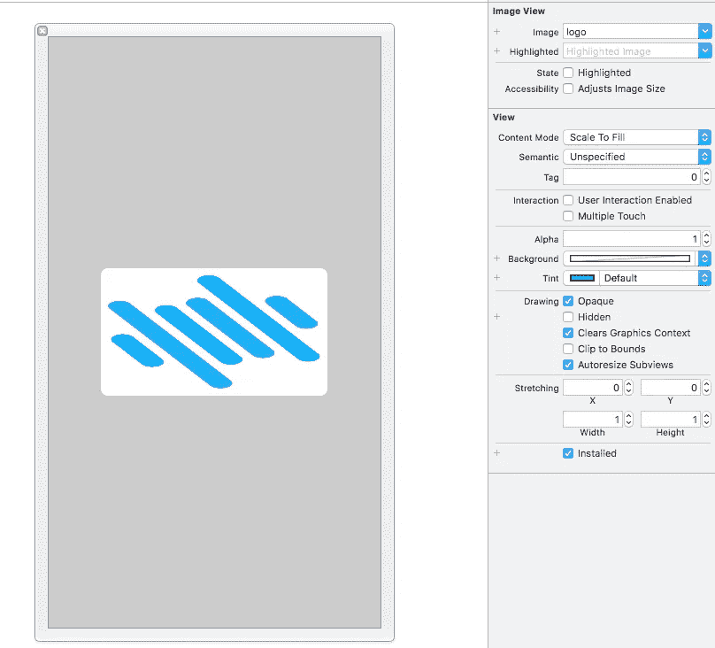

**在 UIImageVIew 中选择图像:**一旦图像在您的项目中，跳回到 **LaunchScreen.xib** 。点击艺术板中间的 UIImageView 组件，一些选项会出现在右边的面板中，最上面的是一个图像下拉菜单。点击下拉菜单，你的图像现在应该在画板的中央。

它可能看起来和我的一样时髦，所以把内容模式从“缩放填充”改为“纵横比”。

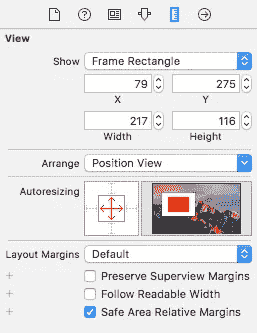

**将徽标居中:**它可能看起来是居中的，但如果你打开正在观看的设备，你会发现它在四处跳动。切换到看起来像尺子的标签(**显示尺寸检查器**)。你所要做的就是在自动调整部分取消选择顶部和左边的红线，然后选择中间的两条线，如上图所示。

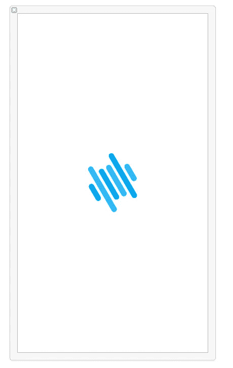

那里。砰。你做到了。

瞧，你现在应该有一个完全可调整大小的启动屏幕。干得好。

# **第四步:安卓启动屏幕**

最后但同样重要的是，让我们解决这个问题的 Android 方面。

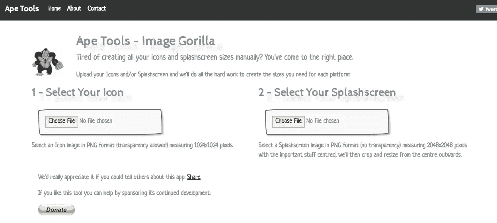

前往 [Ape 工具](https://apetools.webprofusion.com/#/)。我们将用它来生成你需要的所有 android 启动屏幕尺寸。在一个 2048x2048 的 PNG 中创建一个和上面一样的屏幕。

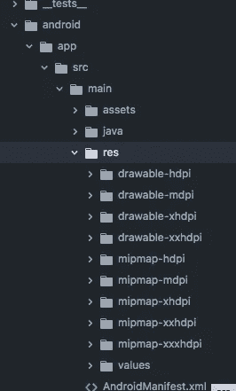

像以前一样，你会得到一个文件夹，里面有一堆不同大小的图片。就像 Android 图标一样，我们将打开**Android>app>src>main>RES**并将这些文件夹拖入其中。我们只需要 **drawable-hdpi、drawable-mdpi、drawable-xhdpi、**和 **drawable-xxhdpi。**

我意识到这违背了本教程的观点，但是我是一个非常忙的人。Android 需要更多的步骤来让闪屏工作。

我已经遵循了本教程中的步骤，它们非常有效！

[https://medium . com/handle-labs/how-to-add-a-splash-screen-to-a-react-native-app-IOs-and-Android-30 a3 CEC 835 AE](https://medium.com/handlebar-labs/how-to-add-a-splash-screen-to-a-react-native-app-ios-and-android-30a3cec835ae)

很好。

感谢阅读。