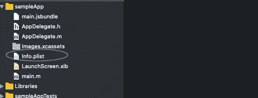
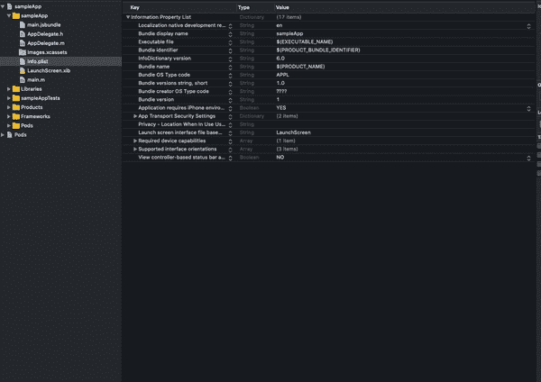

# React 原生摄像头集成[iOS]

> 原文：<https://betterprogramming.pub/react-native-camera-integration-ios-abbd4517e1c8>

## 三个快速简单的步骤


照片来自 Unsplash 的 [ShareGrid](https://unsplash.com/@sharegrid)

注意:确保你的 [React 原生](https://facebook.github.io/react-native/)版本高于 0.60.0。

# **第一步**

安装 [React 原生摄像头](https://github.com/react-native-community/react-native-camera)。

```
npm install react-native-camera --save && cd sampleApp && pod install && cd ..
```

# **第二步**

从项目的根文件夹打开 Xcode，找到`Info.plist`文件。



您的项目信息列表

# **第三步**

现在，将以下带有适当原因的关键字字符串添加到`Info.plist`文件中。

你给出的理由会在你的用户同意相机许可之前被他们阅读，所以想想你的用户会想看什么。

```
NSCameraUsageDescription
NSPhotoLibraryAddUsageDescription
NSPhotoLibraryUsageDescription
NSMicrophoneUsageDescription
```



添加必需的密钥，说明您的应用程序需要摄像头访问`Info.plist file`的原因

你好。仅此而已。现在你已经准备好了！

感谢阅读。