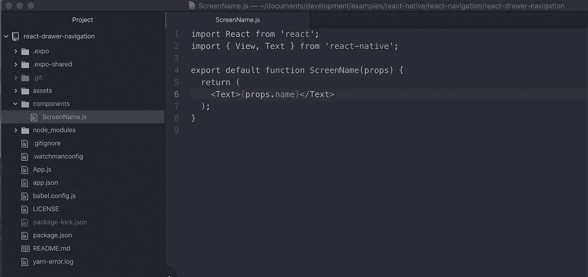
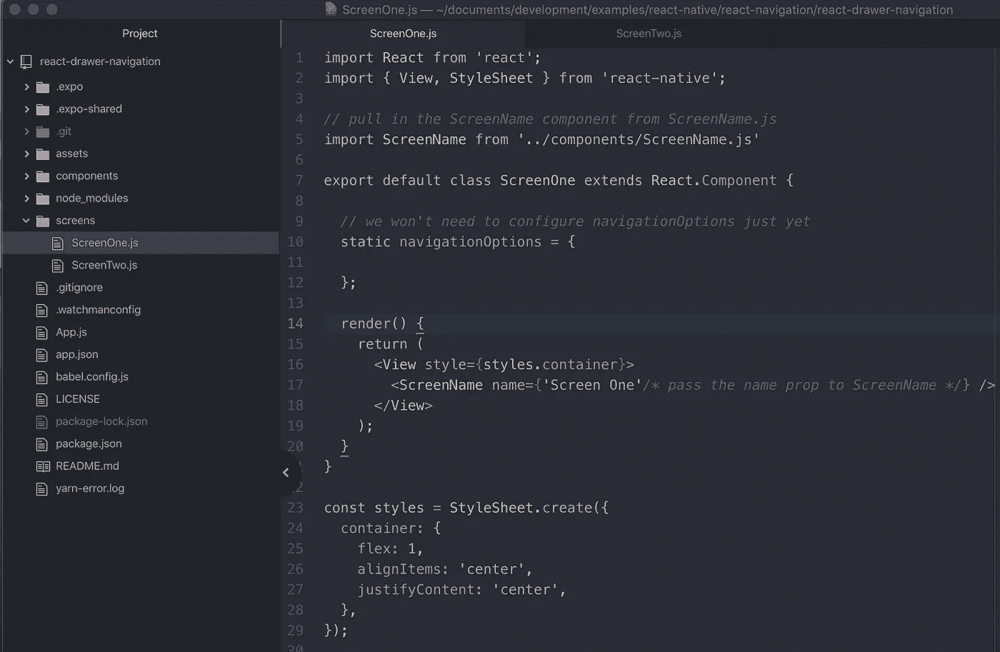
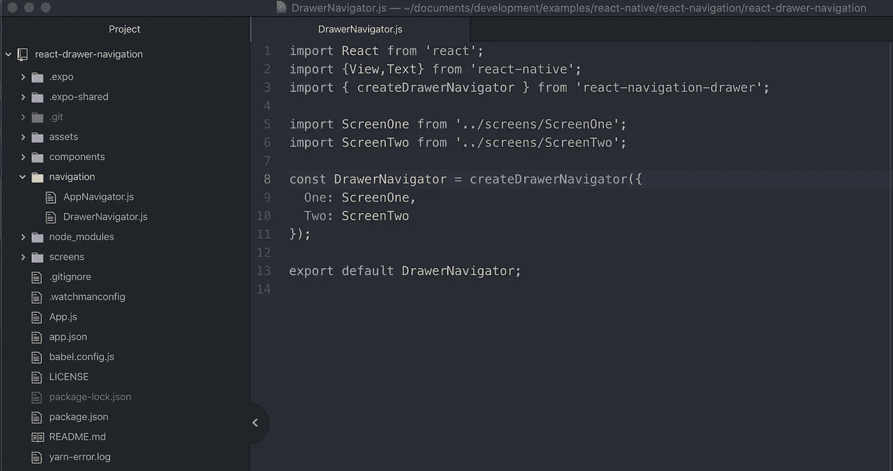
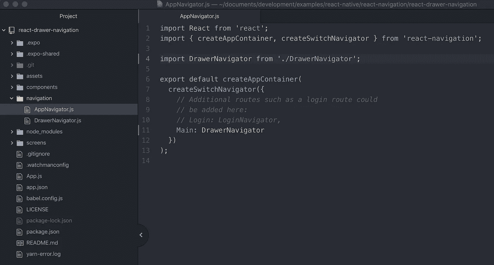
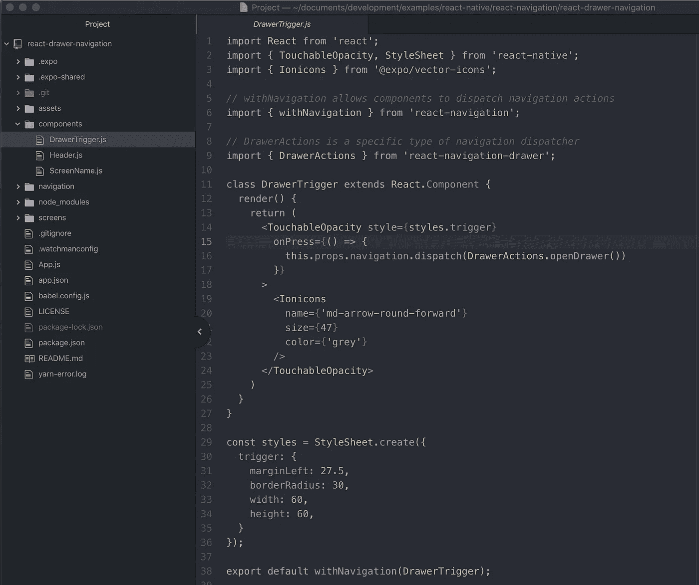
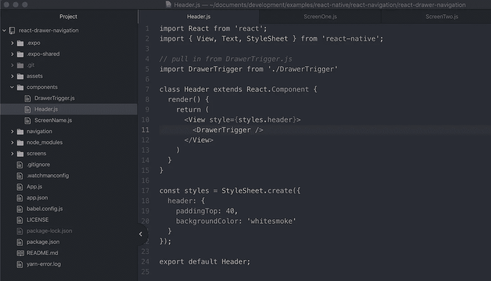
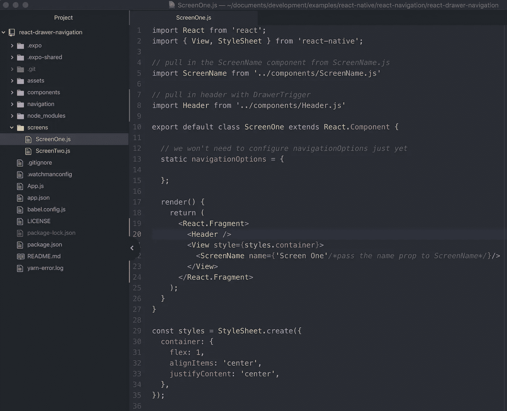

# 反应本机-抽屉导航

> 原文：<https://betterprogramming.pub/react-native-drawer-navigation-3a2a1aea21a0>

## 带反应导航


塞缪尔·泽勒在 [Unsplash](https://unsplash.com/photos/-nIrhwOCRY8) 上拍摄的照片

在本教程中，我们将介绍 React 导航(抽屉导航器)的主要功能和设置。

*如果你还没有，我推荐你在阅读本教程之前先看看* [*Intro to React 导航*](https://medium.com/swlh/intro-to-react-navigation-1d8957fedfd1) *。它涵盖了该项目的初始配置和设置。*

目前我们有一个类似这样的视图:

*源代码:* [*此处*](https://github.com/seanwatters/intro-to-react-navigation)


要开始使用抽屉导航，您需要安装软件包`react-navigation-drawer`，这样我们就可以导入`createDrawerNavigator`。在您的终端中运行以下命令:

```
expo install react-navigation-drawer
```

现在我们已经安装了`react-navigation-drawer`，我们可以开始编写实际的应用程序了。

*请注意，你也可以从* `*package.json*` *文件中删除* `*react-navigation-tabs*` *包。*

# 1.屏幕

*如果您正在使用* [*简介库*](https://github.com/seanwatters/intro-to-react-navigation) *，您可以跳过这一部分。*

首先，我们希望在每个屏幕上呈现一个组件。在您的根目录中，您需要添加一个`/components`文件夹和一个名为`ScreenName.js`的文件:

```
|- assets
|- components
    |- ScreenName.js|- node_modules
```



链接到: [GitHub 要点](https://gist.github.com/seanwatters/4d4b49e10e5400de6fea87aae3e16886)

我们有一个组件来呈现屏幕名称。现在，为了创建屏幕，我们需要添加一个包含`ScreenOne.js`和`ScreenTwo.js`文件的`/screens`文件夹:

```
|- assets
|- components
    |- ScreenName.js|- node_modules
|- screens
    |- ScreenOne.js
    |- ScreenTwo.js
```



链接到: [GitHub 要点](https://gist.github.com/seanwatters/7104c1919ba6295ce4389018babf4bc1)

现在已经创建了屏幕和组件——现在我们可以转到导航器了。

# 2.航海家

文件树的当前状态应该是这样的:

```
|- assets
|- components
    |- ScreenName.js|- node_modules
|- screens
    |- ScreenOne.js
    |- ScreenTwo.js
```

现在你需要添加`navigation`文件夹，里面有`AppNavigator.js`和`DrawerNavigator.js`文件:

```
|- assets
|- components|- navigation
    |- AppNavigator.js
    |- DrawerNavigator.js   // if you're working from the previous
                            // tutorial, BottomTabNavigator.js will
                            // become DrawerNavigator.js
|- node_modules
|- screens
```

`DrawerNavigator.js`文件的代码如下所示:



链接到: [GitHub 要点](https://gist.github.com/seanwatters/f6a7302522a46b9eb34a8a90f2309140)

这个`AppNavigator.js`文件看起来会是这样的:



链接到: [GitHub 要点](https://gist.github.com/seanwatters/3adfc704d4b646e37974f42c5dc361a7)

*如果您正在关闭* [*简介库*](https://github.com/seanwatters/intro-to-react-navigation) *，我们在这里所做的只是将* `*BottomTabNavigator*` *更新为* `*DrawerNavigator*` *，并将* `*createBottomTabNavigator*` *更新为* `*createDrawerNavigator*` *。*

您的模拟器现在应该是这样的:


抽屉关闭


抽屉打开

从技术上讲，这是一个功能性的抽屉导航器，因为它可以通过抽屉导航，但可访问性有限。从主屏幕上看，没有好的指示表明抽屉存在。根本看不出来抽屉的存在。

为了让抽屉更容易打开，我们必须在标题上添加一个图标来触发抽屉打开(除了已经可用的“滑动打开”)。

要添加这个图标，我们需要在各自的文件中创建一个`Header`组件和一个`DrawerTrigger`组件:

```
|- assets
|- components
    |- DrawerTrigger.js
    |- Header.js
    |- ScreenName.js|- navigation
|- node_modules
|- screens
```

`DrawerTrigger`将从`DrawerTrigger.js`导入到您的`Header.js`文件中。`DrawerTrigger`的代码如下所示:



链接到: [GitHub 要点](https://gist.github.com/seanwatters/0c848b7f3d80a83d217b8f42c95a8dc9)

这里有几样东西需要打开:

1.  `withNavigation`是一个高阶函数，使`navigation`属性可用于您正在导出的组件，并让您访问由`react-navigation` *(第 6 行和第 38 行)*提供的许多动作。
2.  `DrawerActions`可以访问许多分派与抽屉导航器相关的事件的功能。在这种情况下，我们利用`openDrawer()` *(第 16 行)*。如你所见，`DrawerActions`依赖`withNavigation`，给我们访问`navigation`道具的权限。

现在我们有了`DrawerTrigger`组件，`Header.js`文件中的 cod 将如下所示:



链接到: [GitHub 要点](https://gist.github.com/seanwatters/1ae95a97e20ca05eca4e8b3ed2e8825d)

`Header`组件更简单一些。它不需要知道任何关于`navigation`道具，使用`withNavigation`或者知道`DrawerActions`的事情。它只是导入了`DrawerTrigger`并作为一个容器。

# 最后

现在我们有了包含`DrawerTrigger`的`Header`组件，我们需要做的就是在屏幕中包含标题。



链接到: [GitHub 要点](https://gist.github.com/seanwatters/aa5f52cf6ed8600de9eee4e70116b8a9)

在每个屏幕文件(`ScreenOne.js`和`ScreenTwo.js`)中，您需要从`../components/Header.js`导入`Header`组件。

为了保持视图与到目前为止的示例一致，可以将`Header`和`ScreenName`组件包装在一个片段中，并堆叠在另一个之上*(如第 19 和 24 行所示)。*

您的项目现在应该有一个功能齐全的抽屉导航器，在标题中有一个打开触发器。它看起来会像这样:


开闭式

抽屉现在可以从主屏幕*上滑动，从标题中的箭头图标*上触发。

这不是与 React Navigation 的`createDrawerNavigator.`相关的每个选项的完整分类，有许多选项和配置可供探索。要真正定制您的应用程序，理解这些额外的特性是很重要的。

我将在不久的将来写一篇文章，详细介绍这些选项和实现的最佳实践。目前`createDrawerNavigator`上的文档是 [*这里*](https://reactnavigation.org/docs/en/drawer-navigator.html) 。

除了 GitHub gists 下面提供的每个代码片段之外，**完整的资源库**可以在 [***这里找到***](https://github.com/seanwatters/react-native-drawer-navigation) **。**

[推特](https://twitter.com/sean_watters) — [github](https://github.com/seanwatters) — [网站](https://seanwatters.io/)