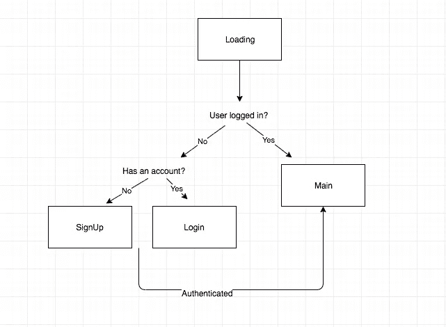
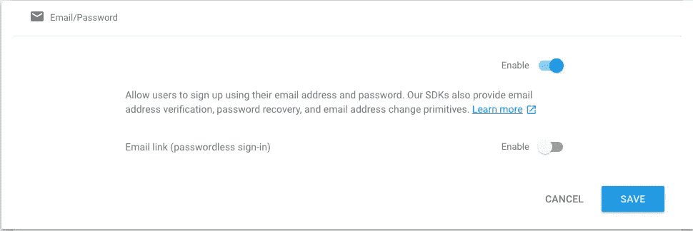

# React Native 和 Firebase:身份验证

> 原文：<https://betterprogramming.pub/react-native-firebase-authentication-7652e1d2c8a2>

## 如何设置 React 本机应用程序以使用 Firebase

也可以作为 egghead.io 上的视频课程！

**使用 Firebase 对用户进行身份验证**

[https://next . egghead . io/lessons/react-authenticate-a-user-in-react-with-fire base](https://next.egghead.io/lessons/react-authenticate-a-user-in-react-with-firebase)


[Smart](https://unsplash.com/@smartphotocourses?utm_source=unsplash&utm_medium=referral&utm_content=creditCopyText) 在 [Unsplash](https://unsplash.com/s/photos/guide?utm_source=unsplash&utm_medium=referral&utm_content=creditCopyText) 上拍照

嗨！我是法拉兹。这里有一个快速指南，可以让我们在 [React Native](https://facebook.github.io/react-native/) 中使用 [Firebase 的认证](https://firebase.google.com/products/auth)！

Firebase 提供了许多伟大的产品，让我们能够快速开发移动应用程序；[实时数据库](https://firebase.google.com/docs/database)、认证、[云 Firestore](https://firebase.google.com/docs/firestore) 、[云功能](https://firebase.google.com/docs/functions)、[crash lytics](https://firebase.google.com/products/crashlytics)……不一而足。

我们将使用电子邮件和密码构建一个简单的身份验证流程。

我们所需要的是一种将 Firebase SDK 与 React 原生应用一起使用的方法……感谢创造了`react-native-firebase`的[转化酶](https://github.com/invertase)的可爱的人们，我们已经做到了！这是一个非常棒的开源项目，用于将 React 本地应用程序与 Firebase 链接起来。

# 设置我们的应用程序

既然我们是从零开始，我们可以继续使用 react-native-firebase 提供的[基本入门套件。](https://github.com/invertase/react-native-firebase-starter)

(如果你已经有一个现有的应用程序，你可以前往 [React Native Firebase](https://rnfirebase.io) 并遵循手册安装说明。)

继续按照他们的说明(他们很棒)来启动和运行我们的应用程序，然后在您准备好之后再回来。

# 在 Firebase 中启用电子邮件和密码验证

按照上面链接的说明操作后，您应该准备好开始了。

这是我们将要建造的东西的示意图:



我们正在建造的流程图

为了允许用户使用电子邮件和密码组合，我们需要在 Firebase 控制台中启用这个提供者。

要做到这一点，直接进入您的 Firebase 项目→身份验证→登录方法。点击`Email/Password`并设置为`enabled`并保存。您的仪表板应该如下所示:



启用电子邮件和密码验证

# 创建屏幕

如果我们看一下我们的图表，你可以看到我们有四个屏幕:`Loading`、`SignUp`、`Login`和`Main`。

一个`Loading`屏幕显示，直到我们确定用户的身份验证状态；一个`SignUp`屏幕，用户可以在其中创建帐户；一个`Login`屏幕，现有用户可以在其中登录；以及一个`Main`屏幕，我们的应用程序只向经过身份验证的用户显示。

我们将使用`react-navigation`为我们的应用导航，所以让我们设置我们的导航器并创建我们的屏幕。

```
yarn add react-navigation
```

让我们创建我们的屏幕。

## `Loading.js`

## `SignUp.js`

## **Login.js**

## **Main.js**

现在我们已经创建了所有的屏幕，让我们在`App.js`文件中连接导航。

## **App.js**

如果我们启动我们的应用程序，您应该会看到我们的`Loading`屏幕和永远旋转的`ActivityIndicator`。这是我们所期望的，因为我们需要确定用户是否经过身份验证，以确定将他们路由到哪里。

如果用户通过验证，将他们发送到`Main`屏幕。否则，将它们发送到`SignUp`屏幕。

# 确定用户是否通过身份验证

我们可以使用 Firebase 来确定用户的身份验证状态。让我们在`Loading`屏幕上添加一项检查，以确定用户是否登录。

我们使用 Firebase 的`onAuthStateChanged`监听器来获取用户的当前身份验证状态。如果它们被认证，我们就把它们发送到`Main`屏幕。否则，我们将它们发送到`SignUp`屏幕。

现在，由于我们没有登录，您应该会短暂地看到`Loading`屏幕，然后转到`SignUp`屏幕。

# **注册用户**

我们需要创建一个新用户，这样我们就可以让他们登录了！让我们前往`SignUp`屏幕，连接我们的`handleSignUp`方法。

当用户提交表单时，我们使用`createUserWithEmailAndPassword`，然后将他们导航到`Main`屏幕。如果有错误，我们会捕捉并显示它。

# 在主屏幕上显示当前用户

在我们当前的实现中，如果用户登录，我们将只能看到`Main`屏幕。我们需要从 Firebase 获取`currentUser`，这样我们就可以显示他们的电子邮件。让我们更新我们的`Main`屏幕来处理这个问题。

现在，当我们看到`Main`屏幕时，我们应该会看到用户的电子邮件地址。如果我们刷新应用程序，我们应该会自动转到`Main`屏幕，因为我们已经通过了身份验证。

最后一步是，我们应该能够登录一个用户后，我们已经创建了一个帐户！

# 在中记录已存在的用户

最后冲刺！让我们更新我们的`Login`屏幕，以便我们可以使用现有帐户登录。

太棒了。

我们现在有了一个用 React Native 和 Firebase 设置的简单身份验证流程。如果你想访问完整的源代码，我已经把它上传到了 GitHub。

感谢阅读！