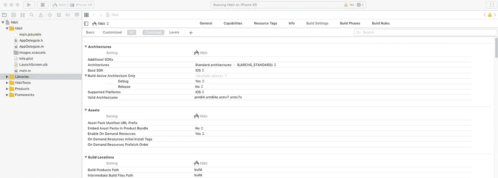
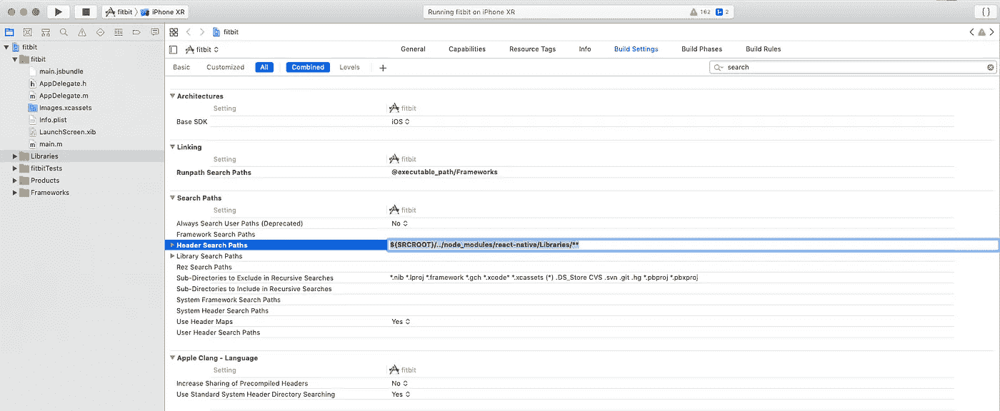
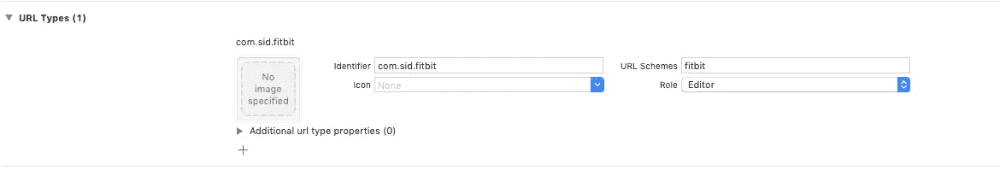
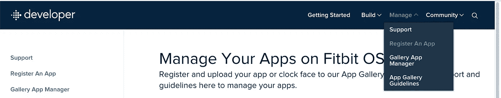
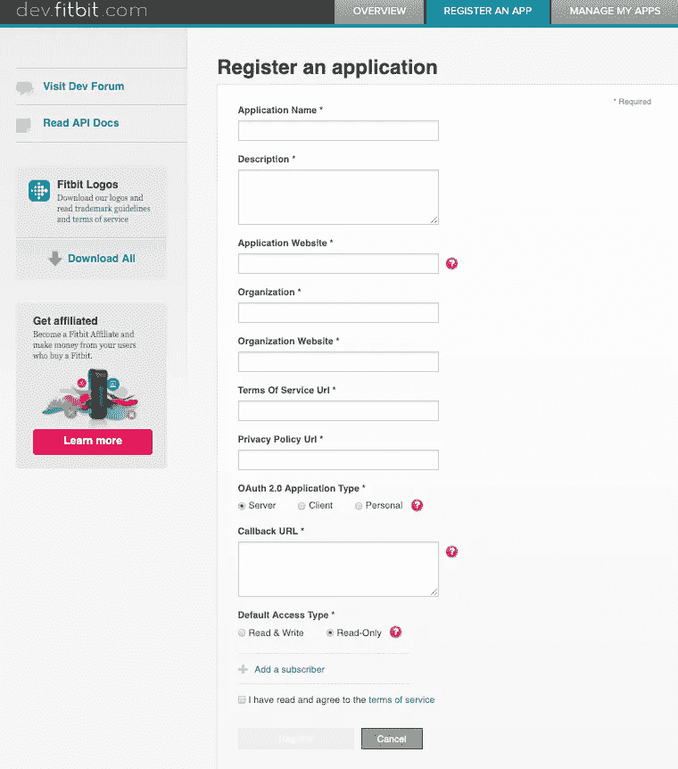
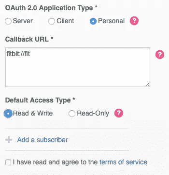
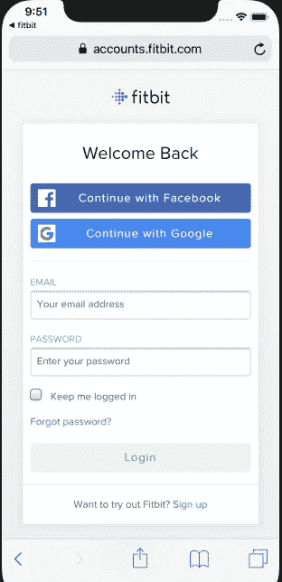
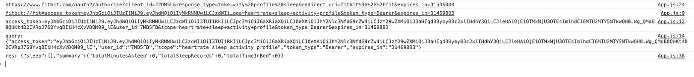
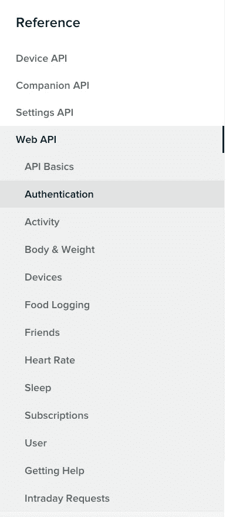

# React Native Fitbit:集成过程

> 原文：<https://betterprogramming.pub/react-native-fitbit-the-integration-process-ec373a086cce>

## 如何将 Fitbit API 集成到您的 React 原生应用中


[健身媒体](https://unsplash.com/@fitnish?utm_source=unsplash&utm_medium=referral&utm_content=creditCopyText)在 [Unsplash](https://unsplash.com/search/photos/fitness-tracker?utm_source=unsplash&utm_medium=referral&utm_content=creditCopyText) 上拍摄的照片

# 介绍

你有没有想过制作自己的个人健身追踪器？或者，您可能想要获取您当前的位置，管理您的睡眠，或者只是工作并将数据存储在数据库中用于日志？

Fitbit 已经涵盖了这一切。

Fitbit 是科技市场的最新潮流，最近它的受欢迎程度达到了顶峰。最近，我能够抓住一个，它激励我将它集成到我正在工作的 React 原生应用程序中。

以下是如何将 Fitbit API 集成到 React 原生应用程序中，适用于 iOS 和 Android，并在我们的应用程序屏幕中获得响应以跟踪数据。一步一步地遵循这些指导方针，在本文的最后，您将获得一个充满 Fitbit API 响应的 JSON。让我们开始吧。

# 步骤 1:基本安装

1.  使用以下命令创建一个新项目:

```
react-native init fitbitAuthentication
```

2.建立初始项目后，运行以下命令:

```
cd fitbitAuthentication
npm install qs --save
```

# 步骤 2:环境设置

正如你已经知道的，我们需要为 Android 和 iOS 平台提供基础环境，以便相同的代码在两个平台上运行。每次你安装一个新的链接，最好是通过基本的设置程序，以避免任何错误。相信我，在错误处理方面， [React Native](https://reactjs.org/) 可能很糟糕。

## ios

1.  转到终端，编写以下命令:

```
cd fitbitAuthentication
cd ios
open .
```

打开`ios/your_project_name.xcodeproj`文件，在 XCode 中进行如下配置。

2.在 XCode 窗口中。点击侧边栏中的项目名称，并转到主窗口中的*构建设置*选项卡。到达后，使用*搜索*选项并找到*搜索*。



Mac 屏幕中的 XCode 窗口

3.一旦你输入*搜索*，就会显示这样一个屏幕。在标题搜索路径部分，单击一次并添加路径，如下所示:

```
$(SRCROOT)/../node_modules/react-native/Libraries
```



标题搜索路径

一旦添加了路径，双击整个链接并从下拉菜单中选择递归选项。

4.在顶部栏中，找到*信息*选项卡，点击 *URL 类型*，如下图所示。添加应用程序所需的凭据。请记住，不要输入与我相同的内容，还要记下它，以便将来在集成时参考。



5.在您的项目中，打开 iOS 文件夹，找到`AppDelegate.m`文件，并在现有代码中添加一些内容:

恭喜你。您已经完成了 iOS 平台的初始设置。

## 机器人

在 Android 中，你必须设置你的 Android 应用 URL 方案。

要指定 URL 方案，修改您的`AndroidManifest.xml`并在 React Native 提供的过滤器下添加一个额外的意图过滤器。用您的应用程序值更新`“yourscheme”` & `“yourHost”`。

# 第三步:Fitbit 账户整合

1.  转到 [Fitbit 开发者。](https://dev.fitbit.com/)
2.  创建一个帐户，然后点击菜单中的*管理*选项:



3.当您点击*注册一个应用*时，它会将您重定向到此屏幕:



填写此表单，并在以下部分进行更改，如图所示:



注意回调 URL

注册完成后，对显示的所有数据进行截图，以备后用。你也可以随时回来看看，所以如果你不看也没关系。但这是我为了避免浪费时间而推荐的。

# 第四步:最后一步

1.  将`config.js`文件添加到您的 app 根目录中，并添加以下代码:

```
export default {
  client_id: 'YOUR_CLIENT_ID',
  client_secret: 'YOUR_CLIENT_SECRET'
}
```

2.在您的`App.js`文件中，添加以下代码:

给你。现在，只需运行基本命令，您就完成了集成。

```
npm installreact-native run-ios
```


应用程序中的主屏幕



WebView 中的身份验证屏幕

身份验证完成后，单击左上角的返回应用程序，并检查控制台的响应。它看起来会像这样:



最终回应

查看 [Fitbit web API](https://dev.fitbit.com/build/reference/web-api/) ,根据您的需求获取和使用更多数据。



**谢谢！保持学习和分享:-)**