# React Native:如何为 iOS 和 Android 构建主屏幕小部件

> 原文：<https://betterprogramming.pub/react-native-how-to-build-a-home-screen-widget-for-ios-and-android-8b2d7db343cb>

## 剧透警告:React Native 不能在 widget 本身上使用。

**目标:**学习如何构建一个原生小部件，并与 React 原生应用程序分享信息*。*

**TL；DR:** 检查整个代码，然后在这里[执行提交](https://github.com/andrepimenta/react-native-create-widget-tutorial)。

**高级功能:**建议熟悉 React Native，有一定 Android/iOS 开发经验。

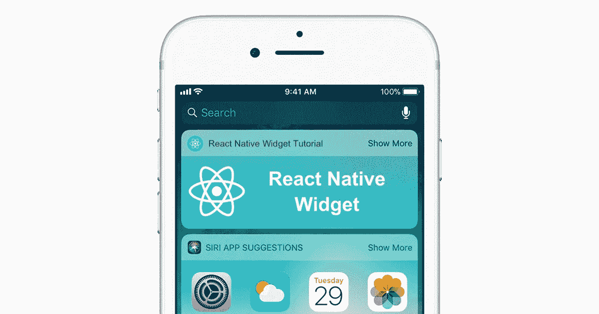

如何使用 React Native 为 iOS 和 Android 构建主屏幕小部件

小工具是应用程序的一个重要补充，通常是一个非常受欢迎的功能。不幸的是，您不能直接使用 React Native 来构建小部件。为什么？因为 iOS 对应用程序扩展有 16 MB 的内存限制，而 React Native 从一开始就占用了大部分内存。相信我，我尽力了。

因此，另一种选择是在 Android 上用 Java、在 iOS 上用 Swift 原生构建每个小部件。通常，您需要小部件能够与主应用程序共享信息——在本例中，与 React 原生应用程序共享信息。本教程将向您展示这是如何实现的。

我将这个项目命名为`ReactNativeCreateWidgetTutorial`、**、**，它看起来会像这样:

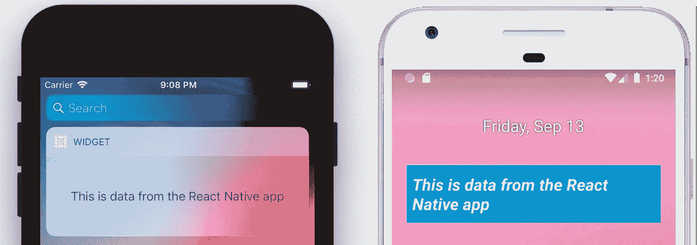

# ios

## 1.创建小部件文件

通过在 Xcode 上打开您的工作区文件来创建小部件(在 iOS 上，它被称为 Today 扩展),然后单击 File > New > Target:

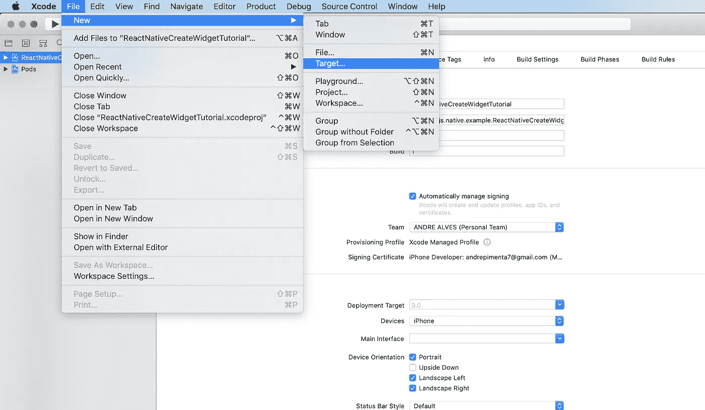

选择今天扩展，然后单击下一步:

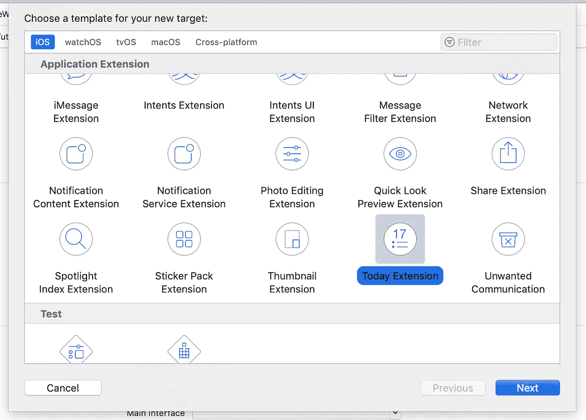

给它起个名字，然后选择你喜欢的语言。在这种情况下，我将选择 Swift。单击完成:

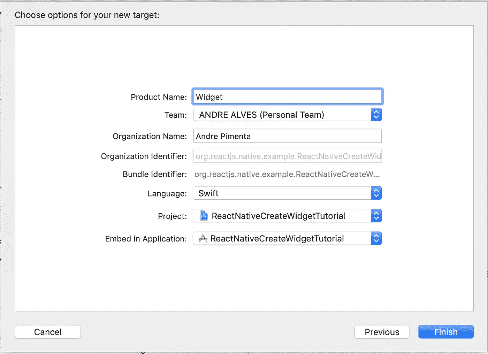

如果 Xcode 要求激活该方案，请点按“激活”。

您应该会在项目中看到 Widget 文件夹:

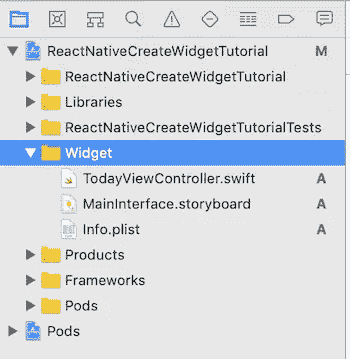

现在，您应该在小部件屏幕上看到小部件，并且您已经可以激活它了:

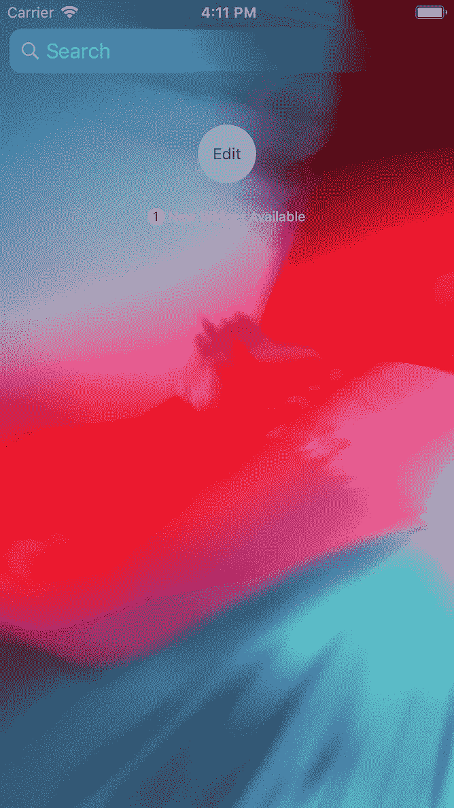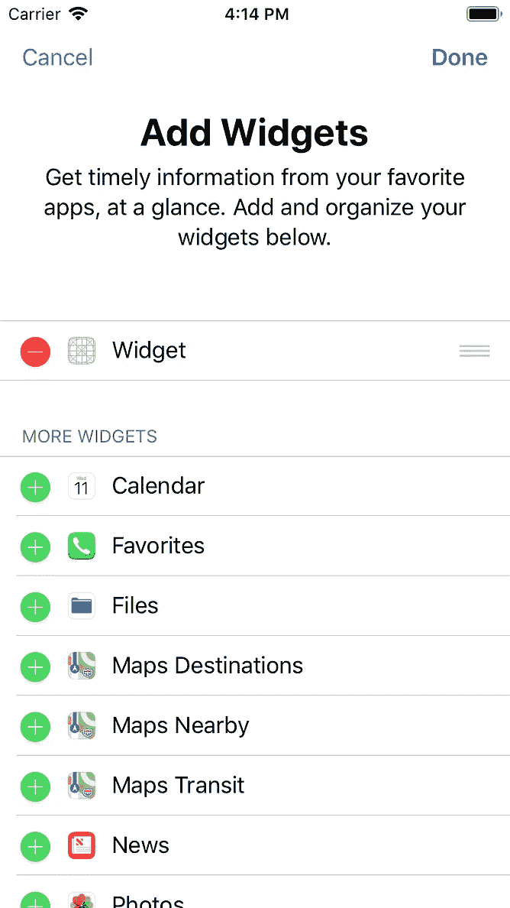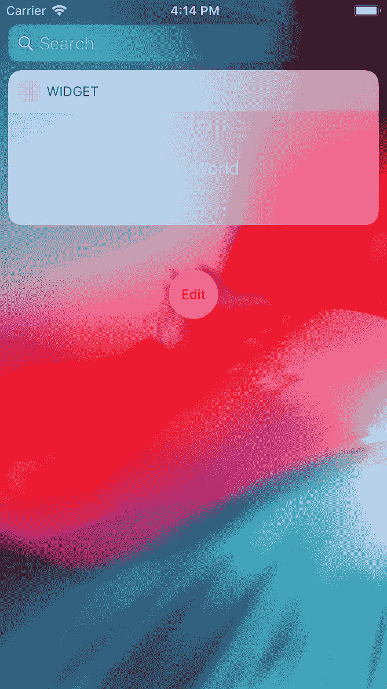

现在，让我们检查一下小部件的结构。进入你的部件文件夹，点击故事板文件。点击助理编辑按钮(屏幕右上角有两个圆圈的按钮):

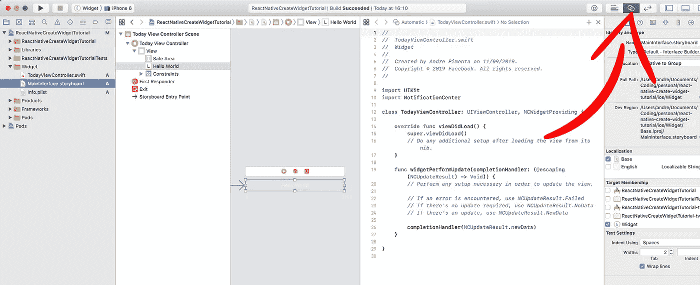

你可以看到有两个函数叫做`viewDidLoad` 和`widgetPerformUpdate` *。*功能`[viewDidLoad](https://developer.apple.com/documentation/uikit/uiviewcontroller/1621495-viewdidload)`在用户每次切换到微件屏幕时运行。因此，这是您应该初始化变量、标签或视图的地方。每当您需要更新小工具内容时，就会调用函数`[widgetPerformUpdate](https://developer.apple.com/documentation/notificationcenter/ncwidgetproviding/1490262-widgetperformupdate)`。

## 2.自定义小部件 UI

你还可以看到有一个标签，上面写着“你好，世界”让我们通过将标签拖动到我们的代码中来自定义它。右键单击标签，将新的引用出口直接拖动到类内的代码中。

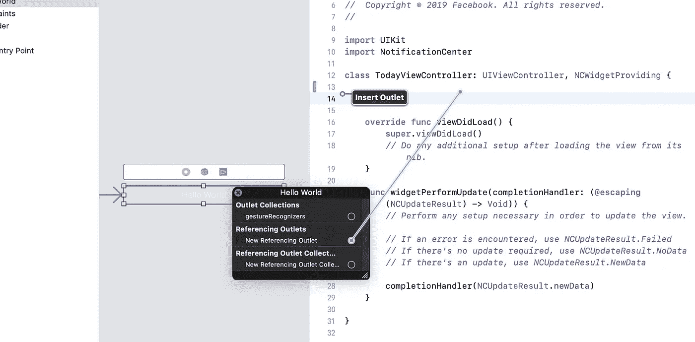

您应该看到代码中的引用，如下所示:

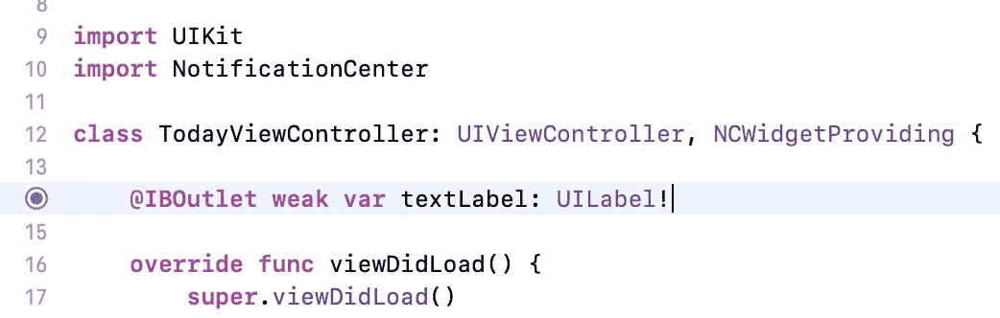

让我们修改`viewDidLoad`函数中标签的文本:

```
**override** **func** viewDidLoad() {
 **super**.viewDidLoad()
 *// Do any additional setup after loading the view from its nib.* //ADD THIS LINE 
 textLabel.text = "My first Widget"
}
```

如果您运行该应用程序，您应该会看到标签被正确初始化:

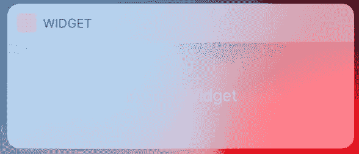

**提示:**你可以在不运行整个应用程序的情况下运行 widget，方法是转到 Xcode，选择 widget 作为目标，然后点击运行:


## 3.**创建 widget 和 React 原生应用之间的通信通道**

好了，现在是有趣的部分。让我们的 React 原生应用程序控制小部件显示的内容。为此，我们必须实现 React 本机应用程序与小部件通信的方法。我们将通过小部件和 React 本机应用程序之间的共享存储来实现这一点。这可以使用 `[UserDefaults](https://developer.apple.com/documentation/foundation/userdefaults)` iOS 原生模块来完成。

我们将让 React 原生应用程序写入`UserDefaults` 并让小部件从中读取。我们发现的第一个问题是没有官方的 React 本机方式来与`UserDefaults`、*、*和*、*交互，我也没有找到任何好的库来做这件事。所以让我们自己通过在 React 原生和原生 iOS 之间建立一座桥梁来实现这一点。

首先，我们将在应用程序中创建一个共享空间，允许小部件和应用程序之间的通信。这可以通过位于功能选项卡下的应用程序组来完成。

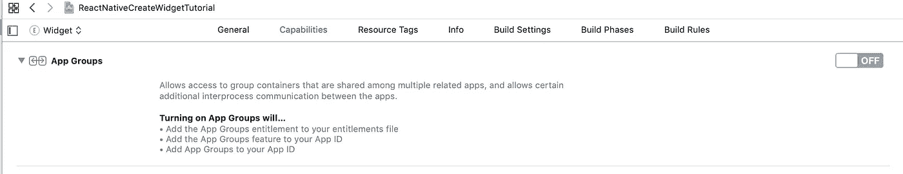

让我们激活它，然后选择一个组或添加一个组(如果它是空的):

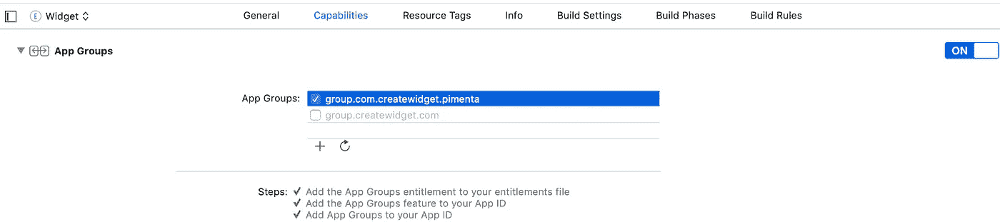

好了，现在我们已经启用了应用程序组，让我们通过创建一个本机桥来实现 React Native 写入`UserDefaults`的方法。

选择你的项目，点击右键添加一个新文件:

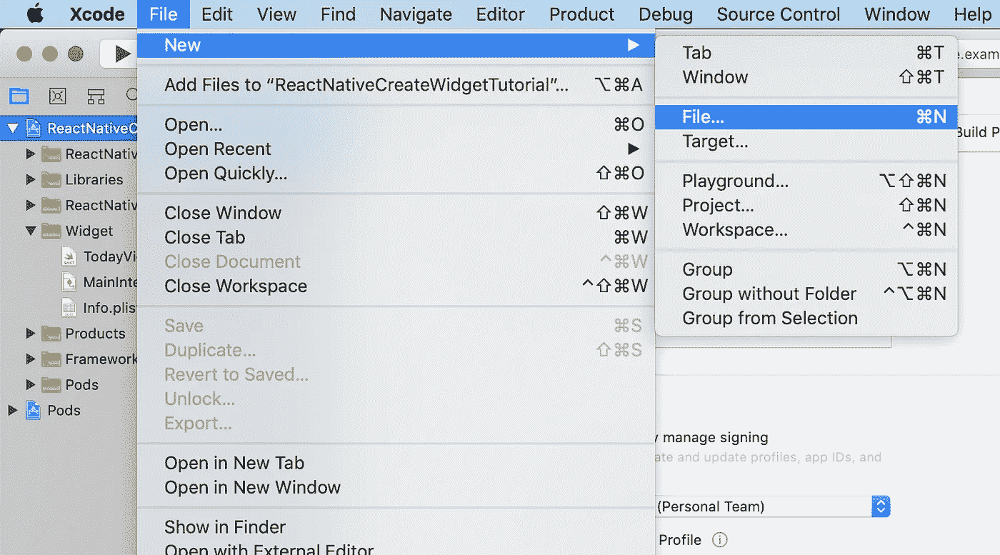

选择 Cocoa Touch Class，然后单击下一步:

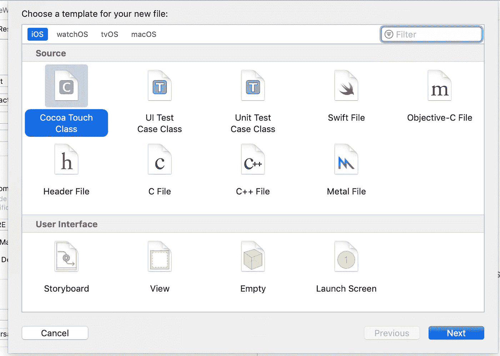

因为这是一个将由小部件和 React 本机应用程序共享的存储，所以我们称它为`SharedStorage`。选择目标-C，然后单击下一步:

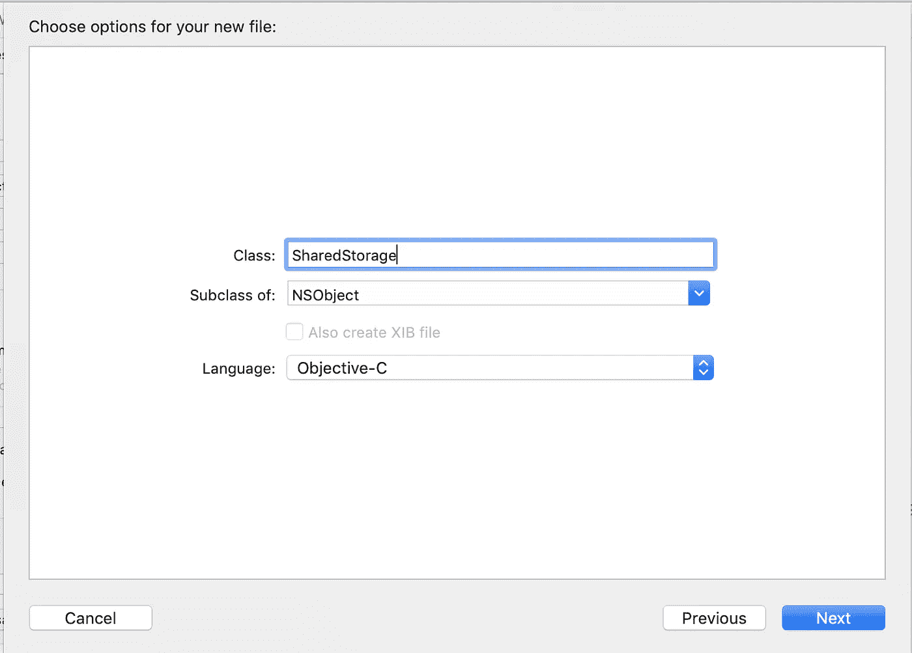

现在，您应该会看到项目中的新文件:

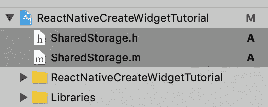

让我们编辑这些文件。首先把这个复制到`SharedStorage.h`文件中:

并且这个进入`SharedStorage.m`文件:

**重要提示:**将群组名称(`group.com.createwidget.pimenta`)更改为您在应用群组上创建的名称。

现在，你可以在 React Native 上调用`SharedStorage`。正如您在代码中看到的，它所做的只是接收一个 JSON 并将其存储在`UserDefaults`存储器中。

## 4.使用 React 本机应用程序控制小部件内容

在 React 本机端，让我们导入模块:

```
import { NativeModules } from 'react-native';const SharedStorage = NativeModules.SharedStorage;
```

然后，让我们将一些数据发送到存储:

```
SharedStorage.set(
 JSON.stringify({text: 'This is data from the React Native app'})
);
```

例如，您可以在您的`App.js`或任何您认为适合在 React 本机代码上设置数据的地方这样做:

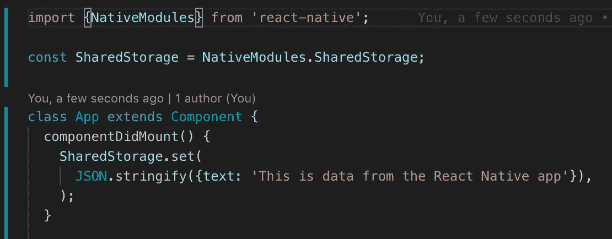

现在，剩下的就是让小部件读取数据并将其插入到 UI 中。我们将把小部件连接到`UserDefaults`，读取它的数据，然后在“Hello World”*`textLabel`上打印数据。*

*转到 Widget 文件夹中的`TodayViewController.swift` 文件，编辑`viewDidLoad` 函数，如下图:*

```
*//CHANGE THE GROUP NAME
let userDefaults = UserDefaults(suiteName:"group.com.createwidget.pimenta")override func viewDidLoad() {
 super.viewDidLoad()
 // Do any additional setup after loading the view from its nib. //ADD THIS
 do{
  let shared = userDefaults?.string(forKey: "data")
  if(shared != nil){
   let data = try JSONDecoder().decode(Shared.self, from: shared!.data(using: .utf8)!)
   textLabel.text = data.text
  }
 }catch{
  print(error)
 }
}*
```

*你可以在这里查看整个文件[。](https://github.com/andrepimenta/react-native-create-widget-tutorial/blob/master/ios/Widget/TodayViewController.swift)*

***重要提示:**将群组名称(`group.com.createwidget.pimenta`)更改为您在应用群组上创建的名称。*

*让我们运行应用程序，并检查小部件(注意，您必须运行并打开应用程序，以便让它写入`SharedStorage`):*

*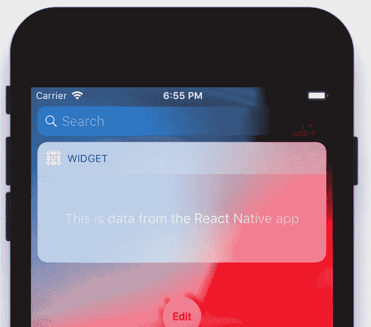*

*这就是 iOS 的全部内容，现在是 Android 部分。*

# *机器人*

## *1.创建小部件文件*

*在 Android Studio 上打开 Android 文件夹。然后，在 Android Studio 中，右键单击 res > New > Widget > App Widget:*

*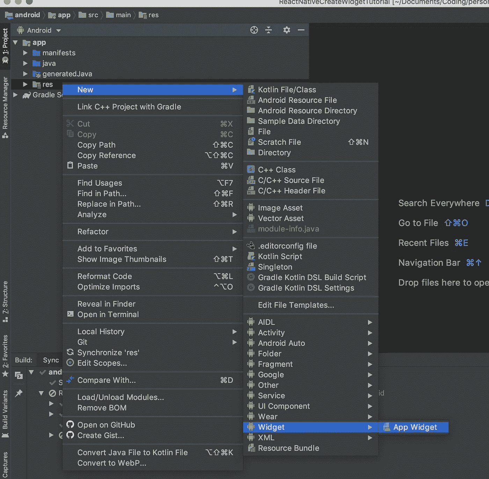*

*命名并配置您的小部件，然后单击完成:*

*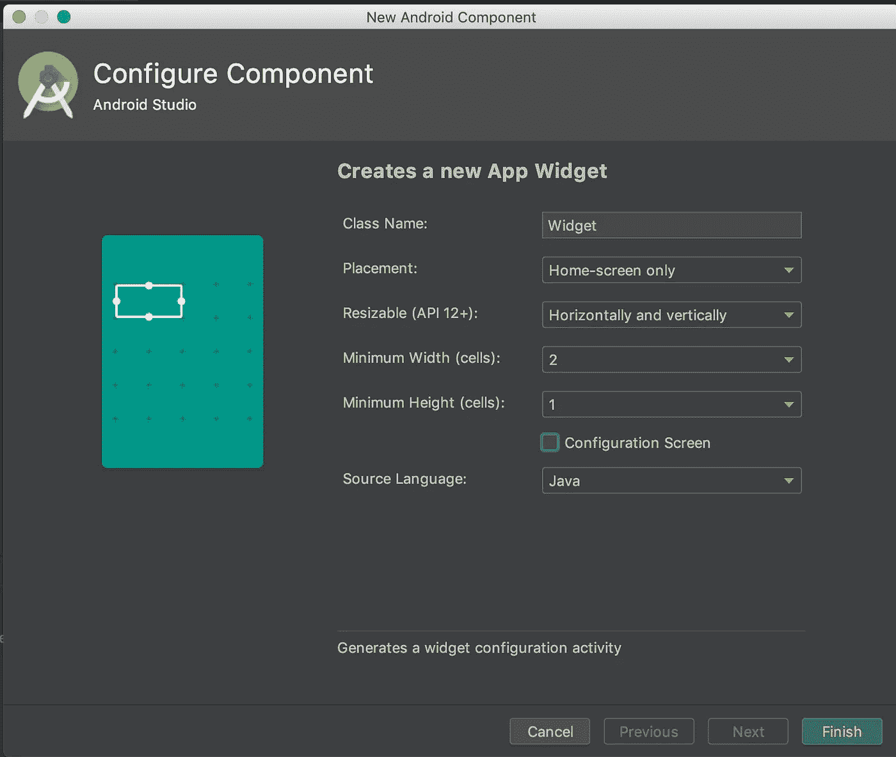*

*下一个窗口将显示将要添加到项目中的几个文件。`Widget.java`文件是我们编写小部件行为的地方。其余的文件是我们实现小部件 UI 组件的地方。单击添加:*

*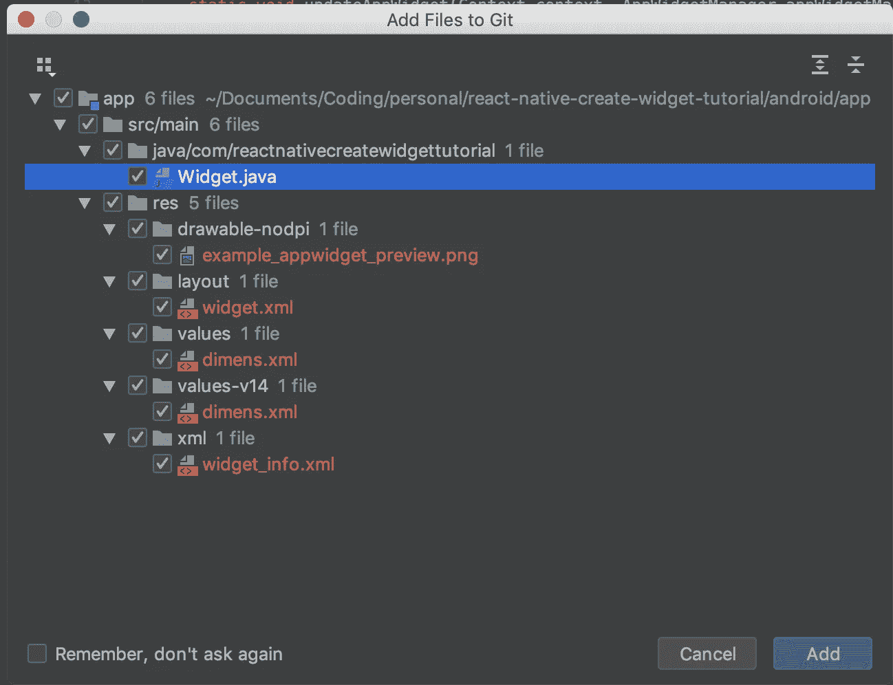*

*现在，如果您运行应用程序，您应该会看到可用的小部件:*

***注意:**如果你先做了 iOS 教程，在你的 React 本机代码上注释你调用`SharedStorage`的行，因为它还没有在 Android 上实现，这将导致一个错误。*

*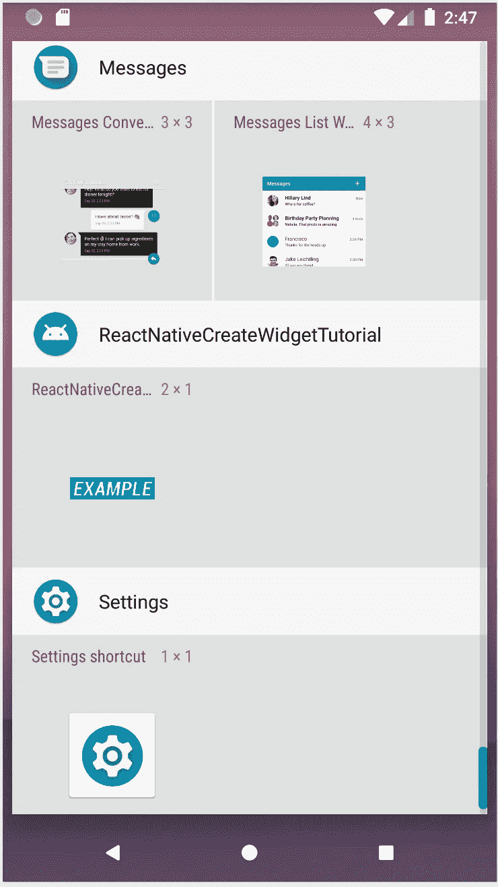**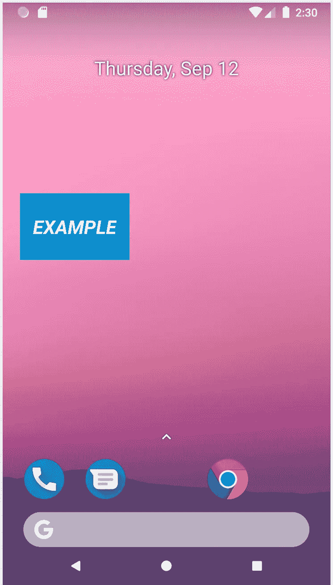*

*好了，现在我们已经运行了小部件，让我们对它进行一点定制。*

## *2.自定义小部件 UI*

*在 Android Studio 上，打开你的应用文件夹，选择文件 RES-> layout-> T2:*

**

*这将打开您的小部件的布局。如您所见，有一个文本视图，其中包含文本“EXAMPLE”如果你点击它，你可以看到更多的细节:*

*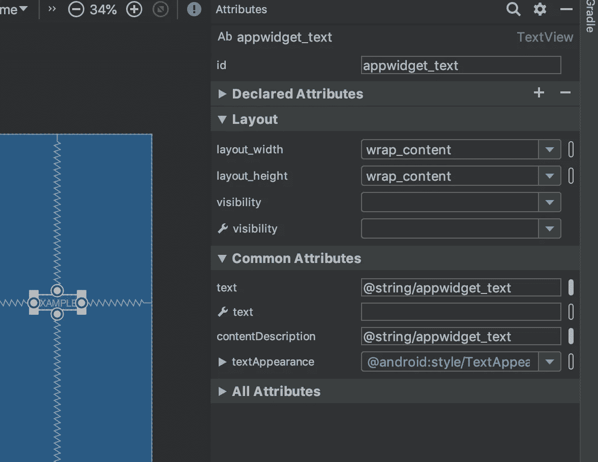*

*让我们更改标签的文本。正如您在标签属性上看到的，该文本引用了“@string/appwidget_text”这位于 res > values > `strings.xml`。打开这个文件，您将看到定义的文本:*

*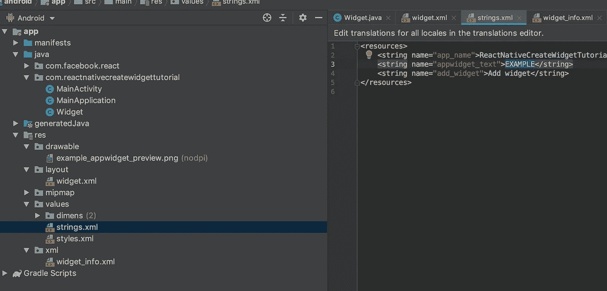*

*如果您将文本从“EXAMPLE”更改为“HELLO”，请保存文件，然后再次运行应用程序。这将反映在小工具上。让我们开始吧:*

*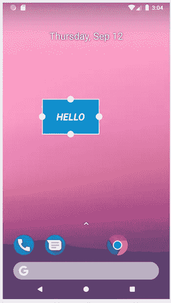*

*好了，现在我们知道如何定制小部件了。接下来，让我们通过 React 本机应用程序实现一种方法来实现这一点。*

## *3.创建小部件和 React 本机应用程序之间的通信通道*

*好了，现在有趣的部分又来了。让我们的 React 原生应用程序控制小部件显示的内容。为此，我们必须实现 React 本机应用程序与小部件通信的方法。我们将通过小部件和 React 本机应用程序之间的共享存储来实现这一点。这可以通过使用`[SharedPreferences](https://developer.android.com/reference/android/content/SharedPreferences)` 安卓原生模块来完成。*

*我们将让 React 原生应用程序写入`[SharedPreferences](https://developer.android.com/reference/android/content/SharedPreferences)`，并让小部件从中读取。我们发现的第一个问题是没有官方的 React 本机方式来与`[SharedPreferences](https://developer.android.com/reference/android/content/SharedPreferences)`、*、*和*、*交互。我没有找到任何好的库来做这件事。所以我们自己来实现这个吧。*

*为了调用`[SharedPreferences](https://developer.android.com/reference/android/content/SharedPreferences)`，我们将在 React 原生和原生 Android 之间建立一座桥梁。*

*在项目中的`MainActivity.java`旁边添加两个文件，分别叫做`SharedStorage.java`和`SharedStoragePackager.java`:*

*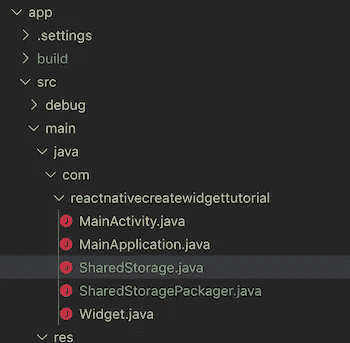*

*将以下内容复制到您的`SharedStoragePackager.java`文件中:*

*并将其写入您的`SharedStorage.java`文件:*

*`Important:`把包名`com.reactnativecreatewidgettutorial`改成自己的。还有小部件类名称的`Widget.class`。*

*现在你可以在 React Native 上调用`SharedStorage`。正如您在代码中看到的，它所做的只是接收一个 JSON 并将其存储在`SharedPreferences`存储器中，然后告诉小部件进行自我更新。*

*为了让 Android 知道你的模块的存在，把它添加到你的`MainApplication.java`文件的包列表中。*

```
*new SharedStoragePackager()*
```

## *4.使用 React 本机应用程序控制小部件内容*

*在 React 本机端，让我们导入模块。*

***注意:**如果你已经修改了 React 本机代码，跳过这一部分。*

```
*import { NativeModules } from 'react-native';const SharedStorage = NativeModules.SharedStorage;*
```

*然后，让我们将一些数据发送到存储:*

```
*SharedStorage.set(
 JSON.stringify({text: 'This is data from the React Native app'})
);*
```

*例如，您可以在您的`App.js`或任何您认为适合在 React 本机代码上设置数据的地方这样做:*

**

*现在剩下的就是让小部件读取数据并将其插入 UI。我们将小部件连接到`SharedPreferences`，读取它的数据，然后将数据打印在“HELLO”*标签上。**

**转到 Widget 文件夹中的`Widget.java` 文件，导入以下模块:**

```
**import android.content.SharedPreferences;
import org.json.JSONException;
import org.json.JSONObject;**
```

**现在修改`updateAppWidget`函数，像这样:**

```
**static void updateAppWidget(Context context, AppWidgetManager appWidgetManager, int appWidgetId) {

 try {
  SharedPreferences sharedPref = context.getSharedPreferences("DATA", Context.MODE_PRIVATE); String appString = sharedPref.getString("appData", "{\"text\":'no data'}"); JSONObject appData = new JSONObject(appString); // Construct the RemoteViews object
  RemoteViews views = new RemoteViews(context.getPackageName(), R.layout.widget);
  views.setTextViewText(R.id.appwidget_text, appData.getString("text")); // Instruct the widget manager to update the widget
  appWidgetManager.updateAppWidget(appWidgetId, views);
 }catch (JSONException e) {
  e.printStackTrace();
 }
}**
```

**你可以在这里查看整个文件[。](https://github.com/andrepimenta/react-native-create-widget-tutorial/blob/master/android/app/src/main/java/com/reactnativecreatewidgettutorial/Widget.java)**

**我们正在修改负责更新 widget 内容的函数`updateAppWidget`，使 widget 从`SharedPreferences` db 中读取数据并打印在文本标签上。**

**就这样——现在 React 原生应用控制了小部件内容。让我们运行应用程序，并检查小部件(注意，您必须运行并打开应用程序，以便让它写入`SharedStorage`):**

**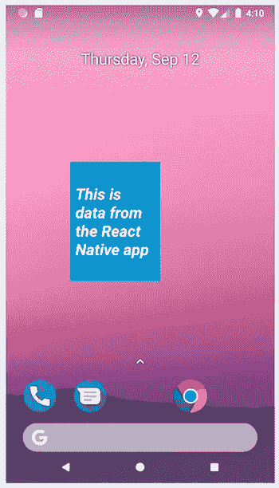**

**这就是编码。现在，您已经有了可以在小部件的其余部分上进行构建的基础。让我们检查最终结果。**

# **结果**

**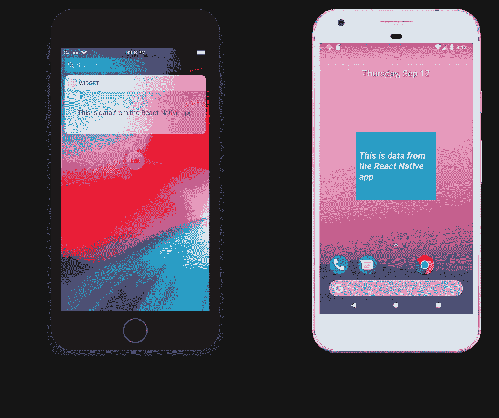**

****代码:**查看整个代码[此处](https://github.com/andrepimenta/react-native-create-widget-tutorial)。**

**希望这篇教程对你有帮助。**