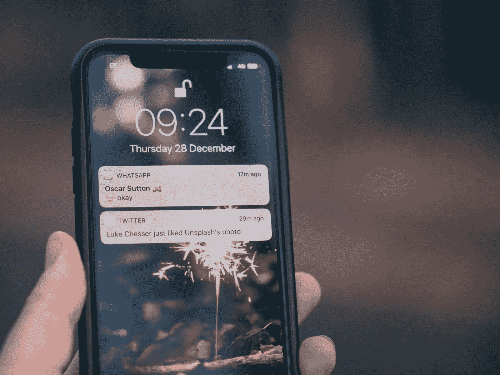
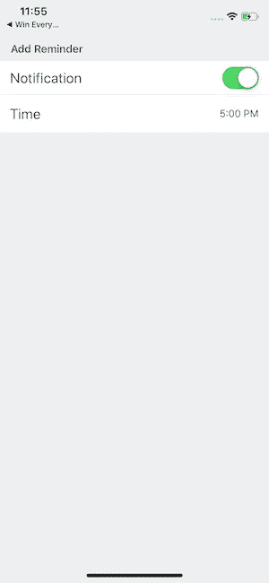
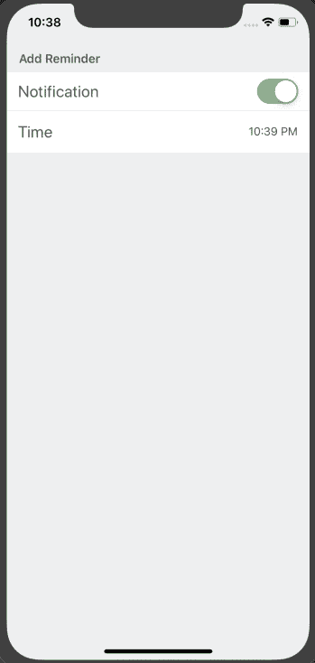

# 使用 Firebase 对本地、本地、预定、推送通知做出反应

> 原文：<https://betterprogramming.pub/react-native-local-scheduled-push-notification-with-firebase-8c775b71c35c>

## 使用 firebase 安排本地推送通知



照片由[杰米街](https://unsplash.com/@jamie452?utm_source=unsplash&utm_medium=referral&utm_content=creditCopyText)在 [Unsplash](https://unsplash.com/search/photos/notification?utm_source=unsplash&utm_medium=referral&utm_content=creditCopyText) 拍摄

随着应用程序使用量的不断增加，应用程序开发人员不断尝试寻找新的方法来吸引用户。推送通知是让你的用户参与进来并获得信息的一种方式。

推送通知是应用程序用来推动用户再次参与和保留的沟通渠道。推送通知技术已经走过了漫长的道路，从单一的消息传递系统发展到丰富的交互式媒体。

有两种类型的通知:远程和本地。

# **远程通知**

使用远程通知，您可以使用公司的一台服务器，通过 Apple 推送通知服务(FCM)将数据推送到用户设备。

# **本地通知**

Android 和 IOS 都支持从本地应用程序触发通知的能力。这些可以立即显示，也可以安排在以后显示。

在本文中，我们将使用本地通知功能在特定时间向用户发送每日提醒。

# **先决条件**

本教程需要 React Native 的基础知识。要设置您的开发机器，请遵循此处的官方指南。

为了在 React 本地应用中实现推送通知，我们将使用 [react-native-firebase](https://github.com/invertase/react-native-firebase) 。

React Native Firebase 具有通知模块，支持远程(FCM)和本地通知。

为了确保我们在同一页上，以下是本教程中使用的版本:

*   节点 v10.15.0
*   国家预防机制 6.4.1
*   纱线 1.16.0
*   react-原生 0.59.9
*   react-native-firebase 5.2.3

# **入门**

要使用`react-native-cli`创建新项目，请在终端中键入以下内容:

```
$ react-native init localReminders$ cd localReminders
```

## **安装 React Native Firebase**

按照此处的安装说明[安装 react-native-firebase。](https://rnfirebase.io/docs/v5.x.x/installation/initial-setup)

*确保你已经完成了 iOS 和 Android 的设置。*

## **安装模块**

React Native Firebase 仅向您的应用程序提供对核心功能的访问。

为了在 react 本地应用中获得用户通知，我们必须安装**云消息**和**通知**模块。

*   在此按照以下说明[安装**云消息**。](https://rnfirebase.io/docs/v5.x.x/messaging/ios)
*   在处按照以下说明[安装**通知**。](https://rnfirebase.io/docs/v5.x.x/notifications/ios)

同样，确保你遵循了 iOS 和 Android 的步骤

## **初始代码设置**

在您的`App.js`文件中添加这些导入:

```
import React, { Component } from "react";import { Alert } from "react-native";import firebase from "react-native-firebase";import Dashboard from "./src/Dashboard";
```

在你的`src`文件夹中创建一个空的`Dashboard.js`文件。我们将在教程的后面用代码填充它。

现在创建一个名为`App`的`class`组件，如下所示:

我们在这个类组件中创建了几个助手方法，我们称之为`componentDidMount`生命周期方法。在渲染中，我们将返回`Dashboard`组件。

让我们回顾一下并向这些方法添加代码，看看它们能做什么以及为什么我们需要它们。

# **创建 Android 通知通道**

从 Android 8.0(API 26 级)开始，通知必须指定一个通知通道，否则不会出现。

要让 React Native Firebase 无缝地跨所有版本的 Android 工作，您需要在显示通知之前创建一个通道。这段代码可以多次重新运行，所以每次应用程序启动时都这样做是安全的。

为了创建这个通知通道，我们创建了一个定制的助手方法`createNotificationChannel()`。用以下内容更新它:

Android 通道接受三个参数`channelId`、`name`和`importance`。

有关完整的参考文件，请参见[和](https://rnfirebase.io/docs/v5.x.x/notifications/reference/AndroidChannel)以及[和](https://rnfirebase.io/docs/v5.x.x/notifications/reference/AndroidNotifications)的 Android 通知。

# **通知权限和监听器**

在发送任何通知之前，我们需要确保我们拥有通知权限，然后，当我们拥有该权限时，我们可以添加通知侦听器。这个通知监听器将监听任何通知，并在收到时返回`notification`。

用以下内容更新您的`checkPermission()`方法:

当通知监听器接收到通知时，我们用收到的`notification`调用`displayNotification()`方法，这将显示通知。

我们现在可以接收和显示通知。现在是时候安排一个将在未来某个时间触发的本地通知了。

# **仪表板屏幕**

我们将创建一个**仪表板**屏幕。这将有一个开关来启用和禁用通知和时间选择器来设置接收通知的时间。它看起来会像这样:



通知设置屏幕

为了制作这个 UI 屏幕，我们将添加一些第三方助手库。

1.  [react-native-elements](https://react-native-training.github.io/react-native-elements/)—UI 组件库
2.  [时刻](https://momentjs.com/) —处理日期对象
3.  React-Native-modal-datetime-picker—一个适用于 Android 和 iOS 的 React-Native datetime-picker

让我们从添加所需的导入开始:

现在我们想在用户登陆仪表板时设置一个提醒，所以我们将在`componentDidMount()`生命周期方法上创建并调用一个`setReminder()`方法:

在`setReminder()`方法中，首先我们将利用`notificationTime`和`enableNotification`状态。

如果`enableNotification`为真，我们使用`[scheduleNotfication](https://rnfirebase.io/docs/v5.x.x/notifications/reference/Notifications#scheduleNotification)`方法调度通知。

`scheduleNotification()`有两个参数，`notification`和`schedule`。

对于`notification`，我们调用另一个自定义方法`buildNotification()`，它将返回通知，在`schedule`中，我们将传递一个带有`fireDate`、`repeatInterval`和`exact`键的对象。

`fireDate`是首次显示通知的日期，以毫秒为单位。对于`repeatInterval`，我们将使用`day`，因为我们希望每天都显示通知。`exact`选项仅适用于 Android，它表示是否应该严格遵守`fireDate`,即提醒，或者是否可以稍微偏离以节省电池。

否则我们将只返回`false`。

现在，我们将添加`buildNotification()`方法，它将在收到通知时构建一个通知:

让我们为通知`switch`和时间选择器添加一些辅助方法。它们各自的组件将使用它们来设置本地状态，稍后将使用这些状态:

最后，我们将返回仪表板 UI 的`render(),`:

是时候加入一些风格来让 UI 更吸引人了。

就是这样。我们已经完成了发展。在下一节中，我们将在 iOS 模拟器中测试它。

# **运行应用程序**

通过启用通知并将时间设置为未来 1 分钟来测试应用程序。



*注意:有时通知可能不会在准确的时间显示。请等待整整一分钟，通知才会出现。*

我们现在可以在 iOS 和 Android 的 React 原生应用中安排每日本地推送通知。

除了 firebase，还有其他库可以用来实现本地推送通知，比如[react-native-push-notification](https://github.com/zo0r/react-native-push-notification)。

# 结论

我们已经成功地创建了一个基本的应用程序，可以通过 firebase 安排本地推送通知。

点击在 Github repo [中找到源代码。](https://github.com/vikrantnegi/local-reminders)